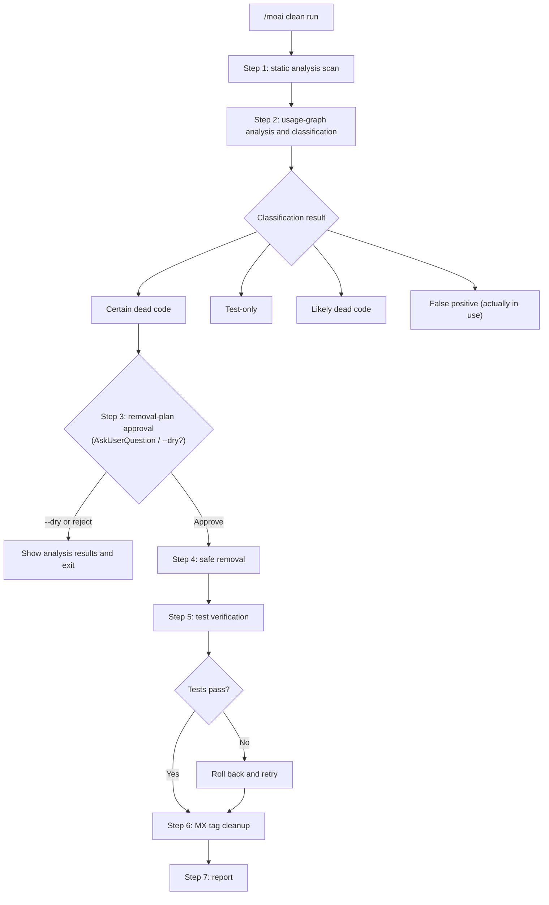
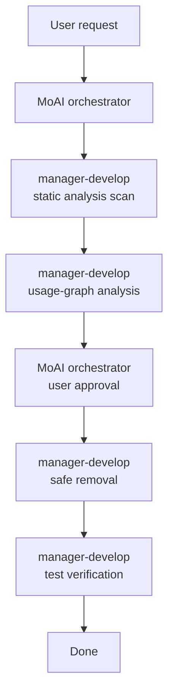

The dead-code identification and safe-removal command. Through static analysis and usage-graph analysis, it **finds unused code and removes it safely**.


**One-line summary**: `/moai clean` is a "code diet tool." It **automatically finds and safely deletes** unused functions, variables, imports, and files.



**Slash command**: In Claude Code, type `/moai:clean` to run this command directly. Typing just `/moai` shows the list of all available subcommands.


## Overview

As a project grows, code that is no longer used piles up. Unused imports, functions that are never called, and unreferenced types make the codebase complicated. `/moai clean` finds this dead code with static analysis and removes it safely, verified by tests.

From the harness-engineering perspective, this command plays the role of **garbage collection**. Dead code is a burden not only for humans but also for agents — every line of code an agent reads is context (tokens), so dead-code removal is code hygiene and a context diet at the same time: tokenomics.

## Usage

```bash
# Basic usage
> /moai clean

# Preview (check only, no modifications)
> /moai clean --dry

# Remove safe items only
> /moai clean --safe-only

# Analyze specific files/directories only
> /moai clean --file src/auth/

# Analyze specific code types only
> /moai clean --type functions
```

## Supported Flags

| Flag | Description | Example |
|-------|------|------|
| `--dry` (or `--dry-run`) | Show analysis results only, no removal | `/moai clean --dry` |
| `--safe-only` | Remove only certain dead code (skip uncertain items) | `/moai clean --safe-only` |
| `--file PATH` | Analyze only a specific file or directory | `/moai clean --file src/utils/` |
| `--type TYPE` | Analyze only a specific code type | `/moai clean --type imports` |
| `--aggressive` | Include low-usage code (where the single caller is itself dead code) | `/moai clean --aggressive` |

### --type Flag Options

| Type | Description |
|------|------|
| `functions` | Functions/methods that are never called |
| `imports` | Import statements that are never referenced |
| `types` | Unused type definitions |
| `variables` | Variables declared but never used |
| `files` | Files not imported anywhere |

### The --dry Flag

Previews which items are classified as dead code without modifying any actual code:

```bash
> /moai clean --dry
```

This option is useful when you want to review the analysis results before removal.

## Execution Flow

`/moai clean` runs in 7 steps.


```mermaid
flowchart TD
    Start["/moai clean run"] --> Phase1["Step 1: static analysis scan"]

    Phase1 --> Phase2["Step 2: usage-graph analysis and classification"]
    Phase2 --> Classify{"Classification result"}
    Classify --> Dead["Certain dead code"]
    Classify --> TestOnly["Test-only"]
    Classify --> Likely["Likely dead code"]
    Classify --> False["False positive (actually in use)"]

    Dead --> Phase3{"Step 3: removal-plan approval<br/>(AskUserQuestion / --dry?)"}
    Phase3 -->|--dry or reject| Report["Show analysis results and exit"]
    Phase3 -->|Approve| Phase4["Step 4: safe removal"]

    Phase4 --> Phase5["Step 5: test verification"]
    Phase5 --> Pass{"Tests pass?"}
    Pass -->|No| Rollback["Roll back and retry"]
    Pass -->|Yes| Phase6["Step 6: MX tag cleanup"]
    Rollback --> Phase6
    Phase6 --> Phase7["Step 7: report"]
```

Step 3 **removal-plan approval** is a human gate where the orchestrator presents the removal-target list to the user via `AskUserQuestion` and obtains approval. Step 6 **MX tag cleanup** also cleans up the `@MX` comments attached to the removed code, so no dangling comments remain.

### Step 1: Static Analysis Scan

Auto-detects the project language by project marker and detects candidates with each language's standard dead-code analysis tools. It **treats the 16 supported languages equally** (go, python, typescript, javascript, rust, java, kotlin, csharp, ruby, php, elixir, cpp, scala, r, flutter, swift), gracefully skips tools that are not installed, and silently passes projects with no recognized language marker. The following are representative examples only and do not favor any particular language:

| Language (example) | Analysis tools (example) | Checks |
|------|-----------|-----------|
| Go | `go vet`, `staticcheck`, `deadcode` | Unused variables, functions, types |
| Python | `vulture`, `autoflake` | Dead code, unused imports |
| TypeScript/JavaScript | `ts-prune`, ESLint `no-unused-vars` | Unused exports, variables |
| Rust | `cargo clippy`, `cargo udeps` | Dead-code warnings, unused dependencies |

The remaining 12 languages (java, kotlin, csharp, ruby, php, elixir, cpp, scala, r, flutter, swift, etc.) are scanned equally with their own standard toolchains.

**Scan categories:**

- Unused imports: import statements with no references
- Unused variables: variables declared but never read
- Unused functions: functions defined but never called
- Unused types: type definitions with no usage sites
- Unused files: files not imported anywhere
- Dead dependencies: packages installed but never imported

### Step 2: Usage-Graph Analysis

Builds a usage graph to verify the static analysis results:

- Searches the entire codebase for references to each candidate
- Checks indirect usage (interfaces, reflection, dynamic dispatch)
- Checks test-only usage (used only in tests, unused in production code)
- Checks conditional compilation (build tags, environment-based imports)

### Step 3: Classification

| Classification | Description | Removal safety |
|------|------|------------|
| **Certain dead code** | No references anywhere in the codebase | Safe |
| **Test-only** | Used only in test files | Mostly safe |
| **Likely dead code** | Low confidence (possible dynamic usage) | Caution needed |
| **False positive** | Actually in use (reflection, plugins, etc.) | Cannot remove |

### Step 4: Safe Removal

Removes in reverse dependency-graph order (leaf nodes first):

- Removes related code as a group (function + private helpers)
- Updates affected imports
- Cleans up files left empty after all exports are removed
- Code with an `@MX:ANCHOR` tag is never removed without explicit approval

### Step 5: Test Verification

After removal, the full test suite runs to verify against regressions. If tests fail, the removal is rolled back and classified as a "false positive." Safety is judged by the evidence of passing tests — not by "I deleted it and it seems fine."

### Step 6: Report

```
Dead-code removal report

Removed: 15 items (287 lines)
  - src/utils/helper.go: UnusedFunction (15 lines)
  - src/models/old.go: entire file deleted (120 lines)

Kept (false positives): 2 items
  - src/api/handler.go: DynamicHandler (uses reflection)

Test result: PASS (all tests pass)

Codebase reduction:
  - Files removed: 3
  - Lines removed: 287
  - Dependencies removed: 1
```

## Agent Delegation Chain


```mermaid
flowchart TD
    User["User request"] --> MoAI["MoAI orchestrator"]
    MoAI --> Refactor1["manager-develop<br/>static analysis scan"]
    Refactor1 --> Refactor2["manager-develop<br/>usage-graph analysis"]
    Refactor2 --> MoAI2["MoAI orchestrator<br/>user approval"]
    MoAI2 --> Refactor3["manager-develop<br/>safe removal"]
    Refactor3 --> Testing["manager-develop<br/>test verification"]
    Testing --> Complete["Done"]
```

| Agent | Role | Main work |
|----------|------|----------|
| **manager-develop** | Analysis and removal | Static analysis, usage graph, safe removal |
| **manager-develop** | Verification | Runs the test suite, checks for regressions |
| **MoAI orchestrator** | Coordination | User approval, @MX tag cleanup |

## Frequently Asked Questions

### Q: What if dead code is removed by mistake?

You can revert with Git. MoAI removes in reverse dependency order and runs the tests, so on any problem it rolls back automatically.

### Q: When should I use `--aggressive`?

Use it when you want to include the case where a function has exactly 1 caller and that caller is itself dead code. Useful for cleanup after large refactorings.

### Q: Is code used via reflection removed too?

In `--safe-only` mode, only "certain dead code" is removed. Code used via reflection or dynamic dispatch is classified as a "false positive" and preserved.

## Related Documents

- [/moai fix - one-shot auto-fix](/utility-commands/moai-fix)
- [/moai codemaps - architecture doc generation](/utility-commands/moai-codemaps)
