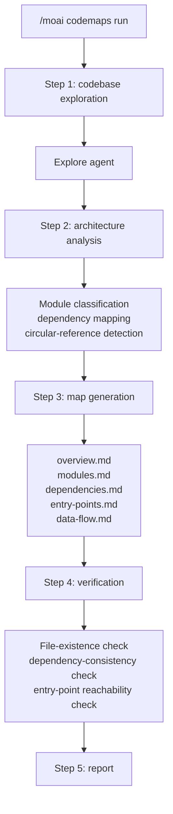
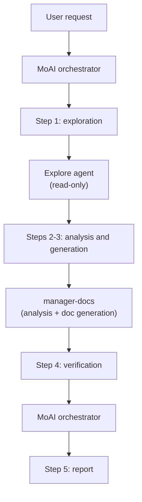

The command that scans the codebase and auto-generates **architecture documentation**.


**One-line summary**: `/moai codemaps` is an "architecture cartographer." It analyzes the codebase and **auto-generates structural documents** — module maps, dependency graphs, entry-point catalogs, and more.



**Slash command**: In Claude Code, type `/moai:codemaps` to run this command directly. Typing just `/moai` shows the list of all available subcommands.


## Overview

When joining a new project or getting to grips with a large codebase, understanding the architecture matters most. `/moai codemaps` automatically analyzes the codebase and generates module maps, dependency graphs, entry-point catalogs, and data-flow documents.

The generated documents are stored in the `.moai/project/codemaps/` directory and help both humans and AI agents understand the codebase quickly. In harness-engineering terms, it is a **context map** — a file-based map the agent can always consult instead of re-discovering the architecture every session. It also has a large token-saving effect, replacing repeated exploration cost with a one-time document generation.

## Usage

```bash
# Generate architecture docs for the whole codebase
> /moai codemaps

# Ignore existing docs and regenerate
> /moai codemaps --force

# Analyze a specific area only
> /moai codemaps --area api

# Include Mermaid diagrams
> /moai codemaps --format mermaid

# Limit the exploration depth
> /moai codemaps --depth 3
```

## Supported Flags

| Flag | Description | Example |
|-------|------|------|
| `--force` (or `--regenerate`) | Ignore existing docs and regenerate all codemaps | `/moai codemaps --force` |
| `--area AREA` | Focused analysis on a specific area | `/moai codemaps --area auth` |
| `--format FORMAT` | Output format (markdown, mermaid, json; default: markdown) | `/moai codemaps --format mermaid` |
| `--depth N` | Maximum directory exploration depth (default: 4) | `/moai codemaps --depth 3` |

### The --force Flag

Deletes all existing codemap documents and regenerates them from scratch:

```bash
> /moai codemaps --force
```

Useful when the codebase has changed significantly.

### The --area Flag

Analyzes only a specific area and its dependencies:

```bash
# Analyze only the API module
> /moai codemaps --area api

# Analyze only the auth module
> /moai codemaps --area auth
```

Results are stored in `.moai/project/codemaps/{area}/`.

### The --format Flag

Specifies the output format:

```bash
# Include Mermaid diagrams
> /moai codemaps --format mermaid

# Additionally generate JSON
> /moai codemaps --format json
```

## Execution Flow

`/moai codemaps` runs in 5 steps.



### Step 1: Codebase Exploration

The `Explore` agent explores the codebase in depth:

| Exploration target | Description |
|-----------|------|
| Directory structure | Maps the top-level and important subdirectories |
| Module boundaries | Identifies package/module boundaries and responsibilities |
| Entry points | Finds main entry points (main.go, index.ts, app.py, etc.) |
| Public APIs | Lists exported functions, types, interfaces |
| Dependency graph | Maps inter-module dependencies (import, require) |
| External dependencies | Catalogs third-party dependencies |
| Config files | Identifies build, deployment, and config files |

### Step 2: Architecture Analysis

The `manager-docs` agent analyzes the exploration results:

- Classifies modules by layer (presentation, business, data, infrastructure)
- Identifies high fan-in modules (`@MX:ANCHOR` candidates)
- Detects circular dependencies
- Maps request/data flow paths
- Identifies domain boundaries
- Recognizes architecture patterns (MVC, Clean, Hexagonal, etc.)

### Step 3: Map Generation

Generates 5 documents in the `.moai/project/codemaps/` directory:

| File | Contents |
|------|------|
| `overview.md` | High-level architecture summary and module descriptions |
| `modules.md` | Detailed module catalog (responsibilities, dependencies) |
| `dependencies.md` | Dependency graph (text and Mermaid diagrams) |
| `entry-points.md` | Entry-point catalog and call paths |
| `data-flow.md` | Main data-flow paths |

When using the `--area` flag:
- `.moai/project/codemaps/{area}/overview.md`
- `.moai/project/codemaps/{area}/modules.md`
- `.moai/project/codemaps/{area}/dependencies.md`

### Step 4: Verification

- Confirms every referenced file and module actually exists
- Checks bidirectional consistency of dependency relationships
- Verifies entry-point reachability
- Compares changes against existing codemaps (when not `--force`)

This step mechanically checks that the generated map matches the actual code — documents too are judged complete only after verification, not after "we generated them."

### Step 5: Report

```
## Codemap generation report

### Generated files
- .moai/project/codemaps/overview.md
- .moai/project/codemaps/modules.md
- .moai/project/codemaps/dependencies.md
- .moai/project/codemaps/entry-points.md
- .moai/project/codemaps/data-flow.md

### Architecture highlights
- Pattern: Clean Architecture
- Module count: 12
- Entry points: 3 (API server, CLI, worker)

### Potential issues
- Circular dependency: pkg/auth <-> pkg/user
- High coupling: pkg/core (fan_in: 8)
- Isolated module: pkg/legacy (no usage sites)
```

## Agent Delegation Chain



**Agent roles:**

| Agent | Role | Main work |
|----------|------|----------|
| **MoAI orchestrator** | Workflow coordination, verification, reporting | Flag parsing, verification, user interaction |
| **Explore** | Codebase exploration (read-only) | Directory structure, module boundaries, dependency mapping |
| **manager-docs** | Architecture analysis and doc generation | Module classification, dependency analysis, codemap file authoring |

## Frequently Asked Questions

### Q: How often should codemaps be regenerated?

Regenerating after a large refactoring or after adding a new module is a good idea. Running `/moai sync` also updates the codemaps automatically.

### Q: Do codemaps generated with --area conflict with the full codemap?

No. Codemaps generated with `--area` are stored in a separate subdirectory. They are managed independently of the full codemap.

### Q: Can I edit the generated codemaps directly?

Yes, you can edit them manually. However, regenerating with the `--force` flag overwrites manual edits. Running without `--force` performs an incremental update that takes the existing documents into account.

### Q: Which architecture patterns are recognized?

Major patterns such as MVC, Clean Architecture, Hexagonal, and Layered Architecture are recognized. The recognized pattern is recorded in `overview.md`.

## Related Documents

- [/moai clean - dead-code removal](/utility-commands/moai-clean)
- [/moai feedback - submit feedback](/utility-commands/moai-feedback)
