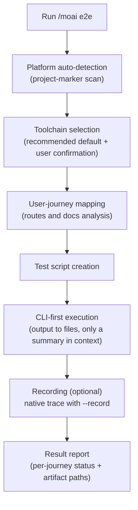
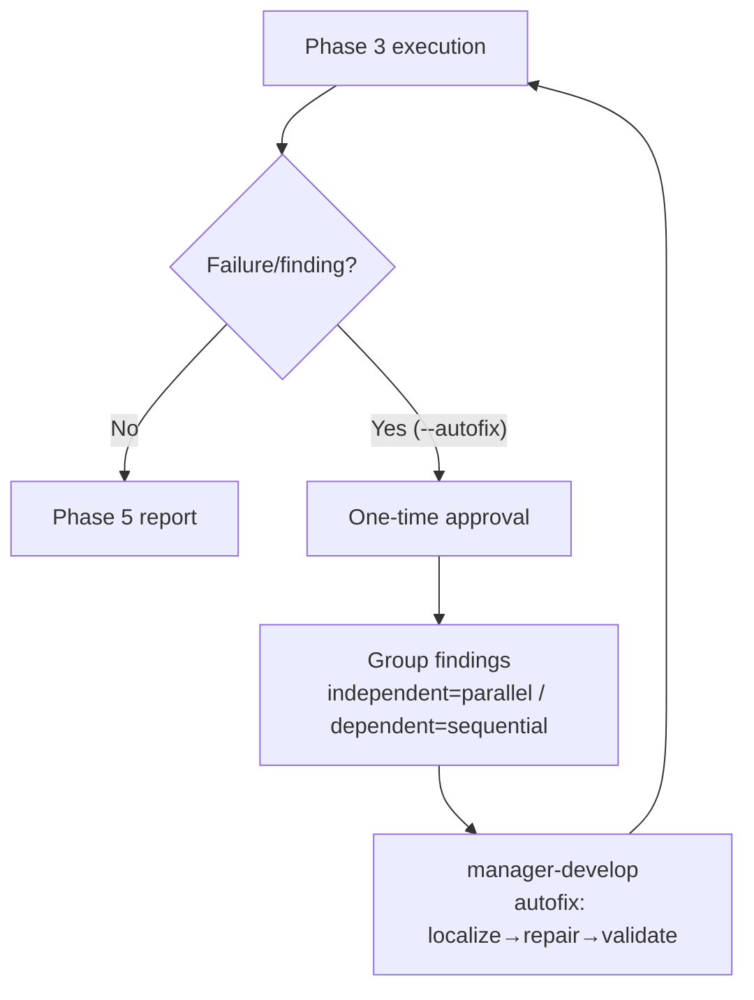
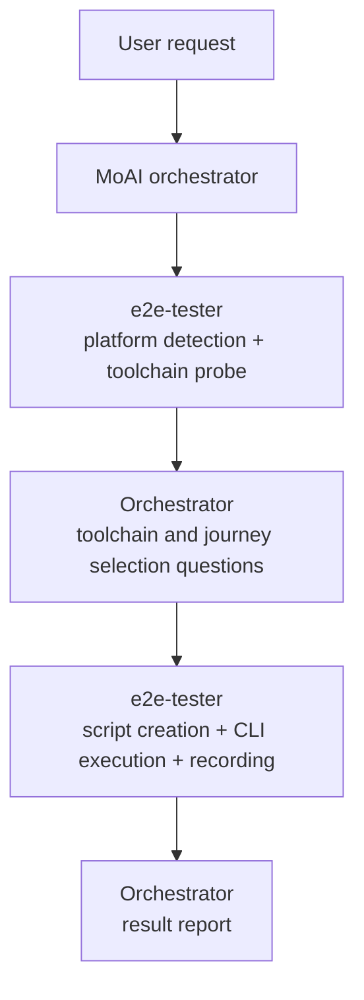

Creates and runs E2E (End-to-End) tests for web, mobile, and desktop applications. It **auto-detects** the project type and selects a **CLI-first toolchain** per platform, executing with token usage minimized.


**One-line summary**: `/moai e2e` is a "user-journey verification tool". It runs real user flows — login → checkout → confirmation — end to end in a browser, simulator, or desktop app.



**Slash command**: Type `/moai:e2e` in Claude Code to run this command directly. Typing just `/moai` shows the list of all available subcommands.


## Overview

Where a unit test verifies a single function, an E2E test verifies the **entire user journey**. `/moai e2e` automates this process — it determines by itself whether the project is web, mobile, or desktop, picks the platform's default toolchain, then writes and runs the test scripts.

The overall flow:



## Usage

```bash
> /moai e2e
```

Run without arguments to detect the project type, get the recommended toolchain and discovered user journeys presented for selection, then proceed.

```bash
# Run directly with a specific toolchain
> /moai e2e --tool playwright

# Run a single journey only
> /moai e2e --journey login

# Record the run (traces/recordings)
> /moai e2e --record
```

## Supported Flags

| Flag | Description | Example |
|-------|------|------|
| `--tool TOOL` | Force toolchain selection (skips the selection question) | `/moai e2e --tool maestro` |
| `--platform web\|mobile\|desktop` | Force the platform classification | `/moai e2e --platform web` |
| `--record` | Record runs via the toolchain's native recording facility | `/moai e2e --record` |
| `--url URL` | Target URL for web testing | `/moai e2e --url http://localhost:3000` |
| `--journey NAME` | Run only the named user journey | `/moai e2e --journey checkout` |
| `--headless` | Run in headless mode (default true) | `/moai e2e --headless` |
| `--browser BROWSER` | Browser for Playwright (default chromium) | `/moai e2e --browser firefox` |
| `--timeout N` | Test timeout in seconds (default 30) | `/moai e2e --timeout 60` |
| `--retry N` | Retries for failed tests (default 1) — re-runs **only the failed specs** | `/moai e2e --retry 2` |
| `--autofix` | Enable autonomous fix delegation — delegate fixes to manager-develop on Phase 3 failure and re-run (max 3 iterations; independent findings parallel) | `/moai e2e --autofix` |

## Platform-Toolchain Matrix

Each platform has a fixed default toolchain, and every default path is **fully executable with the CLI alone**.

| Platform | Default toolchain | Alternative/fallback | Notes |
|--------|-------------|-----------|------|
| **Web** | Playwright CLI | agent-browser (AI-exploratory) | Cross-browser: chromium / firefox / webkit |
| **Mobile** | Maestro | Appium (fallback), Detox (React Native only) | iOS / Android / Flutter support, declarative YAML flows |
| **Desktop (Electron)** | Playwright `_electron` | — | Reuses the web Playwright install. API is experimental — stated in reports |
| **Desktop (Tauri)** | WebdriverIO + `@wdio/tauri-service` | — | Embedded-WebDriver mode is cross-platform including macOS |

When the selected toolchain is not installed, the install command is presented first; upon approval it installs, re-verifies the version, then proceeds.

## Project-Type Auto-Detection

The platform is classified by reading the project's **marker files**. Detection is marker-driven — no language or framework receives privileged treatment.

| Classification | Detection markers (examples) |
|------|------------------|
| Desktop (Electron) | `electron` in package.json dependencies, electron-builder/Forge config |
| Desktop (Tauri) | `src-tauri/tauri.conf.json`, `tauri` in dependencies |
| Mobile (React Native) | `react-native` in dependencies, `ios/` + `android/` directories |
| Mobile (Flutter) | `pubspec.yaml` containing `flutter:`, `lib/main.dart` |
| Mobile (native) | `*.xcodeproj` with iOS targets, `build.gradle` with `com.android.application` |
| Web | Web framework configs (next/nuxt/vite/astro etc.), `index.html`, HTTP-serving apps broadly |
| Mixed | Two or more platform markers detected simultaneously — per-surface toolchain selection |

## Execution Flow

### Step 1: User-Journey Mapping

Reads the project docs and route definitions (routes.ts, urls.py, router.go, navigation graphs, etc.) to discover candidate user journeys. Critical paths such as login, the core feature, and error handling come first.

```markdown
Journey: User Login
Steps:
1. Navigate to /login (web) | Launch app to login screen (mobile/desktop)
2. Enter email
3. Enter password
4. Submit
5. Verify redirect to /dashboard
6. Verify welcome message displayed
```

### Step 2: Script Creation

Test scripts are written under the `e2e/` directory following the selected toolchain's conventions.

| Toolchain | Artifact location |
|--------|-------------|
| Playwright | `e2e/<journey>.spec.ts` |
| Maestro | `e2e/flows/<journey>.yaml` |
| Appium / WebdriverIO | `e2e/<journey>.e2e.ts` + `wdio.conf.ts` |

Every journey step pairs with a **verifiable outcome** — assertion-free navigation scripts are never written.

### Step 3: Execution and Report

Runs the tests and reports per-journey PASS/FAIL status, duration, and artifact paths in a table. Failed journeys come with a bounded log excerpt at the failure point plus screenshot paths.

## Autonomous Fix Delegation (--autofix)

With the `--autofix` flag, when Phase 3 execution surfaces **failures or improvement findings**, the orchestrator delegates fixes to the `manager-develop` agent and re-runs Phase 3 in a loop. The step is skipped when the flag is absent or Phase 3 is green.



- **One-time approval**: the orchestrator obtains a single approval before the first delegation; it covers the whole loop and is not re-asked. Declining falls back to the standard manual next-step.
- **Finding grouping**: independent findings (disjoint files) fan out in parallel; dependent findings (same module) run sequentially to avoid concurrent-write conflicts.
- **Loop cap**: max 3 iterations (mirrors `ci-autofix-protocol.md`). On green it reports; on exhaustion it escalates remaining failures + artifact paths to the user.

## Token-Minimized Execution

The core design principle of `/moai e2e` is **CLI-first**. Instead of piling verbose output into the AI context, it uses the cheapest path first.

1. **CLI + bounded tail**: the full run log is saved to a file under `e2e/.runs/`, and only the exit code + the last few lines appear in context. The log file path is always cited.
2. **Structured reporters**: for failure triage, it selectively reads **only the failed specs** from JSON reporter output instead of re-running the full suite.
3. **MCP is conditional**: MCP tools are used only for capabilities the CLI cannot provide — live performance traces, Lighthouse-class audits. No MCP server is a hard dependency on any default path.

Reports, traces, screenshots, and recordings are stored under the project-local `e2e/` directories and **cited by path** — their content is never inlined into context.

## Recording Option

With the `--record` flag, runs are recorded via the selected toolchain's **native facility**.

| Toolchain | Native facility | Output location |
|--------|---------------|-----------|
| Playwright | `--trace on` traces | `e2e/traces/*.zip` |
| Maestro | `maestro record` | `e2e/recordings/` |
| WebdriverIO | video/trace reporter services | `e2e/recordings/` |

## When No Target Is Detected

When no e2e-able surface is detected (for example, a pure library with no web/mobile/desktop entry point), it reports **"no e2e target detected"** with the marker evidence consulted, and exits gracefully without creating any `e2e/` artifacts.

A **native desktop app** that is neither Electron nor Tauri (pure macOS app, WinUI, Qt/GTK, etc.) routes to this same branch — OS-level native-desktop automation is not yet provided; a deferral notice is reported with the classification evidence, followed by a graceful exit.

## Agent Delegation Chain

The execution owner of `/moai e2e` is the **e2e-tester** agent. All user-facing selection questions belong to the MoAI orchestrator; e2e-tester receives the selections and performs the execution only.



| Agent | Role | Main tasks |
|----------|------|----------|
| **MoAI orchestrator** | Selection and reporting | Toolchain/journey selection questions, result-report rendering |
| **e2e-tester** | Execution owner | Detection probes, journey mapping, script creation, CLI execution, recording |
| **manager-develop** (with --autofix) | Fix delegation | localize→repair→validate (re-verifies the relevant e2e spec locally) |

## Related Documents

- [/moai fix - One-shot auto-fix](/utility-commands/moai-fix)
- [/moai loop - Iterative fix loop](/utility-commands/moai-loop)
- [/moai - Fully autonomous automation](/utility-commands/moai)
