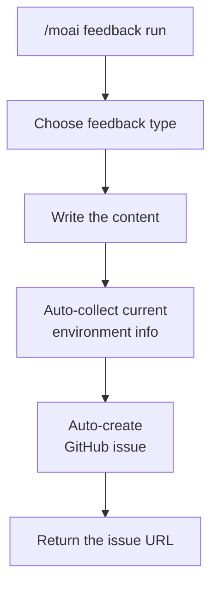
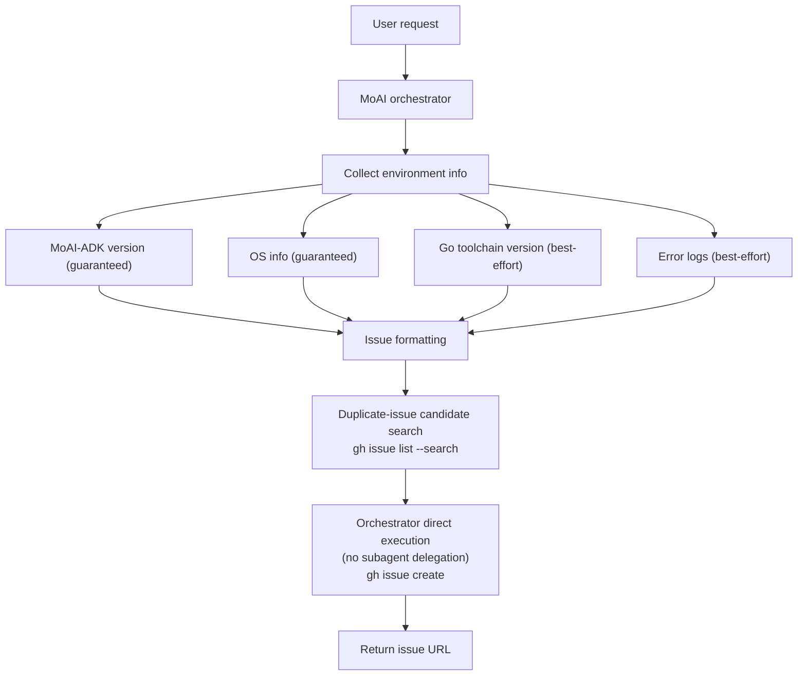

The command for submitting feedback or bug reports to MoAI-ADK.


**One-line summary**: `/moai feedback` **auto-creates a GitHub issue** from your improvement proposal or bug report about MoAI-ADK itself.



**Slash command**: In Claude Code, type `/moai:feedback` to run this command directly. Typing just `/moai` shows the list of all available subcommands.


## Overview

Use this command when you find a bug while using MoAI-ADK, need a new feature, or come up with an improvement idea. There is no need to open GitHub and write an issue manually — you can submit feedback right inside Claude Code.


**Important**: this command **does not modify your project's code**. It delivers feedback about the MoAI-ADK tool itself to the development team.


## Usage

```bash
# Standard form
> /moai feedback

# Short aliases
> /moai fb
> /moai bug
> /moai issue
```

Running the command guides you through choosing the feedback type and entering the content.

## Input Method (no flags)

`/moai feedback` takes no flags. The feedback type is determined automatically from the free-form content you enter, and the title and description are collected in a single `AskUserQuestion` round from the orchestrator. Just describe the problem or proposal in natural language.

## How It Works

Running `/moai feedback` proceeds as follows.



### Automatically Collected Information

The following information is included automatically when submitting feedback, so the development team can diagnose the problem faster.

| Collected item | Description | Example | Collection mode |
|-----------|------|------|-----------|
| MoAI-ADK version | Currently installed version (`moai version`) | v10.8.0 | Guaranteed (always collected) |
| OS info | Operating system and version (`uname`) | macOS 15.2 | Guaranteed (always collected) |
| Go toolchain version | Build provenance of the tool binary (`go version`) | go1.23.4 | best-effort (omitted where the Go toolchain is not installed) |
| Error logs | Error context passed by the orchestrator (if any) | TypeError: ... | best-effort (included only when the orchestrator passes it; the workflow itself does not read session transcripts) |

## Feedback Configuration

`/moai feedback` reinforces the issue-creation process with the following 4 behaviors.

### Diagnostics: Guaranteed Items + best-effort Items

As in the table above, the MoAI-ADK version (`moai version`) and OS info (`uname`) are guaranteed items that are **always** collected. The Go toolchain version (`go version`) and the error context passed by the orchestrator are **best-effort** items — when the conditions are not met (e.g. an environment with only the prebuilt `moai` binary and no Go toolchain installed), they are omitted, and that is not a failure.

### Duplicate-Issue Candidate Check

Once the issue title is set, and before creating the issue, `gh issue list --repo <target repo> --search "<title keywords>" --state open` searches the target repository for open duplicate issues. This step does not prompt the user directly — it only produces a "possible duplicate issues" candidate report (issue number, title, URL, state), and the orchestrator decides whether to proceed with a new issue or direct you to the existing one.

### Local Draft Save on `gh` Auth Failure

Right before issue creation, `gh auth status` is checked. If `gh` is unauthenticated or the GitHub API rate limit has been hit, it responds gracefully:

1. Notifies you of the detected state (unauthenticated or rate-limited).
2. Suggests running `gh auth login` if unauthenticated, or waiting for the limit to reset if rate-limited.
3. Offers to save the written issue content locally at `.moai/state/feedback-draft-<timestamp>.md`.

Your written feedback is never lost due to a `gh` failure — the local draft file is the recovery path.

### Configuring the Feedback Target Repository

The repository where `/moai feedback` creates issues is configured via the `feedback.repository` value in `.moai/config/sections/feedback.yaml`. The default is `modu-ai/moai-adk` (the MoAI-ADK tool repository itself), and users maintaining a fork can redirect feedback by changing this value to their fork repository.

## Feedback Types

### Bug Report

Reports an error or unexpected behavior encountered while using MoAI-ADK.

```bash
> /moai feedback
# Type (auto-detected): bug report
# Title: characterization tests not generated when running /moai run
# Description: I ran /moai run for SPEC-AUTH-001, but the PRESERVE stage
#        did not generate characterization tests and it moved straight
#        to the IMPROVE stage.
# Reproduction: run /moai run SPEC-AUTH-001
```

### Feature Request

Proposes a new feature you would like added to MoAI-ADK.

```bash
> /moai feedback
# Type (auto-detected): feature request
# Title: add an option to /moai loop to target specific files only
# Description: it would be great if /moai loop could target a specific
#        directory or file instead of the whole project.
# Example: /moai loop --path src/auth/
```

### Question

Asks a question about how to use MoAI-ADK or how it behaves.

```bash
> /moai feedback
# Type (auto-detected): question
# Title: what is the difference between /moai fix and /moai loop?
# Description: both commands seem to fix errors, but I am curious
#        about when to use which one.
```

## Agent Delegation Chain

The `/moai feedback` command is executed **directly by the orchestrator**, with no subagent delegation:



**Responsible parties:**

| Party | Role | Main work |
|----------|------|----------|
| **MoAI orchestrator** | Runs the entire feedback process directly (no subagent delegation) | Collects type/title/description, gathers environment info, searches duplicate-issue candidates, runs `gh issue create` directly, returns the URL |

Not spawning a subagent for a simple single-procedure task is also a tokenomics principle — delegate only when needed, via the cheapest path.

## Worked Example

### Scenario: An Unexpected Error While Running a Command

```bash
# The situation where the error occurred
> /moai "Implement payment feature" --branch
# Error: Branch creation failed - permission denied

# Submit feedback
> /moai feedback
```

The MoAI orchestrator asks for the feedback type, title, and description in turn. Once you answer, a GitHub issue is created automatically and the issue URL is returned.

```
A GitHub issue has been created:
https://github.com/modu-ai/moai-adk/issues/1234

The development team will review it and respond.
```


**Feedback is always welcome!** Even minor inconveniences submitted as feedback are a big help in improving MoAI-ADK.


## Frequently Asked Questions

### Q: Can I edit or delete my feedback?

Yes, you can edit or close the issue directly on GitHub. The issue URL is provided, so you can access it any time.

### Q: Is it OK to report the same problem multiple times?

Duplicate issues are checked on GitHub, so there is no need to worry. If the problem has already been reported, you are directed to the existing issue.

### Q: When will I receive a response to my feedback?

The development team responds with a comment on the issue after review. Complex problems may take time to resolve.

### Q: What is the difference between `/moai feedback` and creating a GitHub issue directly?

`/moai feedback` automatically collects environment information so the development team can understand the problem faster. It is more efficient than creating an issue manually.

## Related Documents

- [/moai - fully autonomous automation](/utility-commands/moai)
- [/moai loop - iterative fix loop](/utility-commands/moai-loop)
- [/moai fix - one-shot auto-fix](/utility-commands/moai-fix)
