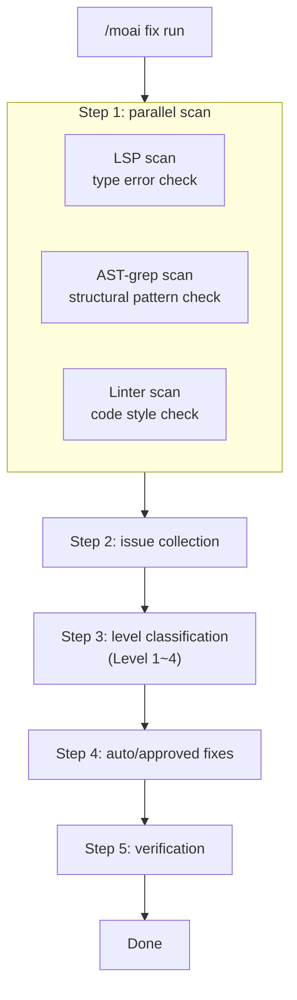
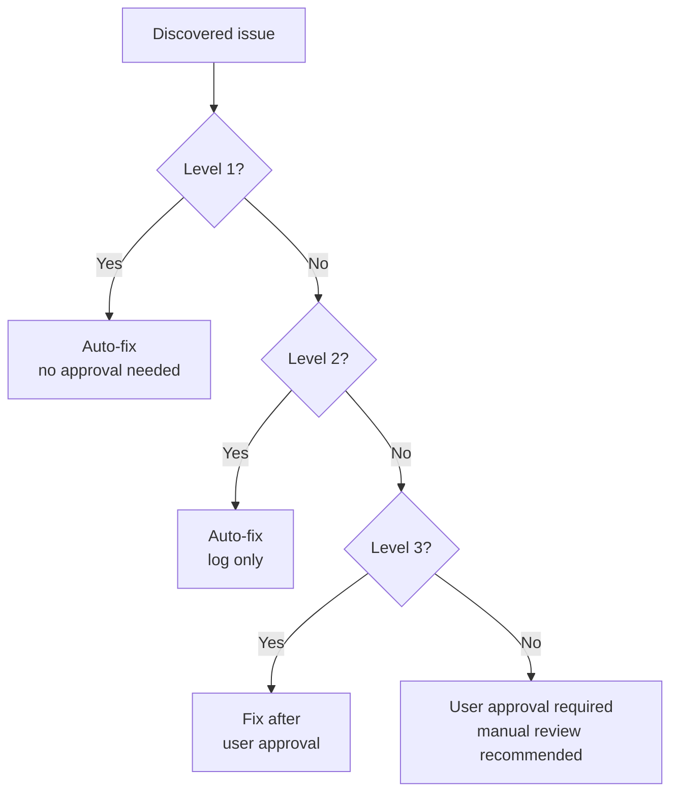
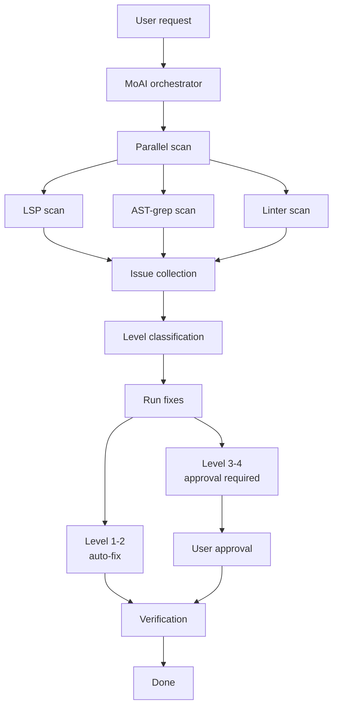

The one-shot auto-fix command. It **scans your code in parallel** for errors, then **fixes them in one pass**.


**One-line summary**: `/moai fix` is a "quick cleanup tool." It **sweeps up** the accumulated lint errors and type errors in your code and fixes them at once.



**Slash command**: In Claude Code, type `/moai:fix` to run this command directly. Typing just `/moai` shows the list of all available subcommands.


## Overview

During development, imports get out of order, types stop matching, and lint warnings pile up. Instead of hunting these down one by one, run `/moai fix` and the AI finds and fixes the problems automatically.

Unlike `/moai loop`, it runs **exactly once**, making it the right fit when you want to clean up the current state quickly. In the loop family, `/moai fix` is the **one-shot (single-pass) preset** — running a loop over clear-cut errors that need no iteration wastes tokens, so picking the cheapest tool that matches the size of the job is the right tokenomics call.

## Usage

```bash
> /moai fix
```

Run it without arguments and it scans the current project for errors and auto-fixes what it can.

## Supported Flags

| Flag | Description | Example |
|-------|------|------|
| `--dry` (or `--dry-run`) | Show results without fixing | `/moai fix --dry` |
| `--sequential` (or `--seq`) | Sequential scan instead of parallel | `/moai fix --sequential` |
| `--level N` | Set the maximum fix level (default 3) | `/moai fix --level 2` |
| `--errors` (or `--errors-only`) | Fix errors only, skip warnings | `/moai fix --errors` |
| `--security` (or `--include-security`) | Include security issues | `/moai fix --security` |
| `--no-fmt` (or `--no-format`) | Skip formatting fixes | `/moai fix --no-fmt` |
| `--resume [ID]` (or `--resume-from`) | Resume from a snapshot (latest if `latest`) | `/moai fix --resume` |

### The --dry Flag

Lets you preview what changes would be made, without applying them:

```bash
> /moai fix --dry
```

With this option, no actual code is modified — only the discovered issues and expected changes are displayed.

### The --level Flag

Limits the levels to be fixed:

```bash
# Fix Level 1-2 only (formatting, lint)
> /moai fix --level 2

# Fix Level 1 only (formatting only)
> /moai fix --level 1
```

## Execution Flow

`/moai fix` runs in 5 steps.



### Step 1: Parallel Scan

Three tools scan the code **simultaneously**.

| Scan tool | Checks | Problems found |
|-----------|-----------|---------------|
| **LSP** | Type system | Type mismatches, undefined variables, wrong argument counts |
| **AST-grep** | Code structure | Unused code, dangerous patterns, inefficient structures |
| **Linter** | Code style | Import ordering, indentation, naming-rule violations |

### Step 2: Issue Collection

The scan results are merged into a single list.

```
Issues found (example):
  [Level 1] src/api/router.py:3 - imports need sorting
  [Level 1] src/models/user.py:15 - unnecessary whitespace
  [Level 2] src/utils/helper.py:8 - unused variable "temp"
  [Level 2] src/auth/service.py:22 - unnecessary else clause
  [Level 3] src/auth/service.py:45 - missing error handling
  [Level 4] src/db/connection.py:12 - possible SQL injection
```

### Step 3: Level Classification

The collected issues are **classified into 4 levels by risk**. Whether an issue is auto-fixed depends on its level. The safe things are handled by the machine, the risky ones get human approval — the harness design principle of pairing autonomy with safety gates applies here too.



## Issue Levels in Detail

### Level 1: Formatting Errors

Cosmetic problems that **do not affect the code's behavior**. The AI fixes them automatically.

| Item | Details |
|------|------|
| **Risk** | Very low |
| **Approval** | Not needed (auto-fix) |
| **Examples** | Import sorting, trailing-whitespace removal, line-ending unification, indentation fixes |
| **Fix tools** | black, isort, prettier |

**Actual fix example:**

```python
# Before (Level 1 issue)
import os
import sys
from pathlib import Path
import json

# After (auto-fixed)
import json
import os
import sys
from pathlib import Path
```

### Level 2: Lint Warnings

**Minor** problems that affect code quality. The AI fixes them automatically and logs the change.

| Item | Details |
|------|------|
| **Risk** | Low |
| **Approval** | Not needed (auto-fix, logged) |
| **Examples** | Unused variables, unnecessary else clauses, duplicated code, naming-rule violations |
| **Fix tools** | ruff, eslint, golangci-lint |

**Actual fix example:**

```python
# Before (Level 2 issue)
def get_user(user_id):
    result = db.query(user_id)
    if result:
        return result
    else:           # unnecessary else
        return None

# After (auto-fixed)
def get_user(user_id):
    result = db.query(user_id)
    if result:
        return result
    return None
```

### Level 3: Logic Errors

Problems that **can change the code's behavior**. Fixed after user approval.

| Item | Details |
|------|------|
| **Risk** | Medium |
| **Approval** | Required (fix after user confirmation) |
| **Examples** | Missing error handling, wrong conditionals, unhandled boundary values, async errors |
| **Fix approach** | Shows the user the change and requests approval |

**What the user sees:**

```
[Level 3] src/auth/service.py:45
  Problem: error handling for authentication failure is missing
  Proposal: add a try-except block to return a proper error response on auth failure

  Approve? (y/n)
```

### Level 4: Security Vulnerabilities

Serious problems that **affect security**. User approval is mandatory, and manual review is recommended.

| Item | Details |
|------|------|
| **Risk** | High |
| **Approval** | Mandatory (manual review strongly recommended) |
| **Examples** | SQL injection, XSS vulnerabilities, hardcoded secrets, unsafe deserialization |
| **Fix approach** | Explains the problem and solution in detail and requests the user's review |


**When a Level 4 issue is found**, the AI does not fix it automatically. A badly fixed security vulnerability can create a bigger problem, so always verify it yourself before fixing.


## Difference from /moai loop

| Comparison | `/moai fix` | `/moai loop` |
|-----------|-------------|--------------|
| **Runs** | Once | Repeats until complete |
| **Level classification** | Yes (Level 1-4) | No |
| **Approval procedure** | Level 3-4 require approval | Handled autonomously |
| **Duration** | Short (1-2 min) | Can be long (5-30 min) |
| **Best for** | Quick error cleanup | Large-scale problem solving |


**Selection guide**:
- "I just want to clean up lint errors before committing" → `/moai fix`
- "There are many failing tests and I want them all fixed" → `/moai loop`


## Residual Issue Handoff (handed to loop)

Because `/moai fix` is a one-shot (single) pipeline, issues that a single scan-fix-verify cannot resolve may remain. The kinds of remaining issues:

- **Level 4 manual items** (security · architecture — auto-fixing forbidden)
- **Unresolved errors** (items the repair stage could not fix)
- **Phase 5 regression-guard failures** (regressions that could neither be reverted nor reported)

When such residue remains, the fix workflow persists it to `.moai/state/loop-verdict-<id>.json` with `exit_kind: "one-shot-residue"` and `iterations_used: 1`. This schema is identical to `/moai loop`'s residue-persistence schema.

The report only **suggests** entering `/moai loop` for re-fixable residue; the fix workflow does not auto-invoke `/moai loop` or any other subcommand. When you re-enter `/moai loop` yourself, the persisted residue is incorporated as items in the loop's scan queue, and the goal-preset sweep drains them.

## Agent Delegation Chain

The agent delegation flow of the `/moai fix` command:



**Agent roles:**

| Agent | Role | Main work |
|----------|------|----------|
| **MoAI orchestrator** | Parallel-scan coordination + direct Level 1 fixes | Issue collection, level classification, running the Level 1 formatter directly (no agent spawn), user approval |
| **manager-develop** | Fix execution | Level 2 auto-fixes, Level 3-4 fixes after approval |

Level 1 formatter cleanup (gofmt/prettier/ruff format, etc.) is performed directly by the orchestrator without an agent spawn. Fix-result verification is also done by the orchestrator re-running the scanners (LSP/AST-grep/linter) rather than by a separate audit agent.

## Worked Example

### Scenario: Code Cleanup Before a Commit

You implemented a new feature and want to clean up the code before committing.

```bash
# Check the current state
$ ruff check src/
# 12 lint warnings found

# Run fix
> /moai fix
```

**Execution log:**

```
[Parallel scan]
  LSP: 2 errors found
  AST-grep: 3 pattern violations found
  Linter: 12 warnings found

[Issue classification]
  Level 1 (formatting): 7 → auto-fix
  Level 2 (lint): 8 → auto-fix
  Level 3 (logic): 2 → approval required
  Level 4 (security): 0

[Level 1-2 auto-fixes complete]
  - 5 import sorts
  - 2 trailing-whitespace removals
  - 3 unused-variable removals
  - 2 unnecessary-else removals
  - 2 type-hint fixes
  - 1 naming-rule fix

[Level 3 approval requests]
  Issue 1: src/auth/service.py:45
    Problem: missing error handling on token expiry
    Proposal: add TokenExpiredError exception handling
    → Approved: fixed

  Issue 2: src/api/router.py:78
    Problem: missing input validation
    Proposal: add input validation with a Pydantic model
    → Approved: fixed

[Verification]
  LSP errors: 0
  Linter warnings: 0
  All fixes verified.

Done: 17 issues fixed
```

## Frequently Asked Questions

### Q: If there are many Level 3-4 issues, do I have to approve them all?

Yes, Level 3-4 issues each require approval. However, you can check first with `--dry` and approve only the important ones.

### Q: What if something breaks after running `/moai fix`?

You can revert with Git. It is a good idea to commit before fixing, or back up with `git stash`.

### Q: What happens to residual issues that could not be fixed?

When `/moai fix` exits leaving residual issues (Level 4 manual items, unresolved errors, Phase 5 regression-guard failures), the residue is persisted to `.moai/state/loop-verdict-<id>.json` with `exit_kind: "one-shot-residue"`. The report only **suggests** entering `/moai loop` for re-fixable residue (it does not auto-invoke it), and when you re-enter `/moai loop` this residue enters the loop queue as scan items.

### Q: What is the difference between `/moai fix` and `/moai`?

`/moai fix` handles **error fixing only**. `/moai` automatically runs the **entire workflow** from SPEC creation through implementation to documentation.

## Related Documents

- [/moai loop - iterative fix loop](/utility-commands/moai-loop)
- [/moai - fully autonomous automation](/utility-commands/moai)
- [TRUST 5 Quality System](/core-concepts/trust-5)
