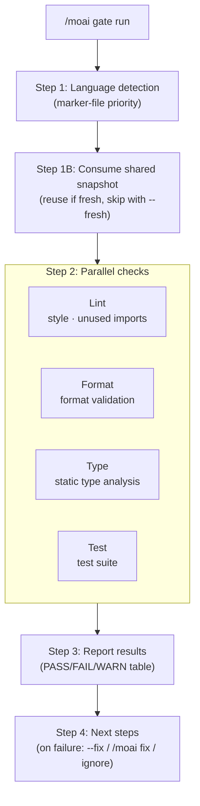

A **lightweight gate** command that quickly validates quality before a commit. It runs lint, format, type checks, and tests **in parallel**, completing within 30 seconds on most projects.


**One-line summary**: `/moai gate` is a "fast checkpoint before committing." It runs four checks (lint · format · type · test) simultaneously and tells you pass/fail instantly — without a full code review or coverage analysis.



**Slash command**: Type `/moai:gate` in Claude Code to run this command directly. Type just `/moai` to see the full list of available subcommands.


## Overview

Use it when you want to check "is the current state clean?" before committing. Unlike `/moai review` (deep 4-perspective review) or the sync pipeline's full quality check, `/moai gate` provides only a **fast pass/fail verdict**.

| Workflow | Scope | Speed | When to use |
|-----------|------|------|-----------|
| `/moai gate` | Lint + format + type + test | Fast (<30s) | Before every commit |
| `/moai review` | 4-perspective deep code review | Medium (2-5 min) | Before a PR, design review |
| sync quality check | Full quality + code review + coverage | Slow (5-10 min) | Part of the sync pipeline |

## Usage

```bash
# Full check
> /moai gate

# Auto-fix lint and format
> /moai gate --fix

# Check staged files only
> /moai gate --staged

# Check a specific file only
> /moai gate --file src/auth/service.go
```

## Supported flags

| Flag | Description | Example |
|-------|------|------|
| `--fix` | Auto-fix lint and format issues (default: report only) | `/moai gate --fix` |
| `--staged` | Check only `git diff --staged` files (tests always run fully) | `/moai gate --staged` |
| `--file PATH` | Check a specific file only | `/moai gate --file src/api.go` |
| `--fresh` | Force fresh mode — disable all shared-diagnostic-snapshot consumption and run every check anew | `/moai gate --fresh` |

## Execution flow



### Step 1: Language detection

It checks marker files in priority order (first match wins) and selects the language-specific toolchain. All 16 supported languages are treated equally — for example, Go runs `go vet` · `golangci-lint` · `go test -race`, while Python runs `ruff` · `mypy` · `pytest`. When no recognized marker is found, language-specific checks are skipped and "unknown language" is reported.

### Step 1B: Consume shared diagnostic snapshot

Before running checks, it queries the shared diagnostic snapshot for the current working tree. When a fresh snapshot (key match + within TTL, default 10 minutes) covers the check categories this gate would run, the recorded results are reused instead of re-running, shown in the report as `Test | PASS (snapshot)`. A stale snapshot is never cited as evidence — it is re-run. In `--fresh` mode this step is skipped entirely.

### Step 2: Parallel checks

The four checks run concurrently in the background.

| Check | Target | `--fix` behavior |
|------|------|--------------|
| **Lint** | Style violations, unused imports, dead code | Fixes auto-fixable items |
| **Format** | Unformatted files | Auto-formats |
| **Type** | Type errors, missing annotations | No auto-fix (manual intervention) |
| **Test** | Test failures | No auto-fix (root-cause investigation needed) |

Per-check timeout is 60 seconds; the overall gate timeout is 90 seconds. On timeout it reports a WARNING but does not block. The results of full-scope checks that actually ran (not reused) are recorded in the shared snapshot store under `.moai/state/verify/`, so downstream consumers (run-phase pre-review gate, sync pre-gate, stop-goal evaluator) can reuse them while the tree is unchanged.

### Step 3: Report results

```
## Quality Gate: PASS
| Check  | Status | Time  |
|--------|--------|-------|
| Lint   | PASS   | 2.1s  |
| Format | PASS   | 0.8s  |
| Type   | PASS   | 3.2s  |
| Test   | PASS   | 12.4s |
Total: 18.5s
```

### Step 4: Next steps

When everything passes, a commit-ready message is shown. When it fails without `--fix`, `AskUserQuestion` presents the following — auto-fix (re-run `--fix`, recommended) / `/moai fix` (deep resolution) / ignore and proceed. Issues remaining after `--fix` (type errors, test failures) are recommended for manual investigation.

## Relationship to other commands

`/moai gate` is a **lightweight checkpoint** that only validates and does not modify files (it corrects lint and format only when given `--fix`). When deeper resolution is needed, move on to `/moai fix` (one-shot) or `/moai loop` (iterative); for a comprehensive pre-PR review, use `/moai review`. `--fresh` mode is used when `/moai loop`'s independent final-verification pass calls this gate to obtain self-reference-free evidence.

## Related documents

- [/moai fix - one-shot auto-fix](/en/utility-commands/moai-fix)
- [/moai loop - iterative fix loop](/en/utility-commands/moai-loop)
- [TRUST 5 quality system](/en/core-concepts/trust-5)
