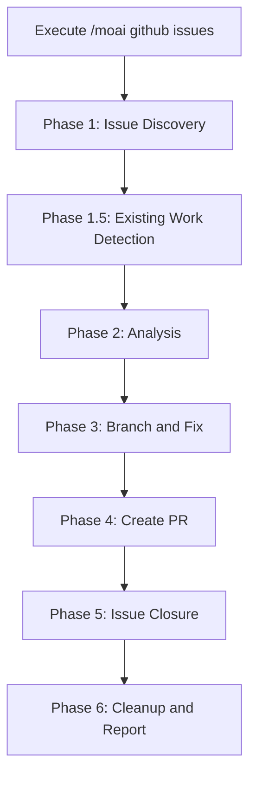
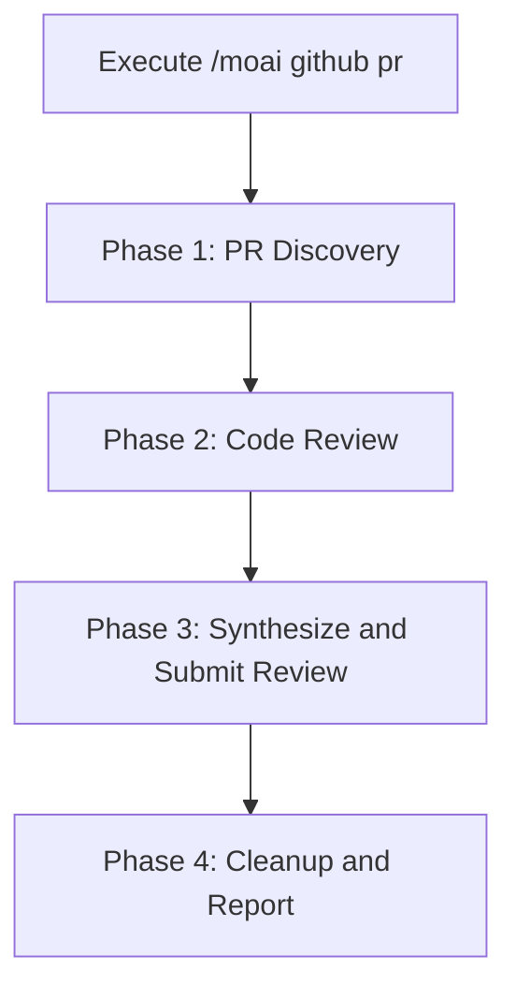

GitHub issue fixing and PR code review automation with Agent Teams.


**One-line summary**: `/moai github` automatically **fixes GitHub issues and reviews pull requests** using Agent Teams for parallel multi-perspective analysis.



**Slash Command**: Type `/moai:github` in Claude Code to run this command directly. Type `/moai` alone to see the full list of available subcommands.


## Overview

`/moai github` provides two main workflows:

- **issues**: Fetch GitHub issues, analyze root cause, implement fixes, and create PRs
- **pr**: Fetch PRs, perform multi-perspective code review, and submit review comments


**Important**: This command requires the GitHub CLI (`gh`) to be installed and authenticated.


## Usage

### Issue Fixing Workflow

```bash
# List and select open issues
> /moai github issues

# Fix specific issue
> /moai github issues 123

# Fix issues with specific label
> /moai github issues --label bug

# Fix all open issues (batch mode)
> /moai github issues --all

# Auto-merge after CI passes
> /moai github issues 123 --merge
```

### PR Review Workflow

```bash
# List and select open PRs
> /moai github pr

# Review specific PR
> /moai github pr 456

# Review all open PRs
> /moai github pr --all

# Auto-merge after approval
> /moai github pr 456 --merge

# Force sub-agent mode (skip Agent Teams)
> /moai github pr 456 --solo
```

## Supported Flags

| Flag | Description | Example |
|------|-------------|---------|
| `--all` | Process all open items | `/moai github issues --all` |
| `--label LABEL` | Filter issues by label | `/moai github issues --label bug` |
| `--merge` | Auto-merge after CI passes | `/moai github pr 123 --merge` |
| `--solo` | Force sub-agent mode | `/moai github issues --solo` |
| `--tmux` | Create tmux session for parallel work | `/moai github issues --tmux` |

## Issues Workflow

The issues workflow follows these phases:



### Phase 1: Issue Discovery

1. Fetch open issues from GitHub
2. Display issue list or filter by label/number
3. Classify issues by type (bug, feature, enhancement, docs)

### Phase 1.5: Existing Work Detection

Before starting analysis, the workflow checks for existing bot work:

- Detects @claude bot branches
- Checks for existing PRs referencing the issue
- As user whether to reuse existing work or redo from scratch

| Bot Branch | PR Exists | Action |
|-----------|-----------|--------|
| Yes | Yes (MERGED) | Skip issue (already resolved) |
| Yes | Yes (OPEN) | Ask: Review existing PR / Redo fix |
| No | Yes (OPEN) | Ask: Review existing PR / Continue work |
| No | No | Proceed with normal analysis |

### Phase 2: Analysis

**Team Mode (Default):**

Creates a team for parallel issue analysis:

- **Analyst teammates**: Explore codebase, identify root cause
- **Coder teammates**: Implement fixes in isolated worktrees
- **Validator teammates**: Verify fixes and test coverage

**Sub-agent Mode (--solo):**

Delegates to appropriate expert agent:
- Bug fix: expert-debug subagent
- Feature: expert-backend or expert-frontend subagent
- Enhancement: expert-refactoring subagent

### Phase 3: Branch and Fix

1. Create feature branch based on issue type:
   - Bug: `fix/issue-{number}`
   - Feature: `feat/issue-{number}`
   - Enhancement: `improve/issue-{number}`
   - Docs: `docs/issue-{number}`

2. Implement fix with tests
3. Verify tests pass
4. Commit changes with `Fixes #{number}` reference

### Phase 4: Create PR

Creates PR with:
- Title: `{type}: {issue title}`
- Body: Fix summary, test plan, issue reference
- Auto-link to issue via `Fixes #{number}`

### Phase 5: Issue Closure

After PR merge, closes issue with multilingual comment:

```
Issue resolved successfully!

Implementation: {summary}
Related PR: #{pr_number}
Merge time: {timestamp} {timezone}
Test Coverage: {coverage}%
```

Supported languages: English, Korean (한국어), Japanese (日本語), Chinese (中文)

## PR Review Workflow

The PR workflow performs multi-perspective code review:



### Phase 2: Multi-Perspective Review

**Team Mode (Default):**

Three reviewers analyze PR in parallel:

| Reviewer | Perspective | Focus Areas |
|----------|-------------|-------------|
| **security-reviewer** | Security | Injection risks, auth/authz, data exposure, OWASP Top 10 |
| **perf-reviewer** | Performance | Algorithm complexity, database patterns, memory leaks, concurrency |
| **quality-reviewer** | Quality | Correctness, test coverage, naming, error handling |

**Sub-agent Mode (--solo):**

Sequential review by:
1. expert-security subagent
2. expert-performance subagent
3. manager-quality subagent

### Phase 3: Submit Review

Findings are classified by severity:

- **Critical**: Must fix before merge (security vulnerabilities, data loss risks)
- **Important**: Should fix (performance issues, missing error handling)
- **Suggestion**: Nice to have (naming, style, minor improvements)

Review action options:
- **Approve**: Submit approval with summary
- **Request Changes**: Submit with required changes
- **Comment Only**: Submit as comment without approval decision

## Bot Review Integration

When merging PRs, checks bot review status before merge:

| Bot | Review State | Action |
|-----|-------------|--------|
| CodeRabbit | CHANGES_REQUESTED | Fix feedback, post `@coderabbitai resolve` |
| CodeRabbit | APPROVED | Proceed with merge |
| CodeRabbit | COMMENTED | Review comments, fix if Critical/Important |
| No bot reviews | - | Proceed with merge |

## Auto-Merge Safety Protocol

Before attempting any merge:

1. **Check mergeability**: `CLEAN`, `BEHIND`, `BLOCKED`, or `DIRTY`
2. **Check review decision**: `APPROVED`, `CHANGES_REQUESTED`, or none
3. **Check CI status**: All required checks must pass

| Merge State | Action |
|-------------|--------|
| CLEAN | Proceed with merge |
| BEHIND | Update branch, wait for CI, retry |
| BLOCKED | Resolve blockers (reviews/CI) |
| DIRTY | Report conflict, cannot auto-merge |

## Agent Mode

### Team Mode (Default)

Agent Teams mode provides parallel multi-perspective analysis:

- **Prerequisites**: `CLAUDE_CODE_EXPERIMENTAL_AGENT_TEAMS=1` and `workflow.team.enabled: true`
- **Benefits**: Faster analysis, multiple perspectives simultaneously
- **Isolation**: Each teammate works in isolated worktree

### Sub-agent Mode (--solo)

Fallback mode when Agent Teams unavailable:

- Sequential agent delegation
- Single context window
- Simpler debugging

## tmux Parallel Development

When `--tmux` flag is provided:

1. Creates tmux session: `github-issues-{timestamp}`
2. One pane per issue worktree (max 3 visible)
3. Each pane auto-executes worktree entry
4. Focus returns to first pane after creation

Layout:
- Panes 1-3: Vertical splits
- Panes 4+: Horizontal splits

## Git Workflow Configuration

Reads `github.git_workflow` from `.moai/config/sections/system.yaml`:

| Strategy | Branch Behavior | PR Target |
|----------|----------------|-----------|
| **github_flow** | Create feature branch | main |
| **gitflow** | Create feature branch | develop |
| **main_direct** | Stay on main | main (no PR) |

## Frequently Asked Questions

### Q: What happens if tests fail during fix?

The workflow retries up to 3 times with error context. If still failing, asks user to: retry, skip, or abort.

### Q: Can I review PRs without auto-merging?

Yes, omit the `--merge` flag. The review will be submitted without merging.

### Q: How are issues closed after merge?

Issues are closed with a multilingual comment (EN/KO/JA/ZH) including implementation summary, PR link, merge timestamp, and test coverage.

### Q: What if CodeRabbit requests changes?

The workflow:
1. Parses review comments
2. Delegates fixes to expert agent
3. Pushes fixes to PR branch
4. Posts `@coderabbitai resolve` comment
5. Waits for re-review (max 5 min)

### Q: Can I process multiple issues at once?

Yes, use `--all` flag for batch mode. Issues are processed sequentially to avoid branch conflicts.

## Related Documents

- [/moai - Full Autonomous Automation](/utility-commands/moai)
- [/moai pr - Pull Request Management](/workflow-commands/moai-sync)
- [Git Worktree Guide](/worktree/guide)
