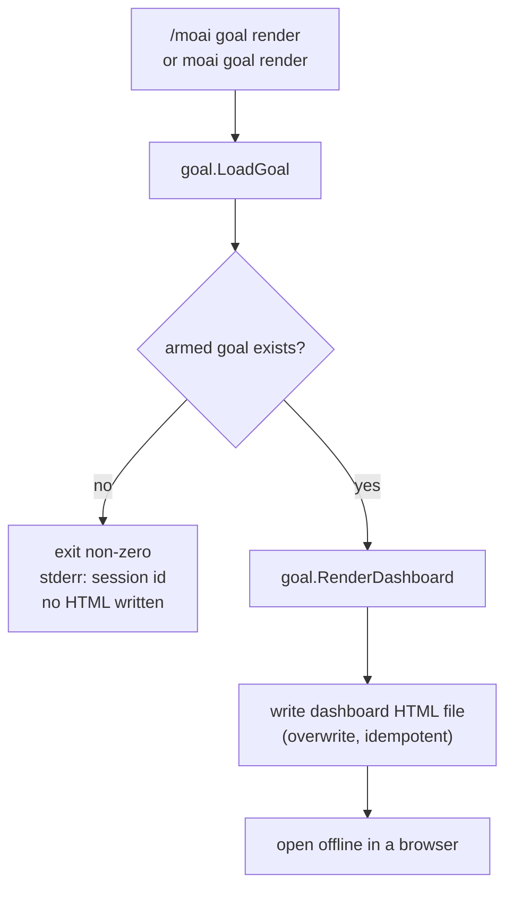

A **condition-declared autonomous loop** command: declare a completion condition and the session works on its own until that condition holds. When you arm a completion condition with `/moai goal "<condition>"`, the `stop-goal` Stop hook evaluates whether the condition is met at the end of every turn and automatically starts the next turn until it is satisfied.


**One-line summary**: `/moai goal` is "a general-purpose loop that declares an end state." If `/moai loop` is a preset whose condition — "until every issue found by the diagnostic tools is gone" — is predetermined, then `/moai goal` is the general-purpose engine where you **declare the completion condition yourself**.



**Programmatic command**: The native Claude Code `/goal` is a TUI command that only a user can type (HUMAN-ONLY). `/moai goal` is a MoAI-owned command that implements the same semantics **programmatically within the pipeline**, entered via `moai` skill routing and the `moai goal` CLI.


## Overview

Use it when you want to tell the agent "keep working on your own until this condition is met." Conditions can mix two kinds.

- **Mechanical condition**: a condition verified by a shell command. Example: `go test ./... exits 0`. It runs the command and observes the exit code.
- **Model-evaluated condition**: a condition verified by a judgment over the transcript. Example: `all AC rows recorded as PASS`. It is evaluated against what the session has surfaced so far.

This loop is the general-purpose engine of v3's second pillar, **agentic loop engineering**. Goal state is stored per session in `.moai/state/goal/<session-id>.json` (not a shared file), and a **turn ceiling (default 30)** makes the loop bounded. When the ceiling is reached, the evaluator issues a 5-section verdict (Claim / Evidence / Baseline-attribution / Gaps / Residual-risk) and stops blocking. `--max-turns 0` opts into an infinite (auto-compact-driven) goal that persists across compaction boundaries, bounded by `--max-duration` (wall-clock) and the stagnation guard instead of the turn count; arming `--max-turns 0` without at least one real bound is rejected at arm time (fail-closed).

## Verbs

### `/moai goal "<condition>"` — register + arm

Registers the condition text and arms the goal on the active session. The condition is parsed into a `conditions[]` array — a pure shell-command string is a mechanical condition, and an assertion referencing the transcript is a model condition. On arming, `.moai/state/goal/<session-id>.json` is written atomically (temp+rename), and the `stop-goal` Stop hook picks it up and begins evaluating at the end of the next turn.

```bash
> /moai goal "go test ./... exits 0; all AC recorded as PASS, or stop after 30 turns"
```

### `/moai goal status [--all]`

Prints the active session's goal (or, with `--all`, all sessions' goals) — the condition text, the conditions array, turns used vs. the ceiling, the progress log, and the lifecycle state (`armed` / `satisfied` / `ceiling-exit` / `cleared`).

### `/moai goal clear`

Releases the active session's goal (deletes the state file). The Stop hook sees no armed goal and stops blocking. This is how the orchestrator ends the loop after judging a model condition satisfied.


**There is no `resume` verb.** The once-discussed `resume` verb (restoring a released goal from an archive) does not exist in the current CLI — `moai goal --help` shows no `resume`, only `arm` / `status` / `clear` / `render`. Because `clear` **deletes** the state file (it does not tombstone to an archive), there is no original left to restore.


### `/moai goal render` — dashboard HTML render

Renders the active session's goal state as a **self-contained HTML dashboard** to `.moai/state/goal/<session-id>.html`. It is idempotent — re-running overwrites the same path. It can be invoked both as a slash command (`/moai goal render`) and as a terminal CLI (`moai goal render`); both call the same `goal.RenderDashboard`. If no goal is armed, it exits with a non-zero code and prints the session id to stderr without writing any HTML. Adding the `--json` flag emits `{action, session_id, path, bytes}`. See the [Goal Dashboard](#goal-dashboard) section below for what gets rendered and the security properties.

## Progression modes (autonomous / semi-autonomous)

When the orchestrator runs Implementation Kickoff Approval (the `AskUserQuestion` at the plan→run boundary), it lets you choose the **autonomous vs. semi-autonomous** progression mode as a **separate axis distinct** from the approve/reject decision. The chosen mode is stored in the goal state's `progression_mode` field (default `autonomous` if the user does not choose).

| Mode | Behavior |
|------|------|
| **autonomous (default)** | The evaluator blocks each turn until the condition is met or the ceiling is reached, without asking the user each turn. This is the existing Stop hook behavior as-is. |
| **semi-autonomous** | The `stop-goal` hook emits a **checkpoint-signal** block JSON at each turn boundary, and the orchestrator reads it to run an `AskUserQuestion` confirmation round (continue / release goal / switch to autonomous). The hook itself never calls `AskUserQuestion` (hook/subagent boundary — it emits structured JSON only). |


**Approval is required in both modes.** The progression-mode axis only chooses what to do **after** the gate has passed — it is not a gate bypass, nor a relaxation of Implementation Kickoff Approval. An armed goal, in any mode, does not authorize run-phase entry, create a PR, or perform destructive operations.


## Safety invariants

1. **Implementation Kickoff Approval is required in both modes** — the progression mode is a post-approval progression choice, not a gate relaxation, and it holds regardless of score.
2. **An armed goal does not bypass gates** — it does not auto-create a PR, and does not perform destructive operations. The evaluator only decides whether to continue turns; it does not pre-approve irreversible operations.
3. **The `stop-goal` hook does not call `AskUserQuestion`** — it emits structured JSON only (hook/subagent boundary).
4. **Stagnation guard** — when N consecutive no-progress iterations are detected, the loop stops and issues a 5-section verdict carrying an E1/E3 escalation note.

## goal conditions should be fast

The evaluator runs at the end of every turn. Prefer `go test -run <pattern>` over the full suite, and deterministic commands over long-running ones — the `stop-goal` Stop hook timeout is 120 seconds, but fast commands keep the turn loop tight.

## Relationship to /moai loop

`/moai loop` is a **preset on top of the goal engine**. If `/moai goal` is the general-purpose loop where the user declares the completion condition directly, then `/moai loop` is a preset that pre-fills the condition "until the issue queue found by the diagnostic tools is drained."

| Engine | Goal | Completion condition |
|------|------|----------|
| `/moai goal` | Condition-declared general-purpose loop | A user-defined condition expression is satisfied |
| `/moai loop` | Diagnostic fix loop (preset) | Issue queue drained + diagnostics clean (0 errors / tests pass / coverage) |

If the end state can be expressed as a condition expression, `/moai goal` is right; if it is "get rid of every problem the tools find," `/moai loop` is right.

## Goal Dashboard

The `render` verb renders the current session's goal state as a single static HTML dashboard at `.moai/state/goal/<session-id>.html`. The file depends on no external JS/CSS framework or CDN — it uses inline CSS only — so it opens directly in a browser offline and survives email attachment and Slack drag-and-drop without breaking.




**Self-contained HTML**: there are no external resources, so it opens even when the network is down. The goal state at render time is fully serialized inside the file.


**What the dashboard shows**: in the v3.1 CLI the verdict argument is always passed as `nil`, so the dashboard renders the following sections together with a "no verdict yet" placeholder.

- **Header** — session id, lifecycle state (`armed` / `satisfied` / `ceiling-exit` / `cleared`), turns used vs. ceiling, progression mode (`autonomous` / `semi-autonomous`), generation timestamp
- **Condition declaration** — the goal condition text shown verbatim inside a bordered block
- **Declared Conditions table** — each condition listed in a table. Mechanical conditions are shown as `<command> (expect exit N)`; model-evaluated conditions are shown as the claim text verbatim
- **Verdict placeholder** — a "no verdict yet" placeholder in the slots for the turn/ceiling line, the failed-conditions table, and the 5-section ceiling verdict (Claim / Evidence / Baseline-attribution / Gaps / Residual-risk)

**XSS auto-escape**: every untrusted field is rendered via the Go standard library `html/template` `{{.Field}}` syntax and auto-escaped. Even if a `<script>` payload is placed inside the condition text or condition values, it is converted to HTML entities and not executed. Goal conditions can mix shell-command strings and free text, so this auto-escape is a meaningful security property.

**Sibling HTML cleanup tied to `clear`**: `moai goal clear` deletes the sibling `<session>.html` dashboard file alongside the state file (`<session>.json`). In addition, `PruneOrphans` moves orphaned `.html` files together with `.json` files into the `consumed/` archive directory (best-effort). This keeps stale dashboards from piling up in the state directory.

## Roadmap

 These are surfaces whose renderer is ready but which are not yet wired into the v3.1 CLI; they are scheduled for v3.2 wiring. Running `moai goal render` today does not show the three below.

-  **Verdict-section population** — the turn/ceiling line, the failed-conditions table, and the 5-section ceiling verdict (Claim / Evidence / Baseline-attribution / Gaps / Residual-risk). The renderer fills these sections when the evaluator passes a non-nil verdict, but the v3.1 CLI always passes `nil`, so the "no verdict yet" placeholder is shown. This wiring is scheduled to arrive in v3.2 together with a LIVE board where the Stop hook refreshes the dashboard every turn.
-  **Plan HTML report** — a separate renderer, `RenderPlanHTML`, that writes plan-phase artifacts (goal + 8-field autonomy contract + verdict score + milestones) to `.moai/reports/plan-html/<SPEC-ID>-plan.html`. v3.1 ships no CLI wrapper and no production caller, so this path is not populated.
-  **Re-arm UI** — three conditional dashboard views: a re-arm indicator on `/clear`, a "re-armed under a new id" view, and a D8 infinite-goal rejection banner. The renderer exists, but no production caller constructs this context, so the v3.1 CLI passes `nil`.

The re-arm mechanics themselves (session-handoff embed + re-arm on `/clear` + infinite-goal rejection defense) already shipped under a prior SPEC — what is "unwired" in this roadmap is ONLY the surfacing of that mechanics state onto the dashboard UI.

## Related documents

- [/moai loop - iterative fix loop](/en/utility-commands/moai-loop)
- [/moai fix - one-shot auto-fix](/en/utility-commands/moai-fix)
- [/moai - fully autonomous automation](/en/utility-commands/moai)
