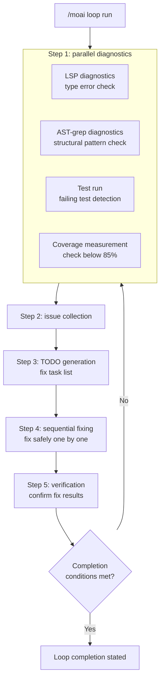
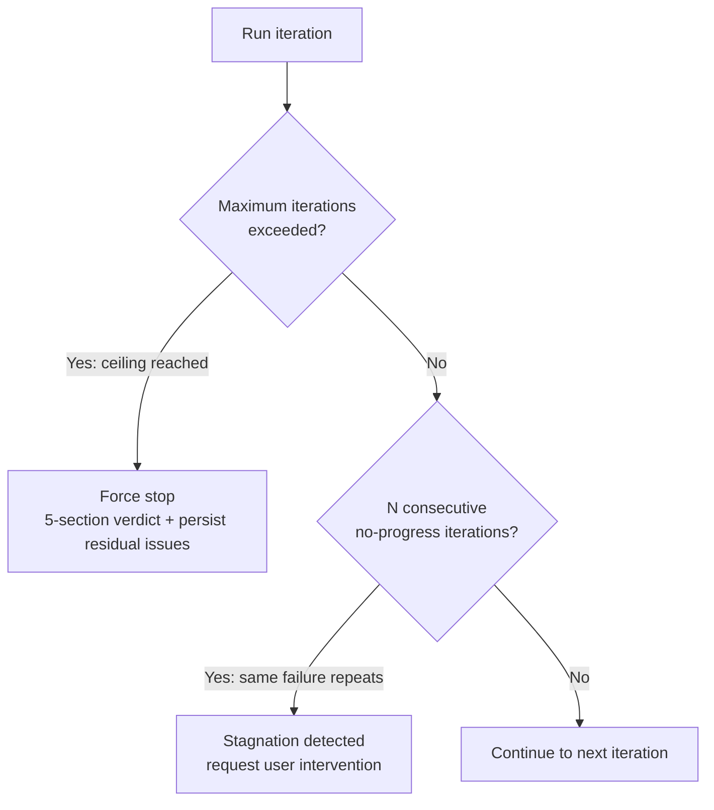
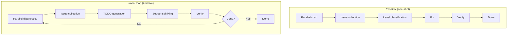
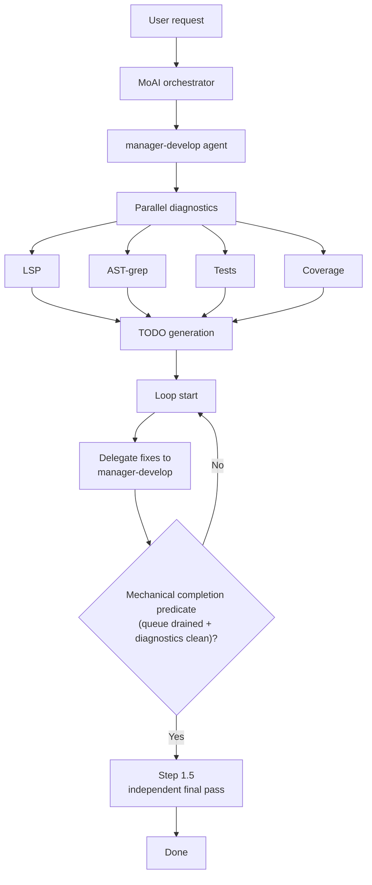

The autonomous iterative fix-loop command. The AI diagnoses issues, fixes them, and verifies the fixes on its own, repeating automatically **until every error is resolved**.


  **One-line summary**: `/moai loop` is an autonomous fix engine called the "Ralph Engine."
  It repeats **diagnose → fix → verify** to resolve every problem in the code automatically.



**Slash command**: In Claude Code, type `/moai:loop` to run this command directly. Typing just `/moai` shows the list of all available subcommands.


## Overview

While writing code, multiple problems can pile up at once — type errors, lint warnings, test failures. Instead of fixing these one by one manually, run `/moai loop` and the AI **fixes everything iteratively and automatically**.

Unlike `/moai fix`, which fixes **only once**, `/moai loop` keeps repeating **until the completion conditions are satisfied**.

This loop is the flagship example of v3's second pillar, **agentic loop engineering**. Instead of a human intervening at every error, the loop diagnoses and fixes on its own, and the observations the loop leaves behind accumulate as raw material for harness learning (recursive self-learning). The engine implementation is `internal/ralph/engine.go` — each iteration's `Decide()` judges one of continue / converge / request_review / abort in priority order.

## Relationship to /moai goal

`/moai loop` is a **preset on top of the goal engine**. While `/moai goal "<condition>"` is a general-purpose loop where the user declares the completion condition directly, `/moai loop` is a preset that pre-fills the condition "until the issue queue found by the diagnostic tools is fully drained."

| Engine | Goal | How it works | Completion condition |
|------|------|----------|----------|
| `/moai goal` | Goal-convergence loop | Until the user-defined condition is satisfied | Condition expression satisfied |
| `/moai loop` | Diagnostic fix loop | Repeat until 0 errors | 0 errors / 0 type errors / 85%+ coverage |

```text
/moai goal "go test ./... exits 0; all ACs recorded as PASS"
/moai goal status | clear
```

If you can express the end state as a condition, use `/moai goal`; if it is "remove everything the tools find," `/moai loop` is the right fit.

## Usage

```bash
> /moai loop
```

Run it without arguments and it automatically finds and fixes every problem in the current project.

## Supported Flags

| Flag                                      | Description                          | Example                       |
| ----------------------------------------- | ------------------------------------ | ----------------------------- |
| `--max N` (or `--max-iterations`)         | Limit the maximum iterations (default 10) | `/moai loop --max 20`   |
| `--lens {clean\|simplify\|coverage}`      | Add scan lenses (comma-separated, opt-in) | `/moai loop --lens clean,coverage` |
| `--auto-fix`                              | Enable auto-fix (default Level 1)    | `/moai loop --auto-fix`       |
| `--sequential` (or `--seq`)               | Sequential diagnostics instead of parallel | `/moai loop --sequential` |
| `--errors` (or `--errors-only`)           | Fix errors only, skip warnings       | `/moai loop --errors`         |
| `--coverage` (or `--include-coverage`)    | Include coverage (default 85%)       | `/moai loop --coverage`       |
| `--memory-check`                          | Enable memory-pressure detection     | `/moai loop --memory-check`   |
| `--resume ID` (or `--resume-from`)        | Resume from a snapshot               | `/moai loop --resume latest`  |

### The --max Flag

Limits the number of iterations:

```bash
# Iterate up to 20 times
> /moai loop --max 20
```


  To prevent infinite loops, the default is 10 iterations (`ralph.yaml`'s `loop.max_iterations`).
  The iteration-ceiling priority is CLI `--max` flag > `ralph.yaml` `loop.max_iterations` >
  `workflow.yaml` `loop_prevention.max_iterations`.


### The --lens Flag

In addition to the default scan lenses (LSP · lint · test failures · review lenses [security, @MX]), opt-in lenses widen the scan scope:

| Lens | Issues added |
|------|---------------|
| `clean` | Dead code (unused functions · imports · files) |
| `simplify` | Over-engineering findings |
| `coverage` | Coverage gaps (supplies issues only when the coverage gate is on) |

Only what a lens finds is placed in the queue; the loop never performs "invented improvements" outside the scanned queue.

## Execution Flow

`/moai loop` goes through the following steps on every iteration.



### Step 1: Parallel Diagnostics

Four diagnostic tools run **simultaneously** to quickly identify every problem in the project.

| Diagnostic tool | Checks           | Example problems found                          |
| ------------ | ------------------- | ----------------------------------------------- |
| **LSP**      | Type system         | Type mismatches, undefined variables, wrong arguments |
| **AST-grep** | Code structure      | Unused imports, dangerous patterns, code smells |
| **Tests**    | Test execution      | Failing tests, raised errors                    |
| **Coverage** | Coverage measurement | Modules below 85%                              |


  **What are parallel diagnostics?** The 4 diagnostics run **at the same time**, making them
  about 4x faster than running them sequentially. The collected problems are merged into
  a single list.


### Step 2: Issue Collection

All the problems found by parallel diagnostics are organized into a single list.

```
Issues found (example):
  [LSP] src/auth/service.py:42 - cannot assign "int" to "str"
  [LSP] src/auth/router.py:15 - "User" type undefined
  [AST] src/utils/helper.py:3 - unused import "os"
  [TEST] tests/test_auth.py::test_login - AssertionError
  [COV] src/auth/service.py - coverage 62% (target 85%)
```

### Step 3: TODO Generation

A fix-task list (TODO) is generated automatically from the collected issues. **Dependency order** is taken into account when deciding the fix sequence.

For example, if a type definition is missing, that type is added first, then the code using it is fixed.

### Step 4: Sequential Fixing

Items in the TODO list are fixed **one by one, sequentially**. Fixing in parallel could cause conflicts, so they are handled safely one at a time.

### Step 5: Verification

After the fixes, diagnostics run again to confirm the problems are resolved. If issues remain, it goes back to Step 1 and repeats.

## Loop-Prevention Mechanisms

Two safeguards prevent infinite loops. Letting a loop run indefinitely also wastes tokens, so the safeguards protect both stability and tokenomics.



| Safeguard              | Condition               | Behavior                                          |
| ---------------------- | ----------------------- | ------------------------------------------------- |
| **Max iteration limit** | Iteration ceiling reached (default 10) | Force-stops the loop, issues a 5-section verdict (Claim / Evidence / Baseline-attribution / Gaps / Residual-risk), and persists residual issues to `.moai/state/loop-verdict-<id>.json` |
| **Stagnation detection** | N consecutive no-progress iterations (same failure signature) | Judged a stagnation; issues a 5-section verdict and requests user intervention |


  **What if a stagnation occurs?** If the AI fails to resolve the same failure signature
  consecutively, it stops automatically and requests your intervention with a 5-section
  evidence verdict. In that case, inspect the error yourself or provide a hint.


## Completion Conditions

`/moai loop` ends the loop when **all three of the following conditions** are satisfied.

| Condition           | Criterion          | Description                              |
| ------------------- | ------------------ | ---------------------------------------- |
| **zero_errors**     | 0 LSP errors       | No type errors or syntax errors          |
| **tests_pass**      | All tests pass     | No failing tests                         |
| **coverage >= 85%** | Coverage at least 85% | Must meet the TRUST 5 quality bar     |

## Difference from /moai fix

`/moai fix` and `/moai loop` look similar, but there is a key difference.



| Comparison    | `/moai fix`             | `/moai loop`             |
| ------------- | ----------------------- | ------------------------ |
| **Runs**      | Once                    | Repeats until complete   |
| **Goal**      | Fix currently visible errors | Fully resolve all errors |
| **Level classification** | Yes (Level 1-4) | No (handles all issues)  |
| **Approval needed** | Level 3-4 require approval | Handled autonomously |
| **Duration**  | Short (1-2 min)         | Can be long (5-30 min)   |
| **When to use** | Simple fixes          | Cleanup after large refactorings |


  **Selection guide**: if there are only a few errors, resolve them quickly with `/moai fix`.
  If there are many errors or interrelated problems, `/moai loop` is more effective.


## Agent Delegation Chain

The agent delegation flow of the `/moai loop` command:



**Completion decision — mechanical predicate + independent final pass:**

The loop's successful termination is decided by a **mechanical completion predicate** — the orchestrator directly checks whether the issue queue is empty and the diagnostics (LSP/AST-grep/tests/coverage) are clean. No separate audit agent (sync-auditor) decides completion.

Once the predicate is satisfied, the **Step 1.5 Independent Final Pass** runs on the success-termination path — it runs `/moai gate --fresh` in a fresh context or spawns a read-only verification Agent to independently confirm the final state, so the loop does not inspect itself.

**Agent roles:**

| Agent                   | Role       | Main work            |
| ----------------------- | ---------- | -------------------- |
| **MoAI orchestrator**   | Loop coordination + completion-predicate decision | Coordinates diagnostics, checks the mechanical completion predicate, reports to the user |
| **manager-develop**     | Loop management and fix execution | TODO generation, actual code fixes (cycle_type=autofix) |
| **`/moai gate --fresh` or read-only verification Agent** | Step 1.5 independent final pass | Confirms the final state in an independent context before successful termination |

## Worked Example

### Scenario: Many Errors After a DDD Implementation

Assume several errors remain after implementing code with `/moai run`.

```bash
# Check the current state
$ pytest --tb=short
# 3 tests failing
# Coverage: 71%

# Check LSP errors
# 5 type errors, 2 undefined references

# Run the loop
> /moai loop
```

**Execution log:**

```
[Iteration 1/10]
  Diagnostics: 5 LSP errors, 3 test failures, coverage 71%
  TODO: 7 fix tasks generated
  Fix: 5 type errors resolved
  Verify: 0 LSP errors, 2 test failures, coverage 71%

[Iteration 2/10]
  Diagnostics: 2 test failures, coverage 71%
  TODO: 2 fix tasks generated
  Fix: 2 test-logic fixes
  Verify: 0 LSP errors, 0 test failures, coverage 74%

[Iteration 3/10]
  Diagnostics: coverage 74% (target 85%)
  TODO: 3 test-addition tasks generated
  Fix: missing test cases added
  Verify: 0 LSP errors, 0 test failures, coverage 87%

Completion conditions met!
  - LSP errors: 0
  - Tests: all passing
  - Coverage: 87%

DONE
```

In this example, `/moai loop` resolved every problem in just 3 iterations. Doing it manually would have meant checking and fixing each error one by one.

## Frequently Asked Questions

### Q: What if `/moai loop` runs too long?

You can limit iterations with the `--max` flag, or interrupt with `Ctrl+C`. The current state is saved, so you can resume later.

### Q: What if I only want a specific type of error fixed?

Use the `--errors` flag to fix errors only and skip warnings, or the `--lens` flag to adjust the scan scope:

```bash
# Fix errors only (skip warnings)
> /moai loop --errors

# Add the dead-code and coverage lenses
> /moai loop --lens clean,coverage
```

### Q: What is the difference between `/moai loop` and `/moai`?

`/moai loop` handles **only the error-fixing loop**. `/moai` automatically runs the **entire workflow** from SPEC creation through implementation to documentation.

### Q: What is the difference between `/moai loop` and `/moai goal`?

`/moai loop` aims to eliminate the issues found by diagnostic tools (LSP, tests, linters), while `/moai goal` keeps taking turns toward an arbitrary completion condition the user declared (e.g. "achieve AC-001 through AC-010"). `/moai loop` is a preset of the goal engine.

### Q: What happens when the loop hits a deadlock?

If the AI fails to resolve the same failure signature N times in a row (stagnation detection), it stops automatically and requests your intervention with a 5-section evidence verdict. In that case, inspect the code yourself or provide a hint.

## Related Documents

- [/moai fix - one-shot auto-fix](/utility-commands/moai-fix)
- [/moai - fully autonomous automation](/utility-commands/moai)
- [TRUST 5 Quality System](/core-concepts/trust-5)
- [Domain-Driven Development](/core-concepts/ddd)
