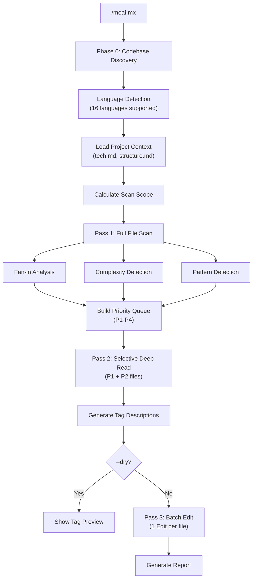
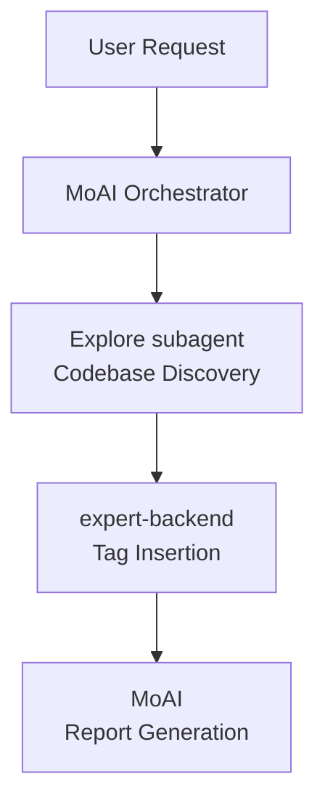

Scans the codebase and adds @MX code-level annotations. Automatically inserts comments so AI agents can **quickly understand code context**.


**One-line summary**: `/moai mx` automatically installs "code navigation signs". It **marks dangerous code, important functions, and missing tests with @MX tags** so AI agents understand your code better.



**Slash Command**: Type `/moai:mx` in Claude Code to run this command directly. Type `/moai` alone to see the full list of available subcommands.


## Overview

@MX tags are metadata annotations attached to code. They help AI agents instantly identify important functions, dangerous patterns, and incomplete work. `/moai mx` analyzes the codebase with a 3-pass scan and automatically inserts appropriate tags.

### @MX Tag Types

| Tag | Purpose | When to Use |
|-----|---------|-------------|
| `@MX:ANCHOR` | Invariant contract | fan_in >= 3 (called from 3+ locations) |
| `@MX:WARN` | Danger zone | Complexity >= 15, goroutine/async patterns |
| `@MX:NOTE` | Context delivery | Magic constants, business rule explanations |
| `@MX:TODO` | Incomplete work | Missing tests, unimplemented SPEC |

## Usage

```bash
# Scan entire codebase
> /moai mx --all

# Preview (check without modifying)
> /moai mx --dry

# P1 priority only (high fan_in functions)
> /moai mx --priority P1

# Force overwrite existing tags
> /moai mx --all --force

# Scan specific languages only
> /moai mx --all --lang go,python

# Lower threshold for more coverage
> /moai mx --all --threshold 2
```

## Supported Flags

| Flag | Description | Example |
|------|-------------|---------|
| `--all` | Scan entire codebase (all languages, all P1+P2 files) | `/moai mx --all` |
| `--dry` | Preview only - show tags without modifying files | `/moai mx --dry` |
| `--priority P1-P4` | Filter by priority level (default: all) | `/moai mx --priority P1` |
| `--force` | Overwrite existing @MX tags | `/moai mx --force` |
| `--exclude PATTERN` | Additional exclude patterns (comma-separated) | `/moai mx --exclude "vendor/**"` |
| `--lang LANGS` | Scan only specified languages (default: auto-detect) | `/moai mx --lang go,ts` |
| `--threshold N` | Override fan_in threshold (default: 3) | `/moai mx --threshold 2` |
| `--no-discovery` | Skip Phase 0 codebase discovery | `/moai mx --no-discovery` |
| `--team` | Parallel scan by language (Agent Teams mode) | `/moai mx --team` |

## Priority Levels

| Priority | Condition | Tag Type |
|----------|-----------|----------|
| **P1** | fan_in >= 3 (called from 3+ locations) | `@MX:ANCHOR` |
| **P2** | goroutine/async, complexity >= 15 | `@MX:WARN` |
| **P3** | Magic constants, missing docstrings | `@MX:NOTE` |
| **P4** | Missing tests | `@MX:TODO` |

## Execution Process

`/moai mx` executes in 3 passes.



### Phase 0: Codebase Discovery

Auto-detection supporting 16 languages:

| Language | Indicator Files | Comment Prefix |
|----------|----------------|----------------|
| Go | go.mod, go.sum | `//` |
| Python | pyproject.toml, requirements.txt | `#` |
| TypeScript | tsconfig.json | `//` |
| JavaScript | package.json | `//` |
| Rust | Cargo.toml | `//` |
| Java | pom.xml, build.gradle | `//` |
| Kotlin | build.gradle.kts | `//` |
| Ruby | Gemfile | `#` |
| Elixir | mix.exs | `#` |
| C++ | CMakeLists.txt | `//` |
| Swift | Package.swift | `//` |
| +5 more | Language-specific config files | Varies |

### Pass 1: Full File Scan

Scans all source files and generates a priority queue:

- **Fan-in Analysis**: Count function/method reference counts
- **Complexity Detection**: Lines, branches, nesting depth
- **Pattern Detection**: Language-specific danger patterns (goroutines, async, threading, unsafe)

### Pass 2: Selective Deep Read

Deep analysis of P1 and P2 files to generate accurate tag descriptions. Leverages project context (tech.md, structure.md, product.md).

### Pass 3: Batch Edit

Inserts tags with 1 Edit call per file. Existing @MX tags are preserved (unless `--force`).

## Batch Checkpoint

Large scans (50+ files) use batch processing:

- **Batch size**: 50 files per iteration
- **Auto-commit**: Intermediate results committed after each batch
- **Progress tracking**: `.moai/cache/mx-scan-progress.json`
- **Resumable**: Continue from where an interrupted scan stopped


When a rate limit is detected, the current batch is saved and the scan stops gracefully. Running `/moai mx` again resumes from the last checkpoint.


## Agent Delegation Chain



## Integration with Other Workflows

| Workflow | MX Integration |
|----------|----------------|
| `/moai sync` | MX validation runs automatically during sync (SPEC-MX-002) |
| `/moai edit` | Auto-validates @MX tags on file edits (v2.7.8+) |
| `/moai run` | Auto-triggers during DDD ANALYZE phase |
| `/moai review` | Includes MX tag compliance check |

## Frequently Asked Questions

### Q: Do @MX tags affect code execution?

No, @MX tags exist only as comments. They have zero impact on code execution or performance.

### Q: What happens with existing tags?

By default, existing tags are preserved. Use `--force` to overwrite them.

### Q: Are auto-generated files tagged?

No. Generated files, vendor directories, and mock files are automatically skipped based on exclude patterns in `.moai/config/sections/mx.yaml`.

## Related Documents

- [/moai clean - Dead Code Removal](/utility-commands/moai-clean)
- [/moai review - Code Review](/quality-commands/moai-review)
- [/moai - Full Autonomous Automation](/utility-commands/moai)
