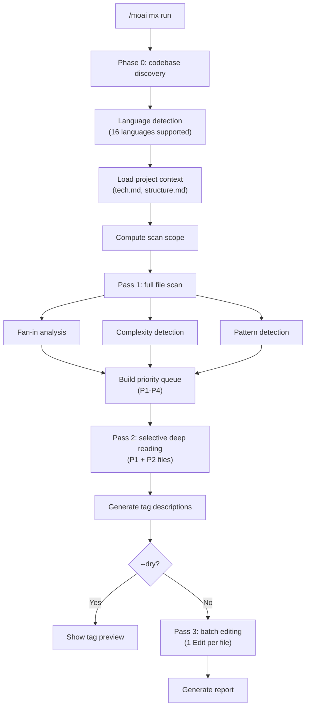
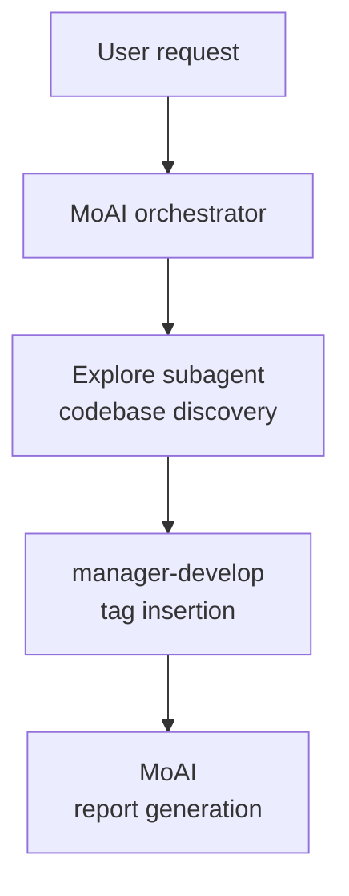

The command that scans the codebase and adds @MX code-level annotations. It automatically inserts comments so AI agents can **quickly understand code context**.


**One-line summary**: `/moai mx` automatically installs "code navigation signposts." It **marks dangerous code, important functions, and missing tests with @MX tags** so AI agents understand the code better.



**Slash command**: In Claude Code, type `/moai:mx` to run this command directly. Typing just `/moai` shows the list of all available subcommands.


## Overview

@MX tags are metadata annotations attached to code. They let AI agents instantly identify important functions, dangerous patterns, and unfinished work while reading code. `/moai mx` analyzes the codebase with a 3-stage scan and inserts the appropriate tags automatically.

Leaving project knowledge for agents in files is a fundamental pattern of harness design, and @MX tags apply that pattern at the **code level**. Instead of the agent re-discovering the danger spots by re-reading all the code every time, it can follow the signposts — a double effect of saving exploration tokens (tokenomics) while never missing the danger spots (quality).

### @MX Tag Types

| Tag | Purpose | When used |
|------|------|----------|
| `@MX:ANCHOR` | Invariant contract | fan_in >= 3 (called from 3+ places) |
| `@MX:WARN` | Danger zone | complexity >= 15, goroutine/async patterns |
| `@MX:NOTE` | Context sharing | Magic constants, business-rule explanations |
| `@MX:TODO` | Unfinished work | Missing tests, unimplemented SPEC |

## Usage

```bash
# Scan the entire codebase
> /moai mx --all

# Preview (check only, no modifications)
> /moai mx --dry

# P1 priority only (high fan_in functions)
> /moai mx --priority P1

# Force-overwrite existing tags
> /moai mx --all --force

# Scan specific languages only
> /moai mx --all --lang go,python

# Lower the fan_in threshold
> /moai mx --all --threshold 2
```

## Supported Flags

| Flag | Description | Example |
|-------|------|------|
| `--all` | Scan the whole codebase (all languages, all P1+P2 files) | `/moai mx --all` |
| `--dry` | Preview only - show tags without modifying files | `/moai mx --dry` |
| `--priority P1-P4` | Priority level filter (default: all) | `/moai mx --priority P1` |
| `--force` | Overwrite existing @MX tags | `/moai mx --force` |
| `--exclude PATTERN` | Additional exclusion patterns (comma-separated) | `/moai mx --exclude "vendor/**"` |
| `--lang LANGS` | Scan specific languages only (default: auto-detect) | `/moai mx --lang go,ts` |
| `--threshold N` | Override the fan_in threshold (default: 3) | `/moai mx --threshold 2` |
| `--no-discovery` | Skip Phase 0 codebase discovery | `/moai mx --no-discovery` |
| `--team` | Parallel per-language scan (agent team mode) | `/moai mx --team` |

## Priority Levels

| Priority | Condition | Tag type |
|---------|------|----------|
| **P1** | fan_in >= 3 (called from 3+ places) | `@MX:ANCHOR` |
| **P2** | goroutine/async, complexity >= 15 | `@MX:WARN` |
| **P3** | Magic constants, missing docstrings | `@MX:NOTE` |
| **P4** | Missing tests | `@MX:TODO` |

The core principle is not "tag everything" but **"tag only the code the AI must notice first."** Most code satisfies none of the conditions and has no tag — and that is normal.

## Execution Flow

`/moai mx` runs in 3 passes.


```mermaid
flowchart TD
    Start["/moai mx run"] --> Phase0["Phase 0: codebase discovery"]

    Phase0 --> LangDetect["Language detection<br/>(16 languages supported)"]
    LangDetect --> Context["Load project context<br/>(tech.md, structure.md)"]
    Context --> Scope["Compute scan scope"]

    Scope --> Pass1["Pass 1: full file scan"]
    Pass1 --> FanIn["Fan-in analysis"]
    Pass1 --> Complexity["Complexity detection"]
    Pass1 --> Pattern["Pattern detection"]
    FanIn --> Queue["Build priority queue<br/>(P1-P4)"]
    Complexity --> Queue
    Pattern --> Queue

    Queue --> Pass2["Pass 2: selective deep reading<br/>(P1 + P2 files)"]
    Pass2 --> Generate["Generate tag descriptions"]

    Generate --> Pass3{"--dry?"}
    Pass3 -->|Yes| Preview["Show tag preview"]
    Pass3 -->|No| Insert["Pass 3: batch editing<br/>(1 Edit per file)"]
    Insert --> Report["Generate report"]
```

### Phase 0: Codebase Discovery

Automatic detection supporting 16 languages:

| Language | Detected files | Comment prefix |
|------|-----------|------------|
| Go | go.mod, go.sum | `//` |
| Python | pyproject.toml, requirements.txt | `#` |
| TypeScript | tsconfig.json | `//` |
| JavaScript | package.json | `//` |
| Rust | Cargo.toml | `//` |
| Java | pom.xml, build.gradle | `//` |
| Kotlin | build.gradle.kts | `//` |
| Ruby | Gemfile | `#` |
| Elixir | mix.exs | `#` |
| C++ | CMakeLists.txt | `//` |
| Swift | Package.swift | `//` |
| 5 more | Each language's config file | Per language |

### Pass 1: Full File Scan

Scans every source file to build the priority queue:

- **Fan-in analysis**: counts function/method references
- **Complexity detection**: line count, branch count, nesting depth
- **Pattern detection**: per-language dangerous patterns (goroutine, async, threading, unsafe)

### Pass 2: Selective Deep Reading

Deeply analyzes P1 and P2 files to generate accurate tag descriptions. Uses the project context (tech.md, structure.md, product.md). Reading only the top-priority files deeply rather than every file — the scan itself is designed to be token-efficient.

### Pass 3: Batch Editing

Inserts tags with 1 Edit call per file. Existing @MX tags are preserved (except with `--force`).

## Batch Checkpoints

Large scans (50+ files) use batch processing:

- **Batch size**: 50 files per iteration
- **Auto-commit**: intermediate results committed after each batch
- **Progress saving**: `.moai/cache/mx-scan-progress.json`
- **Resumable**: an interrupted scan can continue


When a rate limit is detected, the current batch is saved and the scan stops gracefully. Run `/moai mx` again and it resumes from where it stopped.


## Agent Delegation Chain


```mermaid
flowchart TD
    User["User request"] --> MoAI["MoAI orchestrator"]
    MoAI --> Explore["Explore subagent<br/>codebase discovery"]
    Explore --> Backend["manager-develop<br/>tag insertion"]
    Backend --> Report["MoAI<br/>report generation"]
```

## Integration with Other Workflows

@MX tags are integrated across all stages of the SPEC 3-Phase — targets identified in plan, created/updated in run, verified and backfilled in sync:

| Workflow | MX integration |
|-----------|-------------|
| `/moai run` | Auto-triggered in the DDD ANALYZE stage; tags created/updated |
| `/moai sync` | MX verification runs automatically during sync |
| `/moai review` | Includes MX tag compliance checks |

## Frequently Asked Questions

### Q: Do @MX tags affect code execution?

No, @MX tags exist only as comments. They have no effect whatsoever on code execution or performance.

### Q: What happens to existing tags?

Existing tags are preserved by default. Use the `--force` flag to overwrite them.

### Q: Are auto-generated files tagged too?

No. Per the exclusion patterns in `.moai/config/sections/mx.yaml`, generated files, vendor, and mock files are skipped automatically.

## Related Documents

- [/moai clean - dead-code removal](/utility-commands/moai-clean)
- [/moai review - code review](/quality-commands/moai-review)
- [/moai - fully autonomous automation](/utility-commands/moai)
