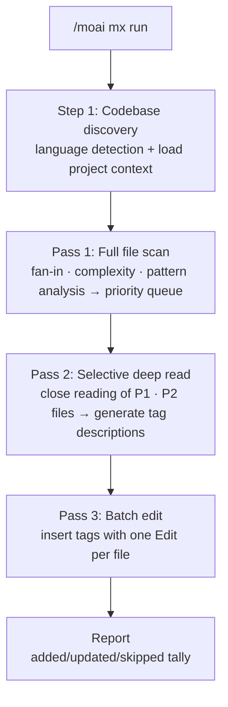

A command that scans the codebase and adds **@MX code annotations**. @MX tags are code-level annotations that help AI agents quickly grasp a code's context, intent, and risk.


**One-line summary**: `/moai mx` is a "code-signpost installer for the AI." It automatically finds high-fan-in functions, danger zones, incomplete spots, and more, planting `@MX:ANCHOR` · `@MX:WARN` · `@MX:NOTE` · `@MX:TODO` tags in the code.



**Slash command**: Type `/moai:mx` in Claude Code to run this command directly. Type just `/moai` to see the full list of available subcommands.


## Overview

The cost of an agent understanding code is context (tokens). @MX tags embed context like "this function is called from 8 places, so do not change its signature carelessly" right next to the code, so the agent does not have to re-analyze the whole codebase every time. From a harness-engineering standpoint, this is an **anchor planted in the code** — a tokenomics device that replaces repeated exploration cost with a one-time annotation.

It is mainly used in the following situations:

- Legacy codebases with no @MX tags
- Marking danger zones before a large refactor
- Updating annotations after a big code change
- MX validation during `/moai sync` (runs automatically)

## Tag types and priority

| Priority | Condition | Tag type |
|----------|------|-----------|
| P1 | fan_in >= 3 callers | `@MX:ANCHOR` (invariant contract, high fan_in) |
| P2 | goroutine/async, complexity >= 15 | `@MX:WARN` (danger zone, `@MX:REASON` required) |
| P3 | Magic constants, missing docstring | `@MX:NOTE` (context · intent) |
| P4 | Missing tests | `@MX:TODO` (incomplete) |
| P5 | Deliberate working simplification (accompanied by `@MX:CEILING` + `@MX:UPGRADE` sub-lines) | `@MX:DEBT` |

## Usage

```bash
# Scan the whole codebase (16 languages)
> /moai mx --all

# Preview without modifying
> /moai mx --dry

# P1 (high fan_in functions) only
> /moai mx --priority P1

# Scan Go and Python only
> /moai mx --all --lang go,python
```

## Supported flags

| Flag | Description | Example |
|-------|------|------|
| `--all` | Scan the whole codebase (all languages, all P1+P2 files) | `/moai mx --all` |
| `--dry` | Preview — show only the tags that would be added, without modifying files | `/moai mx --dry` |
| `--priority P1-P4` | Filter by priority level (default: all) | `/moai mx --priority P1` |
| `--force` | Overwrite existing @MX tags | `/moai mx --all --force` |
| `--exclude pattern` | Additional exclude patterns (comma-separated) | `/moai mx --exclude "vendor/,*.gen.go"` |
| `--lang go,py,ts` | Scan only specified languages (default: auto-detect) | `/moai mx --lang go,python` |
| `--threshold N` | Override the fan_in threshold (default: 3) | `/moai mx --all --threshold 2` |
| `--no-discovery` | Skip the Step 1 codebase discovery | `/moai mx --no-discovery` |

## Execution flow

`/moai mx` runs as a discovery Step 1 + a 3-Pass scan.


```mermaid
flowchart TD
    Start["/moai mx run"] --> Phase1["Step 1: Codebase discovery<br/>language detection + load project context"]
    Phase1 --> Pass1["Pass 1: Full file scan<br/>fan-in · complexity · pattern analysis → priority queue"]
    Pass1 --> Pass2["Pass 2: Selective deep read<br/>close reading of P1 · P2 files → generate tag descriptions"]
    Pass2 --> Pass3["Pass 3: Batch edit<br/>insert tags with one Edit per file"]
    Pass3 --> Report["Report<br/>added/updated/skipped tally"]
```

### Step 1: Codebase discovery

It detects the project language (16 languages, marker-file priority) and determines the language-specific comment prefix (`//`, `#`, etc.). It reads `.moai/project/tech.md` · `structure.md` · `product.md` · `README.md` to load project context for tag descriptions, and computes the scan scope and token budget. Passing `--no-discovery` skips this step.

### Pass 1: Full file scan

It globs all source files by language-specific patterns and performs fan-in analysis (counting function/method references), complexity detection (line count · branches · nesting depth), and pattern detection (goroutine · async · threading · unsafe), producing a priority queue (P1-P4) sorted by score.

### Pass 2: Selective deep read

It closely reads only the P1 · P2 files to analyze function signatures and call patterns, and generates accurate tag descriptions reflecting the project context (tech.md · structure.md · product.md) in language-specific comment syntax.

### Pass 3: Batch edit

It inserts all of a file's tags at once with a single Edit per file. Existing @MX tags are preserved unless `--force` is given. When there are fewer than 5 insertion targets the orchestrator edits directly (no spawn); with 5 or more it delegates to a batch-edit agent.

## Integration with /moai sync · run

- **`/moai sync`**: MX validation runs automatically during the sync phase — it scans files changed since the last sync to check for missing @MX tags, and unless the `--skip-mx` flag is given, adds the tags and includes the tag changes in the sync report.
- **`/moai run`**: During the DDD ANALYZE phase, if the codebase has no @MX tags at all, the 3-Pass is triggered automatically. Existing tags are validated and updated, and new tags are added to new code.

## Agent delegation chain

| Step | Executor | Main task |
|------|-----------|-----------|
| Step 1 (discovery) | Explore subagent | Language detection, load project context |
| Pass 1 (scan) | Explore or `Agent(general-purpose)` (backend scope) | Full file scan, build priority queue |
| Pass 2 (deep read) | `Agent(general-purpose)` (backend scope) | Close read of P1 · P2, generate tag descriptions |
| Pass 3 (edit) | `Agent(general-purpose)` (backend scope); orchestrator directly for fewer than 5 | Batch edit, insert tags |

## Related documents

- [/moai sync - documentation sync](/en/workflow-commands/moai-sync)
- [/moai run - DDD/TDD implementation](/en/workflow-commands/moai-run)
- [/moai clean - dead-code removal](/en/utility-commands/moai-clean)
