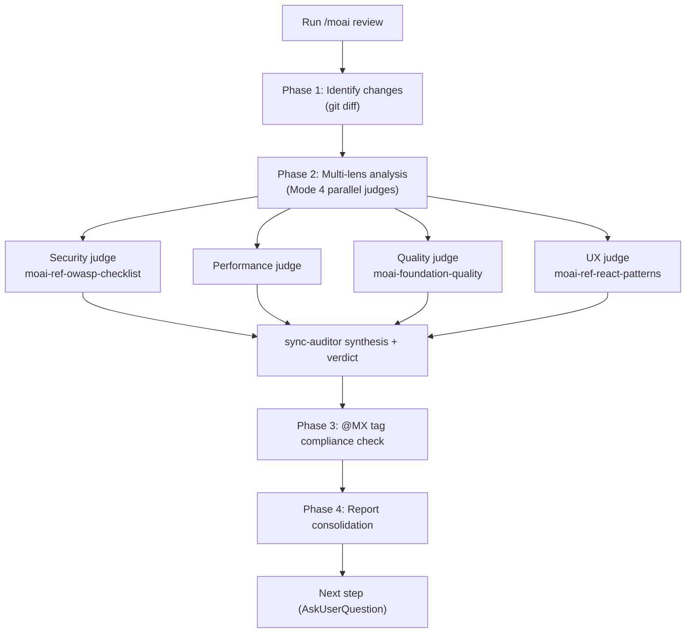

Reviews code across four lenses — security, performance, quality, and UX — checks `@MX` tag compliance, and produces a prioritized consolidated report.


**Slash command**: In Claude Code, type `/moai:review` to run this command directly. Typing just `/moai` shows the list of all available subcommands.


## Overview

`/moai review` is the **multi-lens code review** command. It analyzes the changeset with four read-only judges — Security, Performance, Quality, and UX — checks `@MX` tag compliance, and produces a consolidated report organized by severity.

`/moai review` is a **read-only, report-only lens** — it finds and reports defects but modifies no files. To actually fix the issues found, hand them off to `/moai fix` (or `/moai loop`). In other words, there is a layered relationship: `/moai review` **reports** the problems, and `/moai loop` **fixes** a finite issue set.

## Supported flags

| Flag | Description | Example |
|------|-------------|---------|
| `--staged` | Review only staged (`git add`) changes | `/moai review --staged` |
| `--branch BRANCH` | Compare the current branch against BRANCH (default main) | `/moai review --branch main` |
| `--security` | Focus on security review (OWASP, injection, authentication) | `/moai review --security` |
| `--file PATH` | Review a specific file only | `/moai review --file src/auth.go` |


The `--team` parallel review mode was **retired (tombstone)** along with the Agent Teams static layer. Parallel review is performed as a Mode 4 subagent fan-out, not a team.


## Agent chain

The four lenses run as a **Mode 4 parallel read-only fan-out** — up to four read-only judges (`Agent(general-purpose)`), one per lens, are spawned in a single turn, operating within the 3-5 concurrent-execution cap. Each judge's findings flow into the synthesis of the **sync-auditor** subagent, and sync-auditor owns the final verdict — the fan-out only changes the execution shape, it does not transfer verdict ownership.



## The four lenses

| Lens | Checks |
|------|--------|
| **Security** | OWASP Top 10, input validation, authentication/authorization, secret exposure, injection (SQL/command/XSS/CSRF) |
| **Performance** | Algorithmic complexity, DB query efficiency (N+1), memory patterns, caching opportunities, concurrency safety |
| **Quality** | TRUST 5 compliance, naming/readability, error handling, test coverage of changed code, project-pattern consistency |
| **UX** | User-flow integrity, error states/edge cases, accessibility (WCAG/ARIA), loading states, breaking changes to public interfaces |

The discovery phase reports **everything**, even low-confidence or low-severity items (each tagged with a confidence and severity). Filtering is the job of the verdict phase (must-pass thresholds + harmonic-mean score) downstream — the goal of the discovery phase is coverage.

## --security canonical procedure

When the `--security` flag is specified, the security lens is prioritized and analyzed more deeply.

### Dependency vulnerability scan

Enumerate the project manifest files (`go.mod`, `package.json`, `requirements.txt`, `Cargo.toml`, `pyproject.toml`, `Gemfile`, `composer.json`, `mix.exs`, `Package.swift`, `pubspec.yaml`), auto-detect the language by project marker, then run a vulnerability scan with a per-spawn `Agent(general-purpose)` security reviewer. The full OWASP checklist is supplied by the `moai-ref-owasp-checklist` skill.

### Secret scan (incremental + checkpoint)

Scans git history incrementally. It records the last-scanned SHA checkpoint in `.moai/state/secrets-scan-checkpoint.txt`; when a checkpoint exists, it scans only the new commit range + working tree, then updates the checkpoint to the current HEAD. On a first run or an explicit full scan, it scans the entire history with `--all`.

### Data isolation check

Verifies the boundaries for multi-tenancy (blocking cross-tenant data flow), PII separation (no PII recorded in logs, metrics, or telemetry), and shared-state leakage (no mutable globals carrying request-scoped data).

## @MX tag compliance check

After the lens analysis, it checks `@MX` tag compliance in the changed files:

- New exported functions: `@MX:NOTE` or `@MX:ANCHOR` recommended
- High fan_in functions (callers ≥ 3): `@MX:ANCHOR` required
- Dangerous patterns: `@MX:WARN` recommended
- Untested public functions: `@MX:TODO` recommended

Missing or outdated `@MX` tags are reported as findings.

## Report structure

The consolidated review report is organized by severity:

```markdown
## Code Review Report - {target}

### Critical Issues (must fix)
- [SECURITY] file:line: description
- [PERFORMANCE] file:line: description

### Warnings (should fix)
- [QUALITY] file:line: description
- [UX] file:line: description

### MX Tag Compliance
- Missing tags: N / Outdated tags: N / Compliant files: N/M

### Overall Assessment
- Security: PASS/FAIL
- Performance/Quality/UX: PASS/WARN
- TRUST 5 Score: N/5
```


**Security FAIL = overall FAIL**. The security must-pass criterion is not offset by high scores from the other lenses.


## Next steps

After the report, `AskUserQuestion` presents the following options:

- **Auto-fix (recommended)**: resolve Level 1-2 issues automatically with `/moai fix` (critical and complex issues get manual review)
- **Create fix tasks**: register each finding as a TaskList item
- **Export report**: save to `.moai/reports/`
- **Ignore**: review only, with no immediate action

## Related docs

- [/moai fix](/utility-commands/moai-fix) - auto-fix the issues found
- [/moai loop](/utility-commands/moai-loop) - iteratively fix a finite issue set
- [TRUST 5 quality system](/core-concepts/trust-5) - quality criteria in detail
