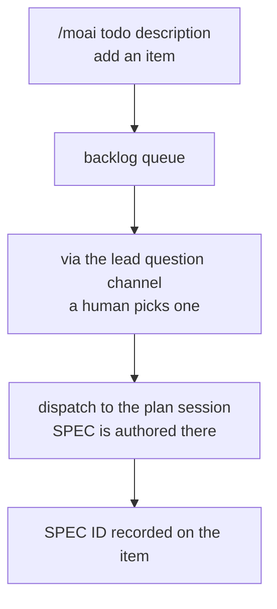



A **backlog queue** where you stack up what to do next, one line at a time. The kanban board's `backlog` column has no session assigned to it, so nobody pushes work into it on its own. Putting a card on the board is therefore always a human's judgment, and `/moai todo` is that window.


**One-line summary**: `/moai todo` is "the line where you write down what's next". You add an item, view the list, clear what's done, and pick the one to start next. It is not a SPEC and not a plan — it only becomes a SPEC at the moment you pick it.



**Slash command**: Type `/moai:todo` in Claude Code to run it immediately. Typing `/moai` alone shows the list of all available subcommands.


## Overview

A backlog item is **one line of intent**. Not a SPEC, not a plan, not an estimate. Only when a human picks the item and the lead session dispatches it to the `plan` session does it become a SPEC.

The queue is deliberately thin. It holds nothing that a SPEC, git history, or the board records better — only **what the human wants next**.



## Usage

```bash
# Add an item
> /moai todo "clean up error paths in auth middleware"

# View the queue
> /moai todo
```

| Invocation | Behavior |
|------|------|
| `/moai todo "<description>"` | Appends an item to the end of the queue and shows the added item and its position. |
| `/moai todo` | Shows the queue in order, with position numbers. |

Removing an item and picking the next card are not verbs on the slash surface. Those two belong to the terminal CLI below (`moai todo done`, `moai todo next`) or to the pick made through the lead session.

Any other argument shape is treated as a description. `/moai todo fix flaky CI cache` is not an error but an item add — the cost of a misunderstanding is a human deleting one line.

## State file

The queue is stored at `.moai/state/kanban/backlog.json`. It lives inside the project and is never committed.

```json
{
  "version": 1,
  "items": [
    {
      "id": "t1",
      "text": "clean up error paths in auth middleware",
      "added_at": "<RFC3339 timestamp>",
      "spec_id": null,
      "state": "queued"
    }
  ]
}
```

| Field | Meaning |
|------|------|
| `id` | A short, stable identifier assigned at add time. Never reused after removal. |
| `spec_id` | An optional link to a SPEC identifier. Filled when the pick records it via `--spec`; when the id is not yet known it stays `null` even in the `picked` state. |
| `state` | The lifecycle discriminator. One of `queued` · `picked` · `dropped` — this value is what separates "still a backlog item" from "already a card on the board". A picked item stays in the file so ongoing work is visible. The only way an item leaves the queue is an explicit `moai todo done` run by a human — nothing removes it automatically when its work completes. (`dropped` is a value defined in the record schema; no command sets it.) |

The file is written atomically (write to a temp file, then rename) so a crash mid-write cannot truncate the queue. A missing file is not an error but an **empty queue**, and a malformed file is reported and left untouched — the human intent stored here is the one value that cannot be regenerated.

## Picking the next card

The pick is made by a human through the lead session's question channel. The lead presents the queue as choices — one item at a time, oldest first, up to the four the tooling allows, with the rest summarized in the body so nothing is hidden — the same way it presents the queue as the first move after a `/clear`. From the terminal, a bare `moai todo next` prints the same list read-only when you just want to see the candidates.


 **A human does the picking.** Nothing is pre-selected, no estimated priority reorders the queue, and "just start from the top" is never a default. If the queue is empty, it says so and stops — an empty backlog is a normal state, not a signal to invent work.


You can also approve several cards at once — by pointing at the cards, or by saying to proceed in order until the queue is empty. That is still a human choice, just made in one batch instead of one at a time. The lead admits the cards in the approved order and does not ask again. What that approval permits is exactly that and nothing more — it is not a license to add items, reorder the queue, or decide cards whose judgment falls outside the approved scope.

After a card is picked, it continues like this:

1. The picked item is marked `picked` with one locked write: `moai todo next <n> [--spec <SPEC-ID>]`. When the identifier is already known, it is attached right here.
2. It is handed to the `plan` session per the kanban dispatch protocol. The card enters the `plan` column, and SPEC authorship happens there, not here.
3. When the id was not known at pick time, re-run `moai todo next <n> --spec <SPEC-ID>` once it is known to attach it. Nothing automates the later attachment — both the dispatch and this follow-up are instructions the lead session performs, not things the queue does on its own.

## Outside Kanban Mode

`/moai todo` works as-is in an ordinary single session — it is just a queue. It does not dispatch, though. Without companion sessions there is nobody to instruct, so reading and writing the queue is all there is, and the rest proceeds by hand.

## Boundaries

- **Not a work-management tool.** No priorities, no assignees, no deadlines, no dependency graph. Work that needs those belongs in an issue tracker or a SPEC.
- **Not the board.** Which column a card sits in is held by the lead session and the SPEC status, not by this file.
- **Not the source of truth for work in progress.** Once a card has a SPEC, the SPEC artifacts are the reference; the backlog item is only a pointer to it.
- **It does not fill itself.** The tool never scrapes TODO comments, open issues, or audit findings into the queue. A human puts items in.

## CLI surface

The same queue is also operable from the terminal. The slash command `/moai todo` and the terminal CLI `moai todo` are two distinct surfaces — they operate on the same file, but their syntax differs.

```bash
# Add an item — prints the issued id and queue position on one line
$ moai todo add "clean up error paths in auth middleware"

# View the queue (id · state · text)
$ moai todo list

# View as structured records
$ moai todo list --json

# Remove an item — accepts a number (t4) or an explicit id
$ moai todo done 4

# Print queued items oldest-first (read-only)
$ moai todo next

# Record a pick — optionally attaching the SPEC identifier
$ moai todo next 4 --spec SPEC-AUTH-001
```

| Command | Behavior |
|------|------|
| `moai todo add "<text>"` | Adds an item and prints the issued id and position. |
| `moai todo list` / `--json` | Renders the queue. `--json` emits the full records as JSON. |
| `moai todo done <n>` | Removes item `n`. The explicit `t<n>` id form is preferred — queue positions move under concurrent adds. |
| `moai todo next` | Prints queued items oldest-first. Read-only. |
| `moai todo next <n> [--spec <SPEC-ID>]` | Marks the item `picked`; with `--spec`, records the identifier verbatim. One locked write. |

The CLI never prompts. It takes arguments and flags, prints one line, and reports errors on stderr — a shape that is safe in scripts and CI.

Both surfaces share the same storage layer. Mutations hold the sibling lock file (backlog.lock) next to the queue file and land through a same-directory temp-file write followed by an atomic rename; reads are lock-free. Item ids are issued inside the lock from the persisted high-water mark (`last_seq`), so a removed item's id is never reused.


**Installed binary**: the CLI ships with the distributed binary. An already-installed `moai` binary only gains this command after reinstalling.


## Related documentation

- [Kanban Mode](/en/advanced/kanban-mode) — the board cards leaving the backlog flow across
- [`/moai` unified command](/en/utility-commands/moai) — the full subcommand map
- [`/moai plan`](/en/workflow-commands/moai-plan) — the stage where a picked card becomes a SPEC
