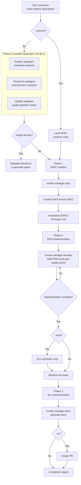

The fully autonomous automation command. When the user provides a goal, MoAI autonomously runs the **plan → run → sync** pipeline.


  **One-line summary**: `/moai` is the "fully autonomous automation" command. You simply describe
  the feature you want in natural language, and MoAI performs **the entire process automatically**,
  from SPEC creation through implementation to documentation.



**Slash command support**: all MoAI subcommands are wrapped as skills, so typing just `/moai` shows the list of available subcommands. Each subcommand can also be run directly in the form `/moai:fix`, `/moai:loop`, `/moai:review`, and so on.


## Overview

`/moai` is MoAI-ADK's **fully autonomous automation workflow** command. Without running sub-commands separately, the entire development process is automated with a single command:

1. **SPEC creation** (manager-spec)
2. **DDD/TDD implementation** (manager-develop — per development_mode in quality.yaml)
3. **Doc synchronization** (manager-docs)

## Analyze-First Routing

Starting with v3, `/moai`'s default routing is **Analyze-First** — language-independent intent analysis. It classifies the meaning of the request rather than matching English keywords, so requests in any `conversation_language` are routed with the same quality.

Routing proceeds in this order:

1. **Intent analysis**: classify the intent of the user's request (regardless of input language)
2. **Context-sufficiency check**: if insufficient, clarify through a Socratic interview
3. **Execution-plan composition**: choose the skill / agent / dynamic-workflow chain
4. **Orchestration mode selection** (Phase 4): autonomous selection from the 6-mode catalog (trivial / background / agent-team (retired) / parallel / sub-agent / workflow)

That is, even typing plain natural language without a subcommand, like `/moai "fix the login bug"`, is routed through intent analysis to the right workflow (the fix family for a fix, or the plan→run→sync pipeline for a new feature).

### Pipeline gates

The default pipeline passes four named gates in order:

1. **Plan-audit gate** (plan-auditor): independently audits the SPEC plan artifacts — aborts on FAIL/INCONCLUSIVE
2. **Implementation Kickoff Approval** (plan→run human gate): exactly once per pipeline entry, always obtaining user approval regardless of score
3. **Phase 4 mode selection** (6-mode catalog): autonomous selection after Implementation Kickoff Approval, recorded in progress.md
4. **Sync-audit gate** (sync-auditor): evaluates the synchronization result across 4 dimensions — aborts the chain on FAIL/INCONCLUSIVE

## Usage

```bash
# Basic usage
> /moai "description of the feature you want"

# With a branch
> /moai "feature description" --branch

# Enable loop mode
> /moai "feature description" --loop

# Resume an existing SPEC
> /moai --resume SPEC-AUTH-001
```

## Supported Flags

| Flag                | Description                              | Example                        |
| ------------------- | ---------------------------------------- | ------------------------------ |
| `--loop`            | Enable automatic iterative fixing after implementation | `/moai "feature" --loop`  |
| `--max N`           | Set the loop iteration ceiling (default 100) | `/moai "feature" --loop --max 20` |
| `--sequential`      | Run the Phase 1 exploration agents sequentially instead of in parallel | `/moai "feature" --sequential` |
| `--branch`          | Auto-create a feature branch             | `/moai "feature" --branch`     |
| `--pr`              | Auto-create a PR after completion        | `/moai "feature" --pr`         |
| `--issue`           | Opt in to GitHub issue creation after SPEC creation (plan phase); skipped otherwise per the late-branch opt-in policy | `/moai "feature" --issue` |
| `--resume SPEC-XXX` | Resume existing SPEC work                | `/moai --resume SPEC-AUTH-001` |
| `--solo`            | Force sub-agent mode (sequential execution) | `/moai "feature" --solo`       |
| `--team`            | (retired) falls back to sub-agent mode with `MODE_TEAM_UNAVAILABLE` | `/moai "feature" --team`       |

### The --loop Flag

Automatically runs iterative fixing after implementation completes, fixing all errors:

```bash
> /moai "JWT authentication system" --loop
```

When you use this option:

1. SPEC creation
2. DDD implementation
3. **Automatic loop execution** (resolves LSP errors, test failures, coverage gaps)
4. Doc synchronization
5. PR creation


  The `--loop` option **fully automates post-implementation cleanup**, maximizing
  productivity.


### The --solo Flag and Orchestration Modes

Run without a flag and MoAI looks at the size of the work and auto-selects the orchestration mode:

**Auto-selection criteria** (when no flag is given):

- Affected domains >= 3 → parallel execution
- Modified files >= 10 → parallel execution
- Complexity score >= 7 → parallel execution
- Otherwise → sub-agent mode (sequential execution)

| Flag | Behavior |
| ------ | ---- |
| `--solo` | Force sub-agent mode (sequential execution) |
| `--team` | (retired) falls back to sub-agent mode with `MODE_TEAM_UNAVAILABLE` |
| (none) | Complexity-based auto-selection |


**v3.0.0-rc11 change**: the Agent Teams static-orchestration layer is **retired**. Forcing `--team` falls back to sub-agent mode with `MODE_TEAM_UNAVAILABLE`. Parallel execution is handled by parallel sub-agent fan-out and 2 dynamic workflows (plan-phase parallel research fan-out, sync-phase 4-dimension quality evaluation), while the native teammate runtime (`moai cg` tmux panes) remains intact.


Parallel execution increases token usage because each agent uses an independent context window. For simple single-domain work, `--solo` (sequential) is more economical — which is why scale-based auto-selection is the default.

## Execution Flow

The full process `/moai` performs internally:



**Key points:**

- **Phase 0 (parallel exploration)**: three agents run at the same time for a 2-3x speedup
- **Single-domain routing**: simple work is delegated directly to a specialist agent, skipping the SPEC
- **Completion signal**: on completion, the completion report explicitly states the work is done

## Phase Details

### Phase 0: Parallel Exploration (optional)

Three agents run **simultaneously** to quickly grasp the project context:

| Agent        | Role                | Work                                          |
| ------------ | ------------------- | --------------------------------------------- |
| **Explore**  | Codebase analysis   | Discovers relevant files, architecture patterns, existing implementations |
| **Research** | External docs research | Official docs, API docs, similar implementation examples |
| **Quality**  | Quality baseline    | Test coverage, lint status, technical debt    |

**Speedup:** parallel execution is 2-3x faster than sequential (15-30 s vs 45-90 s)

**Single-domain routing:**

- Single-domain work (e.g. "SQL optimization"): delegated directly to a specialist agent, no SPEC creation
- Multi-domain work: proceeds through the full workflow

### Phase 1: SPEC Creation

The **manager-spec** subagent creates an EARS-format SPEC document:

- .moai/specs/SPEC-XXX/spec.md
- EARS-format requirements
- Given-When-Then acceptance criteria
- Content written in the conversation_language

### Phase 2: DDD/TDD Implementation Loop

The **manager-develop** subagent implements based on the SPEC:

- DDD cycle: ANALYZE-PRESERVE-IMPROVE (refactoring existing code)
- TDD cycle: RED-GREEN-REFACTOR (new feature development)
- Automatic domain-context injection (backend, frontend, security, database, etc.)

**quality.yaml development_mode setting:**

- `development_mode: ddd` → uses the DDD cycle (improving existing code)
- `development_mode: tdd` → uses the TDD cycle (new feature development, default)

**Loop behavior (with --loop or when loop.enabled is true):**

```
While issues exist AND iterations < maximum:
  1. Run diagnostics (LSP errors, test failures, coverage)
  2. Delegate fixes to manager-develop
  3. Verify the fix results
  4. Check whether the completion condition is met
  5. Exit the loop when the completion sentence is detected
```

### Phase 3: Doc Synchronization

The **manager-docs** subagent synchronizes the implementation and the docs:

- API doc generation
- README update
- CHANGELOG addition
- On success, explicitly states the work is complete

## TODO Management

**[HARD] The TodoWrite tool is mandatory:** TodoWrite must be used for all work tracking

- On discovering an issue: TodoWrite (pending state)
- Before starting work: TodoWrite (in_progress state)
- After completing work: TodoWrite (completed state)
- Printing the TODO list as plain text is forbidden

## Completion Signal

When every workflow stage completes successfully, MoAI explicitly states completion in the completion report (banner/prose) to make the outcome unambiguous.

## LLM Mode Routing

A core tokenomics device. Based on the llm.yaml setting, Claude and GLM are routed automatically per phase — enabling a hybrid where Claude handles strategy and planning while low-cost GLM handles bulk implementation.

| Mode          | Plan phase     | Run phase      |
| ------------- | -------------- | -------------- |
| `claude-only` | Claude         | Claude         |
| `hybrid`      | Claude         | GLM (worktree) |
| `glm-only`    | GLM (worktree) | GLM (worktree) |

## Worked Example

### Example: Fully Automating a JWT Authentication System

**Step 1: Run the command**

```bash
> /moai "JWT-based user authentication system: signup, login, token refresh" --loop --pr
```


`--worktree` is a `/moai plan`-only flag. The default pipeline (`/moai`, `run`, `sync`) has the router reject it, so it is not used in the example above. The worktree is created in the `/moai plan --worktree` step, and subsequent steps reuse that worktree.


**Step 2: Phase 0 - parallel exploration**

```
[Parallel exploration started]
  Explore subagent: analyzing src/auth/...
  Research subagent: researching JWT best practices...
  Quality subagent: confirming 32% test coverage...

[Exploration complete - 23 s]
  Files discovered: 4
  Recommended libraries: PyJWT, bcrypt
  Baseline: 0 LSP errors, 32% coverage
```

**Step 3: Phase 1 - SPEC creation**

```
[Invoking manager-spec]
  SPEC ID: SPEC-AUTH-001
  Requirements: 5 (EARS format)
  Acceptance criteria: 3 scenarios

  User approval: complete
```

**Step 4: Phase 2 - DDD implementation**

```
[manager-spec]
  Task decomposition: 7 tasks
  Strategic planning complete

[manager-develop]
  ANALYZE: code structure analysis complete
  PRESERVE: 12 characterization tests written
  IMPROVE: 7 tasks implemented

[sync-auditor]
  TRUST 5: all pillars pass
  Coverage: 89%
  Status: PASS
```

**Step 5: Automatic loop (--loop)**

```
[Loop started - iteration 1/100]
  Diagnostics: 2 type errors found
  Fix: delegated to the manager-develop subagent
  Verify: all errors resolved

[Loop finished - 1 iteration]
  Completion condition met!
```

**Step 6: Phase 3 - doc synchronization**

```
[manager-docs]
  API docs: docs/api/auth.md created
  README: usage section updated
  CHANGELOG: v1.1.0 entry added
  SPEC-AUTH-001: ACTIVE → COMPLETED
```

**Step 7: Done**

```
[Done]
  SPEC: SPEC-AUTH-001
  Commits: 7
  Tests: 36/36 pass
  Coverage: 89%
  PR: #42 created (Draft → Ready)

  → the Completion Report banner signals that the work is done
```

## Frequently Asked Questions

### Q: What is the difference between `/moai` and its sub-commands?

| Command      | Scope           | When to use                          |
| ------------ | --------------- | ------------------------------------ |
| `/moai`      | Full automation | When you want fast full automation   |
| `/moai plan` | SPEC creation only | When you want to review the SPEC first |
| `/moai run`  | Implementation only | When a SPEC already exists       |
| `/moai sync` | Documentation only | When updating only docs after implementation |

### Q: When should I use the --loop flag?

Use it when you want all errors fixed automatically after implementation. It is especially useful for cleanup after large refactorings.

### Q: What is single-domain routing?

Single-domain work (e.g. "optimize SQL queries") is delegated directly to the specialist agent for that domain without SPEC creation, saving time.

### Q: Can I make requests in a language other than English?

Yes. Analyze-First routing is language-independent intent analysis, so requests in Korean, Japanese, Chinese, or any other language behave identically.

## Related Documents

- [/moai plan](/workflow-commands/moai-plan) - SPEC creation details
- [/moai run](/workflow-commands/moai-run) - DDD implementation details
- [/moai sync](/workflow-commands/moai-sync) - Doc synchronization details
- [/moai loop](/utility-commands/moai-loop) - Iterative fix loop details
- [/moai fix](/utility-commands/moai-fix) - One-shot auto-fix details
