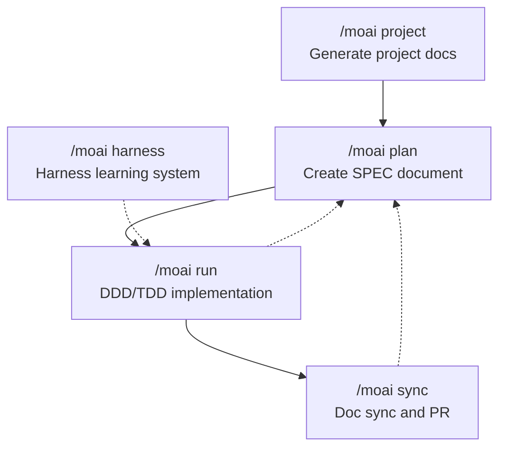

A set of commands that run the SPEC-based 3-Phase lifecycle (plan → run → sync).



## The Center of the Agentic Harness — the 3-Phase Lifecycle

One of the core values of MoAI-ADK v3 is the **Agentic Harness**. Instead of writing code directly, you design the environment where agents work well — SPEC documents, quality gates, and feedback loops. The workflow commands run the **plan → run → sync** pipeline, the central axis of this harness.

Each phase is handled by a specialized agent, and **planning and auditing are separated** so that whoever produced an artifact never inspects it. The plan-phase output is independently audited by plan-auditor, and the sync-phase result is evaluated by sync-auditor across 4 dimensions (Functionality, Security, Craft, Consistency). Right before entering the run phase, the **Implementation Kickoff Approval** (a human gate) always returns to the user.



## Command Summary

| Command | Phase | Responsible agent | Token budget | Purpose |
|--------|------|---------------|-----------|------|
| [`/moai project`](./moai-project) | Phase 0 | manager-docs | - | Auto-generate project documentation |
| [`/moai plan`](./moai-plan) | Phase 1 | manager-spec | 30K | Create SPEC documents |
| [`/moai run`](./moai-run) | Phase 2 | manager-develop | 180K | DDD/TDD implementation |
| [`/moai sync`](./moai-sync) | Phase 3 | manager-docs | 40K | Doc synchronization and PR creation |
| [`/moai harness`](./moai-harness) | Auxiliary | builder-harness | - | Harness creation and learning lifecycle management |

The differing per-phase token budgets are also part of v3's **Token Economics** design. Planning needs deep reasoning but produces small artifacts (30K), implementation involves a lot of code and needs a generous budget (180K), and doc synchronization sits in between (40K). The practice of clearing context with `/clear` between phases comes from the same reasoning — by not carrying the previous phase's conversation into the next, each phase gets its full budget.


If you are new, start with `/moai project`. Project documentation must exist for the AI to accurately understand and work on your project in later phases.

`/moai harness` is an auxiliary command for managing the harness learning subsystem — it monitors CLAUDE.md changes and proposes tier-based automatic updates.


## Quick Start

```bash
# Phase 0: Generate project docs (once, at first)
> /moai project

# Phase 1: Create SPEC
> /moai plan "Implement user authentication"
> /clear

# Phase 2: DDD implementation
> /moai run SPEC-AUTH-001
> /clear

# Phase 3: Doc sync and PR
> /moai sync SPEC-AUTH-001

# Auxiliary: harness learning management (optional)
> /moai harness status
> /moai harness apply
```

You can also make requests in plain natural language. If you type something like `/moai "fix the login bug"` without a subcommand, **Analyze-First routing** analyzes your intent and automatically connects it to the right workflow.

## Related Documents

- [SPEC-Based Development](/core-concepts/spec-based-dev) - Detailed explanation of SPEC and the EARS/GEARS formats
- [DDD Methodology](/core-concepts/ddd) - Detailed explanation of the ANALYZE-PRESERVE-IMPROVE cycle
- [TRUST 5 Quality System](/core-concepts/trust-5) - Detailed explanation of quality gates
- [Harness Engineering](/core-concepts/harness-engineering) - Overview of the harness learning subsystem
- [Quick Start](/getting-started/quickstart) - Step-by-step tutorial from scratch
