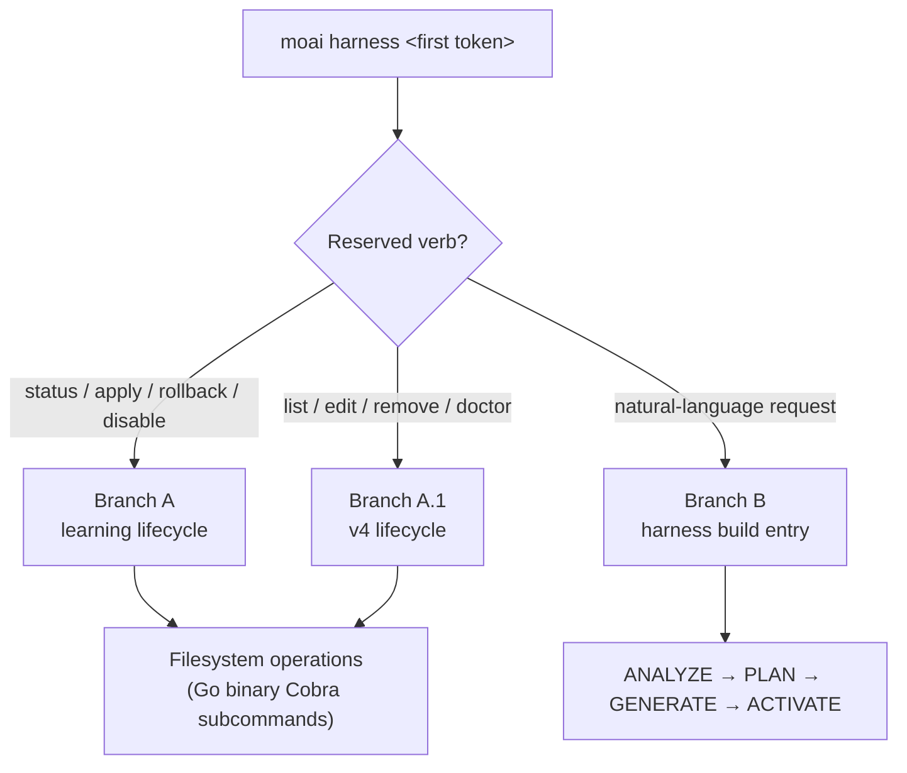

Creates project-specific dynamic specialist teams (harnesses) and manages the harness learning lifecycle.


**Slash command**: Type `/moai:harness <natural-language request>` in Claude Code to run this command directly.


## Overview

`/moai:harness` runs MoAI-ADK's **Harness v4 Builder** to auto-generate a dynamic specialist team tailored to the project's requirements.

It is the command that lets you feel v3's third pillar, the **agentic harness**, directly — a recursive structure where a harness builds a harness. When there is a project-specific area the general-purpose agent catalog cannot cover (e.g., a particular DB migration procedure, an in-house API convention), you can scaffold a specialist team for that area with a single sentence of natural language. The generated harness connects to the **recursive self-learning** subsystem — as usage observations accumulate, the harness produces improvement proposals on its own, and guidance evolves through a user-approval gate.

### What Is the Harness v4 Builder?

The Harness v4 Builder composes a team through a Socratic-interview-based 4-phase workflow (ANALYZE → PLAN → GENERATE → ACTIVATE).

| Phase | Description |
|------|------|
| ANALYZE | Analyze the project structure, languages used, and existing agent inventory |
| PLAN | Decide the needed team size (3-5), each teammate's role, and whether to use worktree isolation |
| GENERATE | Create the `.claude/agents/harness/` agent files and `.moai/harness/manifest.json` |
| ACTIVATE | Register the team and activate the `/harness:<name>` command |

## Single `harness` subcommand routing

`moai harness` is a single Cobra subcommand tree that branches into one of three paths based on the first argument (the first token of $ARGUMENTS) — **argument-branching routing** that introduces no separate command.

| First token | Routing target | Description |
| ------- | ----------- | ---- |
| `status` / `apply` / `rollback` / `disable` | **Branch A — learning lifecycle** | Manage the 4-tier learning system: observation accumulation → pattern → rule → auto-evolution proposal |
| `list` / `edit` / `remove` / `doctor` | **Branch A.1 — v4 lifecycle** | Enumerate, edit, atomically delete, and reference-integrity-diagnose the generated harnesses |
| anything else (natural language) | **Branch B — harness build entry** | Create a new harness via the v4 Builder's ANALYZE → PLAN → GENERATE → ACTIVATE 4 phases |



All verbs dispatch the same way through the `moai harness <verb>` Go binary Cobra subcommand tree — the learning verbs and the v4 verbs are not split into different Go binaries.

## How to Use

### Step 1: Request a team in natural language

```bash
> /moai:harness <natural-language request>
```

**Example:**
```
Create a specialist team for our Go backend project.
I need teams that handle DB migrations, REST API endpoints, and unit tests respectively.
```

### Step 2: The Builder handles it automatically

The Builder runs the 4 phases automatically:

1. **ANALYZE**: detect the Go, PostgreSQL, REST API tech stack
2. **PLAN**: decide on a 3-person team of DB Engineer, API Developer, Test Engineer
3. **GENERATE**:
   - `.claude/agents/harness/db-engineer.md`
   - `.claude/agents/harness/api-developer.md`
   - `.claude/agents/harness/test-engineer.md`
   - creates `.moai/harness/manifest.json`
4. **ACTIVATE**: register the `/harness:backend-team` command

### Step 3: Use the generated team

After creation, the team is used automatically in all work:

```bash
/moai run SPEC-BACKEND-001
```

MoAI analyzes the SPEC complexity and auto-delegates to the teammates in the manifest's phase order.

## Harness v4 Lifecycle Management (Branch A.1)

The generated harnesses are managed with the `moai harness` subcommand. Four v4 lifecycle verbs dispatch as Go binary Cobra subcommands.

### moai harness list

Lists all generated harnesses:

```bash
moai harness list
```

Output info: harness name, domain, entry command, and the schedule declared in the manifest (shown only when declared).

### moai harness edit <name>

Displays the manifest.json and agent-definition file paths to guide editing — the manifest is the SSOT:

```bash
moai harness edit backend-team
```

Edit targets:
- `.claude/commands/harness/<name>/manifest.json` (SSOT)
- `.claude/agents/harness/hns-<name>*-specialist.md` (specialist definitions)
- `.claude/skills/hns-<name>*/` (companion skills)

### moai harness remove <name>

Atomically deletes the harness and all associated files:

```bash
moai harness remove backend-team
```

Deleted items:
- `.claude/commands/harness/<name>.md` (thin-wrapper command)
- `.claude/commands/harness/<name>/manifest.json` (SSOT)
- `.claude/workflows/hns-<name>-run.js` (Runner)
- `.claude/agents/harness/hns-<name>*-specialist.md` (specialists)
- `.claude/skills/hns-<name>*/` (companion skills)


`remove` operates fail-closed — if any single artifact is missing, it aborts the deletion and reports the missing file. This guarantees no orphan artifacts are left behind.


### moai harness doctor

A smoke gate that verifies the reference integrity of all harnesses:

```bash
moai harness doctor
```

Checks:
- Whether every harness's manifest / specialist / skill files exist
- Cross-reference consistency between the manifest and its artifacts
- Schema validity of the schedule declaration (ERROR severity if invalid)

## The Harness Learning Lifecycle — Recursive Self-Learning (Branch A)

A harness is not a static artifact you create and forget. You manage the lifecycle of the **learning subsystem** with the `moai harness` subcommand. The learning verbs (status / apply / rollback / disable) route to Branch A.

| Command | Description |
|--------|------|
| `moai harness status` | Check the learning state (observation count, patterns, proposals, tier distribution, rate-limit window) |
| `moai harness apply` | Apply Tier-4 proposals (must pass the orchestrator AskUserQuestion approval gate) |
| `moai harness rollback <YYYY-MM-DD>` | Roll back to the snapshot of the specified date (the date argument is required) |
| `moai harness disable` | Disable learning (sets harness.yaml `learning.enabled: false`) |

**The 4-tier learning ladder** — the more observations accumulate, the higher the learning stage climbs:

| Tier | Observations | Behavior |
|------|---------|------|
| TierObservation | ≥1 | Simple recording |
| TierHeuristic | ≥3 | Pattern recognition |
| TierRule | ≥5 | Rule formation |
| TierAutoUpdate | ≥10 | Auto-update proposal (user approval required) |

**Artifacts**: the `.moai/harness/` directory (usage-log.jsonl, learned-rules.yaml, proposals/, learning-history/snapshots/)

### The Tier-4 Application Gate

Tier-4 (TierAutoUpdate) proposals **must** pass through an orchestrator-issued `AskUserQuestion` round before any file is modified. The workflow body runs in the orchestrator's main context, and sub-agents cannot call `AskUserQuestion` directly — if a sub-agent needs user input, it returns a structured blocker report and the orchestrator re-runs the gate.

On approval, a 5-layer safety pipeline runs:

1. **FrozenGuard** — path-prefix check (blocks modification of protected paths)
2. **Schema validation** — schema validation of the proposal fields
3. **Diff inspection** — inspection of the changes
4. **Rate-limit window** — max 3 per week, 24-hour cooldown (harness.yaml `rate_limit` SSOT)
5. **Snapshot creation** — save a pre-modification snapshot to `.moai/harness/learning-history/snapshots/<ISO-DATE>/`


The `moai harness apply --execute --id <proposal-id>` CLI path is a **separate ungated trust boundary** — it applies directly via the Go execute pipeline without the `AskUserQuestion` approval gate. Because a CLI process cannot prompt the user, `--execute` is an explicit opt-in for callers who have obtained approval by other means before invocation. The default `apply` (no `--execute`) is payload-only, emitting JSON only and modifying no files.


Auto-evolution is always applied only under the **user-approval gate**. You can restore at any time with `moai harness rollback <YYYY-MM-DD>`.

## Manifest Structure

Harness v4 defines the team configuration with **manifest.json**.

### manifest.json Example

```json
{
  "spec_id": "HARNESS-BACKEND-001",
  "name": "Backend Development Team",
  "version": "1.0.0",
  "created_at": "2026-07-01T10:00:00Z",
  "worktree_isolation": "L1_optional",
  
  "phases": [
    {
      "name": "plan",
      "teammates": [
        {
          "name": "architect",
          "role": "API architecture specialist",
          "model": "inherit",
          "skills": ["moai-foundation-core"]
        }
      ]
    },
    {
      "name": "run",
      "teammates": [
        {
          "name": "db-engineer",
          "role": "DB design and migration",
          "model": "inherit"
        },
        {
          "name": "api-developer",
          "role": "REST API endpoints",
          "model": "inherit"
        },
        {
          "name": "test-engineer",
          "role": "unit tests",
          "model": "inherit"
        }
      ]
    }
  ]
}
```

### Phase Fields

| Field | Description |
|------|------|
| `name` | Phase name (`plan`, `run`, `sync`) |
| `teammates` | Array of teammates participating in this phase |

### Teammate Fields

| Field | Default | Description |
|------|--------|------|
| `name` | required | Teammate unique identifier |
| `role` | required | Description of the teammate's role |
| `model` | `inherit` | Model selection (`inherit`, `sonnet`, `opus`) |
| `skills` | `[]` | List of skills to preload |

Being able to specify a different model per teammate (the `model` field) is an extension of the Tokenomics design — there is no reason to use the same model for a reasoning-heavy role like architecture decisions and a lightweight role like repetitive test writing.

## Worktree Isolation

Harness v4 supports optional worktree isolation.

### L1_optional (default)

```json
"worktree_isolation": "L1_optional"
```

Claude Code automatically creates an L1 worktree when it detects a conflict between parallel teammates.

- **Optional**: isolation applied only on conflict
- **Automatic**: the runtime creates it automatically after detecting a conflict
- **Cost**: worktree isolation increases memory

### none

```json
"worktree_isolation": "none"
```

All teammates work at the project root (minimal memory usage).

## The Team Delegation Workflow

Once a harness is activated, MoAI uses that team automatically.

### Team Delegation During SPEC Execution

```bash
> /moai run SPEC-BACKEND-001
```

**MoAI's automatic decisions:**
1. Estimate SPEC complexity (file count, lines of code)
2. Select the appropriate harness
3. Delegate to teammates sequentially/in parallel in the manifest phase order

### Phase-Based Delegation Example

```
PLAN Phase:
  → the architect teammate handles the architecture design

RUN Phase:
  → db-engineer, api-developer delegated in parallel
  → test-engineer delegated sequentially (tests)

SYNC Phase:
  → documentation generation and PR writing (default manager-docs)
```

## The Power of Natural-Language Requests

The Harness v4 Builder understands requirements through a Socratic interview.

### Effective Request Example

```
Our team is developing a Python FastAPI backend.
We need a team that is good at API endpoints, data validation, and error handling.
```

The Builder automatically:
- Detects the Python, FastAPI, asyncio tech stack
- Decides on a 3-5 person team size
- Sets each teammate's specialization area
- Preloads the needed skills

### The Builder Asks About Unclear Requests

```
I need a team.

→ Builder: What is the project's main technology? (language, framework)
→ Builder: What area should the team focus on? (backend, frontend, full)
→ Builder: Any specialized expertise you specifically need?
```

## Related Documents

- [Harness v4 Builder Guide](/en/advanced/builder-agents) - Builder 4-phase details
- [Agent Guide](/en/advanced/agent-guide) - understanding the 11-agent catalog
- [SPEC-Based Development](/en/workflow-commands/moai-plan) - SPEC workflow overview


**Tip**: Once you create a harness, that team is used automatically in all subsequent work. You can reuse it any time with the `/harness:team-name` command.

