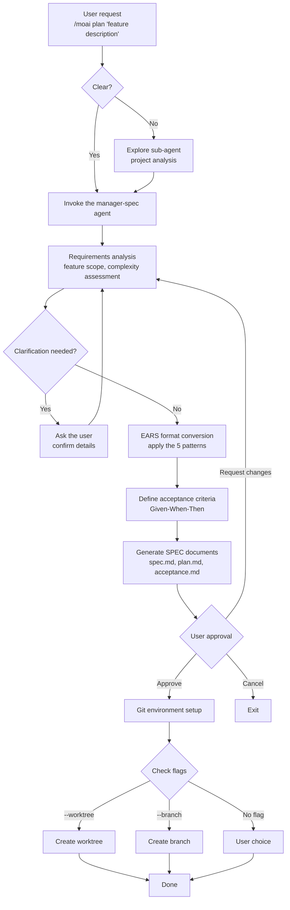
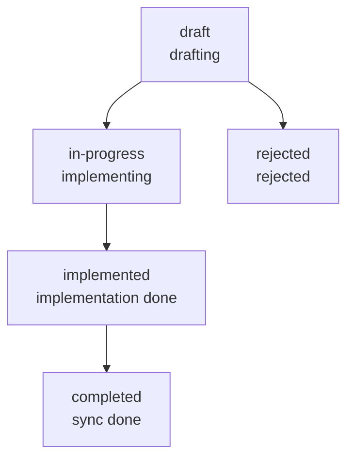

Turns your conversation with the AI into a permanent requirements document. A natural-language request becomes a structured SPEC document, and that document becomes the baseline for every later phase.


**Slash command**: Type `/moai:plan` in Claude Code to run this command directly. Type just `/moai` to see the full list of available subcommands.


## Overview

`/moai plan` is the **Phase 1 (Plan)** command of the MoAI-ADK workflow. It converts a natural-language feature request into a structured SPEC document in **GEARS** (Generalized Expression for AI-Ready Specs) format. Internally, the **manager-spec** agent analyzes the requirements and produces an unambiguous specification.

From v3.0.0, GEARS is the canonical notation, and the legacy **EARS** (Easy Approach to Requirements Syntax) is retained for 6 months of backward compatibility. For the differences between the two notations and migration, see the [GEARS notation section](#gears-notation).

The plan phase is where the deepest reasoning is allocated in the v3 Tokenomics design — the clearer the requirements here, the less rework and token waste in the implementation phase that follows. That is why MoAI-ADK follows the "plan deeply, implement cheaply" allocation principle, and the generated SPEC is independently audited by the **plan-auditor**. The agent that authored it does not inspect its own work.



**Why do you need a SPEC?**

The biggest problem with **vibe coding** (Vibe Coding) is **context loss**.

When a session drops mid-conversation with the AI, **all prior discussion disappears**. When the token limit is exceeded, **the oldest conversation is truncated first**. When you resume work the next day, **it does not remember yesterday's decisions**.

**The SPEC document solves this problem.**

It **saves requirements as a file** for permanent preservation. From v3.0.0, it structures them **without ambiguity** in the official **GEARS** notation (the legacy EARS notation is retained for 6 months of backward compatibility). Even if the session drops, you can **continue the work** just by reading the SPEC.



## Usage

Type the following in the Claude Code chat:

```bash
> /moai plan "description of the feature you want to build"
```

**Usage examples:**

```bash
# A simple feature
> /moai plan "user login feature"

# A detailed feature description
> /moai plan "JWT-based user authentication: login, signup, token renewal API"

# A refactoring request
> /moai plan "refactor the legacy auth system to be JWT-based"
```

## Supported flags

| Flag        | Description                          | Example                           |
| ------------- | ----------------------------- | ------------------------------ |
| `--worktree`  | Auto-create a worktree (highest priority)   | `/moai plan "feature" --worktree` |
| `--branch`    | Create a traditional branch            | `/moai plan "feature" --branch`   |
| `--no-issue`  | Skip automatic GitHub issue creation    | `/moai plan "feature" --no-issue` |

### Flag priority

When branch-strategy flags are specified, they apply in the following order:

1. **--worktree** (highest priority): create an isolated Git worktree
2. **--branch** (second): create a traditional feature branch
3. **No flag** (default): create only the SPEC; the user chooses the branch strategy at the BODP gate

`--no-issue` is an option independent of the branch strategy that skips the GitHub issue creation step (Phase 12).

### The --worktree flag

Creates an **isolated Git worktree** at the same time as the SPEC, preparing a parallel development environment:

```bash
> /moai plan "implement the payment system" --worktree
```

When you use this option:

1. It generates the SPEC document
2. It commits the SPEC (a prerequisite for creating a worktree)
3. It creates a worktree with the `feature/SPEC-{ID}` branch
4. You can develop independently without affecting the main code


  The `--worktree` option is useful when **developing multiple features simultaneously**. Since each SPEC is worked on in an isolated worktree, they do not conflict with each other.


## Requirements notation (EARS / GEARS)

The SPEC document defines requirements in the **EARS** (Easy Approach to Requirements Syntax) format. There are 5 patterns, and the manager-spec agent automatically converts natural language into the appropriate pattern.

From v3.0.0, **GEARS** (Generalized Expression for AI-Ready Specs) is the official notation — it keeps EARS's 5 core patterns while refining the semantic boundaries so that AI coding agents can interpret them more clearly. Legacy EARS is retained for 6 months of backward compatibility, and new SPECs are recommended to follow the GEARS patterns. For the differences between the two notations and migration, see the [GEARS notation section](#gears-notation).

| Pattern             | Format                          | Purpose               | Example                                             |
| ---------------- | ----------------------------- | ------------------ | ------------------------------------------------ |
| **Ubiquitous**   | "The system shall ~"         | Always-applied rules | "The system shall log all API requests"         |
| **Event-driven** | "WHEN ~, THEN the system shall ~" | Event reactions        | "WHEN a user logs in, THEN the system shall issue a JWT"      |
| **State-driven** | "WHILE ~, the system shall ~"  | State-based behavior     | "WHILE logged in, the system shall keep the session" |
| **Unwanted**     | "The system shall not ~"      | Prohibitions          | "The system shall not store passwords in plaintext"      |
| **Optional**     | "Where possible, the system shall ~"         | Optional features        | "Where possible, the system shall support two-factor authentication"         |


  You do not need to memorize the EARS format. The manager-spec agent **converts natural language automatically**. You just describe the feature you want naturally.


## Execution flow

Here is what `/moai plan` does internally:



**Key points:**

- If the request is unclear, the **Explore sub-agent** analyzes the project
- If the requirements are unclear, the manager-spec agent **asks the user follow-up questions**
- It auto-generates **Given-When-Then acceptance criteria** for every requirement
- The generated SPEC document is finalized **after the user approves it**

## SPEC creation phases

`/moai plan` follows a structured workflow of 15 phases and 2 decision points. Phases 1-3 are context discovery, Phases 4-7 are the deep interview, and from Phase 8 the actual SPEC assembly begins.

### Phases 1-3: context discovery

| Phase | Name | Description |
|-------|------|------|
| Phase 1 | Brain proposal detection | Brain IDEA scan and SPEC candidate identification |
| Phase 2 | Project exploration (optional) | `Explore` sub-agent codebase analysis |
| Phase 3 | Clarity assessment | 1-10 score-based clarity assessment and skip conditions |

Phases 1-3 run when the request is ambiguous or the project situation needs to be understood. A clear request can skip them at Phase 3.

### Phases 4-7: deep interview

Run when the clarity score is 4-10:

| Phase | Name | Description |
|-------|------|------|
| Phase 4 | Deep interview loop | 1-5 rounds of topic-centered interview |
| Phase 5 | UltraThink auto-activation | Extended reasoning activated when complexity ≥ 7 |
| Phase 6 | Deep research | `Explore` sub-agent research.md artifact |
| Phase 7 | Design direction | Intent-first design direction when UI/UX keywords are detected |

### Phase 8: SPEC planning

The **manager-spec** agent performs the following:

- Analyze project documents (product.md, structure.md, tech.md)
- Propose and name 1-3 SPEC candidates
- Check for duplicate SPECs (.moai/specs/)
- Design the GEARS structure (the EARS legacy format is also allowed)
- Identify the implementation plan and technical constraints
- Check library versions (stable only, excluding beta/alpha)

### Decision Point 1: user approval gate (HUMAN GATE)

After Phase 8 completes, the user must explicitly approve before proceeding to the next step. There are 4 choices:

| Choice | Meaning |
|------|------|
| **Proceed** | Proceed with the current SPEC |
| **Annotate** | Rewrite reflecting feedback (1-6 round iterations) |
| **Draft** | Preserve the SPEC in draft state and wait |
| **Cancel** | Abort SPEC creation |

### Phase 9: pre-verification gate

Prevents common errors before SPEC creation:

**Step 1 - document type classification:**

- Detect SPEC, Report, Documentation keywords
- Reports are routed to .moai/reports/
- Documentation is routed to .moai/docs/

**Step 2 - SPEC ID validation (all checks must pass):**

- **ID format**: the `SPEC-domain-number` pattern (e.g., `SPEC-AUTH-001`)
- **Domain name**: the approved domain list (AUTH, API, UI, DB, REFACTOR, FIX, UPDATE,
  PERF, TEST, DOCS, INFRA, DEVOPS, SECURITY, etc.)
- **ID uniqueness**: check for duplicates in .moai/specs/
- **Directory structure**: a directory must be created; flat files are forbidden

**Composite domain rule:** up to 2 domains recommended (e.g., UPDATE-REFACTOR-001), up to 3 allowed

### Phase 10: SPEC document creation

Three files are created simultaneously:

**spec.md:**

- YAML front matter (**12 required fields**: id, title, version, status, created, updated,
  author, priority, phase, module, lifecycle, tags)
- HISTORY section (right after the front matter)
- The complete GEARS/EARS structure (5 requirement types)
- Content written in the conversation_language

**plan.md:**

- Work-breakdown implementation plan
- Tech-stack specification and dependencies
- Risk analysis and mitigation strategies

**acceptance.md:**

- At least 2 Given/When/Then scenarios
- Edge-case test scenarios
- Performance and quality-gate criteria

**Quality constraints:**

- Requirement modules: up to 5 per SPEC
- Acceptance criteria: at least 2 Given/When/Then scenarios
- Technical terms and function names stay in English

### Phase 11: plan-auditor independent audit

The **plan-auditor** sub-agent independently audits the SPEC artifacts authored by manager-spec. It follows the **independent-audit principle** that the agent which created the artifacts does not inspect its own results.

- Up to 3 iterations (Retry Loop Contract)
- On score regression in a round, a STOP signal + scope-reduction proposal
- 3 verdicts: PASS / PASS-with-debt / FAIL
- Audit reports are saved in `.moai/reports/plan-audit/`

### Phase 12: GitHub issue creation (conditional)

Without the `--no-issue` flag, it creates a GitHub issue and links a bidirectional reference to the SPEC. From v3.0.0, issue creation is skipped by default and can be explicitly enabled with the `--issue` flag.

### Phase 13: Git environment setup (conditional)

The branch strategy is decided via the **BODP (Branch Origin Decision Protocol) gate**:

- **--worktree** (highest priority): create an isolated Git worktree
- **--branch** (second): create a traditional feature branch
- **Keep the current branch**: continue on the current checkout without a flag

### Phase 14: MX tag planning

Identifies the targets for the `@MX` code annotations to be added in the implementation phase:

- `@MX:ANCHOR` — invariant contracts (high fan_in functions)
- `@MX:WARN` — danger zones (goroutines, complexity ≥ 15)
- `@MX:NOTE` — context/intent records

### Phase 15: SPEC quality gate

Verifies coverage between the GEARS/EARS requirements and the acceptance criteria (AC), and performs a security-scope check.

### Decision Point 2/3/3.5: execution mode selection

After SPEC creation completes, you choose the next step. For details, see the [Decision Point 3.5 section](#decision-point-35-execution-mode-selection-gate).

## Output

The SPEC document is stored in the `.moai/specs/` directory:

```
.moai/
└── specs/
    └── SPEC-AUTH-001/
        ├── spec.md          # EARS requirements
        ├── plan.md          # implementation plan
        └── acceptance.md     # acceptance criteria
```

**Basic structure of the SPEC document:**

```yaml
---
id: SPEC-AUTH-001
version: 1.0.0
status: draft
created: 2026-01-28
updated: 2026-01-28
author: dev team
priority: HIGH
---
```

## SPEC status management

The SPEC document has the following status lifecycle:



| Status           | Description                 | `/moai run` can run |
| -------------- | -------------------- | --------------------- |
| `draft`        | SPEC drafted, awaiting approval | Yes (after approval)      |
| `in-progress`  | Currently implementing         | Yes (continue)           |
| `implemented`  | Implementation done, awaiting sync | No                |
| `completed`    | Sync done, fully complete | No                |
| `rejected`     | Rejected, needs rewrite  | No                |

## Brownfield classification — Delta Markers

Classifies SPEC requirements in an existing-codebase (brownfield) project.

| Marker | Meaning | Description |
|------|------|------|
| `[EXISTING]` | Keep existing | Reference only, no change |
| `[MODIFY]` | Modify | Change existing code |
| `[NEW]` | New | Create new |
| `[REMOVE]` | Remove | Remove existing code |

## Token-saving device — spec-compact.md

In the Plan phase, a summary of the SPEC document (`spec-compact.md`) is auto-generated. In the Run phase, the summary is loaded instead of the full spec.md to **save ~30% of tokens** — a representative example of a Tokenomics device built into the SPEC lifecycle.

## Scope-creep prevention — Exclusions and What/Why constraints

**Mandatory Exclusions ("What NOT to Build")**: every SPEC document requires an **Out of Scope / Exclusions** section. It prevents scope creep in advance.

**What/Why constraint**: SPEC requirements describe only **What** and **Why**. **How** is decided in the implementation phase and is not over-specified in the SPEC.

## Decision Point 3.5: execution mode selection gate

After Plan completes and before Run begins, it auto-detects the execution environment and proposes the optimal mode to the user.

**Detected items:**
1. tmux availability (the `$TMUX` environment variable)
2. Current LLM mode (`team_mode` in `llm.yaml`: cc/glm/cg)

**When tmux is available:**
- Worktree + current mode (recommended)
- Sub-agent Mode (sequential)

**When tmux is unavailable:**
- Sub-agent Mode (recommended)


The Agent Teams static-orchestration layer (Module 3) was retired. The `--team` flag and the Team Mode option are no longer provided, and forcing them falls back to Sub-agent Mode via `MODE_TEAM_UNAVAILABLE`. CG mode (Claude+GLM) is entered with the `moai cg` command.


## A practical example

### Example: creating a JWT authentication SPEC

**Step 1: run the command**

```bash
> /moai plan "JWT-based user authentication system: signup, login, token renewal"
```

**Step 2: manager-spec asks** (if needed)

The manager-spec agent may ask questions to confirm details:

- "What is the minimum password length?"
- "What token expiry time should be set?"
- "Should social login be included?"

**Step 3: SPEC document creation result**

A SPEC document with the following structure is created:

```yaml
---
id: SPEC-AUTH-001
title: JWT-Based User Authentication System
priority: HIGH
status: draft
---
```

```markdown
# Requirements (GEARS/EARS format)

## Ubiquitous

- The system shall hash and store all passwords with bcrypt
- The system shall log all authentication requests

## Event-driven

- WHEN a user logs in with valid credentials, THEN the system shall issue a JWT access token (1 hour) and a refresh
  token (7 days)

## Unwanted

- The system shall not store passwords in plaintext
- The system shall not allow API access with an expired token
```

**Step 4: Git environment setup after user approval**

```bash
# When using the --worktree flag
> /moai plan "JWT authentication" --worktree

# Result:
# 1. SPEC document created (.moai/specs/SPEC-AUTH-001/)
# 2. SPEC committed (feat(spec): Add SPEC-AUTH-001)
# 3. Worktree created (.git/worktrees/SPEC-AUTH-001)
# 4. Worktree path displayed
```

**Step 5: run `/clear`, then move to the implementation phase**

```bash
# Clean up tokens
> /clear

# Start implementation
> /moai run SPEC-AUTH-001
```

## Frequently asked questions

### Q: Can I edit the SPEC document manually?

Yes, you can edit the `.moai/specs/SPEC-XXX/spec.md` file directly. After adding requirements or modifying acceptance criteria, run `/moai run` and the changes are reflected.

### Q: Can't I just write code directly without a SPEC?

You can write code directly in Claude Code, but working without a SPEC means you lose context every time a session drops. **The more complex the feature, the more efficient it is to create a SPEC first.**

### Q: What rule generates the SPEC ID?

It is the `SPEC-domain-number` format (e.g., `SPEC-AUTH-001`)

- `SPEC-AUTH-001`: the first auth-related SPEC
- `SPEC-PAYMENT-002`: the second payment-related SPEC

The domain is decided automatically by manager-spec based on the feature's area.

### Q: What is the difference between `/moai plan` and `/moai`?

`/moai plan` handles **SPEC document creation only**. `/moai` performs the **entire workflow** automatically, from SPEC creation to implementation to documentation.

### Q: What is the difference between --worktree and --branch?

**--worktree** creates an isolated working directory, providing a fully isolated environment. **--branch** creates a new branch in the current repository. To develop multiple features simultaneously, --worktree is recommended.

## GEARS notation (v3.0.0+) {#gears-notation}

From MoAI-ADK v3.0.0, **GEARS** (Generalized Expression for AI-Ready Specs) is introduced as the recommended notation for writing SPECs. The legacy EARS notation is retained for **6 months** of backward compatibility, during which you can gradually migrate to GEARS. New SPECs are recommended to follow the GEARS patterns from the start.

GEARS keeps EARS's 5 core patterns while refining the semantic boundaries so that AI coding agents can interpret them more clearly. The core changes are the **deprecation of the IF/THEN pattern** (normalized to WHEN) and the **redefinition of WHERE** (static preconditions/configuration/feature flags).

Reference: Σ\*/SubLang, **"GEARS: The Spec Syntax That Makes AI Coding Actually Work"**, DEV Community 2026-01-23. <https://dev.to/sublang/gears-the-spec-syntax-that-makes-ai-coding-actually-work-4f3f>

### 5-pattern comparison table

| Notation pattern | EARS (legacy) | GEARS (canonical) | Lint behavior |
|---|---|---|---|
| Ubiquitous | `The system shall <action>` | Same | No change |
| Event-driven (WHEN) | `WHEN <event>, the system shall <action>` | Same | No change |
| State-driven (WHILE) | `WHILE <state>, the system shall <action>` | Same (stateful precondition) | No change |
| Precondition (WHERE) | `WHERE <feature-exists>, the system shall <action>` | `WHERE <precondition>, the system shall <action>` (redefined: static precondition, configuration, feature flag) | No change at the lint layer |
| Negative trigger | `IF <condition>, THEN the system shall <action>` | **DEPRECATED** — use `WHEN <event-detected>, the system shall <action>` instead | **New: `LegacyEARSKeyword` warning** |

### Backward-compatibility window (6 months)

The migration window is valid from the v3.0.0 release for **6 months**, or until the `SPEC-V3R6-GEARS-SWEEP-001` (provisional) batch-correction SPEC completes, whichever comes first. The behavior during the window is as follows.

- **Non-strict mode (default)**: only a `LegacyEARSKeyword` code warning is emitted, no lint failure
- **`--strict` mode (opt-in)**: the warning is promoted to an error and blocks CI
- **The existing 88 SPECs**: not directly modified within this SPEC's scope (REQ-GM-007). Batch correction is the responsibility of the follow-up SWEEP SPEC

### LegacyEARSKeyword diagnostic

When the `isLegacyEARSPattern()` helper in `internal/spec/lint.go` detects an EARS legacy IF/THEN pattern, it emits a message like the following.

```
REQ <REQ-ID>: GEARS migration: replace IF/THEN with WHEN/event normalization; see https://adk.mo.ai.kr/en/workflow-commands/moai-plan/#gears-notation
```

- **Code**: `LegacyEARSKeyword`
- **Severity**: warning (non-strict) / error (`--strict`)
- **Source**: `internal/spec/lint.go`

### Guidance for tool authors

When matching SPEC text in downstream tools (validators, code generators, IDE plugins, etc.), migrate as follows.

- Switch `IF .* THEN` matching to future `WHEN .* shall` matching
- Be aware of the 6-month deprecation window, and implement recognition of both patterns until the window closes
- Use the `LegacyEARSKeyword` finding code as an upgrade signal

### Migration example

**Before (EARS legacy):**

```
IF input is null, THEN the system shall return an error.
```

**After (GEARS canonical):**

```
WHEN input is null is detected, the system shall return an error.
```

This normalization reduces the ambiguity of an AI agent's intent interpretation by stating the trigger as an "event" rather than a "condition," and makes the input/validation point clearer when writing test cases.

## Adaptive Recommendation Placement

From MoAI-ADK v0.1.0, **AskUserQuestion recommendations** are personalized to your decision patterns. The system captures your choices and personalizes future question options based on the observed statistical majority, not the system default. Because the loop accumulates observations and the system learns from them, this is a case of v3's **recursive self-learning** principle applied to the question/recommendation domain.

### How it works

When MoAI asks via `AskUserQuestion`, 5 principles guide recommendation placement:

1. **Fisher information timing** — a question fires when uncertainty is highest (p≈0.5, the decision boundary where Fisher information I=p(1−p) is maximal). When p≈0 or p≈1 (nearly certain), the system auto-resolves and omits the question.

2. **Question ordering — descending information gain** — when multiple questions are needed, they are ordered by estimated information gain so that the most important decisions come first.

3. **Statistical-majority rational default** — the recommended option (the `(Recommended)` label) reflects the observed majority selection in the decision history, and is **not a system-policy default**. When data is insufficient (cold-start), it discloses *"based on the static default, N observations needed for personalization"*.

4. **Precondition disclosure** — each recommended option states its holding preconditions in the *"Recommended when <precondition>"* form so you can evaluate trade-offs immediately.

5. **Proficiency-based adaptive strength** — recommendation strength adjusts by session count:
   - **Expert** (20+ sessions): weak strength — only disclose the inferred preference without a `(Recommended)` override (info-centric, autonomy-respecting)
   - **General user** (5-19 sessions): strong strength — `(Recommended)` + transparent rationale
   - **Cold-start** (<5 sessions): neutral strength — no override, apply the system default

### Privacy and safety

- **Session-scope toggle**: disable per-project personalization with `moai preference toggle` (non-persistent across sessions)
- **Sensitive-domain gate**: security-related topics (vulnerabilities, penetration tests, leaks) get a neutral recommendation + disclosure log
- **Automatic decay**: transient preferences soft-delete after 28 days; stable preferences (explicitly marked) are preserved
- **Advisory capture**: the PostToolUse capture hook never blocks AskUserQuestion execution (fail-open design)
- **Recovery-Signal Carve-Out**: on recovery turns (compact recovery, prompt_too_long, etc.), the advisory hook yields to the recovery (per the recovery-signal carve-out, doctrine-honest)

### Technical implementation


**Internals**: the 5 principles are specified in `.claude/rules/moai/core/askuser-protocol.md` § Recommendation Placement Principles, and rendered in `moai.md`. The capture hook is implemented in `internal/hook/user_decision_capture.go` and supports schema-tolerant parsing and domain classification. The decay policy follows the power-law function `(age+1)^(-0.5)` with α=0.5 fixed (Standard tier). For the full architecture and acceptance criteria, see the project's SPEC documents.


## Related documents

- [SPEC-Based Development](/en/core-concepts/spec-based-dev) - detailed EARS format explanation
- [/moai run](./moai-run) - next step: DDD implementation
- [/moai sync](./moai-sync) - final step: documentation sync
