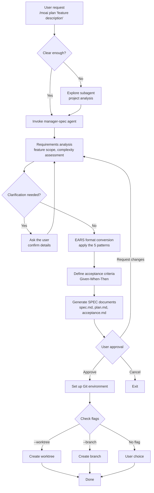
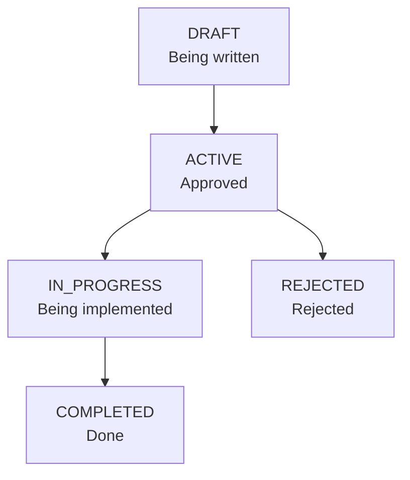

Turns your conversation with the AI into a permanent requirements document. A natural-language request becomes a structured SPEC document, and this document becomes the reference point for every subsequent phase.


**Slash command**: In Claude Code, type `/moai:plan` to run this command directly. Typing just `/moai` shows the list of all available subcommands.


## Overview

`/moai plan` is the **Phase 1 (Plan)** command of the MoAI-ADK workflow. It converts a natural-language feature request into a structured SPEC document in the **EARS** (Easy Approach to Requirements Syntax) format. Internally, the **manager-spec** agent analyzes the requirements and produces an unambiguous specification.

The plan phase is where the deepest reasoning is allocated in the v3 tokenomics design — the clearer the requirements become here, the less rework and token waste in the implementation phase that follows. That is why MoAI-ADK follows the allocation principle of "plan deeply, implement cheaply," and the generated SPEC is independently audited by **plan-auditor**. The agent that produced it never inspects it itself.



**Why do you need a SPEC?**

The biggest problem with **vibe coding** is **context loss**.

When a session with the AI drops, **everything you discussed before is gone**. When you exceed the token limit, **the oldest conversation gets truncated first**. When you resume work the next day, **it does not remember yesterday's decisions**.

**The SPEC document solves this problem.**

Requirements are **saved as files** and preserved permanently. They are structured **without ambiguity** in the EARS format. Even if the session drops, reading the SPEC lets you **pick up where you left off**.



## Usage

Type the following in the Claude Code chat window:

```bash
> /moai plan "description of the feature you want to build"
```

**Usage examples:**

```bash
# Simple feature
> /moai plan "User login feature"

# Detailed feature description
> /moai plan "JWT-based user authentication: login, signup, token refresh APIs"

# Refactoring request
> /moai plan "Refactor the legacy authentication system to JWT-based"
```

## Supported Flags

| Flag                | Description                        | Example                             |
| ------------------- | ---------------------------------- | ----------------------------------- |
| `--worktree`        | Auto-create a worktree (highest priority) | `/moai plan "feature" --worktree`   |
| `--branch`          | Create a traditional branch        | `/moai plan "feature" --branch`     |
| `--resume SPEC-XXX` | Resume interrupted SPEC work       | `/moai plan --resume SPEC-AUTH-001` |
| `--team`            | Force agent team mode              | `/moai plan "feature" --team`       |
| `--solo`            | Force sub-agent mode               | `/moai plan "feature" --solo`       |
| `--seq`             | Sequential diagnostics instead of parallel | `/moai plan "feature" --seq`        |
| `--ultrathink`      | Enable Adaptive Thinking           | `/moai plan "feature" --ultrathink` |

### Flag Priority

When multiple flags are specified, they apply in this order:

1. **--worktree** (highest priority): create an independent Git worktree
2. **--branch** (next): create a traditional feature branch
3. **No flag** (default): create the SPEC only; a branch is created based on the user's choice

### The --worktree Flag

Creates an **independent Git worktree** at the same time as the SPEC, preparing a parallel development environment:

```bash
> /moai plan "Implement payment system" --worktree
```

When you use this option:

1. The SPEC document is created
2. The SPEC is committed (a prerequisite for worktree creation)
3. A worktree is created on the `feature/SPEC-{ID}` branch
4. You can develop independently without affecting the main code


  The `--worktree` option is useful when **developing multiple features at the same time**. Each SPEC
  is worked on in its own independent worktree, so they never conflict with each other.


## EARS-Format Requirements

SPEC documents define requirements in the **EARS** (Easy Approach to Requirements Syntax) format. There are 5 patterns, and the manager-spec agent automatically converts natural language into the appropriate pattern.

| Pattern          | Format                            | Purpose                | Example                                                |
| ---------------- | --------------------------------- | ---------------------- | ------------------------------------------------------ |
| **Ubiquitous**   | "The system shall ~"              | Rules that always apply | "The system shall log every API request"               |
| **Event-driven** | "WHEN ~, THEN the system shall ~" | Event responses        | "WHEN a user logs in, THEN a JWT shall be issued"      |
| **State-driven** | "WHILE ~, the system shall ~"     | State-based behavior   | "WHILE logged in, the session shall be maintained"     |
| **Unwanted**     | "The system shall not ~"          | Prohibitions           | "The system shall not store passwords in plain text"   |
| **Optional**     | "Where possible, the system shall ~" | Optional features   | "Where possible, two-factor authentication shall be supported" |


  You do not need to memorize the EARS format. The manager-spec agent **converts natural language
  automatically**. All you need to do is describe the feature you want in your own words.


## Execution Flow

Here is what `/moai plan` does internally:



**Key points:**

- If the request is unclear, the **Explore subagent** analyzes the project
- If requirements are ambiguous, the manager-spec agent **asks the user follow-up questions**
- **Given-When-Then acceptance criteria** are auto-generated for every requirement
- The generated SPEC document is finalized **only after the user approves it**

## SPEC Creation Stages

### Phase 1A: Project Analysis (optional)

Runs when the request is ambiguous or the project state needs to be assessed:

| Runs when                       | Skipped when                    |
| ------------------------------- | ------------------------------- |
| Unclear request                 | Clear SPEC title                |
| Existing files/patterns need discovery | Resume scenario          |
| Project state uncertain         | Existing SPEC context available |

### Phase 1B: SPEC Planning

The **manager-spec** agent performs the following:

- Analyzes project documents (product.md, structure.md, tech.md)
- Proposes and names 1-3 SPEC candidates
- Checks for duplicate SPECs (.moai/specs/)
- Designs the EARS structure
- Identifies the implementation plan and technical constraints
- Verifies library versions (stable versions only, no beta/alpha)

### Phase 1.5: Pre-Validation Gate

Prevents common errors before SPEC creation:

**Step 1 - Document type classification:**

- Detects SPEC, Report, Documentation keywords
- Reports are routed to .moai/reports/
- Documentation is routed to .moai/docs/

**Step 2 - SPEC ID validation (all checks must pass):**

- **ID format**: `SPEC-DOMAIN-NUMBER` pattern (e.g. `SPEC-AUTH-001`)
- **Domain name**: approved domain list (AUTH, API, UI, DB, REFACTOR, FIX, UPDATE,
  PERF, TEST, DOCS, INFRA, DEVOPS, SECURITY, etc.)
- **ID uniqueness**: duplicate check under .moai/specs/
- **Directory structure**: a directory must be created; flat files are forbidden

**Composite domain rule:** up to 2 domains recommended (e.g. UPDATE-REFACTOR-001), up to 3 allowed

### Phase 2: SPEC Document Generation

Three files are generated together:

**spec.md:**

- YAML frontmatter (7 required fields: id, version, status, created, updated, author,
  priority)
- HISTORY section (immediately after the frontmatter)
- Complete EARS structure (5 requirement types)
- Content written in the conversation_language

**plan.md:**

- Work-breakdown implementation plan
- Tech stack specification and dependencies
- Risk analysis and mitigation strategies

**acceptance.md:**

- At least 2 Given/When/Then scenarios
- Edge-case test scenarios
- Performance and quality gate criteria

**Quality constraints:**

- Requirement modules: at most 5 per SPEC
- Acceptance criteria: at least 2 Given/When/Then scenarios
- Technical terms and function names stay in English

### Phase 3: Git Environment Setup (conditional)

**Runs when:** Phase 2 is complete AND one of the following holds:

- The --worktree flag was provided
- The --branch flag was provided, or the user chose to create a branch
- The configuration allows branch creation (git_strategy setting)

**Skipped when:** develop_direct workflow, or no flag and the user chose "use current branch"

## Output

SPEC documents are stored under the `.moai/specs/` directory:

```
.moai/
└── specs/
    └── SPEC-AUTH-001/
        ├── spec.md          # EARS requirements
        ├── plan.md          # Implementation plan
        └── acceptance.md     # Acceptance criteria
```

**Basic structure of a SPEC document:**

```yaml
---
id: SPEC-AUTH-001
version: 1.0.0
status: ACTIVE
created: 2026-01-28
updated: 2026-01-28
author: dev-team
priority: HIGH
---
```

## SPEC Status Management

SPEC documents follow this status lifecycle:



| Status        | Description                    | `/moai run` allowed |
| ------------- | ------------------------------ | ------------------- |
| `DRAFT`       | Still being written            | No                  |
| `ACTIVE`      | Approved, awaiting implementation | **Yes**          |
| `IN_PROGRESS` | Currently being implemented    | Yes (continue)      |
| `COMPLETED`   | Implemented and verified       | No                  |
| `REJECTED`    | Rejected, needs rewriting      | No                  |

## Brownfield Classification — Delta Markers

Classifies SPEC requirements in an existing codebase (brownfield) project.

| Marker | Meaning | Description |
|------|------|------|
| `[EXISTING]` | Keep as is | Reference only, no changes |
| `[MODIFY]` | Modify | Change existing code |
| `[NEW]` | New | Create from scratch |
| `[REMOVE]` | Remove | Delete existing code |

## The Token Saver — spec-compact.md

The plan phase automatically generates a condensed version of the SPEC document (`spec-compact.md`). The run phase loads the condensed version instead of the full spec.md, **saving ~30% of tokens** — a prime example of a tokenomics device built into the SPEC lifecycle itself.

## Preventing Scope Creep — Exclusions and the What/Why Constraint

**Mandatory Exclusions ("What NOT to Build")**: every SPEC document must include an **Out of Scope / Exclusions** section. This prevents scope creep in advance.

**What/Why constraint**: SPEC requirements describe only the **What** and the **Why**. The **How** is decided in the implementation phase and must not be over-specified in the SPEC.

## Decision Point 3.5: Execution Mode Selection Gate

After the plan completes and before the run starts, the execution environment is auto-detected and the optimal mode is proposed to the user.

**Detected items:**
1. tmux availability (the `$TMUX` environment variable)
2. Current LLM mode (`team_mode` in `llm.yaml`: cc/glm/cg)

**When tmux is available:**
- Worktree + \{current mode\} (Recommended)
- Team Mode (in-process)
- Sub-agent Mode (sequential)

**When tmux is unavailable:**
- Sub-agent Mode (Recommended)
- Team Mode (in-process)

## Worked Example

### Example: Creating a JWT Authentication SPEC

**Step 1: Run the command**

```bash
> /moai plan "JWT-based user authentication system: signup, login, token refresh"
```

**Step 2: manager-spec asks questions** (when needed)

The manager-spec agent may ask questions to confirm details:

- "What is the minimum password length?"
- "What should the token expiration time be?"
- "Should social login be included?"

**Step 3: Generated SPEC document**

A SPEC document with the following structure is created:

```yaml
---
id: SPEC-AUTH-001
title: JWT-based user authentication system
priority: HIGH
status: ACTIVE
---
```

```markdown
# Requirements (EARS format)

## Ubiquitous

- The system shall hash all passwords with bcrypt before storing them
- The system shall log every authentication request

## Event-driven

- WHEN a user logs in with valid credentials, THEN the system shall issue a JWT access
  token (1 hour) and a refresh token (7 days)

## Unwanted

- The system shall not store passwords in plain text
- The system shall not allow API access with an expired token
```

**Step 4: Git environment setup after user approval**

```bash
# When using the --worktree flag
> /moai plan "JWT authentication" --worktree

# Result:
# 1. SPEC documents created (.moai/specs/SPEC-AUTH-001/)
# 2. SPEC committed (feat(spec): Add SPEC-AUTH-001)
# 3. Worktree created (.git/worktrees/SPEC-AUTH-001)
# 4. Worktree path displayed
```

**Step 5: Run `/clear`, then move to the implementation phase**

```bash
# Clean up tokens
> /clear

# Start implementation
> /moai run SPEC-AUTH-001
```

## Frequently Asked Questions

### Q: Can I edit SPEC documents manually?

Yes, you can edit the `.moai/specs/SPEC-XXX/spec.md` file directly. After adding requirements or modifying acceptance criteria, run `/moai run` and your changes will be reflected.

### Q: Can I skip the SPEC and just write code?

You can write code directly in Claude Code, but working without a SPEC means losing context every time a session drops. **The more complex the feature, the more efficient it is to create a SPEC first.**

### Q: What are the rules for generating SPEC IDs?

The format is `SPEC-DOMAIN-NUMBER` (e.g. `SPEC-AUTH-001`)

- `SPEC-AUTH-001`: first authentication-related SPEC
- `SPEC-PAYMENT-002`: second payment-related SPEC

The domain is determined automatically by manager-spec based on the feature's area.

### Q: What is the difference between `/moai plan` and `/moai`?

`/moai plan` handles **SPEC document creation only**. `/moai` automatically runs the **entire workflow** from SPEC creation through implementation to documentation.

### Q: What is the difference between --worktree and --branch?

**--worktree** creates an independent working directory, providing a fully isolated environment. **--branch** creates a new branch in the current repository. To develop multiple features simultaneously, --worktree is recommended.

## GEARS Notation (v3.0.0+) {#gears-notation}

Starting with MoAI-ADK v3.0.0, **GEARS** (Generalized Expression for AI-Ready Specs) is introduced as the recommended notation for writing SPECs. The legacy EARS notation remains backward compatible for **6 months**, during which you can migrate gradually to GEARS. New SPECs are encouraged to follow the GEARS patterns from the start.

GEARS keeps the 5 core patterns of EARS while sharpening their semantic boundaries so AI coding agents can interpret them more clearly. The key changes are the **retirement of the IF/THEN pattern** (normalized to WHEN) and the **redefined meaning of WHERE** (static preconditions/configuration/feature flags).

Reference: Σ\*/SubLang, **"GEARS: The Spec Syntax That Makes AI Coding Actually Work"**, DEV Community 2026-01-23. <https://dev.to/sublang/gears-the-spec-syntax-that-makes-ai-coding-actually-work-4f3f>

### Comparison of the 5 Patterns

| Notation pattern | EARS (legacy) | GEARS (canonical) | Lint behavior |
|---|---|---|---|
| Ubiquitous | `The system shall <action>` | Same | No change |
| Event-driven (WHEN) | `WHEN <event>, the system shall <action>` | Same | No change |
| State-driven (WHILE) | `WHILE <state>, the system shall <action>` | Same (stateful precondition) | No change |
| Precondition (WHERE) | `WHERE <feature-exists>, the system shall <action>` | `WHERE <precondition>, the system shall <action>` (redefined: static preconditions, configuration, feature flags) | No change at the lint layer |
| Negative trigger | `IF <condition>, THEN the system shall <action>` | **DEPRECATED** — use `WHEN <event-detected>, the system shall <action>` instead | **New: `LegacyEARSKeyword` warning** |

### Backward-Compatibility Window (6 months)

The migration window runs from the v3.0.0 release for **6 months**, or until the `SPEC-V3R6-GEARS-SWEEP-001` (provisional) batch-correction SPEC completes — whichever comes first. During the window, behavior is:

- **Non-strict mode (default)**: only a warning with the `LegacyEARSKeyword` code; no lint failure
- **`--strict` mode (opt-in)**: warnings are promoted to errors, blocking CI
- **The existing 88 SPECs**: not modified directly within the scope of this SPEC (REQ-GM-007). Batch correction is the responsibility of the follow-up SWEEP SPEC

### The LegacyEARSKeyword Diagnostic

When the `isLegacyEARSPattern()` helper in `internal/spec/lint.go` detects a legacy EARS IF/THEN pattern, it emits the following message:

```
REQ <REQ-ID>: GEARS migration: replace IF/THEN with WHEN/event normalization; see https://adk.mo.ai.kr/en/workflow-commands/moai-plan/#gears-notation
```

- **Code**: `LegacyEARSKeyword`
- **Severity**: warning (non-strict) / error (`--strict`)
- **Source**: `internal/spec/lint.go`

### Guidance for Tool Authors

When matching SPEC text in downstream tools (validators, code generators, IDE plugins, etc.), migrate as follows:

- Transition `IF .* THEN` matching to `WHEN .* shall` matching going forward
- Be aware of the 6-month deprecation window, and recognize both patterns until the window closes
- Use the `LegacyEARSKeyword` finding code as an upgrade signal

### Migration Example

**Before (EARS legacy):**

```
IF input is null, THEN the system shall return an error.
```

**After (GEARS canonical):**

```
WHEN input is null is detected, the system shall return an error.
```

This normalization expresses the trigger as an "event" rather than a "condition," reducing ambiguity in the AI agent's intent interpretation and making the input/verification timing clearer when writing test cases.

## Adaptive Recommendation Placement

Starting with MoAI-ADK v0.1.0, **AskUserQuestion recommendations** are personalized to your decision patterns. The system captures your choices and personalizes future question options based on the observed statistical majority rather than system defaults. In the sense that the loop accumulates observations and the system learns from them, this is v3's **recursive self-learning** principle applied to the question-and-recommendation domain.

### How It Works

When MoAI asks a question via `AskUserQuestion`, 5 principles guide recommendation placement:

1. **Fisher-information timing** — questions fire when uncertainty is highest (p≈0.5, the decision boundary where Fisher information I=p(1−p) is maximal). When p≈0 or p≈1 (nearly certain), the system auto-resolves and omits the question.

2. **Question ordering — descending information gain** — when multiple questions are needed, they are sorted by estimated information gain so the most important decision is made first.

3. **Statistical-majority rational default** — the recommended option (marked `(Recommended)`) reflects the observed majority choice in your decision history, **not a system policy default**. When data is insufficient (cold-start), it discloses *"based on static default, N observations needed for personalization."*

4. **Precondition disclosure** — each recommended option states the preconditions under which it holds in the form *"Recommended when <precondition>"*, letting you evaluate the trade-off immediately.

5. **Proficiency-based adaptive strength** — recommendation strength adjusts by session count:
   - **Expert** (20+ sessions): weak strength — inferred preferences are disclosed only, without a `(Recommended)` override (info-centric, autonomy-respecting)
   - **General user** (5-19 sessions): strong strength — `(Recommended)` plus a transparent rationale
   - **Cold-start** (<5 sessions): neutral strength — no override, system defaults apply

### Privacy and Safety

- **Session-scoped toggle**: disable per-project personalization with `moai preference toggle` (non-persistent across sessions)
- **Sensitive-domain gate**: security-related topics (vulnerabilities, penetration testing, leaks) get neutral recommendations plus disclosure logging
- **Automatic decay**: transient preferences are soft-deleted after 28 days; stable preferences (explicitly marked) are retained
- **Advisory capture**: the PostToolUse capture hook never blocks AskUserQuestion execution (fail-open design)
- **Recovery-Signal Carve-Out**: on recovery turns (compact recovery, prompt_too_long, etc.) the advisory hook yields to the recovery (recovery-signal carve-out compliant, doctrine-honest)

### Technical Implementation


**Internals**: the 5 principles are specified in `.claude/rules/moai/core/askuser-protocol.md` § Recommendation Placement Principles and rendered into `moai.md`. The capture hook is implemented in `internal/hook/user_decision_capture.go` with schema-tolerant parsing and domain classification. The decay policy follows the power-law function `(age+1)^(-0.5)` with α=0.5 fixed (Standard tier). See the project's SPEC documents for the full architecture and acceptance criteria.


## Related Documents

- [SPEC-Based Development](/core-concepts/spec-based-dev) - Detailed EARS format explanation
- [/moai run](./moai-run) - Next step: DDD implementation
- [/moai sync](./moai-sync) - Final step: doc synchronization
