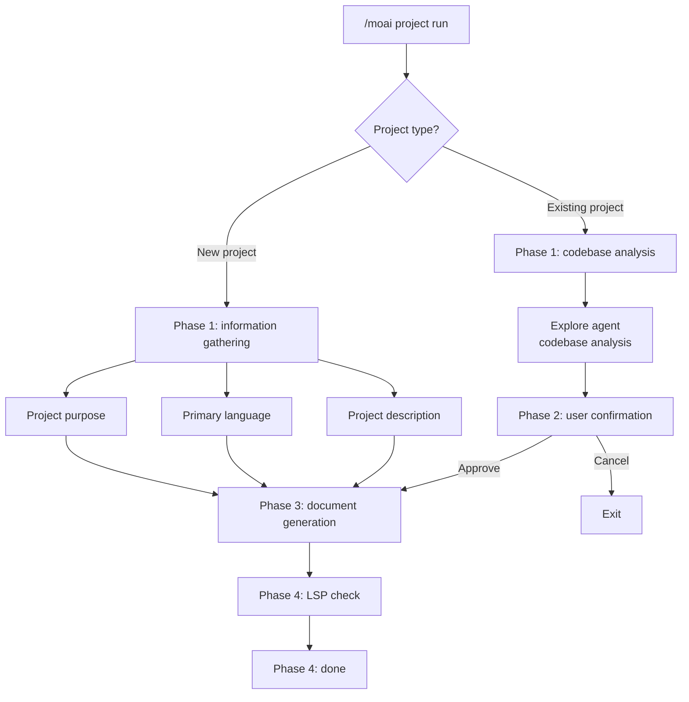
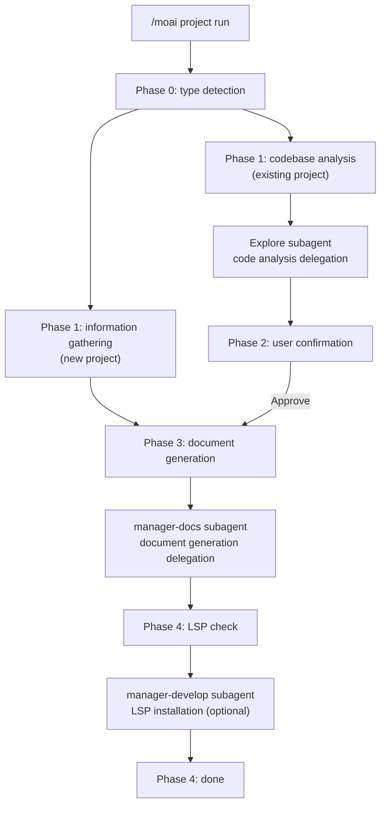

Analyzes your project's codebase and automatically generates the foundational documents the AI needs to understand the project.


**Slash command**: In Claude Code, type `/moai:project` to run this command directly. Typing just `/moai` shows the list of all available subcommands.


## Overview

`/moai project` is the **project documentation generation** command of the MoAI-ADK workflow. It analyzes your project's source code, configuration files, and directory structure to help the AI understand the project quickly.

From the agentic-harness perspective, this command lays the harness's **foundation**. Instead of letting the agent re-discover the codebase from scratch every session, project knowledge is pinned down in files — file-based persistent memory is a fundamental pattern of harness design, and `/moai project` creates its starting point. It also has a tokenomics effect: exploration cost that would repeat every session is replaced by a one-time document generation.


**Why do you need project documentation?**

Claude Code knows nothing about your project when a new conversation starts.
Through the documents generated by `/moai project`, the AI comes to understand:

- **What this project does** (product.md)
- **How the code is organized** (structure.md)
- **What technologies it uses** (tech.md)

With these documents in place, later commands like `/moai plan` and `/moai run` can perform
accurate, project-context-aware work.



## Usage

```bash
> /moai project
```

Run it without any arguments or options and it automatically analyzes the current project directory.

## Generated Documents

`/moai project` generates 3 documents under the `.moai/project/` directory:

```
.moai/
└── project/
    ├── product.md      # Project overview
    ├── structure.md    # Directory structure analysis
    └── tech.md         # Tech stack information
```

Along with document generation, **automatic harness composition** tailored to the project is also part of this command's role — based on the analyzed tech stack, a project-specific agent team (harness) can be composed as well. See [/moai harness](./moai-harness) for the details of harness creation.

### product.md - Project Overview

Contains the project's core information:

| Item              | Description                | Example                            |
| ----------------- | -------------------------- | ---------------------------------- |
| **Project name**  | The project's official name | "MoAI-ADK"                        |
| **Description**   | What the project does      | "AI-powered development toolkit"   |
| **Target users**  | Who the project is for     | "Developers using Claude Code"     |
| **Core features** | List of main features      | "SPEC creation, DDD implementation, doc automation" |
| **Project status** | Current development stage | "v1.1.0, Production"               |

### structure.md - Directory Structure

Analyzes the project's file and folder organization:

| Item               | Description                               |
| ------------------ | ----------------------------------------- |
| **Directory tree** | Visualization of the full folder structure |
| **Purpose of key folders** | What each folder is responsible for |
| **Module composition** | Relationships between core modules    |
| **Entry points**   | Program start files (main.py, index.ts, etc.) |

### tech.md - Tech Stack

Organizes the technology information used in the project:

| Item                | Description             | Example                       |
| ------------------- | ----------------------- | ----------------------------- |
| **Programming languages** | Languages and versions used | "Python 3.12, TypeScript 5.5" |
| **Frameworks**      | Main frameworks         | "FastAPI 0.115, React 19"     |
| **Databases**       | DB type and ORM         | "PostgreSQL 16, SQLAlchemy"   |
| **Build tools**     | Build and package management | "Poetry, Vite"           |
| **Deployment**      | Hosting and CI/CD       | "Docker, GitHub Actions"      |

## Execution Flow

`/moai project` runs a different workflow depending on the project type.

### New Project vs Existing Project



## Detailed Workflow

### Phase 0: Project Type Detection

The project type is checked first.


  **[HARD] rule**: the project type must be asked first. The user's project situation is
  confirmed before any codebase analysis.


**Question**: What type of project is this?

| Option              | Description                                             |
| ------------------- | ------------------------------------------------------- |
| **New project**     | A project starting from scratch. Proceeds by gathering information |
| **Existing project** | A project that already has code. The code is analyzed automatically |

### Phase 1: New-Project Information Gathering

If you chose a new project, the following information is collected:

**Question 1 - Project purpose**:

- **Web Application**: frontend, backend, or full-stack web app
- **API Service**: REST API, GraphQL, or microservices
- **CLI Tool**: command-line utility or automation tool
- **Library/Package**: reusable code library or SDK

**Question 2 - Primary language**:

- **Python**: backend, data science, automation
- **TypeScript/JavaScript**: web, Node.js, frontend
- **Go**: high-performance services, CLI tools
- **Other**: Rust, Java, Ruby, etc. (detailed follow-up)

**Question 3 - Project description** (free input):

- Project name
- Main features or goals
- Target users

Initial documents are generated from the collected information, then the flow moves to Phase 4.

### Phase 1: Codebase Analysis (existing project)

If you chose an existing project, the analysis is delegated to the **Explore agent**.


  **Agent delegation**: codebase analysis is performed by the Explore subagent.
  MoAI only collects the results and presents them to the user.


**Analysis goals**:

- **Project structure**: main directories, entry points, architecture patterns
- **Tech stack**: languages, frameworks, core dependencies
- **Core features**: main features and the location of business logic
- **Build system**: build tools, package managers, scripts

**Explore agent output**:

- Detected primary language
- Identified frameworks
- Architecture patterns (MVC, Clean Architecture, Microservices, etc.)
- Key directory mapping (source, tests, config, docs)
- Dependency catalog
- Entry-point identification

### Phase 2: User Confirmation

The analysis results are shown to the user for approval.

**Displayed contents**:

- Detected languages
- Frameworks
- Architecture
- List of core features

**Options**:

- **Proceed**: continue with document generation
- **Detailed review**: review the analysis details first
- **Cancel**: adjust the project setup

### Phase 3: Document Generation

Document generation is delegated to the **manager-docs agent**.

**Handed-off contents**:

- Phase 1 analysis results (or Phase 1 user input)
- Phase 2 user confirmation
- Output directory: `.moai/project/`
- Language: the config's conversation_language

**Generated files**:

| File             | Contents                                                                  |
| ---------------- | ------------------------------------------------------------------------- |
| **product.md**   | Project name, description, target users, core features, use cases         |
| **structure.md** | Directory tree, purpose of each directory, key file locations, module composition |
| **tech.md**      | Tech stack overview, framework rationale, dev environment requirements, build/deploy settings |

### Phase 4: Development Environment Check

Checks whether an LSP server matching the detected tech stack is installed.

**Per-language LSP mapping** (16 languages supported):

| Language              | LSP server                 | Check command                      |
| --------------------- | -------------------------- | ---------------------------------- |
| Python                | pyright or pylsp           | `which pyright`                    |
| TypeScript/JavaScript | typescript-language-server | `which typescript-language-server` |
| Go                    | gopls                      | `which gopls`                      |
| Rust                  | rust-analyzer              | `which rust-analyzer`              |
| Java                  | jdtls (Eclipse JDT)        | -                                  |
| Ruby                  | solargraph                 | `which solargraph`                 |
| PHP                   | intelephense               | check via npm                      |
| C/C++                 | clangd                     | `which clangd`                     |
| Kotlin                | kotlin-language-server     | -                                  |
| Scala                 | metals                     | -                                  |
| Swift                 | sourcekit-lsp              | -                                  |
| Elixir                | elixir-ls                  | -                                  |
| Dart/Flutter          | dart language-server       | Built into the Dart SDK            |
| C#                    | OmniSharp or csharp-ls     | -                                  |
| R                     | languageserver (R package) | -                                  |
| Lua                   | lua-language-server        | -                                  |

**Options when LSP is not installed**:

- **Continue without LSP**: proceed to completion
- **Show installation guide**: display the setup guide for the detected language
- **Auto-install now**: install via the manager-develop agent (confirmation required)

### Phase 4: Completion

Displays a completion message in the user's language.

- List of generated files
- Location: `.moai/project/`
- Status: success or partial completion

**Next-step options**:

- **Write a SPEC**: define a feature specification with `/moai plan`
- **Review documents**: open and review the generated files
- **Start a new session**: clear the context and start fresh

## When to Use

### Must run when

- **Applying MoAI-ADK to a new project for the first time** - the AI needs foundational documents to understand the project
- **Adopting MoAI-ADK in an existing project** - documents are auto-generated even for projects that already have code

### Good to re-run when

- **After a major project restructuring** - when the directory structure or tech stack has changed
- **After adopting a major new technology** - e.g. a database change or a framework addition
- **When a new team member joins the project** - onboard with up-to-date documentation


  `/moai project` **overwrites** existing documents. If you have manual edits,
  back them up before running.


## Worked Examples

### Example 1: Starting a New Project

#### Step 1: Run the command

First initialize the project in the terminal, then start Claude Code.

```bash
# Initialize the project in the terminal
$ moai init my-api-project
$ cd my-api-project

# Generate project docs in Claude Code
> /moai project
```

#### Step 2: Choose the project type

Since this is a new project, choose "New project."

```bash
AI: Choose your project type:
1. New project (starting from scratch)
2. Existing project (has code)

User: 1
```

The AI switches to new-project information gathering mode.

#### Step 3: Choose the project purpose

Choose the project's purpose.

```bash
AI: Choose the project purpose:
1. Web Application
2. API Service
3. CLI Tool
4. Library/Package

User: 2
```

Choose API Service to indicate a REST API server project.

#### Step 4: Choose the primary language

Choose the programming language you will use.

```bash
AI: Choose the primary language:
1. Python
2. TypeScript/JavaScript
3. Go
4. Other

User: 1
```

Choose Python to set up a backend API server development environment.

#### Step 5: Enter project details

Enter detailed information about the project.

```bash
AI: Describe your project (name, goals, target users):

User: A REST API server. It has user authentication and data management. It is a tool for developers.
```

This information is used to generate the `product.md` document.

#### Step 6: Document generation complete

The AI generates the documents automatically from the collected information.

```bash
[Generating documents...]

Done! 3 documents were created in the .moai/project/ directory.
```

Generated documents:

- `.moai/project/product.md` - project overview
- `.moai/project/structure.md` - directory structure
- `.moai/project/tech.md` - tech stack

### Example 2: Adopting MoAI-ADK in an Existing Project

#### Step 1: Move to the project directory and initialize

Move to a project that already has code and initialize MoAI-ADK.

```bash
# Move to the existing project directory
$ cd ~/projects/existing-api

# Initialize MoAI-ADK
$ moai init

# Generate project docs in Claude Code
> /moai project
```

#### Step 2: Choose the project type

Choose the existing-project option.

```bash
AI: Choose your project type:
1. New project (starting from scratch)
2. Existing project (has code)

User: 2
```

Proceeding in existing-project mode starts the codebase analysis.

#### Step 3: Automatic codebase analysis

The Explore agent analyzes the project automatically.

```bash
[Explore agent is analyzing the codebase...]

Analysis results:
- Language: Python 3.12
- Framework: FastAPI 0.115
- Database: PostgreSQL 16
- Architecture: Clean Architecture
- Core features:
  * User authentication
  * Data CRUD
  * API endpoint management
```

The agent automatically identifies the project's structure, dependencies, and patterns.

#### Step 4: Confirm the analysis results

Review the analysis results and approve document generation.

```bash
Generate documents from this analysis?
1. Proceed
2. Detailed review
3. Cancel

User: 1
```

If the analysis is accurate, choose "Proceed" to continue with document generation.

#### Step 5: Document generation

The manager-docs agent generates the documents from the analysis results.

```bash
[manager-docs agent is generating documents...]

Done! The following files were created:
- .moai/project/product.md
- .moai/project/structure.md
- .moai/project/tech.md
```

Each document covers a different aspect of the project.

#### Step 6: LSP check and completion

Confirms that the development environment is properly configured.

```bash
The LSP server 'pyright' is installed.

Choose your next step:
1. Write a SPEC (/moai plan)
2. Review documents
3. Start a new session
```

Since the LSP server is installed, you can start development right away.

### Example 3: Continuing the Workflow After Doc Generation

#### Step 1: Generate project docs (once, at first)

Generate the documents when first setting up the project.

```bash
> /moai project
```

This step only needs to be done once per project.

#### Step 2: Create a SPEC

Once project docs exist, the AI understands the project.

```bash
> /moai plan "Implement user authentication"
```

Since the AI already knows the project's tech stack and structure, it can generate a more accurate SPEC.


  `/moai project` typically needs to run only **once or twice** per project. There is no
  need to run it every time; re-run it only when the project structure has changed significantly.


## Agent Chain



## Frequently Asked Questions

### Q: What happens if I run `/moai plan` without project docs?

You can still create a SPEC, but since the AI does not know the project's tech stack or structure, it may make **inaccurate technical judgments**. Running `/moai project` first is always recommended.

### Q: Does it analyze private code too?

`/moai project` operates **locally only**. Your code is not sent to external servers, and the generated documents are stored locally in the `.moai/project/` directory.

### Q: Does it work in monorepo projects?

Yes, monorepo structures are supported. Run it from the root directory and it analyzes the entire project structure.

### Q: What happens if there is no LSP server?

Document generation proceeds even without an LSP server. However, code-quality diagnostics may be limited in the later `/moai run` phase. Phase 4 provides LSP installation guidance.

## Related Documents

- [Quick Start](/getting-started/quickstart) - Full workflow tutorial
- [/moai plan](./moai-plan) - Next step: SPEC document creation
- [/moai harness](./moai-harness) - Creating a project-specific harness
- [SPEC-Based Development](/core-concepts/spec-based-dev) - Detailed SPEC methodology
- [Subagent Catalog](/advanced/agent-guide) - Explore and manager-docs agent details
