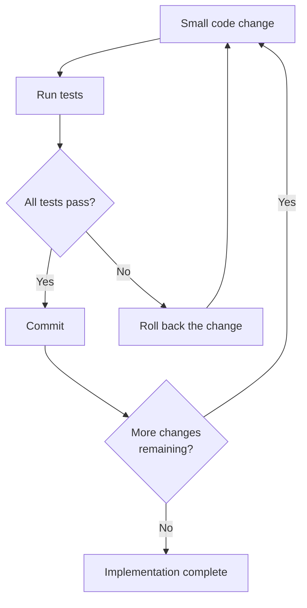
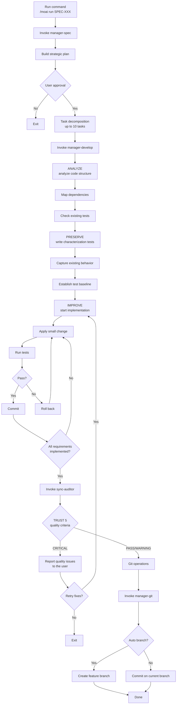

The Run-phase command that implements code based on the SPEC document. Depending on the project state, either the TDD (RED-GREEN-REFACTOR) or DDD (ANALYZE-PRESERVE-IMPROVE) cycle applies; this document focuses on the DDD cycle, which safely improves existing code.


**Slash command**: In Claude Code, type `/moai:run` to run this command directly. Typing just `/moai` shows the list of all available subcommands.


## Overview

`/moai run` is the **Phase 2 (Run)** command of the MoAI-ADK workflow. It reads the SPEC document created in Phase 1 and implements the code safely through the **ANALYZE-PRESERVE-IMPROVE** cycle without breaking existing functionality. Internally, the **manager-develop** agent manages the entire process.

The implementation phase consumes the most tokens in the 3-Phase pipeline. That is why the v3 tokenomics design is concentrated here — auto-loading the SPEC summary (`spec-compact.md`) saves ~30% of tokens, Harness Level Routing adjusts verification depth by SPEC complexity to cut unnecessary audit cost, and progress is saved to files so you can resume even if the session drops.


**Understanding DDD as a home renovation**

The DDD ANALYZE-PRESERVE-IMPROVE cycle is like **renovating a house**:

| Stage        | Analogy                | Actual work                                  |
| ------------ | ---------------------- | -------------------------------------------- |
| **ANALYZE**  | Inspecting the house   | Understand the current code structure and issues |
| **PRESERVE** | Photographing the current state | Record existing behavior with characterization tests |
| **IMPROVE**  | Renovating room by room | Improve gradually while keeping tests passing |

Just as demolishing the whole house at once is dangerous, code is safest when you **change it a little at a time and verify each step**.



## Usage

Pass the SPEC ID created in the Plan phase as an argument:

```bash
# Always run /clear after completing the Plan phase
> /clear

# Start implementation with a SPEC ID
> /moai run SPEC-AUTH-001
```


  Always run `/clear` before `/moai run`. Cleaning up the tokens used in the Plan phase
  lets the Run phase **use the full 200K tokens**.


## Supported Flags

| Flag                | Description                     | Example                            |
| ------------------- | ------------------------------- | ---------------------------------- |
| `--resume SPEC-XXX` | Resume interrupted implementation | `/moai run --resume SPEC-AUTH-001` |
| `--solo`            | Force sub-agent mode            | `/moai run SPEC-AUTH-001 --solo`   |
| `--mode <value>`    | Specify the dispatch axis       | `/moai run SPEC-AUTH-001 --mode loop` |

**Resume feature:**

On re-run, work continues from the last successful stage checkpoint.

**The `--mode` dispatch axis:**

`--mode` is a separate axis that selects a `/moai run` workflow variant (distinct from Phase 4's 6-mode execution catalog):

- `autopilot` (default): scale-based selection in Phase 4, then run the implementation
- `loop`: delegate to the Ralph engine's diagnostic loop (see `loop.md`)
- `team`: retired — raises `MODE_TEAM_UNAVAILABLE` and falls back to `autopilot` (Agent Teams static layer retired)
- `pipeline`: rejected — returns the `MODE_PIPELINE_ONLY_UTILITY` error (pipeline mode is for utility subcommands only)

## The DDD Cycle

`/moai run` executes three stages in order: **ANALYZE -> PRESERVE -> IMPROVE**. Let's look at what happens in each stage.

### 1. ANALYZE

Reads the existing code and compares it against the SPEC requirements to figure out what needs to be done.

**Analysis items:**

| Item          | Description               | Example                                |
| ------------- | ------------------------- | -------------------------------------- |
| Code structure | Files, modules, dependencies | "auth.py depends on user_service.py" |
| Domain boundaries | Scope of business logic | "Separate the auth domain from the user domain" |
| Test status   | Existing test coverage    | "Currently 45% coverage"               |
| Technical debt | Areas needing improvement | "SQL injection vulnerability found"    |

### 2. PRESERVE

Records the current behavior of the existing code with **characterization tests**. These tests act as a **safety net** confirming that existing functionality still works the same after refactoring.


**What is a characterization test?**

It does not judge "whether this code is right or wrong" — it **records "this is how it currently
behaves."**

For example, if the existing login function returns `{"status": "success"}` on success, this
behavior is recorded as a test. Later, when you change the code, a failure in this test tells you
immediately that "the existing behavior has changed."



### 3. IMPROVE

Changes the code **in small increments** according to the SPEC requirements, running the tests each time to confirm the existing behavior is preserved.

**Core principle: small changes + verify every time**



## Execution Flow

The full process `/moai run` performs internally:



## Phase Details

### Phase 3: JIT Language Detection

Automatically detects the project's primary language and injects the appropriate language skill when spawning agents. All 16 languages are supported equally.

| Detected file | Language skill |
|-----------|-----------|
| `go.mod` | moai-lang-go |
| `package.json` (typescript) | moai-lang-typescript |
| `pyproject.toml` | moai-lang-python |
| `Cargo.toml` | moai-lang-rust |
| `pom.xml` / `build.gradle` | moai-lang-java |

### Phase 4: Scale-Based Mode Selection

Automatically selects the optimal execution mode based on the SPEC's scale. Not running a heavy pipeline for a small task — that too is tokenomics.

| Pattern | Criteria | Execution mode |
|------|------|-----------|
| Bug fix | files ≤ 3, single domain | **Fix Mode** |
| Single feature | files ≤ 5, single domain | **Focused Mode** |
| In-domain feature | files 5-10 | **Standard Mode** |
| Multi-domain | files ≥ 10 or domains ≥ 3 | **Full Pipeline** |

### Harness Level Routing (quality-depth routing)

At the start of the run phase, the quality-pipeline depth is determined automatically by SPEC complexity.

| Level | Target | evaluator | Skipped phases |
|------|------|-----------|---------------|
| **minimal** | Simple bug fixes, config changes | disabled | 0, 0.5, 2.0, 2.5, 2.75, 2.8a |
| **standard** | Regular feature development (default) | final-pass (Phase 16 only) | none |
| **thorough** | Critical features such as security/payments | per-sprint (Phase 10 + 2.8a) | none |

Automatic escalation on failure: minimal → standard → thorough (up to 2 times)

### Plan Audit Gate

The first mandatory gate that runs on entering `/moai run`. The **plan-auditor** sub-agent independently audits the SPEC artifacts authored in the plan phase.

- plan-auditor is an agent independent of manager-spec — the agent that created the artifacts does not inspect its own results
- If the SPEC-artifact hash has not changed and the previous verdict score is ≥ 0.90, it is skip-eligible (the cached verdict is reused)
- Otherwise, plan-auditor re-runs and issues a new verdict
- 3 verdicts: PASS / PASS-with-debt / FAIL


The Plan Audit Gate's skip policy (skipping the plan-auditor re-run) is score-based. However, the **Implementation Kickoff Approval** below is a separate user-approval gate independent of score, and cannot be bypassed under any circumstances (REQ-ATR-015).


### Implementation Kickoff Approval

A **HUMAN GATE** that obtains the user's explicit approval after passing the Plan Audit Gate and before starting implementation.

- Presents the plan-auditor verdict summary + the SPEC artifacts to the user
- Presents 3 options via `AskUserQuestion`: "enter run / additional review / abort"
- Even if the score is ≥ 0.90, and even if it is PASS-with-debt, this approval is not skipped
- The implementation phase begins only after user approval

### Phase 1: Analysis and Planning

The **manager-develop** subagent performs the following:

- Fully analyzes the SPEC document
- Extracts requirements and success criteria
- Identifies implementation stages and individual tasks
- Determines tech stack and dependency requirements
- Estimates complexity and effort
- Produces a detailed execution strategy with a staged approach

**Output:** an execution plan including plan_summary, a requirements list, success_criteria, and effort_estimate

### Phase 6: Task Decomposition

Breaks the approved execution plan into atomic, reviewable tasks:

**Task structure:**

- **Task ID**: sequential within the SPEC (TASK-001, TASK-002, etc.)
- **Description**: a clear task statement
- **Requirement Mapping**: the SPEC requirement it satisfies
- **Dependencies**: list of prerequisite tasks
- **Acceptance Criteria**: how completion is verified

**Constraint:** at most 10 tasks per SPEC. If more are needed, splitting the SPEC is recommended

The task decomposition result is persistently recorded in `.moai/specs/SPEC-{ID}/tasks.md`. It is trackable via Git and referenced by the Drift Guard.

### Phase 10: Sprint Contract (thorough only)

Runs only at the thorough level. The Done criteria are pre-agreed with sync-auditor before implementation.

**Contract contents:**
- Specific test cases that must pass
- Identified edge cases
- Hard thresholds (coverage %, performance targets, security requirements)

After up to 2 rounds of negotiation, the evaluator's recommendation is finalized.

### Phase 2: DDD Implementation

The **manager-develop** subagent runs the ANALYZE-PRESERVE-IMPROVE cycle:

**Requirements:**

- Initialize work tracking
- Run the complete ANALYZE-PRESERVE-IMPROVE cycle
- Verify existing tests pass after each transformation
- Create characterization tests for uncovered code paths
- Achieve test coverage of 85% or higher

**Output:** files_modified, characterization_tests_created, test_results, behavior_preserved, structural_metrics

### Phase 13: Quality Verification

The **sync-auditor** subagent performs TRUST 5 verification:

| TRUST 5 pillar | Verification items                        |
| ------------- | ------------------------------------------ |
| **Tested**    | Tests exist and pass, DDD discipline maintained |
| **Readable**  | Project conventions followed, docs included |
| **Unified**   | Follows existing project patterns           |
| **Secured**   | No security vulnerabilities, OWASP compliant |
| **Trackable** | Clear commit messages, supports history analysis |

**Additional verification:**

- Test coverage 85% or higher
- Behavior preservation: existing tests pass unchanged
- Characterization tests pass: behavior snapshots match
- Structural improvement: coupling and cohesion metrics improved

**Output:** trust_5_validation results, coverage_percentage, overall_status (PASS/WARNING/CRITICAL), issues_found

### Phase 19: sync-auditor Independent Audit

At the thorough level, the sync-auditor subagent performs a 4-dimension (Functionality/Security/Craft/Consistency) active evaluation and TRUST 5 static verification. An independent auditor — not the agent that built it — judges quality.


Security FAIL = overall FAIL. After up to 3 fix-evaluate cycles, the result is reported to the user.


### Drift Guard (scope-deviation detection)

When the DDD/TDD cycle completes, actual changes are compared against the plan:

- drift ≤ 20%: informational record only
- 20% < drift ≤ 30%: warning
- drift > 30%: triggers the Phase 14 replanning gate

### Phase 19: Git Operations (conditional)

The **manager-git** subagent performs Git automation:

**Runs when:**

- quality_status is PASS or WARNING
- If git_strategy.automation.auto_branch is true, a feature branch is created
- If auto_branch is false, commits go directly to the current branch

### Phase 20: Completion and Guidance

The user is presented with the following options:

| Option              | Description                                    |
| ------------------- | ---------------------------------------------- |
| Sync documentation  | Run `/moai sync` to generate docs and a PR     |
| Implement another feature | Create an additional SPEC with `/moai plan` |
| Review the results  | Check the implementation and test coverage locally |
| Done                | End the session                                |

## The Token Saver — spec-compact.md

On run-phase entry, the SPEC summary is auto-loaded, **saving ~30% of tokens**. If `.moai/specs/SPEC-{ID}/spec-compact.md` exists, it is used instead of the full spec.md.

## Quality Gates

When implementation is complete, all of the following quality criteria must pass:

| Item            | Criterion    | Description                              |
| --------------- | ------------ | ---------------------------------------- |
| LSP errors      | **0**        | No type-checker or linter errors         |
| Type errors     | **0**        | No type errors from pyright, mypy, tsc, etc. |
| Lint errors     | **0**        | No linter errors from ruff, eslint, etc. |
| Test coverage   | **85%+**     | Code test coverage target                |
| Behavior preservation | **100%** | All characterization tests pass        |



**Why is 85% coverage the target?**

Why 85% instead of 100%

**100% is unrealistic** and can lead to meaningless tests. **At 85%, most of the core
logic** is tested. The remaining 15% is code that is hard to test, such as config files
and error handlers.



## Worked Example

### Example: Implementing SPEC-AUTH-001

**Step 1: SPEC created in the Plan phase**

```bash
> /moai plan "JWT-based user authentication: signup, login, token refresh"
# SPEC-AUTH-001 created
```

**Step 2: Clean up tokens, then start implementation**

```bash
> /clear
> /moai run SPEC-AUTH-001
```

**Step 3: What manager-develop does automatically**

The 4 phases the manager-develop agent runs to implement the SPEC.

---

#### Phase 1: Strategic Planning

Analyzes the SPEC document and builds an implementation strategy.

```bash
Phase 1: Strategic planning
- SPEC document analysis complete
- 5 requirements extracted
- Decomposed into 7 tasks (TASK-001 ~ TASK-007)
- Estimated complexity: medium
```

---

#### Phase 6: Task Decomposition

Breaks the implementation work into fine-grained units.

```bash
Phase 6: Task decomposition
- TASK-001: Define the user model
- TASK-002: Password hashing utility
- TASK-003: JWT token creation/verification
- TASK-004: Signup API
- TASK-005: Login API
- TASK-006: Token refresh API
- TASK-007: Input validation middleware
```

---

#### Phase 2: DDD Implementation

Implements safely with the ANALYZE-PRESERVE-IMPROVE cycle.

**ANALYZE stage** - understand the existing code:

```bash
ANALYZE stage:
- Analyzed existing code structure: src/auth/ (4 files)
- Checked test coverage: currently 32%
- Mapped dependencies: bcrypt, PyJWT, SQLAlchemy
```

**PRESERVE stage** - protect the existing behavior:

```bash
PRESERVE stage:
- Wrote 12 characterization tests
- Captured existing behavior
- Established test baseline: 32%
```

**IMPROVE stage** - implement incrementally:

```bash
IMPROVE stage:
- Iteration 1: TASK-001 user model (tests pass)
- Iteration 2: TASK-002 password hashing (tests pass)
- Iteration 3: TASK-003 JWT tokens (tests pass)
- Iteration 4: TASK-004 signup API (tests pass)
- Iteration 5: TASK-005 login API (tests pass)
- Iteration 6: TASK-006 token refresh (tests pass)
- Iteration 7: TASK-007 input validation (tests pass)
```

---

#### Phase 13: Quality Verification

Verifies quality against the TRUST 5 pillars.

```bash
Phase 13: Quality verification
- All TRUST 5 pillars pass
- Test coverage: 89%
- LSP errors: 0
- Type errors: 0
- Characterization tests: 12/12 pass
- New tests: 24/24 pass
- Status: PASS
```

---

#### Phase 19: Git Operations

Creates commits with Conventional Commits.

```bash
Phase 19: Git operations
- Branch: feature/SPEC-AUTH-001
- 7 commits created (Conventional Commits)
```

---

#### Phase 20: Completion

Once implementation is complete, you are guided to the next step.

```bash
Phase 20: Completion
- Implementation complete
- Next step: /moai sync
```

**Step 4: Move to the Sync phase after implementation completes**

```bash
> /clear
> /moai sync SPEC-AUTH-001
```

## Frequently Asked Questions

### Q: In a new project with no existing code, what happens to the PRESERVE stage?

If there is no existing code, the PRESERVE stage is **passed through quickly**. Tests for the new code are written together in the IMPROVE stage.

### Q: Which cycle applies — TDD or DDD?

It follows the `development_mode` setting in `quality.yaml`. TDD (RED-GREEN-REFACTOR) suits new feature development, while DDD (ANALYZE-PRESERVE-IMPROVE) suits refactoring existing projects with low test coverage.

### Q: What if I run out of tokens mid-implementation?

The manager-develop agent **saves progress automatically**. After `/clear`, run `/moai run SPEC-XXX` again and it continues based on the SPEC document.

### Q: What if reaching 85% test coverage is difficult?

You can adjust the coverage target in `quality.yaml`, but this is **not recommended**. 85% is the minimum bar guaranteeing that core logic is tested. If coverage falls short, manager-develop automatically adds the missing tests.

### Q: What happens if Phase 13 returns a CRITICAL status?

The quality issues are reported to the user, and you are asked whether to retry fixes. Choosing "yes" returns to the IMPROVE stage and continues fixing.

### Q: What is the difference between `/moai run` and `/moai`?

`/moai run` performs **implementation only, based on an already-created SPEC**. `/moai` automatically runs the **entire workflow** from SPEC creation through implementation to documentation.

## Related Documents

- [Domain-Driven Development](/core-concepts/ddd) - Detailed ANALYZE-PRESERVE-IMPROVE cycle explanation
- [TRUST 5 Quality System](/core-concepts/trust-5) - Detailed quality gate explanation
- [/moai plan](./moai-plan) - Previous step: SPEC document creation
- [/moai sync](./moai-sync) - Next step: doc synchronization and PR
