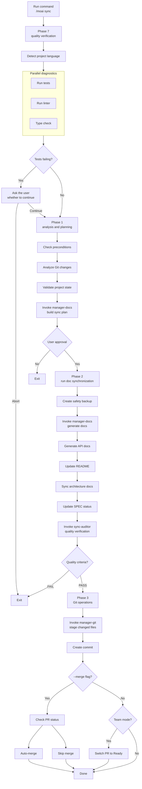

Synchronizes documentation for the implemented code and prepares for release through Git automation. This is the final step of the 3-Phase lifecycle.


**Slash command**: In Claude Code, type `/moai:sync` to run this command directly. Typing just `/moai` shows the list of all available subcommands.


## Overview

`/moai sync` is the **Phase 3 (Sync)** command of the MoAI-ADK workflow. It analyzes the code implemented in Phase 2, auto-generates documentation, and creates Git commits and a PR (Pull Request) to complete release preparation. Internally, the **manager-docs** agent manages the entire process.

The synchronization result is independently evaluated by **sync-auditor** — the agent that produced the docs and the agent that inspects them are separated, so the phase closes with verified evidence rather than a "we synced it" claim.


**Why do you need doc synchronization?**

Writing documentation separately after writing code is tedious, and code and docs easily
drift out of sync. `/moai sync` solves this problem:

- **Analyzes the code** to **auto-generate** API documentation
- **Auto-updates** README and CHANGELOG
- **Auto-creates** Git commits and PRs

Because code changes and docs stay synchronized, the "the docs are stale" problem disappears.



## Usage

Run after the Run phase completes:

```bash
# Run /clear after the Run phase completes (recommended)
> /clear

# Sync docs and create a PR
> /moai sync
```

## Supported Modes

| Mode          | Description                          | When to use                    |
| ------------- | ------------------------------------ | ------------------------------ |
| `auto` (default) | Smart sync of changed files only  | Daily development              |
| `force`       | Regenerate all documentation         | Error recovery, large refactoring |
| `status`      | Read-only status check               | Quick health check             |
| `project`     | Update project-wide documentation    | Milestone completion, periodic sync |

The default `auto` mode syncing only changed files is also a tokenomics design decision — if there is no reason to regenerate every document each time, those tokens are simply not spent.

### Usage per Mode

```bash
# Default mode (changed files only)
> /moai sync

# Full regeneration
> /moai sync --mode force

# Status check only
> /moai sync --mode status

# Project-wide update
> /moai sync --mode project
```

## Supported Flags

| Flag      | Description                          | Example              |
| --------- | ------------------------------------ | -------------------- |
| `--pr`   | Skip the changelog prompt and open a PR automatically (Tier L or when review is needed) | `/moai sync --pr` |
| `--skip-mx` | Skip the MX tag check                | `/moai sync --skip-mx` |


The `--merge` and `--team` / `--solo` flags have been **Deprecated** or **removed**.

- `--merge`: In Hybrid Trunk 1-person OSS operation, Tier S/M push directly to main by default, so PR auto-merge is no longer needed. If a merge is needed after creating a PR at Tier L, run `gh pr merge` manually.
- `--team` / `--solo`: The Agent Teams static-orchestration layer has been RETIRED. `--team` triggers a `MODE_TEAM_UNAVAILABLE` fallback, and since sub-agent mode is the only mode, `--solo` is meaningless too.


### The --pr Flag

Skips the changelog prompt and opens a PR automatically:

```bash
> /moai sync --pr
```

**Use case**: when you want to create a PR quickly without entering changelog information manually. The changelog can be added later during PR review.

### Tier-based PR routing

Whether a PR is created is decided automatically by the SPEC tier (the Hybrid Trunk 1-person OSS default behavior):

| Tier | PR creation | Executor |
| ---- | ------- | --------- |
| **Tier S** (≤ 300 LOC, < 5 files) | direct push to main (no PR) | manager-develop or orchestrator |
| **Tier M** (300-1000 LOC, 5-15 files) | direct push to main (no PR) | manager-develop or orchestrator |
| **Tier L** (> 1000 LOC or constitutional) | PR from a `feat/SPEC-XXX` branch via manager-git | manager-git |
| **Explicit `--pr`** (any tier) | PR from a `feat/SPEC-XXX` branch via manager-git | manager-git |

Tier S/M push directly to main because the CI 4 status checks + pre-push hook guarantee safety. Tier L requires a PR review window and full CI matrix verification due to its broad scope.

**Token-efficiency strategies:**

- Loads only the SPEC document's metadata and summary
- Caches and reuses the list of files changed in the previous phase
- Uses document templates to shorten generation time

## Execution Flow

The full process `/moai sync` performs internally:



## Phase Details

### Phase 7: Quality Verification (parallel diagnostics)

Verifies project quality before doc synchronization.

**Step 1 - Project language detection:**

| Language            | Marker files                               |
| ------------------- | ------------------------------------------ |
| Python              | pyproject.toml, setup.py, requirements.txt |
| TypeScript          | tsconfig.json, package.json (typescript)   |
| JavaScript          | package.json (no tsconfig)                 |
| Go                  | go.mod, go.sum                             |
| Rust                | Cargo.toml, Cargo.lock                     |
| 11 more languages supported |

**Step 2 - Parallel diagnostics:**

Three tools run at the same time:

| Diagnostic tool | Purpose             | Timeout |
| ----------- | ----------------------- | -------- |
| Test runner | Detect test failures    | 180 s    |
| Linter      | Check code style        | 120 s    |
| Type check  | Check for type errors   | 120 s    |

**Step 3 - Handling test failures:**

If tests fail, the user is presented with choices:

- **Continue**: proceed despite failures
- **Abort**: stop and exit

**Step 4 - Code review:**

The **sync-auditor** subagent performs TRUST 5 quality verification and produces a consolidated report.

**Step 5 - Quality report generation:**

Aggregates the status of test-runner, linter, type-checker, and code-review, and determines the overall status (PASS or WARN).

### Phase 1: Analysis and Planning

The **manager-docs** subagent builds the synchronization strategy.

**Output:** documents_to_update, specs_requiring_sync, project_improvements_needed, estimated_scope

### Phase 2: Doc Synchronization Execution

**Step 1 - Create safety backup:**

A backup is created before modifications:

- Timestamp generated
- Backup directory: `.moai-backups/sync-{timestamp}/`
- Important files copied: README.md, docs/, .moai/specs/
- Backup integrity verified

**Step 2 - Doc synchronization:**

The **manager-docs** subagent performs the following:

- Reflects changed code into the Living Documents
- Auto-generates and updates API documentation
- Updates README when needed
- Syncs architecture documents
- Repairs project issues and fixes broken references
- Verifies the SPEC document matches the implementation
- Detects changed domains and generates per-domain updates
- Generates a sync report: `.moai/reports/sync-report-{timestamp}.md`

**Step 3 - Post-sync quality verification:**

The **sync-auditor** subagent verifies sync quality against the TRUST 5 criteria:

- All project links complete
- Documents well formatted
- All documents consistent
- No credentials exposed
- All SPECs properly linked

**Step 4 - SPEC status update:**

Batch-updates the status of completed SPECs to "completed" and records version changes and status transitions.

### Phase 3: Git Operations and PR

The **manager-git** subagent performs the Git operations:

**Step 1 - Create commit:**

- Stage all changed docs, reports, README, and docs/ files
- Create a single commit listing the synced docs, project repairs, and SPEC updates
- Verify the commit with git log

**Step 2 - Switch PR to Ready (Team mode only):**

- Check the setting in git_strategy.mode
- If Team mode: switch the Draft PR to Ready (gh pr ready)
- Assign reviewers and labels if configured
- If Personal mode: skipped

**Step 3 - Auto-merge (with the --merge flag):**

- Check CI/CD status with gh pr checks
- Check merge conflicts with gh pr view --json mergeable
- If passing and mergeable: run gh pr merge --squash --delete-branch
- Check out develop, pull, delete the local branch

### Phase 4: Completion and Next Steps

**Standard completion report:**

A summary of the following is displayed:

- mode, scope, number of files updated/created
- Project improvements
- Updated documents
- Generated reports
- Backup location

**Worktree-mode next steps (auto-detected from git context):**

| Option                    | Description                          |
| ------------------------- | ------------------------------------ |
| Return to main directory  | Leave the worktree and go back to main |
| Continue in the worktree  | Keep working in the current worktree |
| Switch to another worktree | Choose a different worktree         |
| Remove this worktree      | Clean up the worktree                |

**Branch-mode next steps (auto-detected from git context):**

| Option                    | Description                       |
| ------------------------- | --------------------------------- |
| Commit and push changes   | Upload changes to the remote      |
| Return to the main branch | To develop or main                |
| Create PR                 | Create a Pull Request             |
| Continue on the branch    | Keep working on the current branch |

**Standard next steps:**

| Option              | Description                    |
| ------------------- | ------------------------------ |
| Create the next SPEC | Run `/moai plan`              |
| Start a new session | Run `/clear`                   |
| Review the PR       | Team mode: gh pr view          |
| Continue development | Personal mode: keep working   |

## Generated Documents

The documents `/moai sync` automatically generates or updates:

### API Documentation

Analyzes API endpoints, function signatures, and class structures in the implemented code to generate documentation.

| Document type | Contents                          | Generated when              |
| ------------ | ---------------------------------- | --------------------------- |
| API reference | Endpoints, request/response schemas | A REST API is included    |
| Function docs | Parameters, return values, exceptions | Public functions are included |
| Class docs   | Attributes, methods, inheritance    | Classes are included        |

### README Updates

Updates the project's README.md as follows:

- **Usage section**: usage examples for newly added features
- **API section**: adds the list of new endpoints
- **Dependencies section**: reflects newly added libraries

### CHANGELOG Writing

Records the change history in the [Keep a Changelog](https://keepachangelog.com) format:

```markdown
## [Unreleased]

### Added

- JWT-based user authentication system (SPEC-AUTH-001)
  - POST /api/auth/register - signup
  - POST /api/auth/login - login
  - POST /api/auth/refresh - token refresh
```

## Git Automation

`/moai sync` performs Git operations automatically after generating docs.

### Commit Message Format

MoAI-ADK follows the [Conventional Commits](https://www.conventionalcommits.org/) format:

| Prefix     | Purpose     | Example                                     |
| ---------- | ----------- | ------------------------------------------- |
| `feat`     | New feature | `feat(auth): add JWT authentication`        |
| `fix`      | Bug fix     | `fix(auth): resolve token expiration issue` |
| `docs`     | Documentation | `docs(auth): update API documentation`    |
| `refactor` | Refactoring | `refactor(auth): centralize auth logic`     |
| `test`     | Tests       | `test(auth): add characterization tests`    |

## Post-PR CI Monitoring

Right after `/moai sync` creates the PR, MoAI-ADK runs two waves of automated monitoring. Wave 1 polls CI results to determine which required checks failed, and Wave 2 enters an auto-fix loop when failures occur. Instead of a human watching the CI screen after PR creation, the loop observes results and responds — agentic loop engineering extended into the CI domain.

### Wave 1 — CI Result Polling

- Calls `gh pr checks` every 30 seconds (respecting the GitHub API rate limit)
- 30-minute hard timeout — if required checks do not complete in that time,
  the watch loop exits with exit code 3
- Required-check definition SSoT: `.github/required-checks.yml`
- Auxiliary checks are not merge blockers even if they fail (warning only)

### Wave 2 — Auto-Fix Loop (up to 3 iterations)

When a required check fails, MoAI-ADK enters the auto-fix loop.

- Each iteration applies the fix as a **new commit** (no force-push / amend)
- At most 3 iterations per PR push (not per session)
- At iteration ≥ 4, escalation to the user via a blocking AskUserQuestion

### Auto-Handled vs Human Decision Required

| Failure type               | Auto-handled? | Notes                                        |
| -------------------------- | ------------- | -------------------------------------------- |
| lint error                 | Automatic     | Items `golangci-lint` can autofix            |
| format drift               | Automatic     | `gofmt` / `prettier`, etc.                   |
| test syntax error          | Automatic     | Missing imports / compile errors             |
| **data race**              | **Human decision** | Semantic failure — judging whether the concurrency is intentional |
| **deadlock**               | **Human decision** | Semantic failure                        |
| **panic**                  | **Human decision** | Semantic failure                        |
| **test assertion failure** | **Human decision** | A human decides whether the spec or the code is right |

### Files Auto-Fix Never Touches


The auto-fix loop **never modifies** the following files:

- `.env`, `.env.*` (environment variables / secrets)
- credentials files
- `scripts/ci-watch/run.sh` (Wave 2 infrastructure)
- `.github/required-checks.yml` (Wave 1 SSoT)


### Related Documents

- Polling doctrine SSoT: `.claude/rules/moai/workflow/ci-watch-protocol.md`
- Auto-fix doctrine SSoT: `.claude/rules/moai/workflow/ci-autofix-protocol.md`

## Quality Gates

The Sync phase's quality criteria are more documentation-centric than the Run phase's:

| Item      | Criterion     | Description                     |
| --------- | ------------- | ------------------------------- |
| LSP errors | **0**        | The code must be error-free     |
| Warnings  | **up to 10**  | Some warnings allowed during doc generation |
| LSP state | **Clean**     | Overall clean state             |


  If the quality gate fails, doc generation and PR creation are **halted**. First go back to
  `/moai run` to fix code issues, or use `/moai fix` to fix errors quickly.


## Sync-phase Human Gates

The sync process has two HUMAN GATEs. These gates are not auto-passed, and the chain is halted on a FAIL or INCONCLUSIVE verdict.

| Gate | Name | Timing | Role |
| ------ | ---- | ---- | ---- |
| `gate-sync-1` | Pre-Sync Quality | Before entering Phase 3 | Confirm the working tree is clean and all tests pass |
| `gate-sync-2` | Documentation Scope | Approve the doc generation scope | The user reviews the divergence report and approves the doc regeneration scope |

`gate-sync-1` verifies that code quality meets the sync entry conditions — if there are test failures or a dirty working tree, it does not proceed to doc generation. `gate-sync-2` is an approval step where the user confirms which documents to regenerate — it prevents automatic generation from making unintended document changes.


If the sync-auditor verdict is FAIL/INCONCLUSIVE or a gate blocks, the chain is halted. It does not auto-complete without passing the gates.


## Worktree-Context Auto-Merge

When run in a worktree environment, auto-merge is the default behavior.

**Worktree-context detection:**
- Whether the current git directory path contains `/.moai/worktrees/`
- Or an active entry for the current SPEC-ID exists in `.moai/worktrees/registry.json`

**Flag behavior:**

| Flag | Before v2.8 | v2.9.0 and later |
|--------|----------|------------|
| (none) | No merge | **Auto-merge** in worktree context |
| `--merge` | Auto-merge | **Deprecated** (warning shown) |
| `--no-merge` | N/A | Skip auto-merge |

**Auto-merge execution conditions:**
1. All CI/CD checks pass
2. No merge conflicts
3. The `--no-merge` flag is not set


On CI failure or conflict, auto-merge is not performed, and the error is reported along with recovery commands.


### Post-Merge Auto Cleanup

Automatic cleanup runs after a successful PR merge.

**Condition:** auto-merge succeeded AND `workflow.worktree.auto_cleanup == true`

**Cleanup items:**
1. Remove the worktree directory
2. Delete the feature branch (`--delete-branch`)
3. Update the worktree registry


Cleanup failure does not affect the merge result. On failure: clean up manually with `moai worktree done SPEC-{ID}`.


## `/cd` Cache-Preserving Resume (CC 2.1.169+)

When resuming a multi-step workflow across directory boundaries (e.g. entering an L2 worktree between run and sync), Claude Code 2.1.169+ provides `/cd <path>` — a command that switches the session's working directory **while preserving the prompt cache**, so the accumulated reasoning context is retained instead of being rebuilt on cwd change. This is the cache-preserving alternative to opening a new terminal: `/cd` keeps the context, a new terminal cold-starts. When entering the sync phase in an L2 worktree while retaining run-phase context, `/cd <worktree-path>` is the lower-friction path. Since cache hit rate directly translates into token cost, the habit of preserving the prompt cache is also sound tokenomics. See the [Statusline guide](/en/advanced/statusline) for how the switch is reflected in the `cwd` field.

## Worked Example

### Example: Doc Synchronization and PR Creation

**Step 1: Confirm the Run phase is complete**

```bash
# Check that the Run phase is finished
# manager-develop should have printed a "DONE" or "COMPLETE" marker
```

**Step 2: Clean up tokens, then run Sync**

```bash
> /clear
> /moai sync
```

**Step 3: What manager-docs does automatically**

The 4 phases the manager-docs agent runs for doc synchronization.

---

#### Phase 7: Quality Verification

Verifies project state before doc generation.

```bash
Phase 7: Quality verification
  Project language: Python
  Tests: 36/36 pass
  Linter: 0 errors
  Type check: 0 errors
  Coverage: 89%
  Overall status: PASS
```

---

#### Phase 1: Analysis and Planning

Analyzes Git changes and builds the sync plan.

```bash
Phase 1: Analysis and planning
  Git changes: 12 files modified
  Sync plan: 1 API doc, README update, CHANGELOG addition
  User approval: complete
```

---

#### Phase 2: Doc Synchronization

Generates the needed docs and updates existing ones.

```bash
Phase 2: Doc synchronization
  Backup created: .moai-backups/sync-20260128-143052/
  API docs: docs/api/auth.md (new)
  README.md: usage section updated
  CHANGELOG.md: v1.1.0 entry added
  SPEC-AUTH-001 status: ACTIVE → COMPLETED

  Quality verification: all checks pass
```

---

#### Phase 3: Git Operations

Creates the commit and opens the PR.

```bash
Phase 3: Git operations
  Commit created: docs(auth): synchronize documentation for SPEC-AUTH-001
  PR status: Draft → Ready (Team mode)
```

**Step 4: Check the created PR**

```bash
# View the PR from the terminal
$ gh pr view 42
```

The created PR automatically includes the SPEC requirements, the list of changed files, and the test results.

## Frequently Asked Questions

### Q: What if I don't want PRs created automatically?

Set `auto_pr: false` in `git-strategy.yaml` and only the commit will be automated. You can create the PR yourself whenever you want.

### Q: Can I change the CHANGELOG format?

Currently the [Keep a Changelog](https://keepachangelog.com) format is used by default. Custom formats are planned for the future.

### Q: What if I want docs only, without Git operations?

Set `auto_commit: false` in `git-strategy.yaml` and only doc generation will run. Git operations can be done manually.

### Q: What do I do when the quality gate fails?

There are two options:

```bash
# Option 1: quick fix with /moai fix
> /moai fix "fix lint errors"

# Option 2: re-implement with /moai run
> /moai run SPEC-AUTH-001
```

After fixing, run `/moai sync` again.

### Q: What is the difference between `/moai sync` and `/moai`?

`/moai sync` handles **documentation of already-implemented code only**. `/moai` automatically runs the **entire workflow** from SPEC creation through implementation to documentation.

## Related Documents

- [/moai run](/workflow-commands/moai-run) - Previous step: DDD implementation
- [TRUST 5 Quality System](/core-concepts/trust-5) - Detailed quality gate explanation
- [Quick Start](/getting-started/quickstart) - Full workflow tutorial
