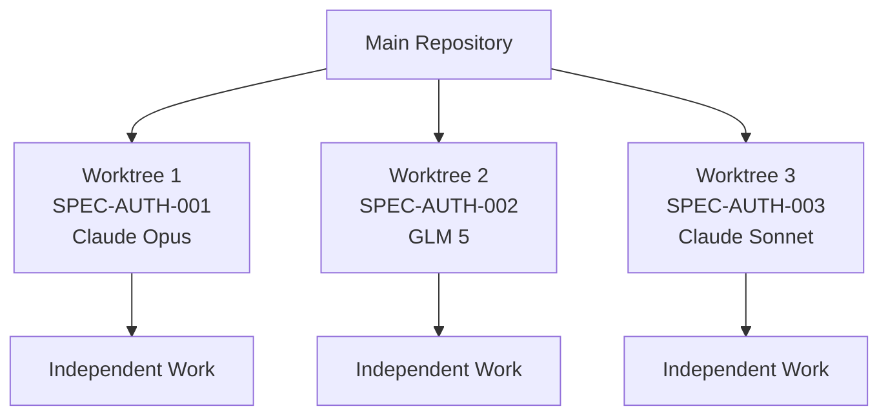
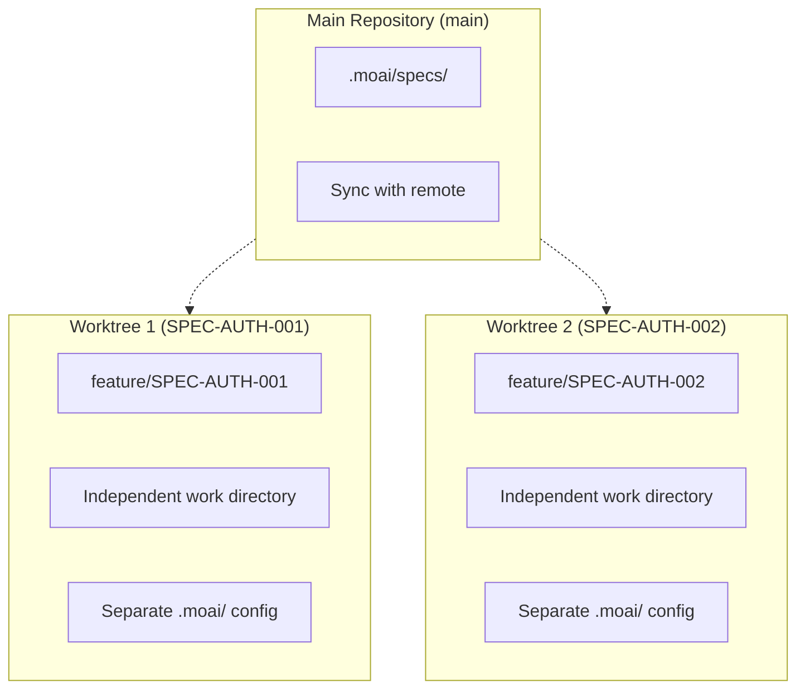
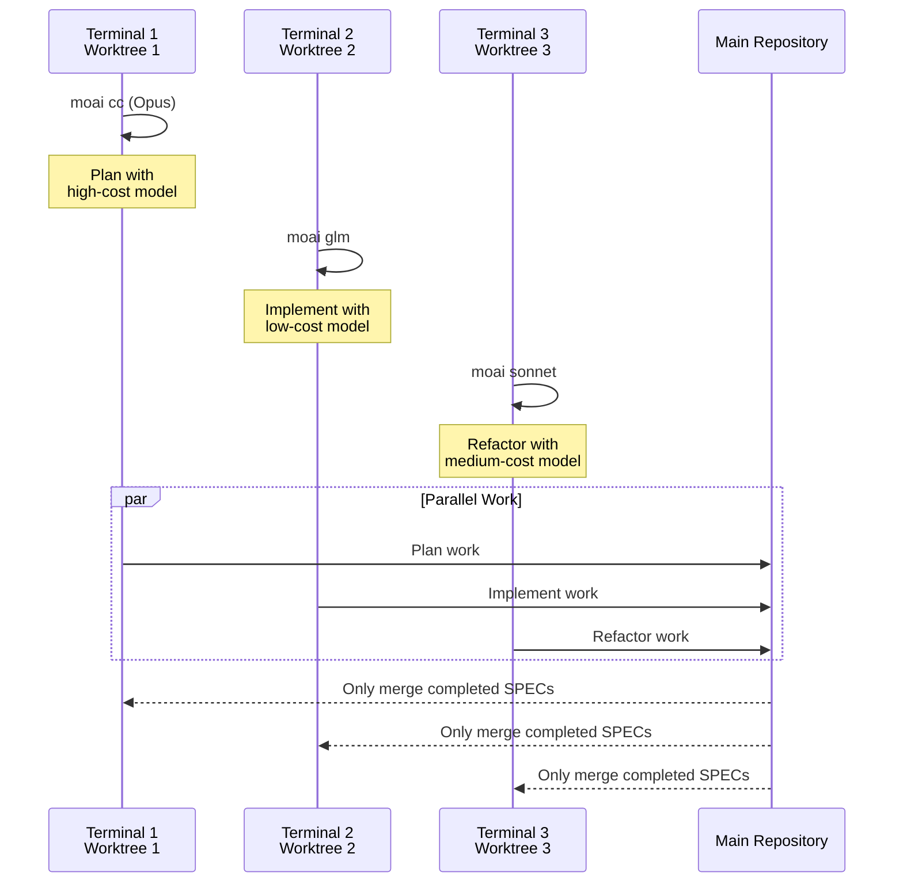
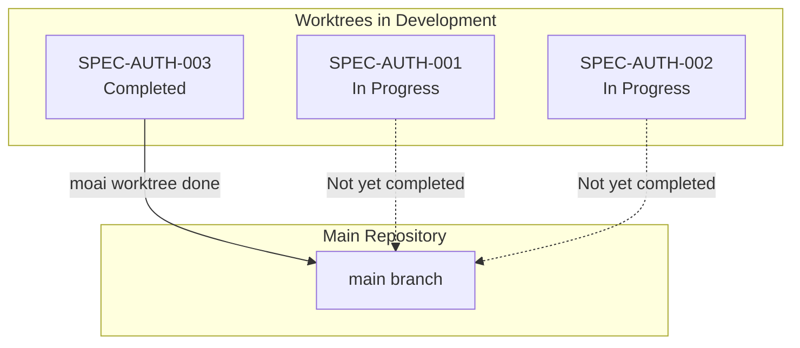

Git Worktree is a core feature in MoAI-ADK for parallel development. It provides complete isolation by allowing each SPEC to be developed in an independent environment.

## Why Do We Need Worktree?

### Problem: Shared LLM Settings

In traditional MoAI-ADK, when you use `moai glm` or `moai cc` to change the LLM, **the same LLM is applied to all open sessions**. This causes the following issues:

- **SPEC Interference**: LLM settings affect each other when developing different SPECs
- **No Parallel Development**: Cannot develop multiple SPECs simultaneously
- **Cost Inefficiency**: Must use expensive Opus in all sessions

### Solution: Complete Isolation

With Git Worktree, each SPEC maintains **completely independent Git state and LLM settings**:



## Core Workflow

### 3-Step Development Process

MoAI-ADK development with Git Worktree consists of 3 steps:

```mermaid
flowchart TD
    subgraph Phase1["Phase 1: Plan (Terminal 1)"]
        A1[/moai plan<br/>feature description<br/>--worktree/] --> A2[SPEC Document Created]
        A2 --> A3[Worktree Auto Created]
        A3 --> A4[Feature Branch Created]
    end

    subgraph Phase2["Phase 2: Implement (Terminals 2, 3, 4...)"]
        B1[moai worktree go SPEC-ID] --> B2[Enter Worktree]
        B2 --> B3[moai glm<br/>Change LLM]
        B3 --> B4[/moai run SPEC-ID]
        B4 --> B5[/moai sync SPEC-ID]
    end

    subgraph Phase3["Phase 3: Merge & Cleanup"]
        C1[moai worktree done SPEC-ID] --> C2[Checkout main]
        C2 --> C3[Merge]
        C3 --> C4[Cleanup]
    end

    Phase1 --> Phase2
    Phase2 --> Phase3
```

### Step-by-Step Details

#### Step 1: Plan (Terminal 1)

Generate a SPEC document using Claude 4.5 Opus:

```bash
> /moai plan "Add authentication system" --worktree
```

**What happens**:

- Automatic creation of SPEC document in EARS format
- Automatic creation of Worktree for that SPEC
- Automatic creation and checkout of feature branch

**Results**:

- `.moai/specs/SPEC-AUTH-001/spec.md`
- New Worktree directory
- `feature/SPEC-AUTH-001` branch

#### Step 2: Implement (Terminals 2, 3, 4...)

Implement using GLM 5 or other cost-effective models:

```bash
# Enter Worktree (new terminal)
$ moai worktree go SPEC-AUTH-001

# Change LLM
$ moai glm

# Start development
$ claude
> /moai run SPEC-AUTH-001
> /moai sync SPEC-AUTH-001
```

**Benefits**:

- Completely isolated working environment
- GLM cost efficiency (70% savings vs Opus)
- Unlimited parallel development without conflicts

#### Step 3: Merge & Cleanup

```bash
moai worktree done SPEC-AUTH-001              # main → merge → cleanup
moai worktree done SPEC-AUTH-001 --push       # above + push to remote
```

## Worktree Command Reference

| Command                   | Description                       | Example                          |
| ------------------------ | -------------------------- | ------------------------------ |
| `moai worktree new SPEC-ID`    | Create new Worktree           | `moai worktree new SPEC-AUTH-001`    |
| `moai worktree go SPEC-ID`     | Enter Worktree (open new shell) | `moai worktree go SPEC-AUTH-001`     |
| `moai worktree list`           | List Worktrees         | `moai worktree list`                 |
| `moai worktree done SPEC-ID`   | Merge and cleanup               | `moai worktree done SPEC-AUTH-001`   |
| `moai worktree remove SPEC-ID` | Remove Worktree              | `moai worktree remove SPEC-AUTH-001` |
| `moai worktree status`         | Check Worktree status         | `moai worktree status`               |
| `moai worktree clean`          | Cleanup merged Worktrees       | `moai worktree clean --merged-only`  |
| `moai worktree config`         | Check Worktree settings         | `moai worktree config root`          |

## Key Benefits of Worktree

### 1. Complete Isolation

Each SPEC maintains independent Git state:



**Benefits**:

- Can commit independently in each Worktree
- Work without branch conflicts
- Only completed SPECs are merged to main

### 2. LLM Independence

Each Worktree maintains separate LLM settings:



### 3. Unlimited Parallel Development

Can develop multiple SPECs simultaneously:

```bash
# Terminal 1: Plan SPEC-AUTH-001
> /moai plan "authentication system" --worktree

# Terminal 2: Implement SPEC-AUTH-002 (GLM)
$ moai worktree go SPEC-AUTH-002
$ moai glm
> /moai run SPEC-AUTH-002

# Terminal 3: Implement SPEC-AUTH-003 (GLM)
$ moai worktree go SPEC-AUTH-003
$ moai glm
> /moai run SPEC-AUTH-003

# Terminal 4: Document SPEC-AUTH-004
$ moai worktree go SPEC-AUTH-004
> /moai sync SPEC-AUTH-004
```

### 4. Safe Merge

Only completed SPECs are merged to main branch:



## Parallel Development Visualization

Working simultaneously in multiple terminals:

```mermaid
graph TB
    subgraph Terminal1["Terminal 1: Planning"]
        T1A[/moai plan<br/>--worktree/]
        T1B[Claude Opus<br/>High cost/High quality]
        T1C[SPEC Document Created]
    end

    subgraph Terminal2["Terminal 2: Implementing"]
        T2A[moai worktree go<br/>SPEC-AUTH-001]
        T2B[moai glm<br/>Low cost]
        T2C[/moai run<br/>DDD Implementation]
    end

    subgraph Terminal3["Terminal 3: Implementing"]
        T3A[moai worktree go<br/>SPEC-AUTH-002]
        T3B[moai glm<br/>Low cost]
        T3C[/moai run<br/>DDD Implementation]
    end

    subgraph Terminal4["Terminal 4: Documenting"]
        T4A[moai worktree go<br/>SPEC-AUTH-003]
        T4B[moai sonnet<br/>Medium cost]
        T4C[/moai sync<br/>Documentation]
    end

    T1C --> T2A
    T1C --> T3A
    T1C --> T4A
```

## Next Steps

- **[Complete Guide](/worktree/faq)** - All Git Worktree commands and detailed usage
- **[Real Examples](/worktree/faq)** - Real-world usage examples
- **[FAQ](/worktree/faq)** - Frequently asked questions and troubleshooting

## Related Documents

- [MoAI-ADK Documentation](https://adk.mo.ai.kr)
- [SPEC System](../spec/)
- [DDD Workflow](../workflow/)
