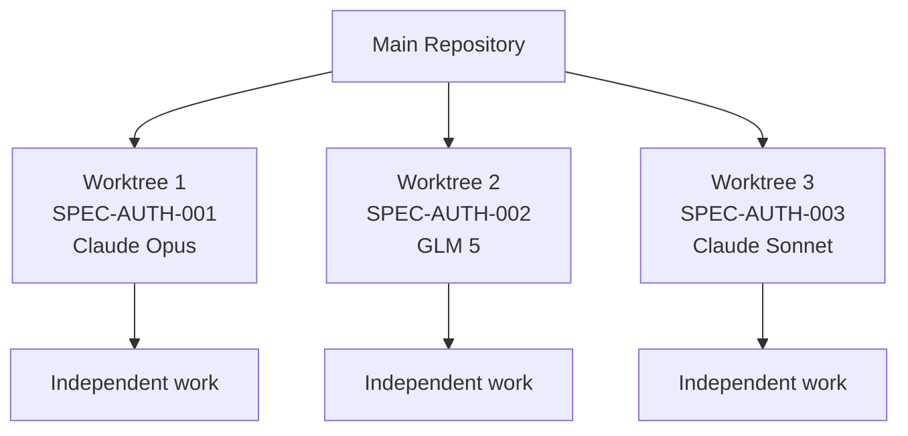
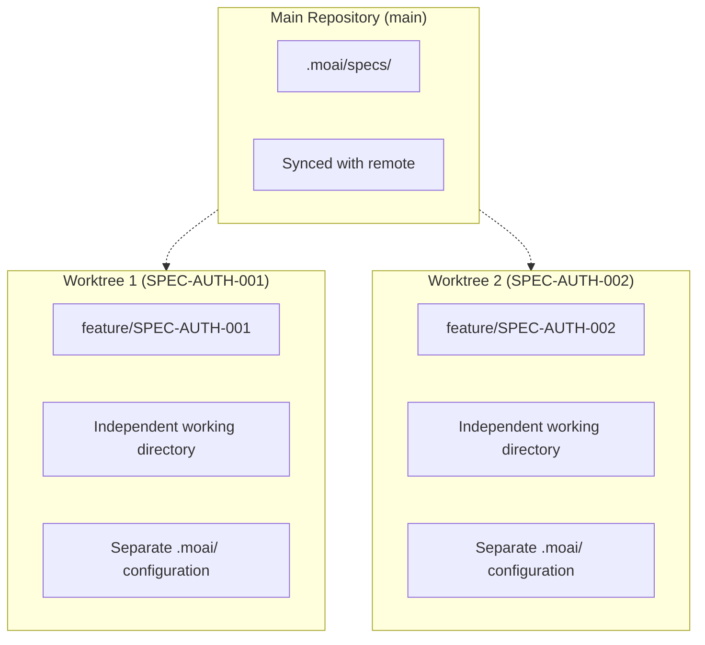
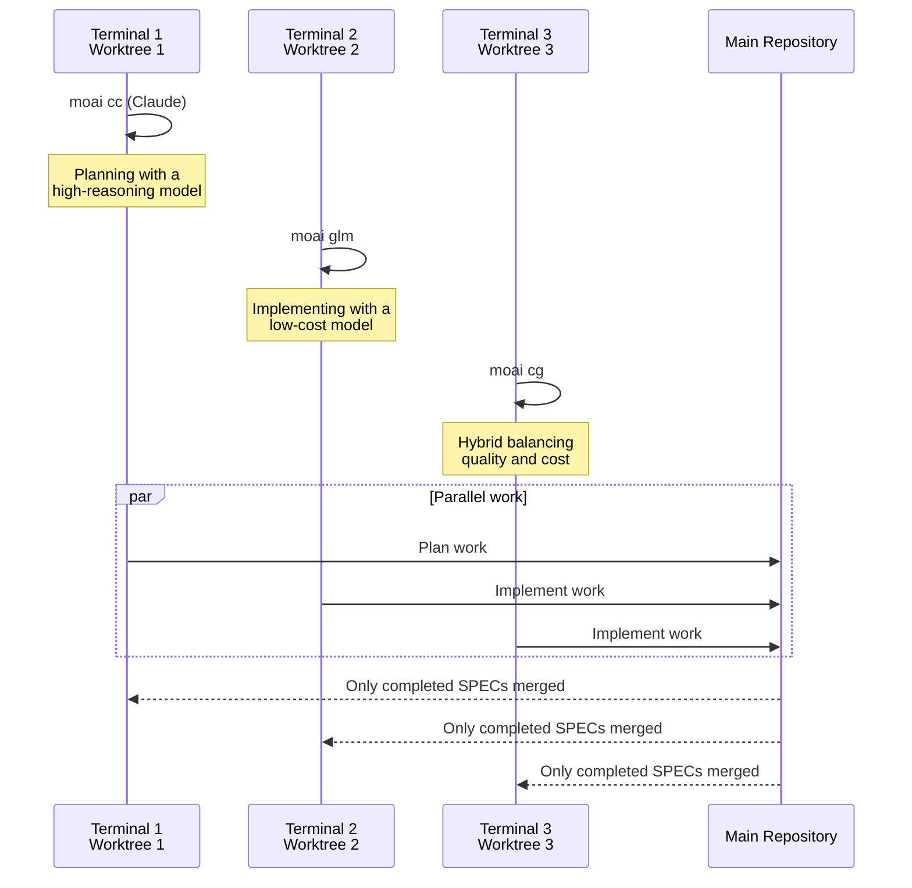
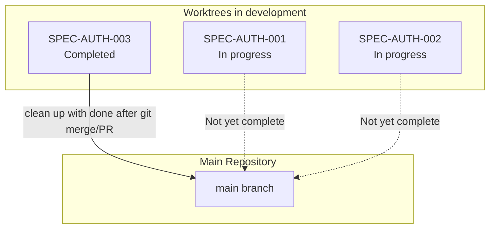

 <strong>Belongs to</strong>:  Agentic Harness

<!-- @value: agentic-harness -->

Git Worktree is the foundation of MoAI-ADK parallel development. It gives every
SPEC a fully independent workspace, so you can keep different Git states and
different LLM configurations running at the same time.


Background on the platform layer is in [Worktrees](/en/claude-code/agentic/worktrees). This page is the MoAI-ADK account of it.



Looked at through **the Agentic Harness** — the quality-control one of the three
core values — Worktree is the control device that splits each SPEC's workspace
completely apart. Agents working in parallel never overwrite each other's work,
and only completed SPECs get merged into main. A cost benefit (Tokenomics)
follows from it: each worktree can be given its own LLM execution mode, so a
high-reasoning Claude model can run in the planning terminal while a low-cost
GLM runs in the implementation terminal — one model assigned per phase.

## Why do you need Worktree?

### Problem: LLM configuration is shared across sessions

Without Worktree, switching the LLM backend with `moai glm` or `moai cc`
applies **the same configuration to every open session** of the project. As a
result:

- **Cross-SPEC interference** — an LLM change made for one SPEC shakes up work on other SPECs
- **No parallel development** — you cannot run multiple SPECs under different conditions at the same time
- **Wasted tokens** — even simple implementation work runs on the expensive model

### Solution: complete isolation

With Git Worktree, each SPEC's **Git state and LLM configuration move
independently**:


```mermaid
graph TB
    A[Main Repository] --> B[Worktree 1<br/>SPEC-AUTH-001<br/>Claude Opus]
    A --> C[Worktree 2<br/>SPEC-AUTH-002<br/>GLM 5]
    A --> D[Worktree 3<br/>SPEC-AUTH-003<br/>Claude Sonnet]

    B --> E[Independent work]
    C --> F[Independent work]
    D --> G[Independent work]
```

## Core workflow

### 3-phase development process

MoAI-ADK development with Worktree flows through three phases:

```mermaid
flowchart TD
    subgraph Phase1["Phase 1: Plan (Terminal 1, main checkout)"]
        A1[/moai plan<br/>feature description/] --> A2[SPEC document created]
        A2 --> A3[Implementation scope fixed]
    end

    subgraph Phase2["Phase 2: Implement (Terminals 2, 3, 4...)"]
        B1["moai glm -w SPEC-AUTH-001"] --> B2[Worktree created and entered]
        B2 --> B3[/moai run SPEC-ID]
        B3 --> B4[/moai sync SPEC-ID]
    end

    subgraph Phase3["Phase 3: Merge & Cleanup"]
        C1[merge into base via<br/>git merge or PR] --> C2[moai worktree done branch]
        C2 --> C3[Remove worktree]
        C3 --> C4[Optional: delete branch]
    end

    Phase1 --> Phase2
    Phase2 --> Phase3
```

### Phase-by-phase details

#### Phase 1: Plan (Terminal 1)

Reasoning quality decides the outcome of the planning phase, so the SPEC
document is authored with a Claude (Opus-class) model. This phase runs in the
main checkout as it is:

```bash
> /moai plan "Add authentication system"
```

**Outputs**:

- `.moai/specs/SPEC-AUTH-001/spec.md`
- The SPEC ID to use in the implementation phase

#### Phase 2: Implement (Terminals 2, 3, 4...)

The implementation phase is high-volume, but the SPEC has already set the
direction — so a cheap model like GLM does the job perfectly well. Entering the
worktree is the launcher's job, via the `-w` flag on `moai cc`, `moai glm`, and
`moai cg`. If no worktree by that name exists, it is created on the spot:

```bash
# New terminal: create the worktree and enter it with the GLM backend
$ moai glm -w SPEC-AUTH-001

# Start developing right inside the session you entered
> /moai run SPEC-AUTH-001
> /moai sync SPEC-AUTH-001
```

To open one more worktree while keeping the current session, add `--spawn`. It
comes up in a new tmux window and the original window stays as it is:

```bash
$ moai glm -w SPEC-AUTH-002 --spawn
```

**Advantages**:

- Completely isolated working environment
- GLM cost efficiency (roughly 70% savings versus Opus)
- Unlimited parallel development without conflicts

#### Phase 3: Cleanup

```bash
moai worktree done feature/SPEC-AUTH-001                    # worktree cleanup (merge/push done separately via git)
moai worktree done feature/SPEC-AUTH-001 --delete-branch    # cleanup + delete local branch
```

## Worktree command reference

**Entering** a worktree and **listing** worktrees are not `moai worktree`'s job.
The launcher handles entry; git handles listing:

| What you want to do     | Command                         | Example                                |
| ----------------------- | ------------------------------- | -------------------------------------- |
| Create a Worktree and enter it | `moai cc -w <name>`      | `moai glm -w SPEC-AUTH-001`            |
| Open one in a new window, keeping the session | `moai cc -w <name> --spawn` | `moai cg -w SPEC-AUTH-002 --spawn` |
| List Worktrees          | `git worktree list`             | `git worktree list`                    |

`moai worktree` manages the worktrees once they exist:

| Command                       | Description                     | Example                                |
| ----------------------------- | ------------------------------- | -------------------------------------- |
| `moai worktree sync [branch]` | Bring in base-branch changes    | `moai worktree sync --strategy rebase` |
| `moai worktree done <branch>` | Clean up the Worktree (merge is separate) | `moai worktree done feature/SPEC-AUTH-001` |
| `moai worktree remove <path>` | Remove a Worktree by path       | `moai worktree remove ~/.moai/worktrees/your-project/SPEC-AUTH-001` |
| `moai worktree clean`         | Clean up merged or abandoned Worktrees | `moai worktree clean --merged-only`    |
| `moai worktree recover`       | Recover the Worktree registry   | `moai worktree recover`                |
| `moai worktree snapshot`      | Capture the working-tree state  | `moai worktree snapshot`               |
| `moai worktree verify`        | Compare current state against a snapshot | `moai worktree verify --snapshot <path>` |
| `moai worktree restore`       | Roll back to the snapshot HEAD state | `moai worktree restore --snapshot <path>` |

## Key advantages of Worktree

### 1. Complete Isolation

Each SPEC keeps an independent Git state:


```mermaid
graph TB
    subgraph Main["Main Repository (main)"]
        M1[.moai/specs/]
        M2[Synced with remote]
    end

    subgraph WT1["Worktree 1 (SPEC-AUTH-001)"]
        W1A[feature/SPEC-AUTH-001]
        W1B[Independent working directory]
        W1C[Separate .moai/ configuration]
    end

    subgraph WT2["Worktree 2 (SPEC-AUTH-002)"]
        W2A[feature/SPEC-AUTH-002]
        W2B[Independent working directory]
        W2C[Separate .moai/ configuration]
    end

    Main -.-> WT1
    Main -.-> WT2
```

**Advantages**:

- Commit independently in each Worktree
- Work without cross-branch conflicts
- Only completed SPECs are merged into main

### 2. LLM Independence

Each Worktree gets its own LLM execution mode. Three terminals can run
differently — `moai cc` (Claude only), `moai glm` (GLM only), and `moai cg`
(Claude leader + GLM worker hybrid) — without interfering with each other:


```mermaid
sequenceDiagram
    participant T1 as Terminal 1<br/>Worktree 1
    participant T2 as Terminal 2<br/>Worktree 2
    participant T3 as Terminal 3<br/>Worktree 3
    participant Main as Main Repository

    T1->>T1: moai cc (Claude)
    Note over T1: Planning with a<br/>high-reasoning model

    T2->>T2: moai glm
    Note over T2: Implementing with a<br/>low-cost model

    T3->>T3: moai cg
    Note over T3: Hybrid balancing<br/>quality and cost

    par Parallel work
        T1->>Main: Plan work
        T2->>Main: Implement work
        T3->>Main: Implement work
    end

    Main-->>T1: Only completed SPECs merged
    Main-->>T2: Only completed SPECs merged
    Main-->>T3: Only completed SPECs merged
```

### 3. Unlimited Parallel

You can run multiple SPECs at the same time:

```bash
# Terminal 1: plan SPEC-AUTH-001 (main checkout)
> /moai plan "Authentication system"

# Terminal 2: implement SPEC-AUTH-002 (GLM)
$ moai glm -w SPEC-AUTH-002
> /moai run SPEC-AUTH-002

# Terminal 3: implement SPEC-AUTH-003 (GLM)
$ moai glm -w SPEC-AUTH-003
> /moai run SPEC-AUTH-003

# Terminal 4: document SPEC-AUTH-004 (Claude)
$ moai cc -w SPEC-AUTH-004
> /moai sync SPEC-AUTH-004
```

### 4. Safe Merge

Only completed SPECs are merged into the main branch:


```mermaid
flowchart TB
    subgraph Development["Worktrees in development"]
        D1[SPEC-AUTH-001<br/>In progress]
        D2[SPEC-AUTH-002<br/>In progress]
        D3[SPEC-AUTH-003<br/>Completed]
    end

    subgraph Main["Main Repository"]
        M[main branch]
    end

    D3 -->|clean up with done after git merge/PR| M
    D1 -.->|Not yet complete| M
    D2 -.->|Not yet complete| M
```

## Parallel development visualized

This is what working across multiple terminals looks like. Each worktree is
fully isolated so parallel work proceeds without conflicts — that is the heart
of the Agentic Harness. The ability to assign the right model to each phase is
the Tokenomics benefit that comes with it:

```mermaid
graph TB
    subgraph Terminal1["Terminal 1: Planning"]
        T1A[/moai plan/]
        T1B[Claude Opus<br/>high cost / high quality]
        T1C[SPEC document created]
    end

    subgraph Terminal2["Terminal 2: Implementing"]
        T2A["moai glm -w<br/>SPEC-AUTH-001"]
        T2B[low-cost backend]
        T2C[/moai run<br/>DDD implementation]
    end

    subgraph Terminal3["Terminal 3: Implementing"]
        T3A["moai glm -w<br/>SPEC-AUTH-002"]
        T3B[low-cost backend]
        T3C[/moai run<br/>DDD implementation]
    end

    subgraph Terminal4["Terminal 4: Documenting"]
        T4A["moai cc -w<br/>SPEC-AUTH-003"]
        T4B[Claude backend]
        T4C[/moai sync<br/>documentation]
    end

    T1C --> T2A
    T1C --> T3A
    T1C --> T4A
```

## Next steps

- **[Complete Guide](/en/worktree/guide)** — every Worktree command and detailed usage
- **[Real-World Examples](/en/worktree/examples)** — usage scenarios from real projects
- **[FAQ](/en/worktree/faq)** — frequently asked questions and troubleshooting

## Related documentation

- [MoAI-ADK Documentation](https://adk.mo.ai.kr)
- [SPEC System](/en/core-concepts/spec-based-dev/)
- [DDD Workflow](/en/core-concepts/ddd/)
