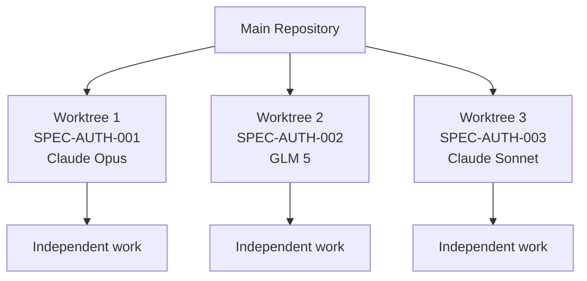
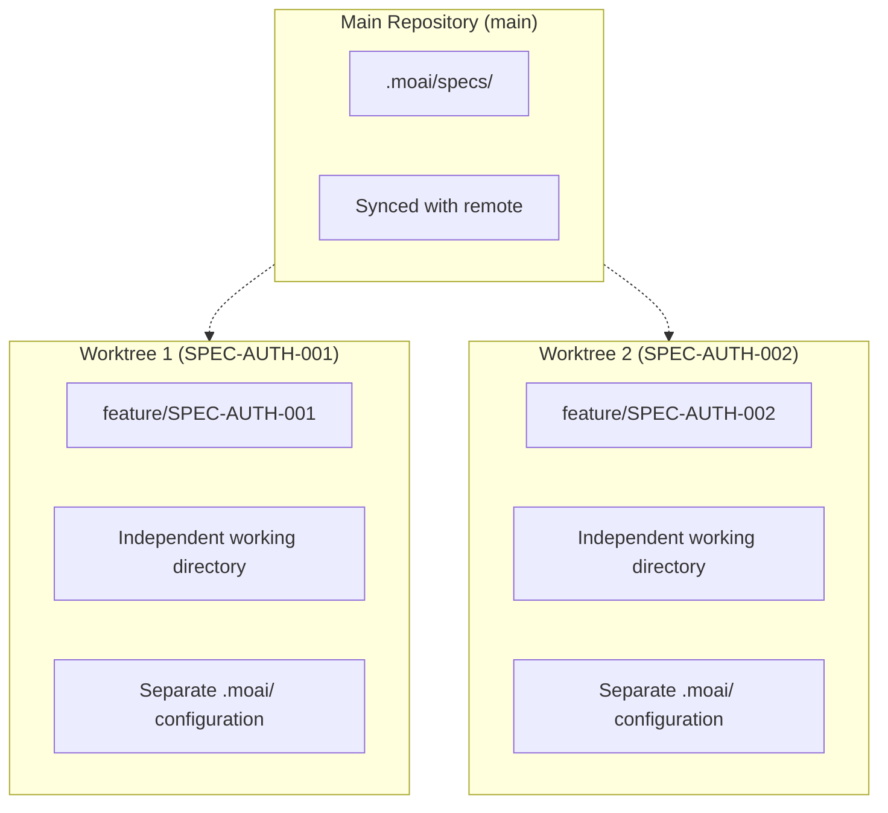
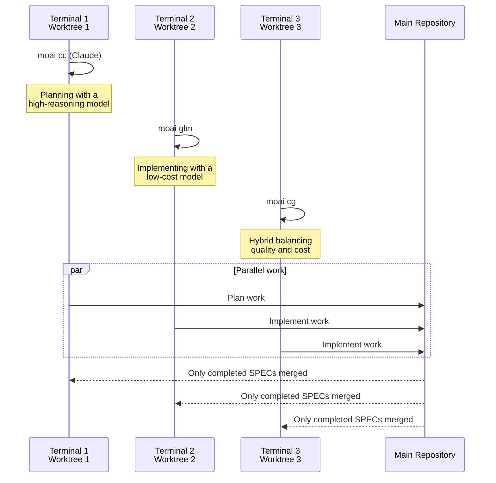
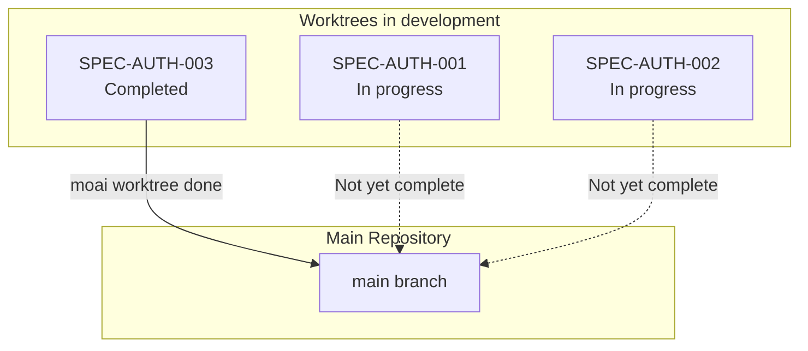

Git Worktree is the foundation of MoAI-ADK parallel development. It gives every
SPEC a fully independent workspace, so you can run different Git states and
different LLM configurations at the same time.

Seen through **Tokenomics** (Token Economics) — the core value of MoAI-ADK
v3.0 — Worktree is the mechanism that actually delivers "plan deep, implement
cheap". You use a high-reasoning Claude model in the planning terminal and a
low-cost GLM in the implementation terminals — assigning the right model to
each work phase is impossible without Worktree isolation.



## Why do you need Worktree?

### Problem: LLM configuration is shared across sessions

Without Worktree, switching the LLM backend with `moai glm` or `moai cc`
applies **the same configuration to every open session** of the project. As a
result:

- **Cross-SPEC interference** — an LLM change made for one SPEC affects work on other SPECs
- **No parallel development** — you cannot run multiple SPECs under different conditions at the same time
- **Wasted tokens** — even simple implementation work runs on the expensive model

### Solution: complete isolation

With Git Worktree, each SPEC gets **its own Git state and LLM configuration**:


```mermaid
graph TB
    A[Main Repository] --> B[Worktree 1<br/>SPEC-AUTH-001<br/>Claude Opus]
    A --> C[Worktree 2<br/>SPEC-AUTH-002<br/>GLM 5]
    A --> D[Worktree 3<br/>SPEC-AUTH-003<br/>Claude Sonnet]

    B --> E[Independent work]
    C --> F[Independent work]
    D --> G[Independent work]
```

## Core workflow

### 3-phase development process

MoAI-ADK development with Worktree flows through three phases:

```mermaid
flowchart TD
    subgraph Phase1["Phase 1: Plan (Terminal 1)"]
        A1[/moai plan<br/>feature description<br/>--worktree/] --> A2[SPEC document created]
        A2 --> A3[Worktree auto-created]
        A3 --> A4[Feature branch created]
    end

    subgraph Phase2["Phase 2: Implement (Terminals 2, 3, 4...)"]
        B1[moai worktree go SPEC-ID] --> B2[Enter Worktree]
        B2 --> B3[moai glm<br/>switch LLM]
        B3 --> B4[/moai run SPEC-ID]
        B4 --> B5[/moai sync SPEC-ID]
    end

    subgraph Phase3["Phase 3: Merge & Cleanup"]
        C1[moai worktree done SPEC-ID] --> C2[Checkout main]
        C2 --> C3[Merge]
        C3 --> C4[Cleanup]
    end

    Phase1 --> Phase2
    Phase2 --> Phase3
```

### Phase-by-phase details

#### Phase 1: Plan (Terminal 1)

Reasoning quality decides the outcome of the planning phase, so the SPEC
document is authored with a Claude (Opus-class) model:

```bash
> /moai plan "Add authentication system" --worktree
```

**What happens**:

- SPEC document auto-generated in EARS format
- A dedicated Worktree auto-created for the SPEC
- Feature branch auto-created and checked out

**Outputs**:

- `.moai/specs/SPEC-AUTH-001/spec.md`
- A new Worktree directory
- The `feature/SPEC-AUTH-001` branch

#### Phase 2: Implement (Terminals 2, 3, 4...)

The implementation phase is high-volume, but the SPEC has already set the
direction — so a cost-efficient model like GLM does the job well:

```bash
# Enter the Worktree (new terminal)
$ moai worktree go SPEC-AUTH-001

# Switch LLM
$ moai glm

# Start development
$ claude
> /moai run SPEC-AUTH-001
> /moai sync SPEC-AUTH-001
```

**Advantages**:

- Completely isolated working environment
- GLM cost efficiency (roughly 70% savings versus Opus)
- Unlimited parallel development without conflicts

#### Phase 3: Merge & Cleanup

```bash
moai worktree done SPEC-AUTH-001                    # worktree cleanup (merge/push done separately via git)
moai worktree done SPEC-AUTH-001 --delete-branch    # cleanup + delete local branch
```

## Worktree command reference

| Command                  | Description                | Example                        |
| ------------------------ | -------------------------- | ------------------------------ |
| `moai worktree new SPEC-ID`    | Create a new Worktree      | `moai worktree new SPEC-AUTH-001`    |
| `moai worktree go SPEC-ID`     | Enter a Worktree (opens a new shell) | `moai worktree go SPEC-AUTH-001`     |
| `moai worktree list`           | List Worktrees             | `moai worktree list`                 |
| `moai worktree done SPEC-ID`   | Merge and clean up         | `moai worktree done SPEC-AUTH-001`   |
| `moai worktree remove SPEC-ID` | Remove a Worktree          | `moai worktree remove SPEC-AUTH-001` |
| `moai worktree status`         | Check Worktree status      | `moai worktree status`               |
| `moai worktree clean`          | Clean up merged Worktrees  | `moai worktree clean --merged-only`  |
| `moai worktree config`         | Inspect Worktree config    | `moai worktree config root`          |

## Key advantages of Worktree

### 1. Complete Isolation

Each SPEC keeps an independent Git state:


```mermaid
graph TB
    subgraph Main["Main Repository (main)"]
        M1[.moai/specs/]
        M2[Synced with remote]
    end

    subgraph WT1["Worktree 1 (SPEC-AUTH-001)"]
        W1A[feature/SPEC-AUTH-001]
        W1B[Independent working directory]
        W1C[Separate .moai/ configuration]
    end

    subgraph WT2["Worktree 2 (SPEC-AUTH-002)"]
        W2A[feature/SPEC-AUTH-002]
        W2B[Independent working directory]
        W2C[Separate .moai/ configuration]
    end

    Main -.-> WT1
    Main -.-> WT2
```

**Advantages**:

- Commit independently in each Worktree
- Work without cross-branch conflicts
- Only completed SPECs are merged into main

### 2. LLM Independence

Each Worktree keeps its own LLM execution mode. Three terminals can run
differently — `moai cc` (Claude only), `moai glm` (GLM only), and `moai cg`
(Claude leader + GLM worker hybrid) — without interfering with each other:


```mermaid
sequenceDiagram
    participant T1 as Terminal 1<br/>Worktree 1
    participant T2 as Terminal 2<br/>Worktree 2
    participant T3 as Terminal 3<br/>Worktree 3
    participant Main as Main Repository

    T1->>T1: moai cc (Claude)
    Note over T1: Planning with a<br/>high-reasoning model

    T2->>T2: moai glm
    Note over T2: Implementing with a<br/>low-cost model

    T3->>T3: moai cg
    Note over T3: Hybrid balancing<br/>quality and cost

    par Parallel work
        T1->>Main: Plan work
        T2->>Main: Implement work
        T3->>Main: Implement work
    end

    Main-->>T1: Only completed SPECs merged
    Main-->>T2: Only completed SPECs merged
    Main-->>T3: Only completed SPECs merged
```

### 3. Unlimited Parallel

You can run multiple SPECs at the same time:

```bash
# Terminal 1: plan SPEC-AUTH-001
> /moai plan "Authentication system" --worktree

# Terminal 2: implement SPEC-AUTH-002 (GLM)
$ moai worktree go SPEC-AUTH-002
$ moai glm
> /moai run SPEC-AUTH-002

# Terminal 3: implement SPEC-AUTH-003 (GLM)
$ moai worktree go SPEC-AUTH-003
$ moai glm
> /moai run SPEC-AUTH-003

# Terminal 4: document SPEC-AUTH-004
$ moai worktree go SPEC-AUTH-004
> /moai sync SPEC-AUTH-004
```

### 4. Safe Merge

Only completed SPECs are merged into the main branch:


```mermaid
flowchart TB
    subgraph Development["Worktrees in development"]
        D1[SPEC-AUTH-001<br/>In progress]
        D2[SPEC-AUTH-002<br/>In progress]
        D3[SPEC-AUTH-003<br/>Completed]
    end

    subgraph Main["Main Repository"]
        M[main branch]
    end

    D3 -->|moai worktree done| M
    D1 -.->|Not yet complete| M
    D2 -.->|Not yet complete| M
```

## Parallel development visualized

This is what working across multiple terminals looks like. Assigning a
different model to each phase is the heart of Tokenomics:

```mermaid
graph TB
    subgraph Terminal1["Terminal 1: Planning"]
        T1A[/moai plan<br/>--worktree/]
        T1B[Claude Opus<br/>high cost / high quality]
        T1C[SPEC document created]
    end

    subgraph Terminal2["Terminal 2: Implementing"]
        T2A[moai worktree go<br/>SPEC-AUTH-001]
        T2B[moai glm<br/>low cost]
        T2C[/moai run<br/>DDD implementation]
    end

    subgraph Terminal3["Terminal 3: Implementing"]
        T3A[moai worktree go<br/>SPEC-AUTH-002]
        T3B[moai glm<br/>low cost]
        T3C[/moai run<br/>DDD implementation]
    end

    subgraph Terminal4["Terminal 4: Documenting"]
        T4A[moai worktree go<br/>SPEC-AUTH-003]
        T4B[moai cc<br/>Claude]
        T4C[/moai sync<br/>documentation]
    end

    T1C --> T2A
    T1C --> T3A
    T1C --> T4A
```

## Next steps

- **[Complete Guide](/en/worktree/guide)** — every Worktree command and detailed usage
- **[Real-World Examples](/en/worktree/examples)** — usage scenarios from real projects
- **[FAQ](/en/worktree/faq)** — frequently asked questions and troubleshooting

## Related documentation

- [MoAI-ADK Documentation](https://adk.mo.ai.kr)
- [SPEC System](/en/core-concepts/spec-based-dev/)
- [DDD Workflow](/en/core-concepts/ddd/)
