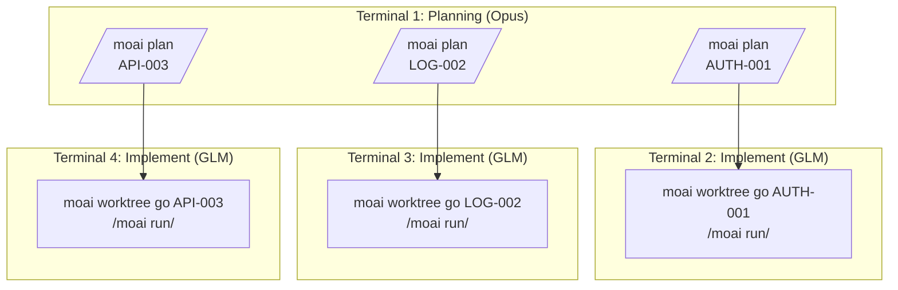
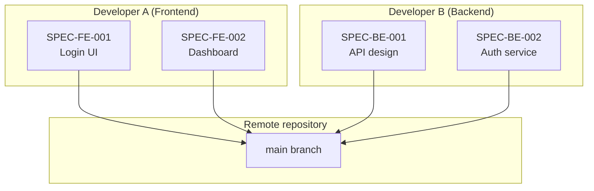
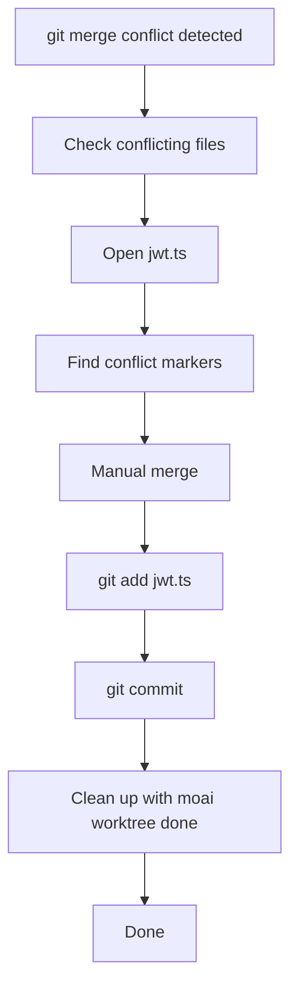
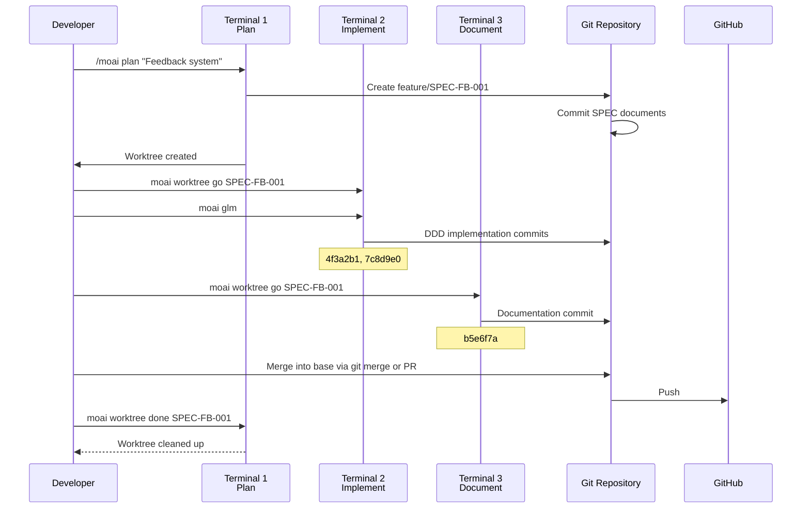

A concrete look at how Git Worktree is actually run in real projects — from single-SPEC development through parallel development, team collaboration, and troubleshooting. Each scenario also carries the tokenomics judgment of "which model to use at which stage".

## Table of contents

1. [Single-SPEC Development](#single-spec-development)
2. [Parallel SPEC Development](#parallel-spec-development)
3. [Team Collaboration Scenario](#team-collaboration-scenario)
4. [Troubleshooting Cases](#troubleshooting-cases)

---

## Single-SPEC Development

### Scenario: implementing a user authentication system

#### Step 1: SPEC planning (Terminal 1)

```bash
# From the project root
$ cd /path/to/your-project

# Create the SPEC plan
> /moai plan "Implement a JWT-based user authentication system" --worktree

# Output
✓ MoAI-ADK SPEC Manager v2.0
━━━━━━━━━━━━━━━━━━━━━━━━━━━━━━━━━━━━━━━━━━

Analyzing SPEC...
  - Functional requirements: 8 found
  - Technical requirements: 5 found
  - API endpoints: 6 identified

Generating SPEC documents...
  ✓ .moai/specs/SPEC-AUTH-001/spec.md
  ✓ .moai/specs/SPEC-AUTH-001/requirements.md
  ✓ .moai/specs/SPEC-AUTH-001/api-design.md

Creating Worktree...
  ✓ Branch created: feature/SPEC-AUTH-001
  ✓ Worktree created: /path/to/your-project/.moai/worktrees/SPEC-AUTH-001
  ✓ Branch switch complete

━━━━━━━━━━━━━━━━━━━━━━━━━━━━━━━━━━━━━━━━━━
Next steps:
  1. Run in a new terminal: moai worktree go SPEC-AUTH-001
  2. Change LLM: moai glm
  3. Start Claude: claude
  4. Start development: /moai run SPEC-AUTH-001

Cost-saving tip: at the implementation stage, 'moai glm' saves 70%!
━━━━━━━━━━━━━━━━━━━━━━━━━━━━━━━━━━━━━━━━━━
```

#### Step 2: entering the Worktree and implementing (Terminal 2)

Planning is done, so switch implementation to a low-cost model:

```bash
# Open a new terminal
$ moai worktree go SPEC-AUTH-001

# A new terminal opens and moves into the Worktree
# The prompt changes
(SPEC-AUTH-001) ~/moai-project/.moai/worktrees/SPEC-AUTH-001

# Switch the LLM to the low-cost model
(SPEC-AUTH-001) $ moai glm
✓ LLM changed: GLM 5 (70% cost savings)

# Start Claude Code
(SPEC-AUTH-001) $ claude
Claude Code v1.0.0
Type 'help' for available commands

# Start DDD implementation
> /moai run SPEC-AUTH-001

# Output
✓ MoAI-ADK DDD Executor v2.0
━━━━━━━━━━━━━━━━━━━━━━━━━━━━━━━━━━━━━━━━━━

Phase 1: ANALYZE
  ✓ Requirements analysis complete
  ✓ Existing code analysis complete
  ✓ Test coverage: 85% target

Phase 2: PRESERVE
  ✓ 12 characterization tests created
  ✓ Existing behavior preservation confirmed

Phase 3: IMPROVE
  ✓ JWT authentication middleware implemented
  ✓ Refresh token rotation implemented
  ✓ Token invalidation on logout implemented

━━━━━━━━━━━━━━━━━━━━━━━━━━━━━━━━━━━━━━━━━━
Implementation complete!
  - Commit: 4f3a2b1 (feat: JWT authentication middleware)
  - Commit: 7c8d9e0 (feat: refresh token rotation)
  - Commit: 2a1b3c4 (feat: token invalidation on logout)

Next steps:
  1. Run tests: pytest tests/auth/
  2. Documentation: /moai sync SPEC-AUTH-001
  3. Complete: moai worktree done SPEC-AUTH-001
━━━━━━━━━━━━━━━━━━━━━━━━━━━━━━━━━━━━━━━━━━
```

#### Step 3: documentation (same Terminal 2)

```bash
# Run documentation
> /moai sync SPEC-AUTH-001

# Output
✓ MoAI-ADK Documentation Generator v2.0
━━━━━━━━━━━━━━━━━━━━━━━━━━━━━━━━━━━━━━━━━━

Generating documents...
  ✓ API docs: docs/api/auth.md
  ✓ Architecture diagram: docs/diagrams/auth-flow.mmd
  ✓ User guide: docs/guides/authentication.md

Commit complete:
  ✓ b5e6f7a (docs: authentication documentation)

━━━━━━━━━━━━━━━━━━━━━━━━━━━━━━━━━━━━━━━━━━
Documentation complete!
Next step: after merging into base (git merge/PR), moai worktree done SPEC-AUTH-001
━━━━━━━━━━━━━━━━━━━━━━━━━━━━━━━━━━━━━━━━━━
```

#### Step 4: base merge and cleanup (Terminal 1)

`moai worktree done` does not merge or push. Handle the merge into the base branch first with `git merge` or a PR, then clean up only the Worktree.

```bash
# Back at the project root
$ cd /path/to/your-project

# Merge into the base branch (git or PR)
$ git checkout main
$ git merge feature/SPEC-AUTH-001
$ git push origin main

# Clean up the Worktree + delete the branch
$ moai worktree done SPEC-AUTH-001 --delete-branch

# Output
✓ Done: worktree for branch feature/SPEC-AUTH-001
━━━━━━━━━━━━━━━━━━━━━━━━━━━━━━━━━━━━━━━━━━
  Path: .moai/worktrees/SPEC-AUTH-001
  Worktree removed.
  Branch feature/SPEC-AUTH-001 deleted.
━━━━━━━━━━━━━━━━━━━━━━━━━━━━━━━━━━━━━━━━━━
```

---

## Parallel SPEC Development

### Scenario: developing 3 SPECs at once

Do all the planning in one terminal with a high-reasoning model (Opus), then switch implementation to GLM and spread it across three terminals:



#### Terminal 1: planning (all SPECs)

```bash
# SPEC 1: authentication
> /moai plan "JWT authentication system" --worktree
✓ SPEC-AUTH-001 created

# SPEC 2: logging
> /moai plan "Structured logging system" --worktree
✓ SPEC-LOG-002 created

# SPEC 3: API
> /moai plan "REST API v2" --worktree
✓ SPEC-API-003 created

# Check Worktrees
moai worktree list
SPEC-AUTH-001  feature/SPEC-AUTH-001  /path/to/SPEC-AUTH-001
SPEC-LOG-002   feature/SPEC-LOG-002   /path/to/SPEC-LOG-002
SPEC-API-003   feature/SPEC-API-003   /path/to/SPEC-API-003
```

#### Terminal 2: implementing AUTH-001

```bash
$ moai worktree go SPEC-AUTH-001
(SPEC-AUTH-001) $ moai glm
(SPEC-AUTH-001) $ claude
> /moai run SPEC-AUTH-001
# ... implementation in progress ...
```

#### Terminal 3: implementing LOG-002

```bash
$ moai worktree go SPEC-LOG-002
(SPEC-LOG-002) $ moai glm
(SPEC-LOG-002) $ claude
> /moai run SPEC-LOG-002
# ... implementation in progress ...
```

#### Terminal 4: implementing API-003

```bash
$ moai worktree go SPEC-API-003
(SPEC-API-003) $ moai glm
(SPEC-API-003) $ claude
> /moai run SPEC-API-003
# ... implementation in progress ...
```

#### Monitoring parallel progress

```bash
# Check all Worktree states from Terminal 1
$ moai worktree status --all

Worktree: SPEC-AUTH-001
Branch: feature/SPEC-AUTH-001
Status: 3 commits ahead of main
LLM: GLM 5
Last activity: 5 minutes ago

Worktree: SPEC-LOG-002
Branch: feature/SPEC-LOG-002
Status: 2 commits ahead of main
LLM: GLM 5
Last activity: 3 minutes ago

Worktree: SPEC-API-003
Branch: feature/SPEC-API-003
Status: 4 commits ahead of main
LLM: GLM 5
Last activity: 7 minutes ago
```

---

## Team Collaboration Scenario

### Scenario: 2 developers collaborating



#### Developer A: Frontend development

```bash
# On developer A's machine
git clone https://github.com/team/project.git
cd project

# Create the Frontend SPEC
> /moai plan "Login UI component" --worktree
✓ SPEC-FE-001 created

# Develop in the Worktree
moai worktree go SPEC-FE-001
(SPEC-FE-001) $ moai glm
(SPEC-FE-001) $ claude
> /moai run SPEC-FE-001

# After implementation, push the branch + create a PR (git/gh)
(SPEC-FE-001) $ exit
git push -u origin feature/SPEC-FE-001
gh pr create --fill
# After the PR merges, clean up the Worktree
moai worktree done SPEC-FE-001 --delete-branch
```

#### Developer B: Backend development

```bash
# On developer B's machine
git clone https://github.com/team/project.git
cd project

# Create the Backend SPEC
> /moai plan "Authentication API service" --worktree
✓ SPEC-BE-001 created

# Develop in the Worktree
moai worktree go SPEC-BE-001
(SPEC-BE-001) $ moai glm
(SPEC-BE-001) $ claude
> /moai run SPEC-BE-001

# After implementation, push the branch + create a PR (git/gh)
(SPEC-BE-001) $ exit
git push -u origin feature/SPEC-BE-001
gh pr create --fill
# After the PR merges, clean up the Worktree
moai worktree done SPEC-BE-001 --delete-branch
```

#### PR merge and integration

```bash
# On the team lead or CI system
gh pr list
# FE-001  Login UI Component          Ready
# BE-001  Authentication API Service  Ready

# Merge the PRs
gh pr merge FE-001 --merge
gh pr merge BE-001 --merge

# Everyone stays up to date
git pull origin main
```

---

## Troubleshooting Cases

### Case 1: resolving a merge conflict

Merges happen in `git merge` or a PR, so conflicts occur at that stage too. The Worktree CLI does not participate in merging.

```bash
$ git checkout main
$ git merge feature/SPEC-AUTH-001

# Output
✗ Merge conflict!
Conflicting files:
  - src/auth/jwt.ts
  - tests/auth.test.ts
```

**Resolution process**:



```bash
# Resolve the conflict
code src/auth/jwt.ts

# Check the conflict markers
<<<<<<< HEAD
const secret = process.env.JWT_SECRET;
=======
const secret = config.jwt.secret;
>>>>>>> feature/SPEC-AUTH-001

# Merge manually
const secret = process.env.JWT_SECRET || config.jwt.secret;

# Stage then commit
git add src/auth/jwt.ts
git commit -m "fix: resolve merge conflict in JWT config"
git push origin main

# Once the merge is done, clean up the Worktree
moai worktree done SPEC-AUTH-001 --delete-branch
✓ Done!
```

### Case 2: recovering a corrupted Worktree

```bash
$ moai worktree go SPEC-AUTH-001
✗ The Worktree is corrupted.

# Diagnose
$ moai worktree status
✗ The Worktree directory does not exist

# Recover
$ moai worktree remove .moai/worktrees/SPEC-AUTH-001 --force
✓ Existing Worktree removed

$ moai worktree new SPEC-AUTH-001
✓ Worktree re-created
```

### Case 3: cleaning up merged Worktrees

```bash
$ df -h
Filesystem      Size  Used Avail Use%
/dev/disk1     500G  480G   20G  96%

# Clean up only Worktrees merged into base
$ moai worktree clean --merged-only

✓ Merged Worktrees cleaned up
✓ Disk space reclaimed
```

---

## Real Project Workflow

### A complete development cycle example



---

## Success Story

### Case: adoption at a startup

```bash
# Situation: 3 features to develop at once
# Time: 1 week
# Developers: 2

# Day 1: plan all SPECs
> /moai plan "User management" --worktree
> /moai plan "Payment system" --worktree
> /moai plan "Notification system" --worktree

# Days 2-4: parallel implementation
# Terminal 1: user management
$ moai worktree go SPEC-USER-001 && moai glm
# Terminal 2: payment system
$ moai worktree go SPEC-PAY-001 && moai glm
# Terminal 3: notification system
$ moai worktree go SPEC-NOTIF-001 && moai glm

# Days 5-6: documentation and testing
# Run /moai sync in each Worktree

# Day 7: after merging into base (git merge/PR), clean up the Worktrees
$ moai worktree done SPEC-USER-001 --delete-branch
$ moai worktree done SPEC-PAY-001 --delete-branch
$ moai worktree done SPEC-NOTIF-001 --delete-branch

# Results
# - All 3 features complete
# - Parallel development shortened the development flow
# - 70% cost savings from using GLM
```

---

## Tips and Tricks

### Tip 1: terminal management

```bash
# Manage sessions with tmux
tmux new-session -d -s spec-user 'moai worktree go SPEC-USER-001'
tmux new-session -d -s spec-pay 'moai worktree go SPEC-PAY-001'

# List sessions
tmux ls
spec-user: 1 windows
spec-pay: 1 windows

# Switch sessions
tmux attach-session -t spec-user
```

### Tip 2: tracking progress

```bash
# Progress across all Worktrees
moai worktree list --verbose
for spec in SPEC-USER-001 SPEC-PAY-001 SPEC-NOTIF-001; do
    echo "=== $spec ==="
    cd "$(moai worktree go $spec)"
    git log --oneline -5
    echo ""
done
```

### Tip 3: automation script

```bash
#!/bin/bash
# auto-workflow.sh

SPEC_ID=$1

echo "1. Creating the SPEC plan..."
> /moai plan "$2" --worktree

echo "2. Entering the Worktree..."
moai worktree go $SPEC_ID

echo "3. Changing the LLM..."
moai glm

echo "4. Starting Claude..."
claude

# Usage
# ./auto-workflow.sh SPEC-AUTH-001 "Authentication system"
```

## Related Documents

- [Git Worktree Overview](/en/worktree/)
- [Complete Guide](/en/worktree/guide)
- [FAQ](/en/worktree/faq)
