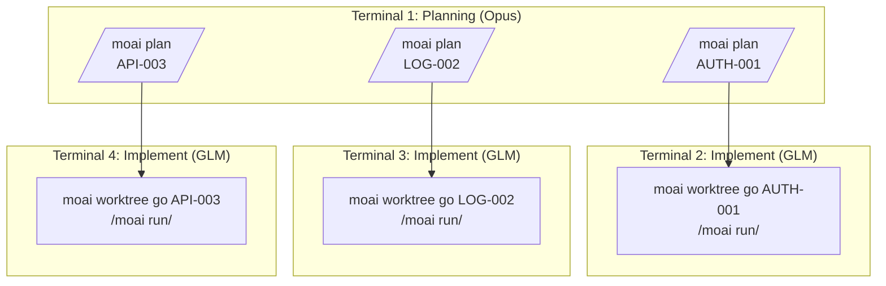
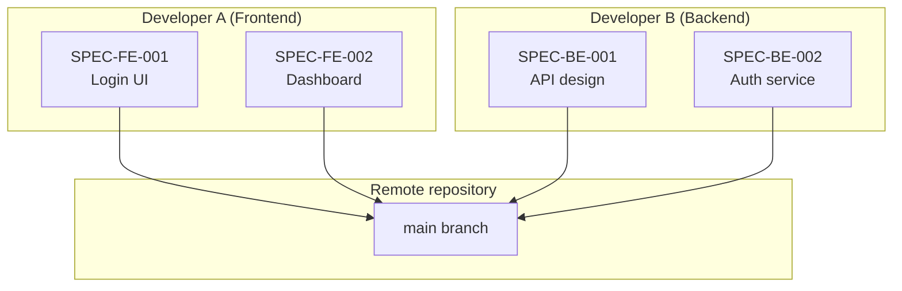
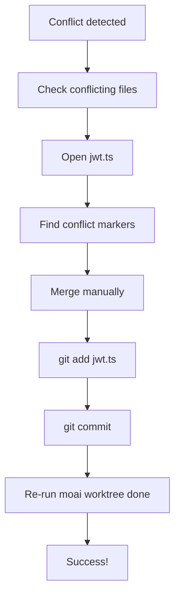
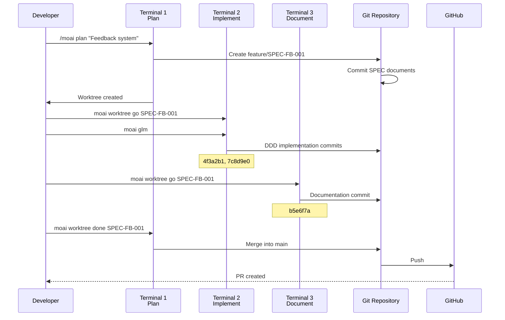

How Git Worktree runs in real projects — concrete scenarios from single-SPEC
development to parallel development, team collaboration, and troubleshooting.
Each scenario includes the Tokenomics decision of "which model goes to which
phase".

## Table of contents

1. [Single-SPEC Development](#single-spec-development)
2. [Parallel SPEC Development](#parallel-spec-development)
3. [Team Collaboration Scenario](#team-collaboration-scenario)
4. [Troubleshooting Cases](#troubleshooting-cases)

---

## Single-SPEC Development

### Scenario: implementing a user authentication system

#### Step 1: SPEC planning (Terminal 1)

```bash
# From the project root
$ cd /path/to/your-project

# Create the SPEC plan
> /moai plan "Implement JWT-based user authentication system" --worktree

# Output
✓ MoAI-ADK SPEC Manager v2.0
━━━━━━━━━━━━━━━━━━━━━━━━━━━━━━━━━━━━━━━━━━

Analyzing SPEC...
  - Functional requirements: 8 found
  - Technical requirements: 5 found
  - API endpoints: 6 identified

Generating SPEC documents...
  ✓ .moai/specs/SPEC-AUTH-001/spec.md
  ✓ .moai/specs/SPEC-AUTH-001/requirements.md
  ✓ .moai/specs/SPEC-AUTH-001/api-design.md

Creating Worktree...
  ✓ Branch created: feature/SPEC-AUTH-001
  ✓ Worktree created: /path/to/your-project/.moai/worktrees/SPEC-AUTH-001
  ✓ Branch switched

━━━━━━━━━━━━━━━━━━━━━━━━━━━━━━━━━━━━━━━━━━
Next steps:
  1. In a new terminal, run: moai worktree go SPEC-AUTH-001
  2. Switch LLM: moai glm
  3. Start Claude: claude
  4. Start development: /moai run SPEC-AUTH-001

Cost-saving tip: use 'moai glm' during implementation for 70% savings!
━━━━━━━━━━━━━━━━━━━━━━━━━━━━━━━━━━━━━━━━━━
```

#### Step 2: entering the Worktree and implementing (Terminal 2)

Planning is done, so implementation switches to the low-cost model:

```bash
# Open a new terminal
$ moai worktree go SPEC-AUTH-001

# A new terminal opens and moves into the Worktree
# The prompt changes
(SPEC-AUTH-001) ~/moai-project/.moai/worktrees/SPEC-AUTH-001

# Switch the LLM to the low-cost model
(SPEC-AUTH-001) $ moai glm
✓ LLM switched: GLM 5 (70% cost savings)

# Start Claude Code
(SPEC-AUTH-001) $ claude
Claude Code v1.0.0
Type 'help' for available commands

# Start DDD implementation
> /moai run SPEC-AUTH-001

# Output
✓ MoAI-ADK DDD Executor v2.0
━━━━━━━━━━━━━━━━━━━━━━━━━━━━━━━━━━━━━━━━━━

Phase 1: ANALYZE
  ✓ Requirements analysis complete
  ✓ Existing code analysis complete
  ✓ Test coverage: 85% target

Phase 2: PRESERVE
  ✓ 12 characterization tests created
  ✓ Existing behavior preserved

Phase 3: IMPROVE
  ✓ JWT authentication middleware implemented
  ✓ Refresh token rotation implemented
  ✓ Token invalidation on logout implemented

━━━━━━━━━━━━━━━━━━━━━━━━━━━━━━━━━━━━━━━━━━
Implementation complete!
  - Commit: 4f3a2b1 (feat: JWT authentication middleware)
  - Commit: 7c8d9e0 (feat: refresh token rotation)
  - Commit: 2a1b3c4 (feat: token invalidation on logout)

Next steps:
  1. Run tests: pytest tests/auth/
  2. Document: /moai sync SPEC-AUTH-001
  3. Finish: moai worktree done SPEC-AUTH-001
━━━━━━━━━━━━━━━━━━━━━━━━━━━━━━━━━━━━━━━━━━
```

#### Step 3: documentation (same Terminal 2)

```bash
# Run documentation
> /moai sync SPEC-AUTH-001

# Output
✓ MoAI-ADK Documentation Generator v2.0
━━━━━━━━━━━━━━━━━━━━━━━━━━━━━━━━━━━━━━━━━━

Generating documentation...
  ✓ API docs: docs/api/auth.md
  ✓ Architecture diagram: docs/diagrams/auth-flow.mmd
  ✓ User guide: docs/guides/authentication.md

Commit complete:
  ✓ b5e6f7a (docs: authentication documentation)

━━━━━━━━━━━━━━━━━━━━━━━━━━━━━━━━━━━━━━━━━━
Documentation complete!
Next step: moai worktree done SPEC-AUTH-001 --push
━━━━━━━━━━━━━━━━━━━━━━━━━━━━━━━━━━━━━━━━━━
```

#### Step 4: completion and merge (Terminal 1)

```bash
# Back at the project root
$ cd /path/to/your-project

# Complete the Worktree
$ moai worktree done SPEC-AUTH-001 --push

# Output
✓ MoAI-ADK Worktree Manager v2.0
━━━━━━━━━━━━━━━━━━━━━━━━━━━━━━━━━━━━━━━━━━

Completing Worktree: SPEC-AUTH-001

1. Switching to main branch...
   ✓ Switched to branch 'main'

2. Merging feature branch...
   ✓ Merge 'feature/SPEC-AUTH-001' into main

3. Pushing to remote...
   ✓ github.com:username/repo.git
   ✓ Branch 'main' set up to track remote branch 'main'

4. Cleaning up Worktree...
   ✓ Worktree removed: .moai/worktrees/SPEC-AUTH-001
   ✓ Branch removed: feature/SPEC-AUTH-001

━━━━━━━━━━━━━━━━━━━━━━━━━━━━━━━━━━━━━━━━━━
✓ SPEC-AUTH-001 complete!

Total commits: 4
  - 2e9b4c3 docs: authentication documentation
  - 7c8d9e0 feat: refresh token rotation
  - 4f3a2b1 feat: JWT authentication middleware
  - b5e6f7a feat: token invalidation on logout

━━━━━━━━━━━━━━━━━━━━━━━━━━━━━━━━━━━━━━━━━━
```

---

## Parallel SPEC Development

### Scenario: developing 3 SPECs at once

Planning is batched in one terminal on a high-reasoning model (Opus), then
implementation switches to GLM and fans out across three terminals:



#### Terminal 1: planning (all SPECs)

```bash
# SPEC 1: authentication
> /moai plan "JWT authentication system" --worktree
✓ SPEC-AUTH-001 created

# SPEC 2: logging
> /moai plan "Structured logging system" --worktree
✓ SPEC-LOG-002 created

# SPEC 3: API
> /moai plan "REST API v2" --worktree
✓ SPEC-API-003 created

# Check the Worktrees
moai worktree list
SPEC-AUTH-001  feature/SPEC-AUTH-001  /path/to/SPEC-AUTH-001
SPEC-LOG-002   feature/SPEC-LOG-002   /path/to/SPEC-LOG-002
SPEC-API-003   feature/SPEC-API-003   /path/to/SPEC-API-003
```

#### Terminal 2: implementing AUTH-001

```bash
$ moai worktree go SPEC-AUTH-001
(SPEC-AUTH-001) $ moai glm
(SPEC-AUTH-001) $ claude
> /moai run SPEC-AUTH-001
# ... implementation in progress ...
```

#### Terminal 3: implementing LOG-002

```bash
$ moai worktree go SPEC-LOG-002
(SPEC-LOG-002) $ moai glm
(SPEC-LOG-002) $ claude
> /moai run SPEC-LOG-002
# ... implementation in progress ...
```

#### Terminal 4: implementing API-003

```bash
$ moai worktree go SPEC-API-003
(SPEC-API-003) $ moai glm
(SPEC-API-003) $ claude
> /moai run SPEC-API-003
# ... implementation in progress ...
```

#### Monitoring parallel progress

```bash
# In Terminal 1, check every Worktree's status
$ moai worktree status --verbose

Worktree: SPEC-AUTH-001
Branch: feature/SPEC-AUTH-001
Status: 3 commits ahead of main
LLM: GLM 5
Last activity: 5 minutes ago

Worktree: SPEC-LOG-002
Branch: feature/SPEC-LOG-002
Status: 2 commits ahead of main
LLM: GLM 5
Last activity: 3 minutes ago

Worktree: SPEC-API-003
Branch: feature/SPEC-API-003
Status: 4 commits ahead of main
LLM: GLM 5
Last activity: 7 minutes ago
```

---

## Team Collaboration Scenario

### Scenario: two developers collaborating



#### Developer A: frontend development

```bash
# On developer A's machine
git clone https://github.com/team/project.git
cd project

# Create a frontend SPEC
> /moai plan "Login UI component" --worktree
✓ SPEC-FE-001 created

# Develop inside the Worktree
moai worktree go SPEC-FE-001
(SPEC-FE-001) $ moai glm
(SPEC-FE-001) $ claude
> /moai run SPEC-FE-001

# Push to remote when done
(SPEC-FE-001) $ exit
moai worktree done SPEC-FE-001 --push
✓ Done and PR created
```

#### Developer B: backend development

```bash
# On developer B's machine
git clone https://github.com/team/project.git
cd project

# Create a backend SPEC
> /moai plan "Authentication API service" --worktree
✓ SPEC-BE-001 created

# Develop inside the Worktree
moai worktree go SPEC-BE-001
(SPEC-BE-001) $ moai glm
(SPEC-BE-001) $ claude
> /moai run SPEC-BE-001

# Push to remote when done
(SPEC-BE-001) $ exit
moai worktree done SPEC-BE-001 --push
✓ Done and PR created
```

#### PR merge and integration

```bash
# By the team lead or CI system
gh pr list
# FE-001  Login UI Component          Ready
# BE-001  Authentication API Service  Ready

# Merge PRs
gh pr merge FE-001 --merge
gh pr merge BE-001 --merge

# Every developer stays up to date
git pull origin main
```

---

## Troubleshooting Cases

### Case 1: resolving a merge conflict

```bash
$ moai worktree done SPEC-AUTH-001 --push

# Output
✗ Merge conflict!
Conflicting files:
  - src/auth/jwt.ts
  - tests/auth.test.ts

Resolution steps:
1. Edit the conflicting files to resolve
2. git add <file>
3. git commit
4. Re-run moai worktree done SPEC-AUTH-001 --push
```

**Resolution process**:



```bash
# Resolve the conflict
cd .moai/worktrees/SPEC-AUTH-001
code src/auth/jwt.ts

# Check the conflict markers
<<<<<<< HEAD
const secret = process.env.JWT_SECRET;
=======
const secret = config.jwt.secret;
>>>>>>> feature/SPEC-AUTH-001

# Merge manually
const secret = process.env.JWT_SECRET || config.jwt.secret;

# Stage and commit
git add src/auth/jwt.ts
git commit -m "fix: resolve merge conflict in JWT config"

# Retry completion
cd /path/to/your-project
moai worktree done SPEC-AUTH-001 --push
✓ Done!
```

### Case 2: recovering a corrupted Worktree

```bash
$ moai worktree go SPEC-AUTH-001
✗ The Worktree is corrupted.

# Diagnose
$ moai worktree status SPEC-AUTH-001
✗ The Worktree directory does not exist

# Recover
$ moai worktree remove SPEC-AUTH-001 --force
✓ Existing Worktree removed

$ moai worktree new SPEC-AUTH-001
✓ Worktree recreated
```

### Case 3: running out of disk space

```bash
$ df -h
Filesystem      Size  Used Avail Use%
/dev/disk1     500G  480G   20G  96%

# Clean up old Worktrees
$ moai worktree clean --older-than 14

# Worktrees to be cleaned:
  - SPEC-OLD-001 (30 days old)
  - SPEC-OLD-002 (45 days old)
  - SPEC-OLD-003 (60 days old)

Continue? [y/N] y

✓ 3 Worktrees cleaned up
✓ 12GB of disk space reclaimed
```

---

## Real Project Workflow

### Example of a complete development cycle



---

## Success Story

### Case: adoption at a startup

```bash
# Situation: 3 features must be developed at once
# Timeline: 1 week
# Developers: 2

# Day 1: plan all SPECs
> /moai plan "User management" --worktree
> /moai plan "Payment system" --worktree
> /moai plan "Notification system" --worktree

# Days 2-4: parallel implementation
# Terminal 1: user management
$ moai worktree go SPEC-USER-001 && moai glm
# Terminal 2: payment system
$ moai worktree go SPEC-PAY-001 && moai glm
# Terminal 3: notification system
$ moai worktree go SPEC-NOTIF-001 && moai glm

# Days 5-6: documentation and testing
# Run /moai sync in each Worktree

# Day 7: merge
$ moai worktree done SPEC-USER-001 --push
$ moai worktree done SPEC-PAY-001 --push
$ moai worktree done SPEC-NOTIF-001 --push

# Results
# - All 3 features completed
# - 66% time saved through parallel development
# - 70% cost saved by using GLM
```

---

## Tips and Tricks

### Tip 1: terminal management

```bash
# Manage sessions with tmux
tmux new-session -d -s spec-user 'moai worktree go SPEC-USER-001'
tmux new-session -d -s spec-pay 'moai worktree go SPEC-PAY-001'

# List sessions
tmux ls
spec-user: 1 windows
spec-pay: 1 windows

# Switch sessions
tmux attach-session -t spec-user
```

### Tip 2: progress tracking

```bash
# Progress across all Worktrees
for spec in $(moai worktree list --porcelain | awk '{print $1}'); do
    echo "=== $spec ==="
    cd ~/.moai/worktrees/$spec
    git log --oneline -5
    echo ""
done
```

### Tip 3: automation script

```bash
#!/bin/bash
# auto-workflow.sh

SPEC_ID=$1

echo "1. Creating SPEC plan..."
> /moai plan "$2" --worktree

echo "2. Entering Worktree..."
moai worktree go $SPEC_ID

echo "3. Switching LLM..."
moai glm

echo "4. Starting Claude..."
claude

# Usage
# ./auto-workflow.sh SPEC-AUTH-001 "Authentication system"
```

## Related documentation

- [Git Worktree Overview](/en/worktree/)
- [Complete Guide](/en/worktree/guide)
- [FAQ](/en/worktree/faq)
