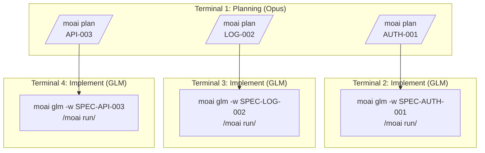
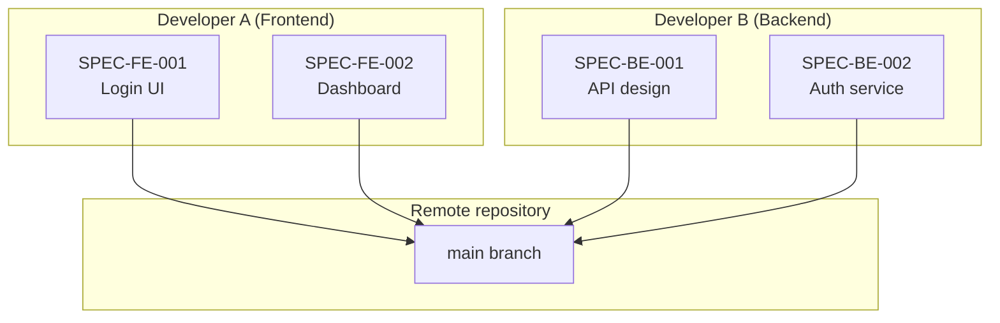
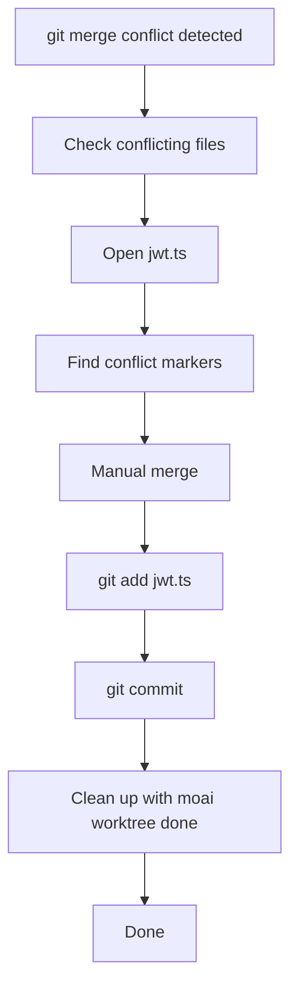
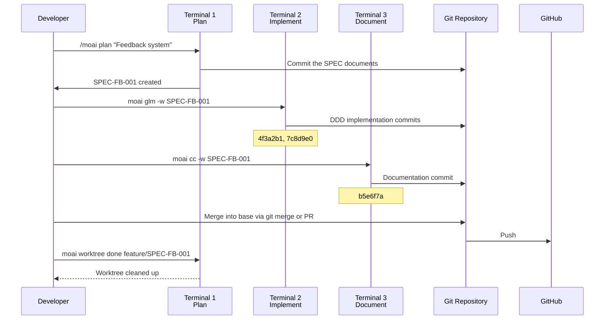

A concrete look at how Git Worktree is actually used in real projects — from
single-SPEC development through parallel development, team collaboration, and
troubleshooting. Each scenario also carries the cost judgment of which model to
use at which stage.

## Table of contents

1. [Single-SPEC Development](#single-spec-development)
2. [Parallel SPEC Development](#parallel-spec-development)
3. [Team Collaboration Scenario](#team-collaboration-scenario)
4. [Troubleshooting Cases](#troubleshooting-cases)

---

## Single-SPEC Development

### Scenario: implementing a user authentication system

#### Step 1: SPEC planning (Terminal 1)

Planning runs in the main checkout as it is.

```bash
# From the project root
$ cd /path/to/your-project

# Create the SPEC plan
> /moai plan "Implement a JWT-based user authentication system"

# Progress summary (example)
Analyzing SPEC...
  - Requirements organized in EARS format

Generating SPEC documents:
  ✓ .moai/specs/SPEC-AUTH-001/spec.md
  ✓ .moai/specs/SPEC-AUTH-001/plan.md
  ✓ .moai/specs/SPEC-AUTH-001/acceptance.md

Next steps:
  1. Run in a new terminal: moai glm -w SPEC-AUTH-001
  2. Start development: /moai run SPEC-AUTH-001
```

#### Step 2: entering the Worktree and implementing (Terminal 2)

Planning is done, so the implementation phase switches to a cheap model. The
worktree creation, the entry, and the backend switch all finish in a single
launcher line:

```bash
# New terminal: create the worktree if missing, then start a session inside it on the GLM backend
$ moai glm -w SPEC-AUTH-001

# Start the DDD implementation in the session you entered
> /moai run SPEC-AUTH-001

# Progress summary (example)
Phase 1: ANALYZE
  ✓ Requirements and existing code analyzed

Phase 2: PRESERVE
  ✓ Characterization tests created, existing behavior preservation confirmed

Phase 3: IMPROVE
  ✓ JWT authentication middleware implemented
  ✓ Refresh token rotation implemented
  ✓ Token invalidation on logout implemented

Implementation complete — committed to feature/SPEC-AUTH-001

Next steps:
  1. Run tests: your project language's test command (e.g. go test ./... / npm test / pytest)
  2. Documentation: /moai sync SPEC-AUTH-001
  3. After merging into base (git merge/PR), clean up: moai worktree done feature/SPEC-AUTH-001
```

#### Step 3: documentation (same Terminal 2)

```bash
# Run documentation
> /moai sync SPEC-AUTH-001

# Progress summary (example)
Syncing documentation...
  ✓ Codemaps and documents updated
  ✓ SPEC status transitioned and committed

Documentation complete — committed to feature/SPEC-AUTH-001
Next step: after merging into base (git merge/PR), moai worktree done feature/SPEC-AUTH-001
```

#### Step 4: base merge and cleanup (Terminal 1)

`moai worktree done` neither merges nor pushes. Finish the merge into the base
branch first with `git merge` or a PR, then all that is left is cleaning up the
Worktree.

```bash
# Back at the project root
$ cd /path/to/your-project

# Merge into the base branch (git or PR)
$ git checkout main
$ git merge feature/SPEC-AUTH-001
$ git push origin main

# Clean up the Worktree + delete the branch
$ moai worktree done feature/SPEC-AUTH-001 --delete-branch

# Output
✓ Done: worktree for branch feature/SPEC-AUTH-001
  Path: ~/.moai/worktrees/your-project/SPEC-AUTH-001
  Worktree removed.
  Branch feature/SPEC-AUTH-001 deleted.
```

---

## Parallel SPEC Development

### Scenario: developing 3 SPECs at once

Do all the planning in one terminal with a high-reasoning model (Opus), then
switch to GLM for implementation and spread it across three terminals:



#### Terminal 1: planning (all SPECs)

```bash
# SPEC 1: authentication
> /moai plan "JWT authentication system"
✓ SPEC-AUTH-001 created

# SPEC 2: logging
> /moai plan "Structured logging system"
✓ SPEC-LOG-002 created

# SPEC 3: API
> /moai plan "REST API v2"
✓ SPEC-API-003 created
```

#### Terminal 2: implementing AUTH-001

```bash
$ moai glm -w SPEC-AUTH-001
> /moai run SPEC-AUTH-001
# ... implementation in progress ...
```

#### Terminal 3: implementing LOG-002

```bash
$ moai glm -w SPEC-LOG-002
> /moai run SPEC-LOG-002
# ... implementation in progress ...
```

#### Terminal 4: implementing API-003

```bash
$ moai glm -w SPEC-API-003
> /moai run SPEC-API-003
# ... implementation in progress ...
```

If you are using tmux, there is no need to open four terminals — bring them all
up from one window with `--spawn`:

```bash
$ moai glm -w SPEC-AUTH-001 --spawn
$ moai glm -w SPEC-LOG-002 --spawn
$ moai glm -w SPEC-API-003 --spawn
```

#### Monitoring parallel progress

git shows the list of worktrees directly.

```bash
# Check the registered Worktrees from Terminal 1
$ git worktree list
/path/to/your-project                                      4f3a2b1 [main]
/path/to/your-project/.claude/worktrees/SPEC-AUTH-001      7c8d9e0 [feature/SPEC-AUTH-001]
/path/to/your-project/.claude/worktrees/SPEC-LOG-002       2a1b3c4 [feature/SPEC-LOG-002]
/path/to/your-project/.claude/worktrees/SPEC-API-003       9f8e7d6 [feature/SPEC-API-003]

# Check recent work in a specific Worktree
$ git -C .claude/worktrees/SPEC-AUTH-001 log --oneline -5
```

---

## Team Collaboration Scenario

### Scenario: 2 developers collaborating



#### Developer A: Frontend development

```bash
# On developer A's machine
git clone https://github.com/team/project.git
cd project

# Create the Frontend SPEC
> /moai plan "Login UI component"
✓ SPEC-FE-001 created

# Develop in the Worktree
$ moai glm -w SPEC-FE-001
> /moai run SPEC-FE-001

# After implementation, push the branch + create a PR (git/gh)
$ git push -u origin feature/SPEC-FE-001
$ gh pr create --fill

# After the PR merges, clean up the Worktree
$ moai worktree done feature/SPEC-FE-001 --delete-branch
```

#### Developer B: Backend development

```bash
# On developer B's machine
git clone https://github.com/team/project.git
cd project

# Create the Backend SPEC
> /moai plan "Authentication API service"
✓ SPEC-BE-001 created

# Develop in the Worktree
$ moai glm -w SPEC-BE-001
> /moai run SPEC-BE-001

# After implementation, push the branch + create a PR (git/gh)
$ git push -u origin feature/SPEC-BE-001
$ gh pr create --fill

# After the PR merges, clean up the Worktree
$ moai worktree done feature/SPEC-BE-001 --delete-branch
```

#### PR merge and integration

```bash
# On the team lead or CI system
gh pr list
# FE-001  Login UI Component          Ready
# BE-001  Authentication API Service  Ready

# Merge the PRs
gh pr merge FE-001 --merge
gh pr merge BE-001 --merge

# Everyone stays up to date
git pull origin main
```

---

## Troubleshooting Cases

### Case 1: resolving a merge conflict

Merges happen in `git merge` or a PR, so conflicts arise at that stage too. The
Worktree CLI does not participate in merging.

```bash
$ git checkout main
$ git merge feature/SPEC-AUTH-001

# Output
✗ Merge conflict!
Conflicting files:
  - src/auth/jwt.ts
  - tests/auth.test.ts
```

**Resolution process**:



```bash
# Resolve the conflict
code src/auth/jwt.ts

# Check the conflict markers
<<<<<<< HEAD
const secret = process.env.JWT_SECRET;
=======
const secret = config.jwt.secret;
>>>>>>> feature/SPEC-AUTH-001

# Merge manually
const secret = process.env.JWT_SECRET || config.jwt.secret;

# Stage then commit
git add src/auth/jwt.ts
git commit -m "fix: resolve merge conflict in JWT config"
git push origin main

# Once the merge is done, clean up the Worktree
moai worktree done feature/SPEC-AUTH-001 --delete-branch
✓ Done!
```

### Case 2: recovering a corrupted Worktree registry

This is the state where you moved or deleted a directory by hand and git can no
longer find the worktree.

```bash
# 1. Recover the registry — repair, then prune stale references and print the recognized list
$ moai worktree recover
Scanning for worktrees in /path/to/your-project...
Recovered 2 worktree(s):
  /path/to/your-project/.claude/worktrees/SPEC-AUTH-001  [feature/SPEC-AUTH-001]
  /path/to/your-project/.claude/worktrees/SPEC-LOG-002   [feature/SPEC-LOG-002]

# 2. Remove any broken entry that is still left by specifying its path
$ moai worktree remove ~/.moai/worktrees/your-project/SPEC-AUTH-001 --force

# 3. Recreate it and enter
$ moai glm -w SPEC-AUTH-001
```

### Case 3: cleaning up Worktrees that eat disk space

```bash
$ df -h
Filesystem      Size  Used Avail Use%
/dev/disk1     500G  480G   20G  96%

# 1. Clean up Worktrees merged into base
$ moai worktree clean --merged-only
  Removing merged worktree: .claude/worktrees/SPEC-LOG-002 [feature/SPEC-LOG-002]
Removed 1 merged worktree(s).

# 2. Check abandoned Worktrees that are not merged but have nothing left in them (preview)
$ moai worktree clean --stale
  Keeping .claude/worktrees/SPEC-API-003 [feature/SPEC-API-003]: uncommitted or untracked changes

Would remove 1 stale worktree(s):
  .claude/worktrees/SPEC-TMP-009 [feature/SPEC-TMP-009]

This was a preview. Re-run with --yes to remove them.

# 3. Once you have reviewed the list, actually remove them (branches stay as they are)
$ moai worktree clean --stale --yes
  Removing stale worktree: .claude/worktrees/SPEC-TMP-009 [feature/SPEC-TMP-009]
Removed 1 stale worktree(s). Branches were left intact.
```

---

## Real Project Workflow

### A complete development cycle example



---

## Success Story

### Case: adoption at a startup

```bash
# Situation: 3 features to develop at once
# Developers: 2

# 1) Plan all the SPECs (main checkout)
> /moai plan "User management"
> /moai plan "Payment system"
> /moai plan "Notification system"

# 2) Parallel implementation — three sessions from one tmux window
$ moai glm -w SPEC-USER-001 --spawn
$ moai glm -w SPEC-PAY-001 --spawn
$ moai glm -w SPEC-NOTIF-001 --spawn

# 3) Documentation — run /moai sync in each Worktree session

# 4) After merging into base (git merge/PR), clean up the Worktrees
$ moai worktree done feature/SPEC-USER-001 --delete-branch
$ moai worktree done feature/SPEC-PAY-001 --delete-branch
$ moai worktree done feature/SPEC-NOTIF-001 --delete-branch

# Results
# - All 3 features complete
# - Parallel development shortened the development flow
# - Cost savings from using GLM
```

Running the implementation sessions on GLM cut costs noticeably. The size of the savings, and the reasoning behind it, are laid out in [CG Mode](/en/multi-llm/cg-mode).

---

## Tips and Tricks

### Tip 1: leave tmux window management to --spawn

`--spawn` re-runs the same command in a new tmux window and prints the pane ID
to switch to. Focus stays in the current window.

```bash
$ moai glm -w SPEC-USER-001 --spawn
Spawned pane %7 running `moai glm -w SPEC-USER-001` in /path/to/your-project
Switch to it with: tmux select-window -t %7
```

Used outside tmux, `--spawn` changes nothing and exits with an error. In that
case drop the flag and run it in the current terminal.

### Tip 2: tracking progress

```bash
# List all Worktrees
git worktree list

# Skim the recent commits in each Worktree
for wt in .claude/worktrees/*/; do
    echo "=== $wt ==="
    git -C "$wt" log --oneline -5
    echo ""
done
```

### Tip 3: a cleanup routine script

```bash
#!/bin/bash
# clean-worktrees.sh — the cleanup routine you run periodically

# Remove merged Worktrees
moai worktree clean --merged-only

# Abandoned Worktrees are previewed first (nothing is deleted automatically)
moai worktree clean --stale

echo "Once you have reviewed the removal list, re-run with --yes."
```

## Related Documents

- [Git Worktree Overview](/en/worktree/)
- [Complete Guide](/en/worktree/guide)
- [FAQ](/en/worktree/faq)
