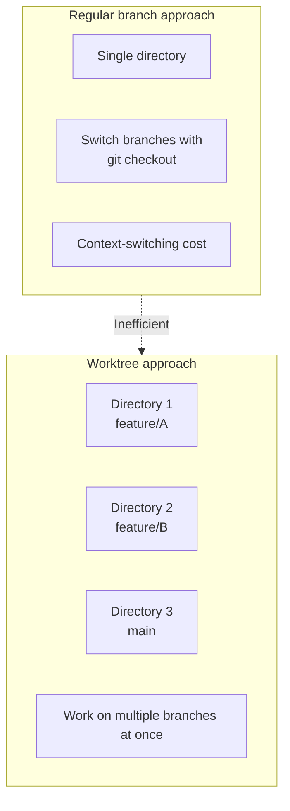
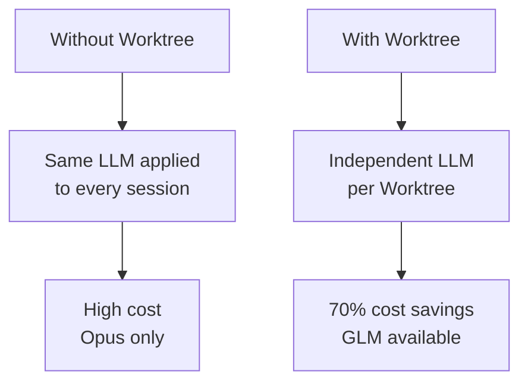
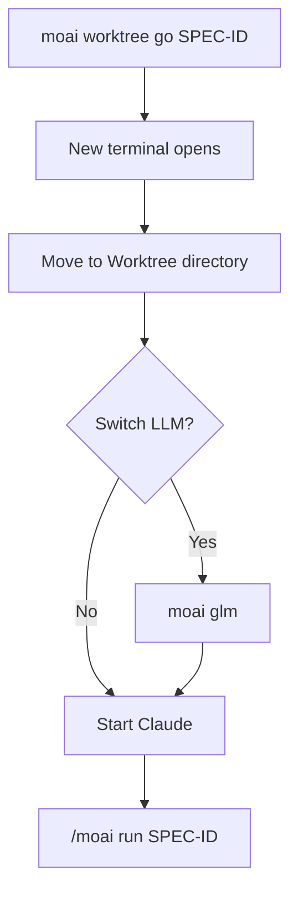
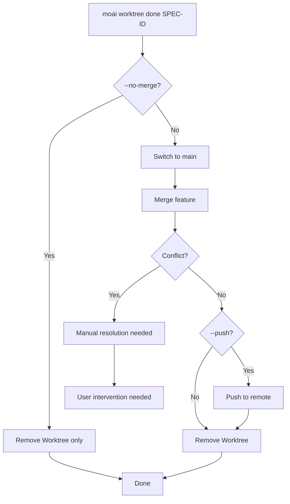
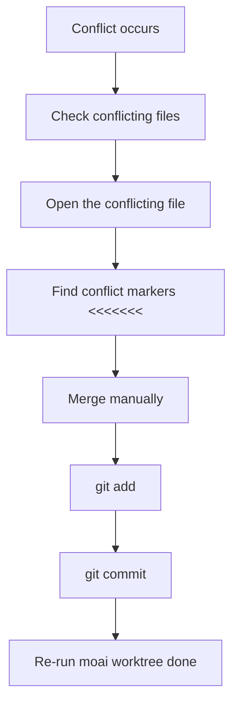
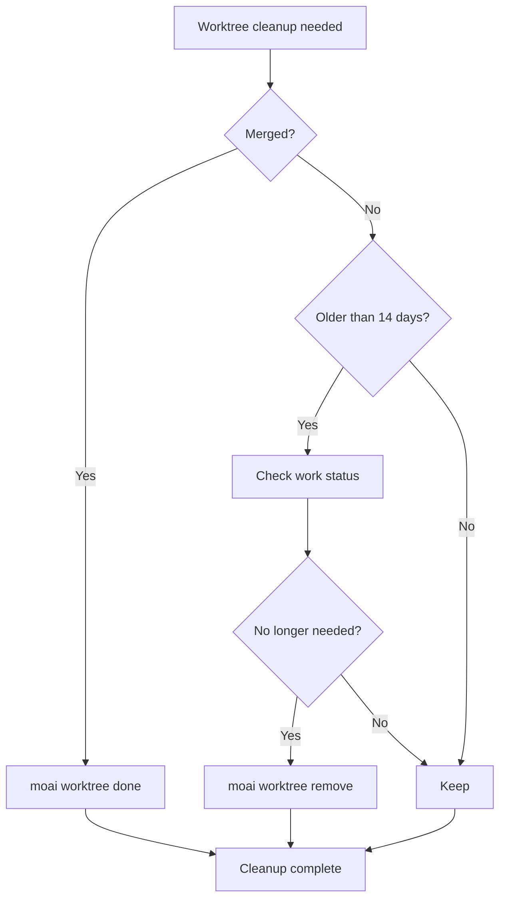
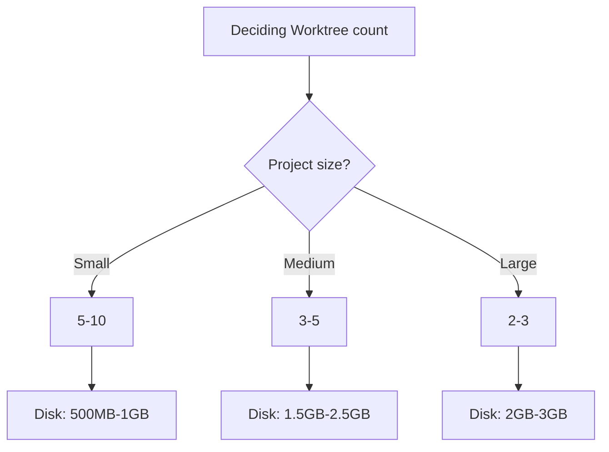
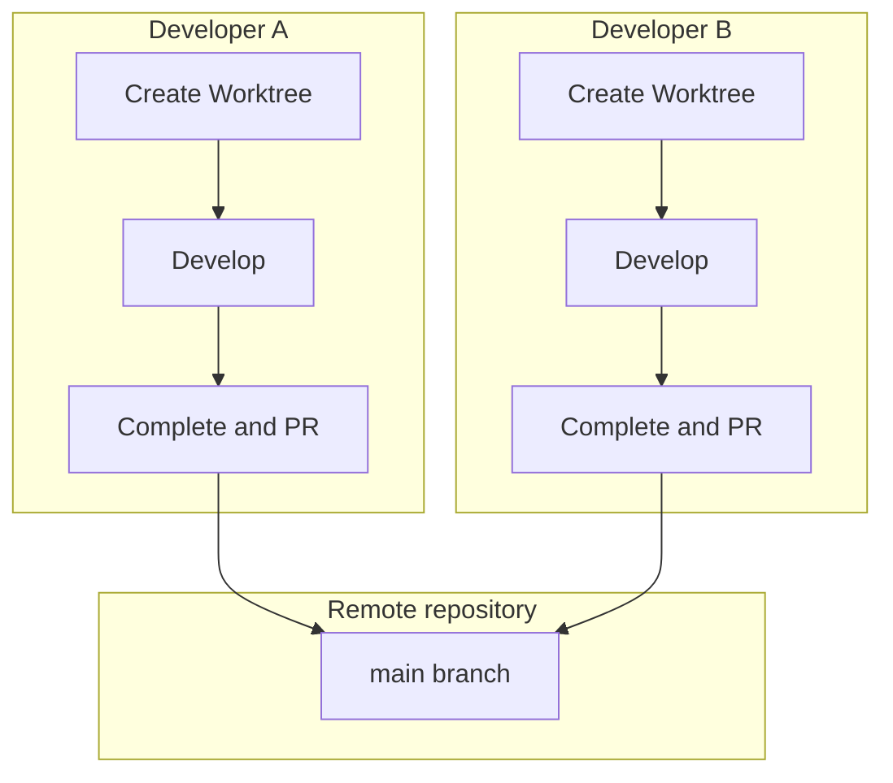

Questions and problems you run into while using Git Worktree, collected in one
place.

## Table of contents

1. [Basic Concepts](#basic-concepts)
2. [Usage](#usage)
3. [Troubleshooting](#troubleshooting)
4. [Performance and Optimization](#performance-and-optimization)
5. [Team Collaboration](#team-collaboration)

---

## Basic Concepts

### Q: How does Git Worktree differ from a regular branch?

**A**: Git Worktree lets you work in **physically separated directories**:



**Key differences**:

| Feature       | Regular branch      | Git Worktree    |
| ------------- | ------------------- | --------------- |
| Working directory | 1 shared        | N independent   |
| Branch switching  | `git checkout` required | Just change directories |
| Concurrent work   | Not possible    | Possible        |
| LLM configuration | Shared          | Independent     |
| Conflict risk     | High            | Low             |

---

### Q: Why should I use Worktree?

**A**: Two reasons are central — parallel development and Tokenomics:

1. **LLM configuration independence** — assign a different LLM per SPEC
   - Plan phase: Opus (high-quality reasoning)
   - Implement phase: GLM (low cost)
   - Document phase: Sonnet (medium)

2. **Parallel development** — run multiple SPECs at the same time
3. **Conflict prevention** — independent workspaces minimize conflicts
4. **Cost savings** — using GLM for implementation cuts costs by roughly 70%



---

### Q: Is Worktree mandatory in MoAI-ADK?

**A**: No, it is not mandatory but **strongly recommended**:

- **Single-SPEC development**: possible without Worktree
- **Multi-SPEC development**: Worktree is effectively required
- **Team collaboration**: Worktree prevents conflicts
- **Cost optimization**: Worktree separates LLMs

---

## Usage

### Q: How do I create a Worktree?

**A**: There are two ways:

**Method 1: automatic creation (recommended)**

```bash
# Auto-created during SPEC planning
> /moai plan "Feature description" --worktree

# Automatically:
# 1. Creates SPEC documents
# 2. Creates the Worktree
# 3. Creates the feature branch
```

**Method 2: manual creation**

```bash
# Create a Worktree manually
moai worktree new SPEC-AUTH-001

# Create from a specific branch
moai worktree new SPEC-AUTH-001 --from develop
```

---

### Q: How do I enter a Worktree?

**A**: Use the `moai worktree go` command:

```bash
# Enter the Worktree
moai worktree go SPEC-AUTH-001

# A new terminal opens and moves into the Worktree
# The prompt changes
(SPEC-AUTH-001) $
```

**Workflow after entering**:



---

### Q: Can I use multiple Worktrees at the same time?

**A**: Yes, without limit:

```bash
# Terminal 1
moai worktree go SPEC-AUTH-001
(SPEC-AUTH-001) $ moai glm

# Terminal 2
moai worktree go SPEC-LOG-002
(SPEC-LOG-002) $ moai glm

# Terminal 3
moai worktree go SPEC-API-003
(SPEC-API-003) $ moai glm

# All can work simultaneously
```

**Parallel work visualized**:


---

### Q: How do I complete a Worktree?

**A**: Use the `moai worktree done` command:

```bash
# Basic completion (merge + cleanup)
moai worktree done SPEC-AUTH-001

# Including a push to the remote
moai worktree done SPEC-AUTH-001 --push

# Remove only, without merging
moai worktree done SPEC-AUTH-001 --no-merge
```

**Completion process**:



---

## Troubleshooting

### Q: I got a Worktree merge conflict

**A**: Resolve it with these steps:



**Concrete example**:

```bash
moai worktree done SPEC-AUTH-001
✗ Merge conflict!

# 1. Check conflicting files
cd .moai/worktrees/SPEC-AUTH-001
git status
# Conflicting file: src/auth/jwt.ts

# 2. Resolve the conflict
code src/auth/jwt.ts

# 3. Check and fix the conflict markers
<<<<<<< HEAD
const secret = process.env.JWT_SECRET;
=======
const secret = config.jwt.secret;
>>>>>>> feature/SPEC-AUTH-001

# 4. Merge
const secret = process.env.JWT_SECRET || config.jwt.secret;

# 5. Commit
git add src/auth/jwt.ts
git commit -m "fix: resolve merge conflict"

# 6. Retry completion
cd /path/to/project
moai worktree done SPEC-AUTH-001
✓ Done!
```

---

### Q: My Worktree is corrupted

**A**: Recover it with these steps:

```bash
# 1. Diagnose
moai worktree status SPEC-AUTH-001
✗ The Worktree directory does not exist

# 2. Remove the existing Worktree
moai worktree remove SPEC-AUTH-001 --force

# 3. Recreate the Worktree
moai worktree new SPEC-AUTH-001

# 4. Verify recovery
moai worktree status SPEC-AUTH-001
✓ Worktree healthy
```

---

### Q: I'm running out of disk space

**A**: Clean up old Worktrees:

```bash
# 1. Check disk usage
$ du -sh .moai/worktrees/*
2.5G    .moai/worktrees/SPEC-AUTH-001
1.8G    .moai/worktrees/SPEC-LOG-002
3.2G    .moai/worktrees/SPEC-API-003

# 2. Clean up old Worktrees
$ moai worktree clean --older-than 14

# Worktrees to be cleaned:
#   - SPEC-OLD-001 (30 days old, 2.1GB)
#   - SPEC-OLD-002 (45 days old, 1.7GB)

Continue? [y/N] y

✓ 2 Worktrees cleaned up
✓ 3.8GB of disk space reclaimed
```

**Cleanup strategy**:



---

### Q: The LLM is not behaving as expected

**A**: Check the per-Worktree LLM configuration:

```bash
# Check the current LLM
moai config
Current LLM: GLM 5

# Change the LLM inside a Worktree
moai worktree go SPEC-AUTH-001
(SPEC-AUTH-001) $ moai cc
→ Switched to Claude Opus

# Other Worktrees are unaffected
(SPEC-AUTH-001) $ exit
moai worktree go SPEC-LOG-002
(SPEC-LOG-002) $ moai config
Current LLM: GLM 5 (unchanged)
```

---

### Q: Git commands are not working

**A**: Make sure you are in the right directory:

```bash
# Check the Worktree directory
pwd
/path/to/your-project/.moai/worktrees/SPEC-AUTH-001

# Check Git status
git status
On branch feature/SPEC-AUTH-001
nothing to commit, working tree clean

# If a Git error occurs
git fetch --all
git rebase origin/feature/SPEC-AUTH-001
```

---

## Performance and Optimization

### Q: Does Worktree affect performance?

**A**: The impact is minimal:

**Advantages**:

- Each Worktree is independent, so caches stay efficient
- Git operations are fast (local branches)
- Takes advantage of file-system caching

**Disadvantages**:

- Disk space usage (duplicated per Worktree)
- Initial Worktree creation takes time

**Optimization tips**:

```bash
# 1. Remove unneeded Worktrees
moai worktree clean --merged-only

# 2. Git garbage collection
git gc --aggressive --prune=now

# 3. Prune Worktrees
git worktree prune
```

---

### Q: How many Worktrees can I create?

**A**: In theory, unlimited — but in practice, these factors constrain the count:

**Limiting factors**:

1. **Disk space**: each Worktree uses roughly 100MB-1GB
2. **Memory**: open sessions in each Worktree
3. **File system**: number of files that can be open at once

**Recommendations**:

- **Small projects**: 5-10 Worktrees
- **Medium projects**: 3-5 Worktrees
- **Large projects**: 2-3 Worktrees



---

### Q: Can Worktrees be cleaned up automatically?

**A**: Yes, use a periodic cleanup script:

```bash
#!/bin/bash
# clean-worktrees.sh

# Clean up merged Worktrees
moai worktree clean --merged-only

# Clean up Worktrees older than 30 days
moai worktree clean --older-than 30

# Git garbage collection
cd /path/to/project
git gc --aggressive --prune=now

echo "Worktree cleanup complete"
```

**Cron job setup**:

```bash
# Run every Sunday at 2 AM
0 2 * * 0 /path/to/clean-worktrees.sh >> /var/log/worktree-cleanup.log 2>&1
```

---

## Team Collaboration

### Q: How do teams use Worktree?

**A**: We recommend the following workflow:



**Team collaboration guide**:

1. **Worktree naming convention**: `SPEC-{category}-{number}`
2. **Sync regularly**: `git pull origin main`
3. **Before PR review**: finish local testing
4. **Avoid conflicts**: sync with `main` frequently

---

### Q: How do I sync a Worktree with the remote repository?

**A**: Run `git pull` regularly:

```bash
# Sync inside each Worktree
moai worktree go SPEC-AUTH-001
(SPEC-AUTH-001) $ git pull origin main

# Or sync all Worktrees
for spec in $(moai worktree list --porcelain | awk '{print $1}'); do
    cd ~/.moai/worktrees/$spec
    echo "Syncing $spec..."
    git pull origin main
done
```

---

### Q: How do I manage a Worktree during PR review?

**A**: Use the following strategy:

```bash
# Before creating the PR
moai worktree status SPEC-AUTH-001
# Check the status

git log main..feature/SPEC-AUTH-001
# Review the changes

# During PR review
# Keep the Worktree (awaiting merge)

# After PR approval
moai worktree done SPEC-AUTH-001 --push
# Merge and clean up

# After PR rejection
cd .moai/worktrees/SPEC-AUTH-001
# Continue with fixes
```

---

## More Questions

### Q: Can I use MoAI-ADK without Worktree?

**A**: Yes, it is possible but not recommended:

```bash
# Use without Worktree
> /moai plan "Feature description"
# The Worktree creation step is skipped

# But the following problems occur:
# 1. The same LLM applies to every session
# 2. No parallel development
# 3. Context-switching cost
```

---

### Q: Do I need to back up Worktrees?

**A**: Worktrees are managed by Git, so no separate backup is needed:

```bash
# Worktrees are part of Git
# Pushing to the remote backs them up automatically

# Push to the remote regularly
git push origin feature/SPEC-AUTH-001

# Recover a lost Worktree
git fetch origin
git worktree add SPEC-AUTH-001 origin/feature/SPEC-AUTH-001
```

---

## Related documentation

- [Git Worktree Overview](/en/worktree/)
- [Complete Guide](/en/worktree/guide)
- [Real-World Examples](/en/worktree/examples)

## Need more help?

- [GitHub Issues](https://github.com/modu-ai/moai-adk/issues) — bug reports, feature requests
- [Discord Community](https://discord.gg/Z7E7Mdc5aN) — real-time chat, tips
