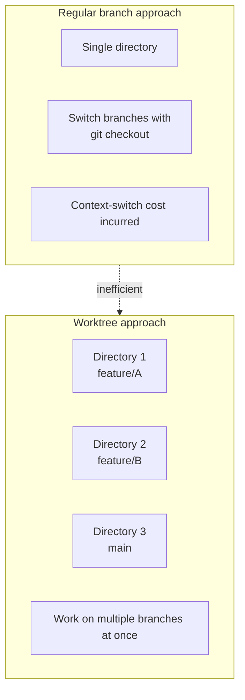
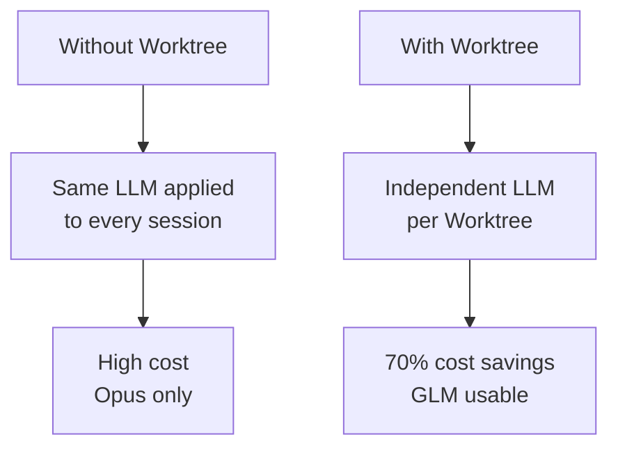
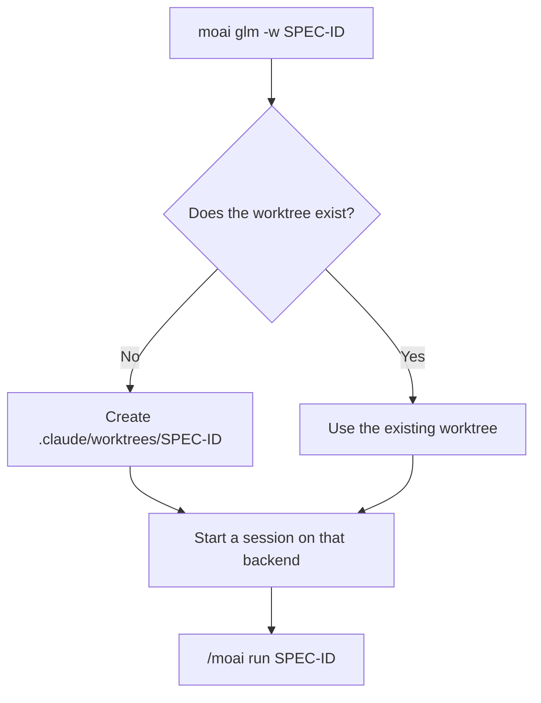
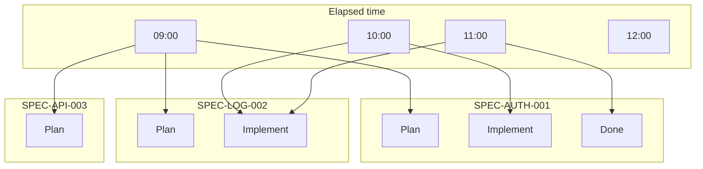
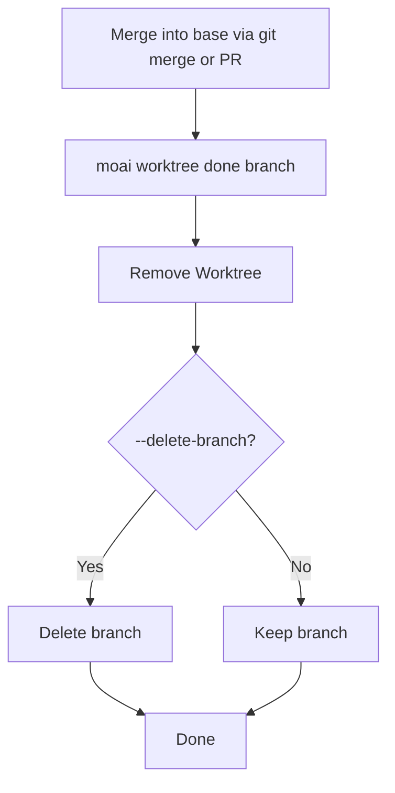
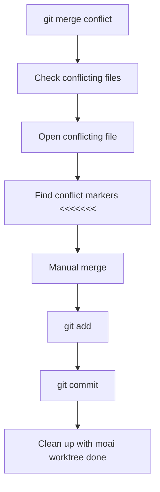
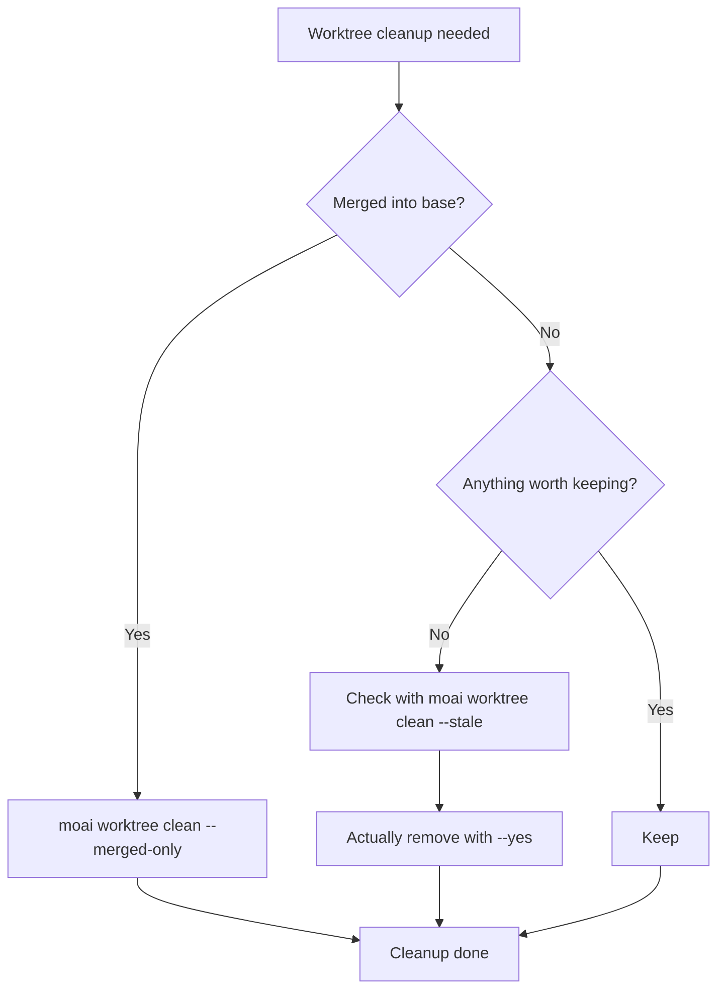
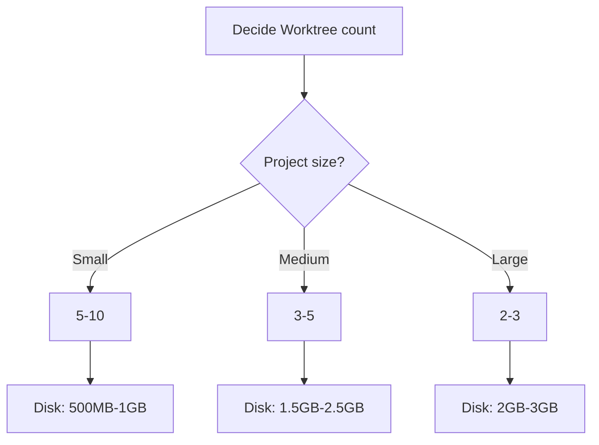
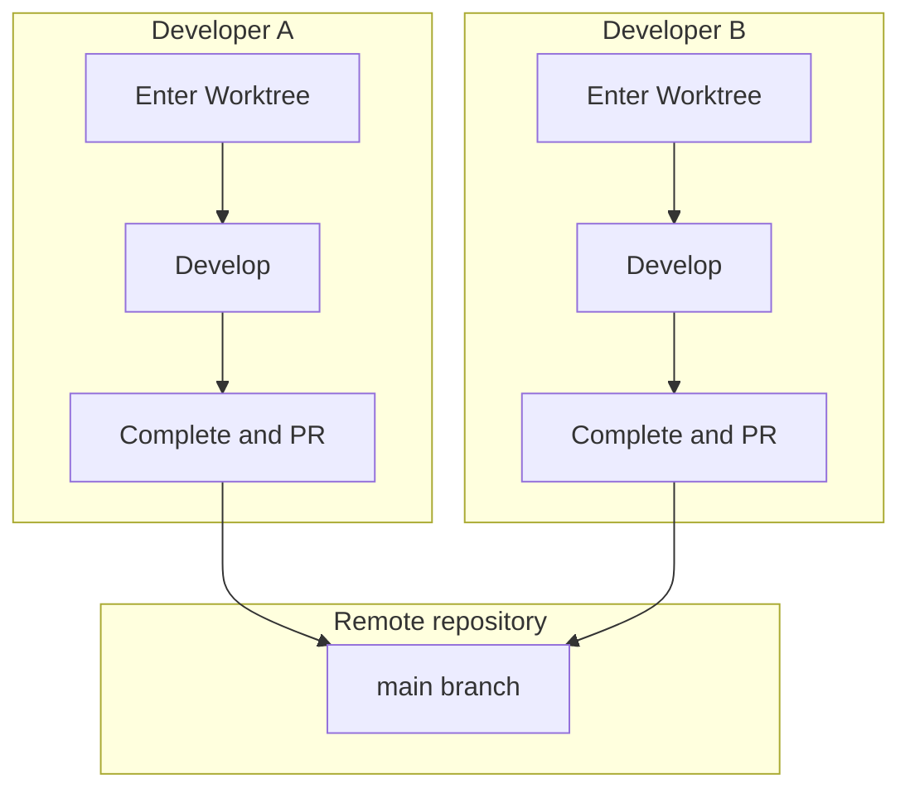

The questions and problems you run into while using Git Worktree, collected in
one place.

## Table of contents

1. [Basic Concepts](#basic-concepts)
2. [Usage](#usage)
3. [Troubleshooting](#troubleshooting)
4. [Performance and Optimization](#performance-and-optimization)
5. [Team Collaboration](#team-collaboration)

---

## Basic Concepts

### Q: What is the difference between Git Worktree and a regular branch?

**A**: Git Worktree lets you work in a **physically separate directory**:



**Key differences**:

| Feature       | Regular branch      | Git Worktree    |
| ------------- | ------------------- | --------------- |
| Working directory | 1 shared        | N independent   |
| Branch switch | `git checkout` required | Just move directories |
| Concurrent work | Impossible        | Possible        |
| LLM setting   | Shared              | Independent     |
| Conflict likelihood | High          | Low             |

---

### Q: Why should I use Worktree?

**A**: Two reasons are central — parallel development and tokenomics:

1. **LLM setting independence** — you can assign a different LLM per SPEC
   - Plan stage: Opus (high-quality reasoning)
   - Implement stage: GLM (low cost)
   - Document stage: Sonnet (middle)

2. **Parallel development** — you can run multiple SPECs at once
3. **Conflict prevention** — separate workspaces mean conflicts almost never happen
4. **Cost savings** — using GLM at the implementation stage cuts cost by about 70%



---

### Q: Is Worktree required in MoAI-ADK?

**A**: No, it is not required, but it is **strongly recommended**:

- **Single-SPEC development**: possible without Worktree
- **Multi-SPEC development**: Worktree is effectively required
- **Team collaboration**: Worktree prevents conflicts
- **Cost optimization**: Worktree separates LLMs

---

## Usage

### Q: How do I enter a Worktree?

**A**: Use the launcher's `-w` flag. If no worktree by that name exists it is
created on the spot, so creation and entry finish in a single line:

```bash
# Create the worktree and enter it with the GLM backend
moai glm -w SPEC-AUTH-001

# Enter the same worktree with the Claude backend
moai cc -w SPEC-AUTH-001

# Enter with the Claude leader + GLM teammate hybrid
moai cg -w SPEC-AUTH-001
```

A short name resolves under `.claude/worktrees/<name>/`. If a worktree you
already created lives somewhere else, pass an absolute path — it has to be
under `~/.moai/worktrees/` or `<project>/.claude/worktrees/`, and any other
path is rejected.

**Post-entry workflow**:



---

### Q: Can I open one more worktree while keeping the current session?

**A**: Add `--spawn`. The same command runs in a new tmux window, and the
current window keeps even its focus:

```bash
moai glm -w SPEC-AUTH-002 --spawn
# Spawned pane %7 running `moai glm -w SPEC-AUTH-002` in /path/to/your-project
# Switch to it with: tmux select-window -t %7
```

`--spawn` works only inside tmux. Used outside tmux it changes nothing and
exits with an error, so drop the flag and run it in the current terminal
instead. With `-w` alone, the current process is replaced by the worktree
session — that is the difference from `--spawn`.

---

### Q: How do I see the list of Worktrees I created?

**A**: Use git commands directly. `moai worktree` has no list command:

```bash
git worktree list
```

The status or recent commits of a specific worktree are checked with `git -C`
as well:

```bash
git -C .claude/worktrees/SPEC-AUTH-001 status
git -C .claude/worktrees/SPEC-AUTH-001 log --oneline -5
```

---

### Q: Can I use multiple Worktrees at once?

**A**: Yes, without limit:

```bash
# Terminal 1
moai glm -w SPEC-AUTH-001

# Terminal 2
moai glm -w SPEC-LOG-002

# Terminal 3
moai glm -w SPEC-API-003

# All can be worked on simultaneously
```

If you are using tmux, you can bring them all up from one window with
`--spawn`:

```bash
moai glm -w SPEC-AUTH-001 --spawn
moai glm -w SPEC-LOG-002 --spawn
moai glm -w SPEC-API-003 --spawn
```

**Parallel-work visualization**:



---

### Q: How do I complete a Worktree?

**A**: `moai worktree done` removes the Worktree and deletes the branch too if
you want. That said, **it neither merges nor pushes**. Finish the base merge
first with `git merge` or a PR. The argument is a branch name, not a path:

```bash
# Remove the Worktree only
moai worktree done feature/SPEC-AUTH-001

# Remove the Worktree + delete the branch
moai worktree done feature/SPEC-AUTH-001 --delete-branch

# Quiet mode for automation (cleanup after PR merge)
moai worktree done feature/SPEC-AUTH-001 --auto
```

**Completion process**:



---

### Q: What is the difference between `moai worktree done` and `moai worktree remove`?

**A**: What they take as an argument is what differs.

| | `done` | `remove` |
|---|---|---|
| Argument | Branch name (`feature/SPEC-AUTH-001`) | File-system path |
| What it does | Finds and removes that branch's worktree | Removes the worktree at that path |
| Branch deletion | Optional via `--delete-branch` | Never |
| Automation mode | `--auto` supported | None |

When you know the branch, use `done`; when you only know the path, or you are
clearing out a worktree whose branch is broken, use `remove`.

---

## Troubleshooting

### Q: Is `moai worktree clean --stale` safe?

**A**: It is designed to be. Three layers of protection are in place.

1. **Preview is the default.** With `--stale` alone it only prints the list of
   candidates for removal and deletes nothing. Deletion happens only when you
   add `--yes`
2. **It does not delete anything with something to lose.** Only worktrees whose
   working tree is clean (no uncommitted changes, no untracked files) and whose
   branch carries no commits of its own beyond base become candidates. If either
   fails, the worktree is kept and the reason is printed alongside
3. **Branches are never deleted.** Even when the worktree directory disappears,
   the commits remain reachable by branch name and can be pulled back at any time

The main checkout and the worktree the command is currently running in are also
always left out of the removal set.

```bash
# 1) Check what would be deleted first
$ moai worktree clean --stale
  Keeping .claude/worktrees/SPEC-API-003 [feature/SPEC-API-003]: uncommitted or untracked changes

Would remove 1 stale worktree(s):
  .claude/worktrees/SPEC-TMP-009 [feature/SPEC-TMP-009]

This was a preview. Re-run with --yes to remove them.

# 2) Once confirmed, actually remove
$ moai worktree clean --stale --yes
```

`--stale` and `--merged-only` cannot be combined. To clean up by merge status
use `--merged-only`; to clean up by abandonment use `--stale`.

---

### Q: I got a Worktree conflict

**A**: Merge conflicts arise at the `git merge` or PR stage. The Worktree CLI
does not participate in merging, so work through it in this order:



**Concrete example**:

```bash
git checkout main
git merge feature/SPEC-AUTH-001
✗ Merge conflict!

# 1. Check conflicting files
git status
# Conflicting file: src/auth/jwt.ts

# 2. Resolve the conflict
code src/auth/jwt.ts

# 3. Check and fix the conflict markers
<<<<<<< HEAD
const secret = process.env.JWT_SECRET;
=======
const secret = config.jwt.secret;
>>>>>>> feature/SPEC-AUTH-001

# 4. Merge
const secret = process.env.JWT_SECRET || config.jwt.secret;

# 5. Commit
git add src/auth/jwt.ts
git commit -m "fix: resolve merge conflict"
git push origin main

# 6. Clean up the Worktree after merging
moai worktree done feature/SPEC-AUTH-001 --delete-branch
✓ Done!
```

---

### Q: My Worktree registry got corrupted

**A**: If you move or delete a directory by hand, git can no longer find the
worktree. Recover it in this order:

```bash
# 1. Recover the registry (git worktree repair + prune + print the list)
$ moai worktree recover
Scanning for worktrees in /path/to/your-project...
Recovered 2 worktree(s):
  /path/to/your-project/.claude/worktrees/SPEC-AUTH-001  [feature/SPEC-AUTH-001]
  /path/to/your-project/.claude/worktrees/SPEC-LOG-002   [feature/SPEC-LOG-002]

# 2. Check the current state
$ git worktree list

# 3. Remove any broken entry that is still left by specifying its path
$ moai worktree remove ~/.moai/worktrees/your-project/SPEC-AUTH-001 --force

# 4. Recreate it and enter
$ moai glm -w SPEC-AUTH-001
```

---

### Q: I'm running out of disk space

**A**: Start with the Worktrees whose merge is done:

```bash
# 1. Check disk usage
$ du -sh .claude/worktrees/*
2.5G    .claude/worktrees/SPEC-AUTH-001
1.8G    .claude/worktrees/SPEC-LOG-002
3.2G    .claude/worktrees/SPEC-API-003

# 2. Clean up Worktrees merged into base
$ moai worktree clean --merged-only

# 3. Check and clean up Worktrees that are not merged but have nothing left in them
$ moai worktree clean --stale
$ moai worktree clean --stale --yes
```

**Cleanup strategy**:



---

### Q: The LLM is not behaving as expected

**A**: Check how the LLM setting is configured in each Worktree:

```bash
# Check the current LLM backend (per-Worktree settings are recorded in .moai/config/sections/llm.yaml)
cat .moai/config/sections/llm.yaml

# To change the backend, re-enter that worktree
moai cc -w SPEC-AUTH-001   # switch to the Claude backend

# Other Worktrees are unaffected
git -C .claude/worktrees/SPEC-LOG-002 show HEAD:.moai/config/sections/llm.yaml
```

---

### Q: Git commands are not working

**A**: Check that you are in the right directory:

```bash
# Check the current worktree root
git rev-parse --show-toplevel

# Check Git status
git status
# On branch feature/SPEC-AUTH-001
# nothing to commit, working tree clean

# If a Git error occurs
git fetch --all
git rebase origin/feature/SPEC-AUTH-001
```

---

## Performance and Optimization

### Q: Does Worktree affect performance?

**A**: The effect is small:

**Advantages**:

- Worktrees are independent of each other, so caching works well
- Git operations are fast (local branches)
- Uses the file-system cache

**Disadvantages**:

- Consumes disk space (duplicated per Worktree)
- Creating a Worktree for the first time takes a moment

**Optimization tips**:

```bash
# 1. Remove unneeded Worktrees
moai worktree clean --merged-only

# 2. Git garbage collection
git gc --aggressive --prune=now

# 3. Prune stale references
moai worktree clean
```

---

### Q: How many Worktrees can I create?

**A**: In theory there is no limit, but in practice these factors govern the
count:

**Limiting factors**:

1. **Disk space**: each Worktree uses about 100MB-1GB
2. **Memory**: sessions opened in each Worktree
3. **File system**: number of files that can be open at once

**Recommendations**:

- **Small project**: 5-10 Worktrees
- **Medium project**: 3-5 Worktrees
- **Large project**: 2-3 Worktrees



---

### Q: Can Worktrees be cleaned up automatically?

**A**: Cleaning up merged Worktrees is safe to automate. For `--stale --yes`,
though, having a person look at the list and run it beats an unattended run:

```bash
#!/bin/bash
# clean-worktrees.sh

cd /path/to/project

# Clean up Worktrees merged into base (safe)
moai worktree clean --merged-only

# Abandoned Worktrees are only reported as a list (nothing is deleted)
moai worktree clean --stale

# Git garbage collection
git gc --aggressive --prune=now

echo "Worktree cleanup done — review the --stale list and handle it yourself with --yes"
```

**Cron job setup**:

```bash
# Run every Sunday at 2 AM
0 2 * * 0 /path/to/clean-worktrees.sh >> /var/log/worktree-cleanup.log 2>&1
```

---

## Team Collaboration

### Q: How does a team use Worktree?

**A**: The following workflow is recommended:



**Team collaboration guide**:

1. **Worktree naming convention**: `SPEC-{category}-{number}`
2. **Regular syncing**: `moai worktree sync`
3. **Before PR review**: complete testing locally
4. **Conflict prevention**: sync with `main` often

---

### Q: How do I sync a Worktree with the base branch?

**A**: `moai worktree sync` pulls the base branch's changes into the Worktree.
`--strategy` picks between merge (default) and rebase:

```bash
# Sync the current directory's Worktree with base (main) — merge strategy
moai worktree sync

# Sync a specific Worktree with the rebase strategy
moai worktree sync feature/SPEC-AUTH-001 --strategy rebase

# Sync against a different base branch
moai worktree sync feature/SPEC-AUTH-001 --base develop
```

---

### Q: How do I manage a Worktree during PR review?

**A**: Use the following strategy:

```bash
# Before creating the PR — check the state and the changes
git worktree list
git log main..feature/SPEC-AUTH-001

# During PR review — keep the Worktree (awaiting merge)

# After PR approval and merge, clean up the Worktree
moai worktree done feature/SPEC-AUTH-001 --delete-branch

# If changes were requested, re-enter and continue working
moai glm -w SPEC-AUTH-001
```

---

## Additional Questions

### Q: Can I use MoAI-ADK without Worktree?

**A**: You can. A worktree is not the default but an option you choose, and
running without `-w` works in the main checkout as it is:

```bash
# Run without a worktree
moai cc
> /moai plan "feature description"
> /moai run SPEC-XXX-001

# But you have to live with the following:
# 1. The same LLM setting applies to every session
# 2. Branch-switching cost during parallel development
```

If you work through SPECs one at a time, that is enough. Once you start running
several SPECs at once, worktrees are clearly the easier path.

---

### Q: Should I back up my Worktree?

**A**: A Worktree is managed by Git, so no separate backup is needed:

```bash
# The Worktree is part of Git
# Pushing to the remote repository backs it up automatically

# Push to the remote regularly
git push origin feature/SPEC-AUTH-001

# Recover on Worktree loss
git fetch origin
git worktree add .claude/worktrees/SPEC-AUTH-001 origin/feature/SPEC-AUTH-001
```

Untracked files are not managed by git, so they do not come back this way. Keep
local files such as `.env` somewhere separate.

---

## Related Documents

- [Git Worktree Overview](/en/worktree/)
- [Complete Guide](/en/worktree/guide)
- [Practical Examples](/en/worktree/examples)

## Need more help?

- [GitHub Issues](https://github.com/modu-ai/moai-adk/issues) — bug reports, feature requests
- [Discord community](https://discord.gg/Z7E7Mdc5aN) — real-time chat, tip sharing
