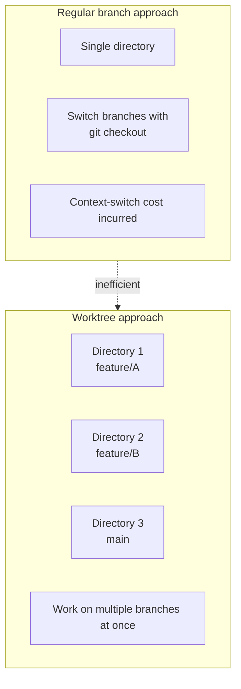
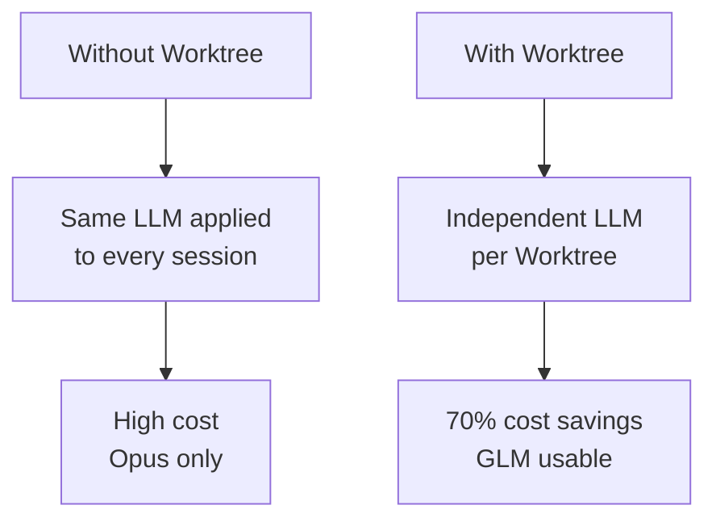
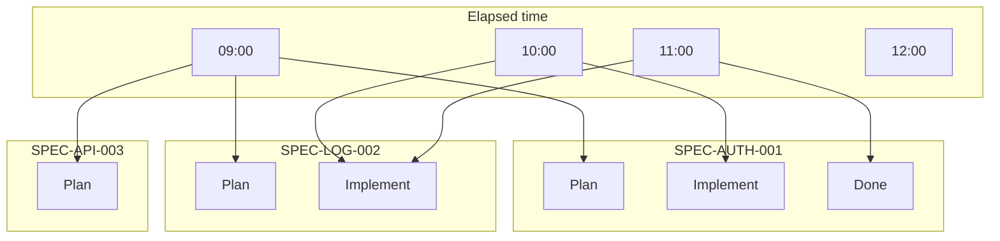
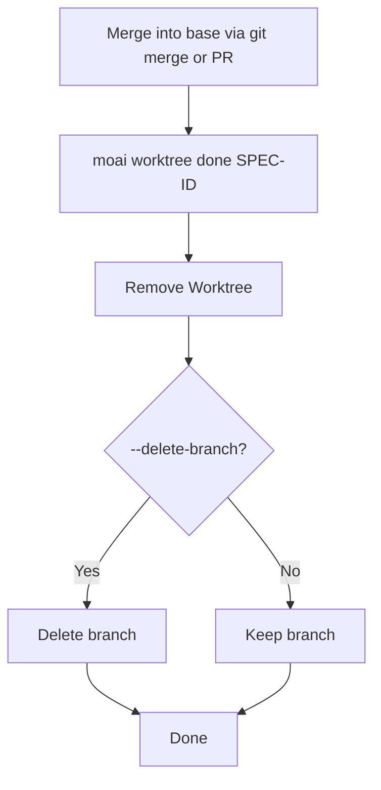
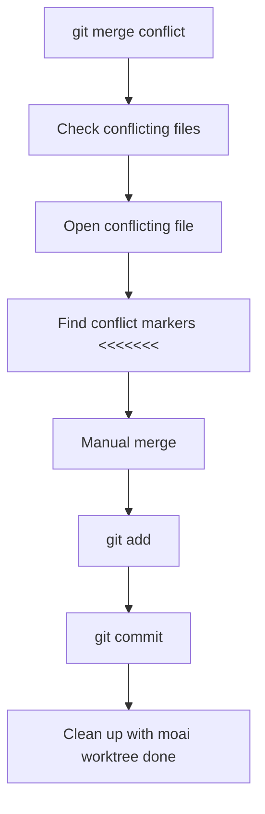
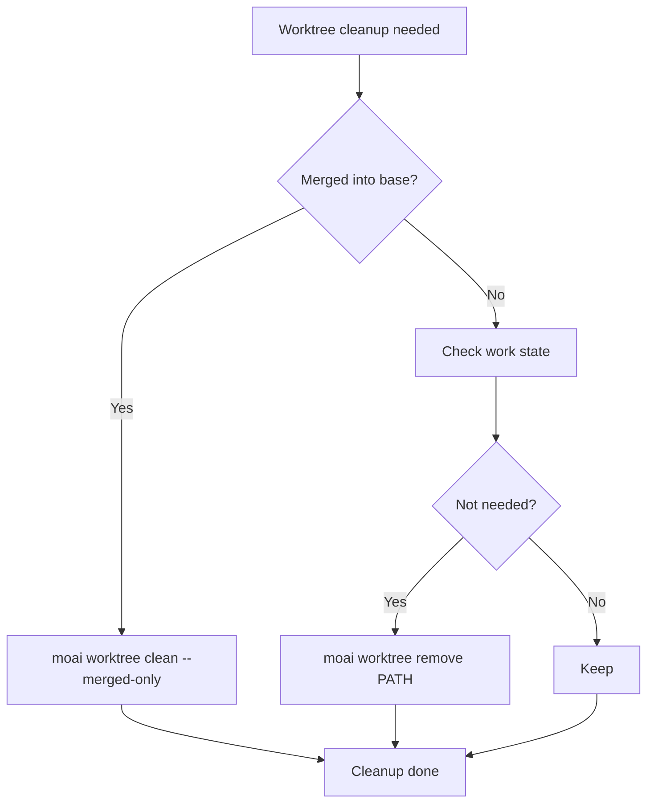
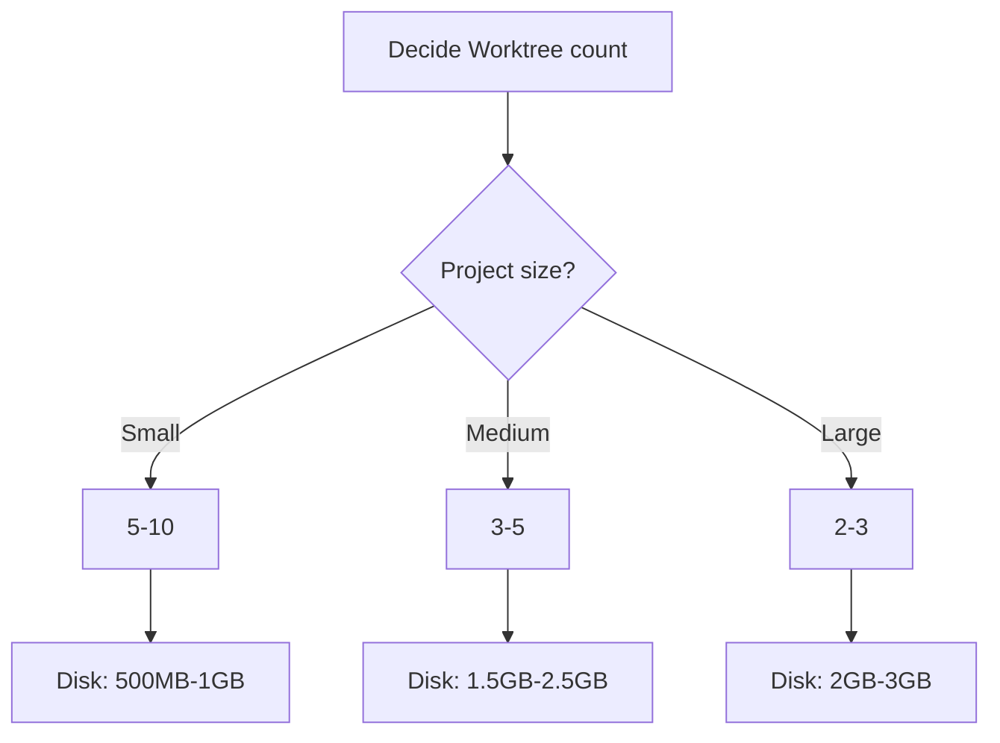
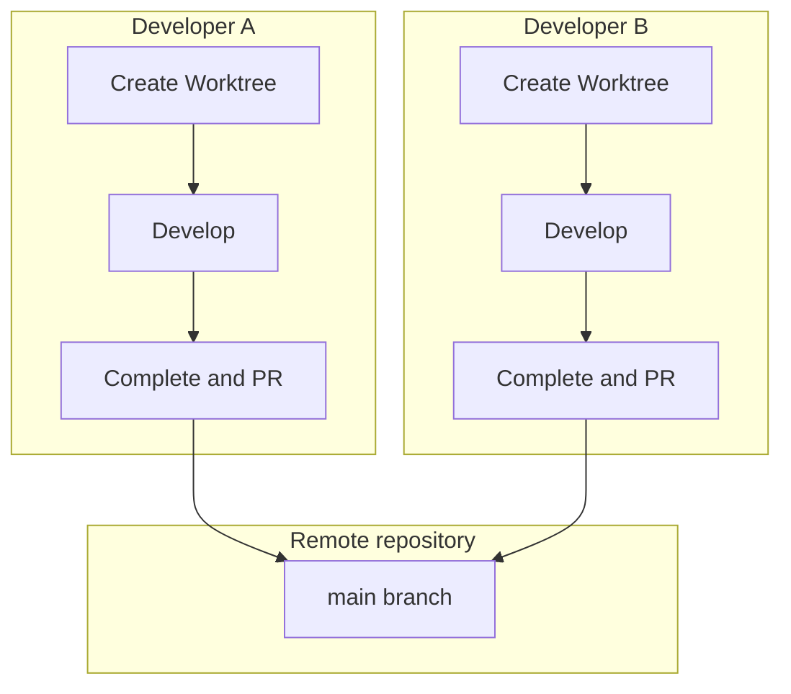

Questions and problems you run into while using Git Worktree, collected in one place.

## Table of contents

1. [Basic Concepts](#basic-concepts)
2. [Usage](#usage)
3. [Troubleshooting](#troubleshooting)
4. [Performance and Optimization](#performance-and-optimization)
5. [Team Collaboration](#team-collaboration)

---

## Basic Concepts

### Q: What is the difference between Git Worktree and a regular branch?

**A**: Git Worktree lets you work in a **physically separate directory**:



**Key differences**:

| Feature       | Regular branch      | Git Worktree    |
| ------------- | ------------------- | --------------- |
| Working directory | 1 shared        | N independent   |
| Branch switch | `git checkout` required | Just move directories |
| Concurrent work | Impossible        | Possible        |
| LLM setting   | Shared              | Independent     |
| Conflict likelihood | High          | Low             |

---

### Q: Why should I use Worktree?

**A**: Two reasons are central — parallel development and tokenomics:

1. **LLM setting independence** — you can assign a different LLM per SPEC
   - Plan stage: Opus (high-quality reasoning)
   - Implement stage: GLM (low cost)
   - Document stage: Sonnet (middle)

2. **Parallel development** — you can run multiple SPECs at once
3. **Conflict prevention** — independent workspaces minimize conflicts
4. **Cost savings** — using GLM at the implementation stage cuts cost by about 70%



---

### Q: Is Worktree required in MoAI-ADK?

**A**: No, it is not required, but it is **strongly recommended**:

- **Single-SPEC development**: possible without Worktree
- **Multi-SPEC development**: Worktree is effectively required
- **Team collaboration**: Worktree prevents conflicts
- **Cost optimization**: Worktree separates LLMs

---

## Usage

### Q: How do I create a Worktree?

**A**: There are two ways:

**Method 1: automatic creation (recommended)**

```bash
# Auto-create at the SPEC planning stage
> /moai plan "feature description" --worktree

# Automatically:
# 1. Creates the SPEC document
# 2. Creates the Worktree
# 3. Creates the feature branch
```

**Method 2: manual creation**

```bash
# Create a Worktree manually (default: based on origin/main)
moai worktree new SPEC-AUTH-001

# Create based on local main
moai worktree new SPEC-AUTH-001 --base main
```

---

### Q: How do I enter a Worktree?

**A**: `moai worktree go` prints the Worktree path. Combine it with the shell's `cd` to move (it does not start a shell session directly):

```bash
# Print the path, then move
cd "$(moai worktree go SPEC-AUTH-001)"
```

**Post-entry workflow**:

```mermaid
flowchart TD
    A[moai worktree go SPEC-ID] --> B[Print path to stdout]
    B --> C["Move with cd \"$(...)\""]
    C --> D{Change LLM?}
    D -->|Yes| E[moai glm]
    D -->|No| F[Start Claude]
    E --> F
    F --> G["/moai run SPEC-ID"]
```

---

### Q: Can I use multiple Worktrees at once?

**A**: Yes, without limit:

```bash
# Terminal 1
moai worktree go SPEC-AUTH-001
(SPEC-AUTH-001) $ moai glm

# Terminal 2
moai worktree go SPEC-LOG-002
(SPEC-LOG-002) $ moai glm

# Terminal 3
moai worktree go SPEC-API-003
(SPEC-API-003) $ moai glm

# All can be worked on simultaneously
```

**Parallel-work visualization**:



---

### Q: How do I complete a Worktree?

**A**: `moai worktree done` removes the Worktree and optionally deletes the branch. **It does not merge or push** — handle the base merge first with `git merge` or a PR:

```bash
# Remove the Worktree only
moai worktree done SPEC-AUTH-001

# Remove the Worktree + delete the branch
moai worktree done SPEC-AUTH-001 --delete-branch

# Quiet mode for automation (cleanup after PR merge)
moai worktree done SPEC-AUTH-001 --auto
```

**Completion process**:



---

## Troubleshooting

### Q: I got a Worktree conflict

**A**: Resolve it with the following steps:

Merge conflicts occur at the `git merge` or PR stage. The Worktree CLI does not participate in merging.



**Concrete example**:

```bash
git checkout main
git merge feature/SPEC-AUTH-001
✗ Merge conflict!

# 1. Check conflicting files
git status
# Conflicting file: src/auth/jwt.ts

# 2. Resolve the conflict
code src/auth/jwt.ts

# 3. Check and fix the conflict markers
<<<<<<< HEAD
const secret = process.env.JWT_SECRET;
=======
const secret = config.jwt.secret;
>>>>>>> feature/SPEC-AUTH-001

# 4. Merge
const secret = process.env.JWT_SECRET || config.jwt.secret;

# 5. Commit
git add src/auth/jwt.ts
git commit -m "fix: resolve merge conflict"
git push origin main

# 6. Clean up the Worktree after merging
moai worktree done SPEC-AUTH-001 --delete-branch
✓ Done!
```

---

### Q: My Worktree got corrupted

**A**: Recover it with the following steps:

```bash
# 1. Diagnose
moai worktree status
✗ The Worktree directory does not exist

# 2. Remove the existing Worktree
moai worktree remove .moai/worktrees/SPEC-AUTH-001 --force

# 3. Re-create the Worktree
moai worktree new SPEC-AUTH-001

# 4. Confirm recovery
moai worktree status
✓ Worktree healthy
```

---

### Q: I'm running out of disk space

**A**: Clean up Worktrees whose merge is done:

```bash
# 1. Check disk usage
$ du -sh .moai/worktrees/*
2.5G    .moai/worktrees/SPEC-AUTH-001
1.8G    .moai/worktrees/SPEC-LOG-002
3.2G    .moai/worktrees/SPEC-API-003

# 2. Clean up only Worktrees merged into base
$ moai worktree clean --merged-only

✓ Merged Worktrees cleaned up
✓ Disk space reclaimed
```

**Cleanup strategy**:



---

### Q: The LLM is not behaving as expected

**A**: Check the per-Worktree LLM setting:

```bash
# Check the current LLM
moai config
Current LLM: GLM 5

# Change the LLM in the Worktree
moai worktree go SPEC-AUTH-001
(SPEC-AUTH-001) $ moai cc
→ Changed to Claude Opus

# Other Worktrees are unaffected
(SPEC-AUTH-001) $ exit
moai worktree go SPEC-LOG-002
(SPEC-LOG-002) $ moai config
Current LLM: GLM 5 (unchanged)
```

---

### Q: Git commands are not working

**A**: Check that you are in the right directory:

```bash
# Check the Worktree directory
pwd
/path/to/your-project/.moai/worktrees/SPEC-AUTH-001

# Check Git status
git status
On branch feature/SPEC-AUTH-001
nothing to commit, working tree clean

# If a Git error occurs
git fetch --all
git rebase origin/feature/SPEC-AUTH-001
```

---

## Performance and Optimization

### Q: Does Worktree affect performance?

**A**: Only a negligible effect:

**Advantages**:

- Each Worktree is independent, so caching is efficient
- Git operations are fast (local branches)
- Uses the file-system cache

**Disadvantages**:

- Uses disk space (duplicated per Worktree)
- Takes time to create a Worktree initially

**Optimization tips**:

```bash
# 1. Remove unneeded Worktrees
moai worktree clean --merged-only

# 2. Git garbage collection
git gc --aggressive --prune=now

# 3. Worktree compaction
git worktree prune
```

---

### Q: How many Worktrees can I create?

**A**: In theory unlimited, but in practice these factors limit the count:

**Limiting factors**:

1. **Disk space**: each Worktree uses about 100MB-1GB
2. **Memory**: sessions opened in each Worktree
3. **File system**: number of files that can be open at once

**Recommendations**:

- **Small project**: 5-10 Worktrees
- **Medium project**: 3-5 Worktrees
- **Large project**: 2-3 Worktrees



---

### Q: Can Worktrees be cleaned up automatically?

**A**: Yes, you can use a periodic cleanup script:

```bash
#!/bin/bash
# clean-worktrees.sh

# Clean up Worktrees merged into base
moai worktree clean --merged-only

# Git garbage collection
cd /path/to/project
git gc --aggressive --prune=now

echo "Worktree cleanup done"
```

**Cron job setup**:

```bash
# Run every Sunday at 2 AM
0 2 * * 0 /path/to/clean-worktrees.sh >> /var/log/worktree-cleanup.log 2>&1
```

---

## Team Collaboration

### Q: How does a team use Worktree?

**A**: The following workflow is recommended:



**Team collaboration guide**:

1. **Worktree naming convention**: `SPEC-{category}-{number}`
2. **Regular syncing**: `git pull origin main`
3. **Before PR review**: complete testing locally
4. **Conflict prevention**: sync with `main` often

---

### Q: How do I sync a Worktree with the remote repository?

**A**: Run `git pull` regularly:

```bash
# Sync in each Worktree
moai worktree go SPEC-AUTH-001
(SPEC-AUTH-001) $ git pull origin main

# Or sync all Worktrees
for spec in SPEC-AUTH-001 SPEC-LOG-002 SPEC-API-003; do
    cd "$(moai worktree go $spec)"
    echo "Syncing $spec..."
    git pull origin main
done
```

---

### Q: How do I manage a Worktree during PR review?

**A**: Use the following strategy:

```bash
# Before creating the PR
moai worktree status
# Check the state

git log main..feature/SPEC-AUTH-001
# Check the changes

# During PR review
# Keep the Worktree (awaiting merge)

# After PR approval and merge, clean up the Worktree
moai worktree done SPEC-AUTH-001 --delete-branch

# After PR rejection
cd "$(moai worktree go SPEC-AUTH-001)"
# Continue the fixes
```

---

## Additional Questions

### Q: Can I use MoAI-ADK without Worktree?

**A**: Yes, but it is not recommended:

```bash
# Use without Worktree
> /moai plan "feature description"
# Skips the Worktree-creation step

# But the following problems arise:
# 1. Same LLM applied to every session
# 2. No parallel development
# 3. Context-switch cost
```

---

### Q: Should I back up my Worktree?

**A**: A Worktree is managed by Git, so no separate backup is needed:

```bash
# The Worktree is part of Git
# Pushing to the remote repository backs it up automatically

# Push to the remote regularly
git push origin feature/SPEC-AUTH-001

# Recover on Worktree loss
git fetch origin
git worktree add SPEC-AUTH-001 origin/feature/SPEC-AUTH-001
```

---

## Related Documents

- [Git Worktree Overview](/en/worktree/)
- [Complete Guide](/en/worktree/guide)
- [Practical Examples](/en/worktree/examples)

## Need more help?

- [GitHub Issues](https://github.com/modu-ai/moai-adk/issues) — bug reports, feature requests
- [Discord community](https://discord.gg/Z7E7Mdc5aN) — real-time chat, tip sharing
