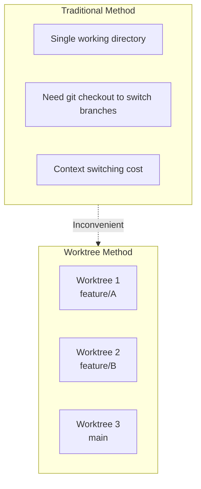
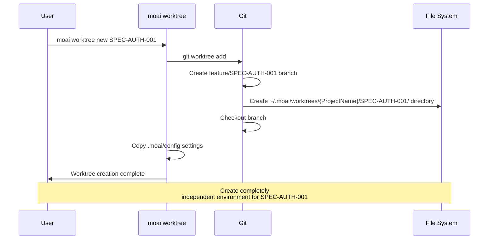
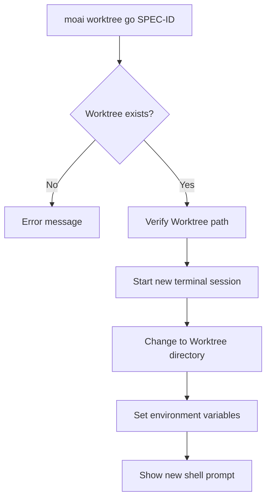
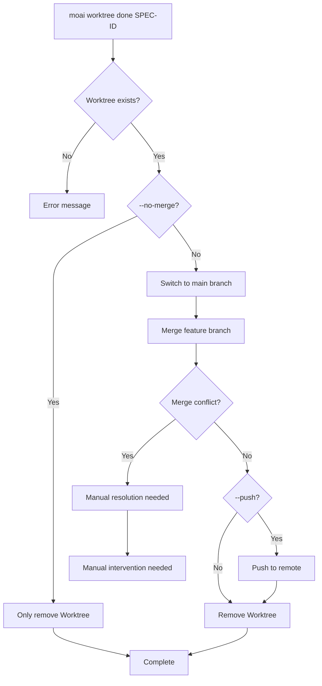
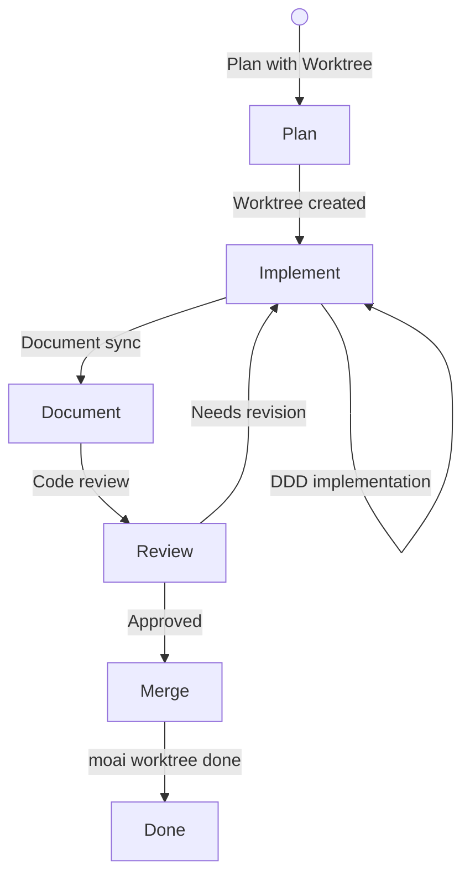
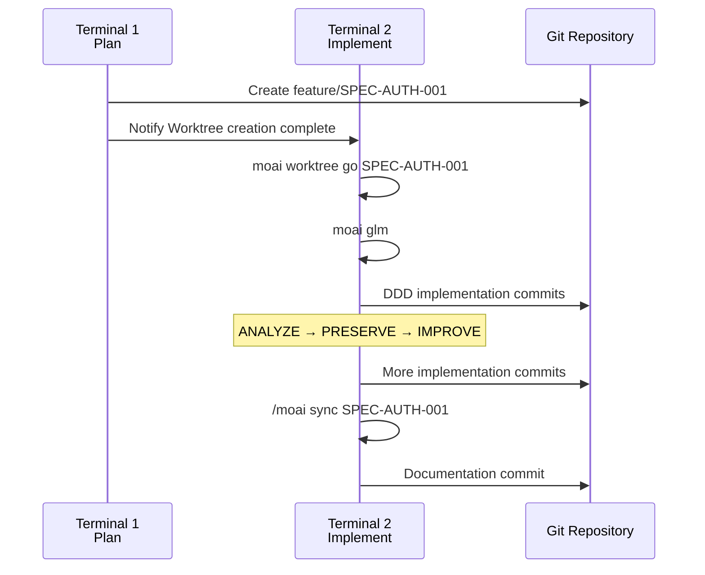
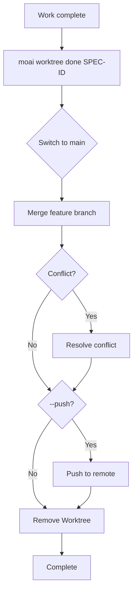
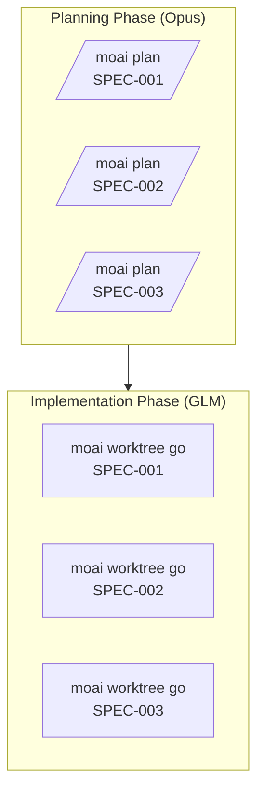
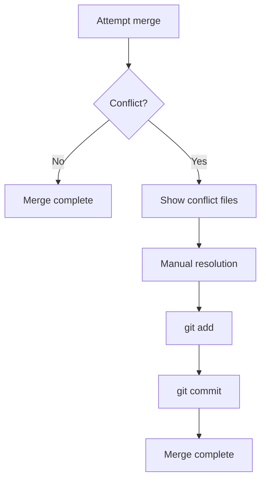
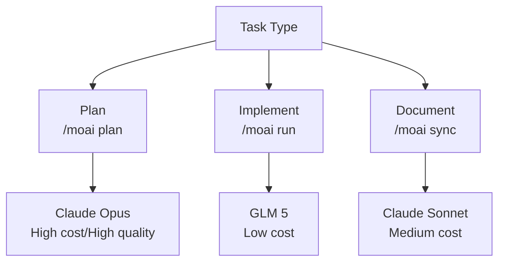

# Git Worktree Complete Guide

This guide provides detailed explanations of all aspects of MoAI-ADK parallel development using Git Worktree.

## Table of Contents

1. [Worktree Basics](#worktree-basics)
2. [Command Reference](#command-reference)
3. [Workflow Guide](#workflow-guide)
4. [Advanced Features](#advanced-features)
5. [Best Practices](#best-practices)

---

## Worktree Basics

### What is Git Worktree?

Git Worktree is a Git feature that allows you to **work on the same Git repository in multiple directories simultaneously**.



### Worktree in MoAI-ADK

MoAI-ADK uses Git Worktree to enable **completely independent environments** for each SPEC:

- **Independent Git State**: Each Worktree maintains its own branch and commit history
- **Separate LLM Settings**: Can use different LLMs in each Worktree
- **Isolated Workspace**: Complete separation at file system level

---

## Command Reference

### moai worktree new

Creates a new Worktree.

#### Syntax

```bash
moai worktree new SPEC-ID [options]
```

#### Parameters

- **SPEC-ID** (required): ID of the SPEC to create (e.g., `SPEC-AUTH-001`)

#### Options

- `-b, --branch BRANCH`: Specify branch name to use (default: `feature/SPEC-ID`)
- `--from BASE`: Specify base branch (default: `main`)
- `--force`: Force recreation if Worktree already exists

#### Usage Examples

```bash
# Basic usage
moai worktree new SPEC-AUTH-001

# Create from specific branch
moai worktree new SPEC-AUTH-001 --from develop

# Force recreation
moai worktree new SPEC-AUTH-001 --force
```

#### Operation Process



---

### moai worktree go

Enters a Worktree and starts a new shell session.

#### Syntax

```bash
moai worktree go SPEC-ID
```

#### Parameters

- **SPEC-ID** (required): ID of the Worktree to enter

#### Usage Examples

```bash
# Enter Worktree
moai worktree go SPEC-AUTH-001

# After entering, change LLM
moai glm

# Start Claude Code
claude

# Start work
> /moai run SPEC-AUTH-001
```

#### Operation Process



---

### moai worktree list

Lists all Worktrees.

#### Syntax

```bash
moai worktree list [options]
```

#### Options

- `-v, --verbose`: Include detailed information
- `--porcelain`: Output in parseable format

#### Usage Examples

```bash
# Basic list
moai worktree list

# Detailed information
moai worktree list --verbose

# Output example
SPEC-AUTH-001  feature/SPEC-AUTH-001  /path/to/worktree/SPEC-AUTH-001  [active]
SPEC-AUTH-002  feature/SPEC-AUTH-002  /path/to/worktree/SPEC-AUTH-002
SPEC-AUTH-003  feature/SPEC-AUTH-003  /path/to/worktree/SPEC-AUTH-003
```

---

### moai worktree done

Completes Worktree work and merges then cleans up.

#### Syntax

```bash
moai worktree done SPEC-ID [options]
```

#### Parameters

- **SPEC-ID** (required): ID of the Worktree to complete

#### Options

- `--push`: Push to remote repository after merging
- `--no-merge`: Only remove Worktree without merging
- `--force`: Force merge even if there are conflicts

#### Usage Examples

```bash
# Basic merge and cleanup
moai worktree done SPEC-AUTH-001

# Push to remote
moai worktree done SPEC-AUTH-001 --push

# Remove only without merging
moai worktree done SPEC-AUTH-001 --no-merge
```

#### Operation Process



---

### moai worktree remove

Removes a Worktree (without merging).

#### Syntax

```bash
moai worktree remove SPEC-ID [options]
```

#### Parameters

- **SPEC-ID** (required): ID of the Worktree to remove

#### Options

- `--force`: Force remove even if there are changes
- `--keep-branch`: Keep branch and only remove Worktree

#### Usage Examples

```bash
# Basic removal
moai worktree remove SPEC-AUTH-001

# Force removal
moai worktree remove SPEC-AUTH-001 --force

# Keep branch
moai worktree remove SPEC-AUTH-001 --keep-branch
```

---

### moai worktree status

Checks the status of a Worktree.

#### Syntax

```bash
moai worktree status [SPEC-ID]
```

#### Parameters

- **SPEC-ID** (optional): Check status of specific Worktree (shows all if not specified)

#### Usage Examples

```bash
# All Worktree status
moai worktree status

# Specific Worktree status
moai worktree status SPEC-AUTH-001

# Output example
Worktree: SPEC-AUTH-001
Branch: feature/SPEC-AUTH-001
Path: /path/to/worktree/SPEC-AUTH-001
Status: Clean (2 commits ahead of main)
LLM: GLM 5
```

---

### moai worktree clean

Cleans up merged or completed Worktrees.

#### Syntax

```bash
moai worktree clean [options]
```

#### Options

- `--merged-only`: Clean only merged Worktrees
- `--older-than DAYS`: Clean only Worktrees older than N days
- `--dry-run`: Show only without actually removing

#### Usage Examples

```bash
# Clean merged Worktrees
moai worktree clean --merged-only

# Clean Worktrees older than 7 days
moai worktree clean --older-than 7

# Preview
moai worktree clean --dry-run
```

---

### moai worktree config

Checks or modifies Worktree settings.

#### Syntax

```bash
moai worktree config [key] [value]
```

#### Parameters

- **key** (optional): Setting key
- **value** (optional): Setting value

#### Usage Examples

```bash
# Show all settings
moai worktree config

# Check specific setting
moai worktree config root

# Change setting
moai worktree config root /new/path/to/worktrees
```

---

## Workflow Guide

### Complete Development Cycle



### Step 1: SPEC Planning (Phase 1)

```bash
# In Terminal 1
> /moai plan "Implement user authentication system" --worktree
```

**Output**:

```
✓ SPEC document created: .moai/specs/SPEC-AUTH-001/spec.md
✓ Worktree created: ~/.moai/worktrees/{ProjectName}/SPEC-AUTH-001
✓ Branch created: feature/SPEC-AUTH-001
✓ Branch checkout complete

Next steps:
1. Run in new terminal: moai worktree go SPEC-AUTH-001
2. Change LLM: moai glm
3. Start development: claude
```

### Step 2: Implementation (Phase 2)

```bash
# In Terminal 2
moai worktree go SPEC-AUTH-001

# After entering Worktree, prompt changes
(SPEC-AUTH-001) $ moai glm
→ Changed to GLM 5

(SPEC-AUTH-001) $ claude
> /moai run SPEC-AUTH-001
```

**Workflow**:



### Step 3: Completion and Merge (Phase 3)

```bash
# After completing work in Terminal 2
exit

# In Terminal 1
moai worktree done SPEC-AUTH-001 --push
```

**Process**:



---

## Advanced Features

### Parallel Work Strategies

#### Strategy 1: Separate Plan and Implement



#### Strategy 2: Simultaneous Development

```bash
# Terminal 1: SPEC-001 Plan
> /moai plan "authentication" --worktree

# Terminal 2: SPEC-002 Plan (after completion)
> /moai plan "logging" --worktree

# Terminal 3, 4, 5: Parallel implementation
moai worktree go SPEC-001 && moai glm  # Terminal 3
moai worktree go SPEC-002 && moai glm  # Terminal 4
moai worktree go SPEC-003 && moai glm  # Terminal 5
```

### Switching Between Worktrees

```bash
# Check current Worktree
moai worktree status

# Switch to different Worktree
moai worktree go SPEC-AUTH-002

# Or navigate directly
cd ~/.moai/worktrees/SPEC-AUTH-002
```

### Conflict Resolution



---

## Best Practices

### 1. Worktree Naming Convention

```bash
# Good examples
moai worktree new SPEC-AUTH-001      # Clear SPEC ID
moai worktree new SPEC-FRONTEND-007  # Include category

# Avoid
moai worktree new feature-branch     # No SPEC ID
moai worktree new temp               # Ambiguous name
```

### 2. Regular Cleanup

```bash
# Run weekly
moai worktree clean --merged-only

# Run monthly
moai worktree clean --older-than 30
```

### 3. LLM Selection Guide



### 4. Commit Message Convention

```bash
# When committing in Worktree
git commit -m "feat(SPEC-AUTH-001): Implement JWT-based authentication

- Add JWT token generation/validation logic
- Implement refresh token rotation
- Invalidate tokens on logout

Co-Authored-By: Claude <noreply@anthropic.com>"
```

### 5. Terminal Management

```bash
# Use separate terminal for each Worktree
# Recommend iTerm2, VS Code, or tmux

# tmux example
tmux new-session -d -s spec-001 'moai worktree go SPEC-001'
tmux new-session -d -s spec-002 'moai worktree go SPEC-002'

# Switch sessions
tmux attach-session -t spec-001
```

### 6. Progress Tracking

```bash
# Check all Worktree status
moai worktree status --verbose

# Check Git log
cd ~/.moai/worktrees/{ProjectName}/SPEC-AUTH-001
git log --oneline --graph --all

# Check changes
git diff main
```

## Related Documents

- [Git Worktree Overview](./index)
- [Real Usage Examples](./examples)
- [FAQ](./faq)
