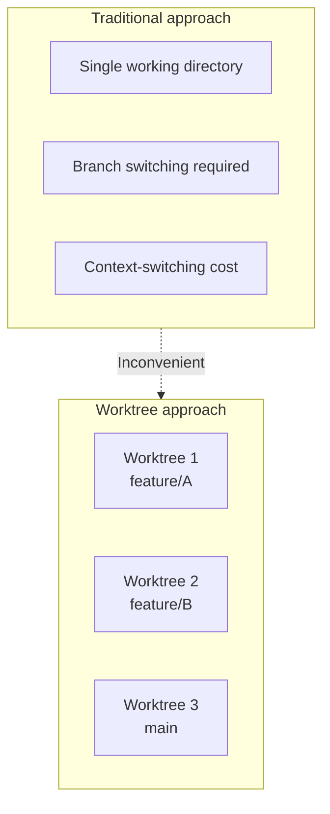
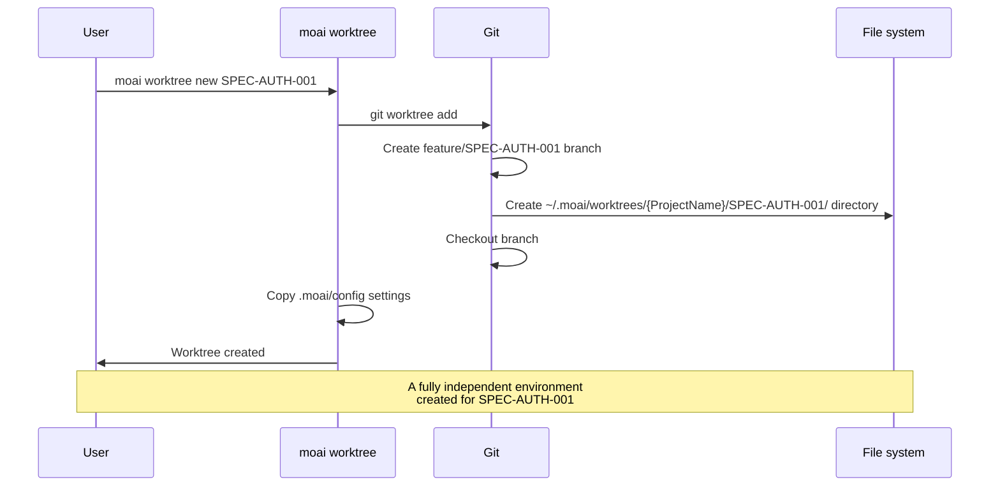
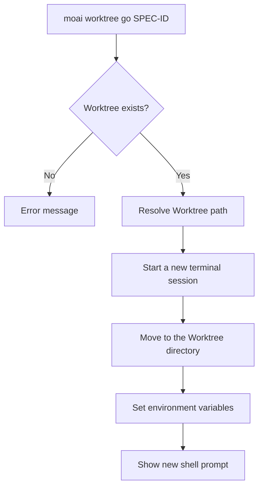
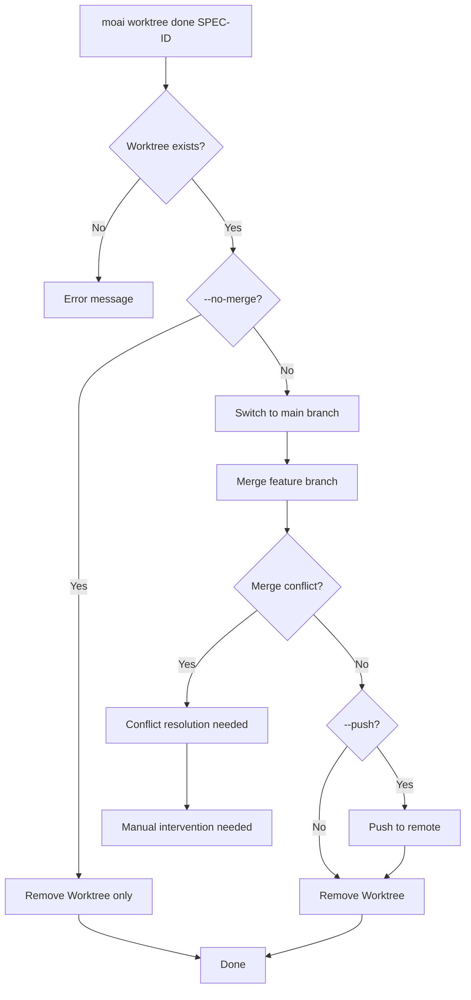
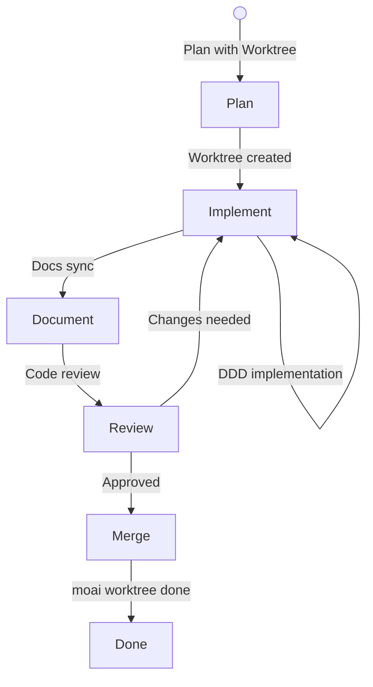
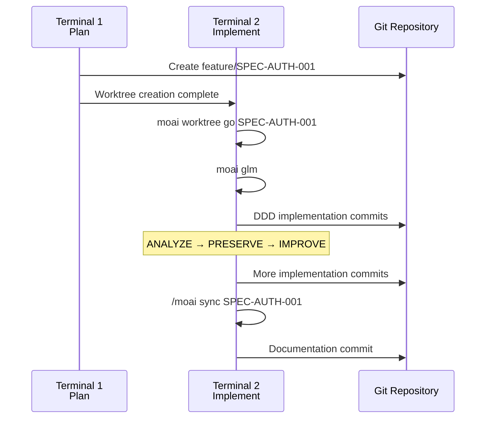
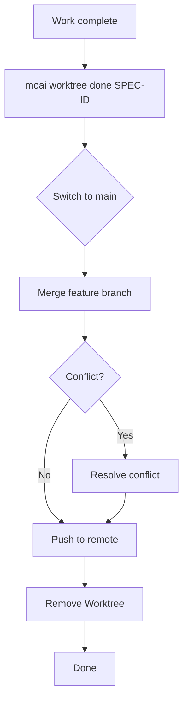
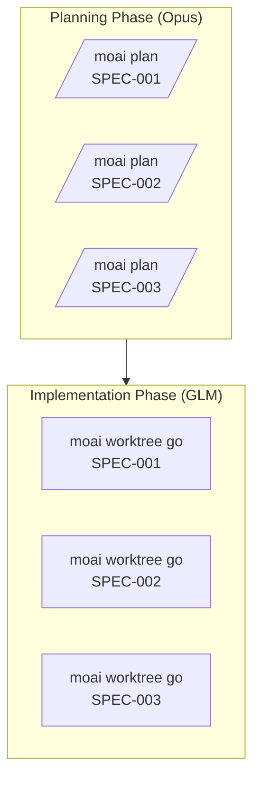
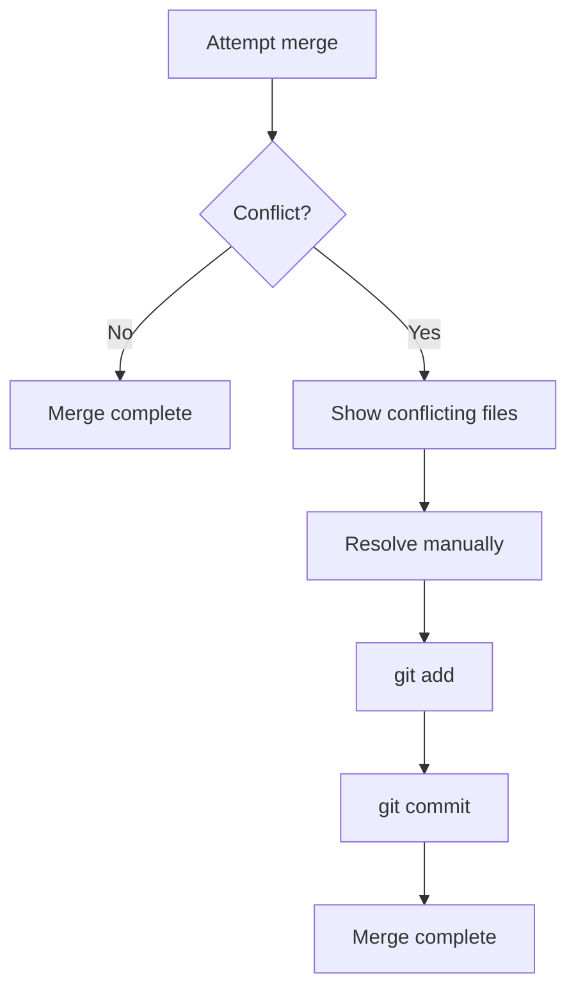
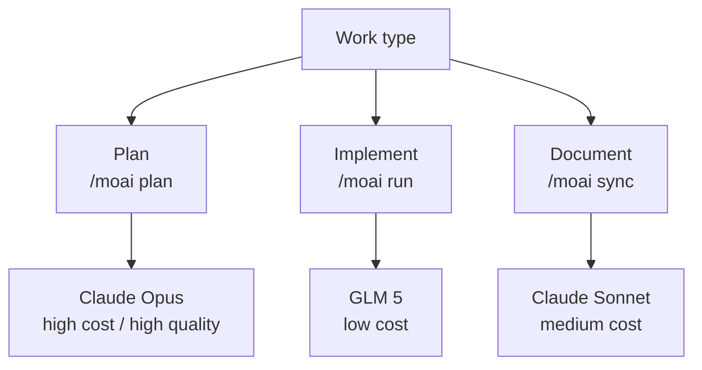

Everything about MoAI-ADK parallel development with Git Worktree — from basic
concepts to the command reference, workflows, and best practices, all in one
document.

## Table of contents

1. [Worktree Basics](#worktree-basics)
2. [Command Reference](#command-reference)
3. [Workflow Guide](#workflow-guide)
4. [Advanced Features](#advanced-features)
5. [Best Practices](#best-practices)

---

## Worktree Basics

### What is Git Worktree?

Git Worktree is a built-in Git feature that lets you **work on one Git
repository from multiple directories at the same time**. Instead of swapping
context with `git checkout` every time you switch branches, you keep one
directory open per branch.


```mermaid
graph TB
    subgraph Traditional["Traditional approach"]
        T1[Single working directory]
        T2[Branch switching required]
        T3[Context-switching cost]
    end

    subgraph Worktree["Worktree approach"]
        W1[Worktree 1<br/>feature/A]
        W2[Worktree 2<br/>feature/B]
        W3[Worktree 3<br/>main]
    end

    Traditional -.->|Inconvenient| Worktree
```

### Worktree in MoAI-ADK

MoAI-ADK layers SPEC-level isolated environments on top of this feature.
Because every SPEC gets a fully independent environment, agents working in
parallel never step on each other's work:

- **Independent Git state** — each Worktree keeps its own branch and commit history
- **Separate LLM configuration** — each Worktree can use a different LLM
  execution mode. This is where the Tokenomics practice of assigning Claude
  to planning and GLM to implementation comes from
- **Isolated workspace** — fully separated at the file-system level

---

## Command Reference

### moai worktree new

Creates a new Worktree.

#### Syntax

```bash
moai worktree new SPEC-ID [options]
```

#### Parameters

- **SPEC-ID** (required): ID of the SPEC to create (e.g., `SPEC-AUTH-001`)

#### Options

- `-b, --branch BRANCH`: specify the branch name to use (default: `feature/SPEC-ID`)
- `--from BASE`: specify the base branch (default: `main`)
- `--force`: force re-creation if the Worktree already exists

#### Examples

```bash
# Basic usage
moai worktree new SPEC-AUTH-001

# Create from a specific branch
moai worktree new SPEC-AUTH-001 --from develop

# Force re-creation
moai worktree new SPEC-AUTH-001 --force
```

#### How it works


```mermaid
sequenceDiagram
    participant User as User
    participant CLI as moai worktree
    participant Git as Git
    participant FS as File system

    User->>CLI: moai worktree new SPEC-AUTH-001
    CLI->>Git: git worktree add
    Git->>Git: Create feature/SPEC-AUTH-001 branch
    Git->>FS: Create ~/.moai/worktrees/{ProjectName}/SPEC-AUTH-001/ directory
    Git->>Git: Checkout branch
    CLI->>CLI: Copy .moai/config settings
    CLI->>User: Worktree created

    Note over User,FS: A fully independent environment<br/>created for SPEC-AUTH-001
```

---

### moai worktree go

Enters a Worktree and starts a new shell session.

#### Syntax

```bash
moai worktree go SPEC-ID
```

#### Parameters

- **SPEC-ID** (required): ID of the Worktree to enter

#### Examples

```bash
# Enter the Worktree
moai worktree go SPEC-AUTH-001

# Switch LLM after entering
moai glm

# Start Claude Code
claude

# Start working
> /moai run SPEC-AUTH-001
```

#### How it works


```mermaid
flowchart TD
    A[moai worktree go SPEC-ID] --> B{Worktree exists?}
    B -->|No| C[Error message]
    B -->|Yes| D[Resolve Worktree path]
    D --> E[Start a new terminal session]
    E --> F[Move to the Worktree directory]
    F --> G[Set environment variables]
    G --> H[Show new shell prompt]
```

---

### moai worktree list

Lists all Worktrees.

#### Syntax

```bash
moai worktree list [options]
```

#### Options

- `-v, --verbose`: include detailed information
- `--porcelain`: output in a parseable format

#### Examples

```bash
# Basic list
moai worktree list

# Detailed information
moai worktree list --verbose

# Sample output
SPEC-AUTH-001  feature/SPEC-AUTH-001  /path/to/worktree/SPEC-AUTH-001  [active]
SPEC-AUTH-002  feature/SPEC-AUTH-002  /path/to/worktree/SPEC-AUTH-002
SPEC-AUTH-003  feature/SPEC-AUTH-003  /path/to/worktree/SPEC-AUTH-003
```

---

### moai worktree done

Completes work in a Worktree, merges, and cleans up.

#### Syntax

```bash
moai worktree done SPEC-ID [options]
```

#### Parameters

- **SPEC-ID** (required): ID of the Worktree to complete

#### Options

- `--push`: push to the remote after merging
- `--no-merge`: remove the Worktree without merging
- `--force`: force the merge even with conflicts

#### Examples

```bash
# Basic merge and cleanup
moai worktree done SPEC-AUTH-001

# Push to the remote
moai worktree done SPEC-AUTH-001 --push

# Remove only, without merging
moai worktree done SPEC-AUTH-001 --no-merge
```

#### How it works


```mermaid
flowchart TD
    A[moai worktree done SPEC-ID] --> B{Worktree exists?}
    B -->|No| C[Error message]
    B -->|Yes| D{--no-merge?}
    D -->|Yes| E[Remove Worktree only]
    D -->|No| F[Switch to main branch]
    F --> G[Merge feature branch]
    G --> H{Merge conflict?}
    H -->|Yes| I[Conflict resolution needed]
    H -->|No| J{--push?}
    J -->|Yes| K[Push to remote]
    J -->|No| L[Remove Worktree]
    K --> L
    E --> M[Done]
    L --> M
    I --> N[Manual intervention needed]
```

---

### moai worktree remove

Removes a Worktree (without merging).

#### Syntax

```bash
moai worktree remove SPEC-ID [options]
```

#### Parameters

- **SPEC-ID** (required): ID of the Worktree to remove

#### Options

- `--force`: force removal even with pending changes
- `--keep-branch`: keep the branch, remove only the Worktree

#### Examples

```bash
# Basic removal
moai worktree remove SPEC-AUTH-001

# Force removal
moai worktree remove SPEC-AUTH-001 --force

# Keep the branch
moai worktree remove SPEC-AUTH-001 --keep-branch
```

---

### moai worktree status

Checks the status of Worktrees.

#### Syntax

```bash
moai worktree status [SPEC-ID]
```

#### Parameters

- **SPEC-ID** (optional): check the status of a specific Worktree (all are shown if omitted)

#### Examples

```bash
# All Worktree statuses
moai worktree status

# A specific Worktree's status
moai worktree status SPEC-AUTH-001

# Sample output
Worktree: SPEC-AUTH-001
Branch: feature/SPEC-AUTH-001
Path: /path/to/worktree/SPEC-AUTH-001
Status: Clean (2 commits ahead of main)
LLM: GLM 5
```

---

### moai worktree clean

Cleans up merged or completed Worktrees.

#### Syntax

```bash
moai worktree clean [options]
```

#### Options

- `--merged-only`: clean up merged Worktrees only
- `--older-than DAYS`: clean up Worktrees older than N days
- `--dry-run`: show what would be removed, without removing

#### Examples

```bash
# Clean up merged Worktrees
moai worktree clean --merged-only

# Clean up Worktrees older than 7 days
moai worktree clean --older-than 7

# Preview
moai worktree clean --dry-run
```

---

### moai worktree config

Inspects or modifies Worktree settings.

#### Syntax

```bash
moai worktree config [key] [value]
```

#### Parameters

- **key** (optional): configuration key
- **value** (optional): configuration value

#### Examples

```bash
# Show all settings
moai worktree config

# Check a specific setting
moai worktree config root

# Change a setting
moai worktree config root /new/path/to/worktrees
```

---

## Workflow Guide

### Complete development cycle


```mermaid
flowchart TD
    Start(( )) -->|"Plan with Worktree"| Plan["Plan"]
    Plan -->|"Worktree created"| Implement["Implement"]
    Implement -->|"DDD implementation"| Implement
    Implement -->|"Docs sync"| Document["Document"]
    Document -->|"Code review"| Review["Review"]
    Review -->|"Approved"| Merge["Merge"]
    Review -->|"Changes needed"| Implement
    Merge -->|"moai worktree done"| Done["Done"]
```

### Step 1: SPEC planning (Phase 1)

```bash
# In Terminal 1
> /moai plan "Implement user authentication system" --worktree
```

**Output**:

```
✓ SPEC document created: .moai/specs/SPEC-AUTH-001/spec.md
✓ Worktree created: ~/.moai/worktrees/{ProjectName}/SPEC-AUTH-001
✓ Branch created: feature/SPEC-AUTH-001
✓ Branch switched

Next steps:
1. In a new terminal, run: moai worktree go SPEC-AUTH-001
2. Switch LLM: moai glm
3. Start development: claude
```

### Step 2: Implementation (Phase 2)

```bash
# In Terminal 2
moai worktree go SPEC-AUTH-001

# The prompt changes once you enter the Worktree
(SPEC-AUTH-001) $ moai glm
→ Set to GLM 5.

(SPEC-AUTH-001) $ claude
> /moai run SPEC-AUTH-001
```

**Workflow**:


```mermaid
sequenceDiagram
    participant T1 as Terminal 1<br/>Plan
    participant T2 as Terminal 2<br/>Implement
    participant Git as Git Repository

    T1->>Git: Create feature/SPEC-AUTH-001
    T1->>T2: Worktree creation complete

    T2->>T2: moai worktree go SPEC-AUTH-001
    T2->>T2: moai glm
    T2->>Git: DDD implementation commits
    Note over T2: ANALYZE → PRESERVE → IMPROVE

    T2->>Git: More implementation commits
    T2->>T2: /moai sync SPEC-AUTH-001
    T2->>Git: Documentation commit
```

### Step 3: Completion and merge (Phase 3)

```bash
# In Terminal 2, after finishing work
exit

# In Terminal 1
moai worktree done SPEC-AUTH-001 --push
```

**Process**:


```mermaid
flowchart TD
    A[Work complete] --> B[moai worktree done SPEC-ID]
    B --> C{Switch to main}
    C --> D[Merge feature branch]
    D --> E{Conflict?}
    E -->|Yes| F[Resolve conflict]
    E -->|No| G[Push to remote]
    F --> G
    G --> H[Remove Worktree]
    H --> I[Done]
```

---

## Advanced Features

### Parallel work strategies

#### Strategy 1: Separate Plan and Implement

The baseline Tokenomics strategy. Batch the planning phase on a
high-reasoning model (Opus), then fan the implementation phase out across
low-cost models (GLM):


```mermaid
graph TB
    subgraph Planning["Planning Phase (Opus)"]
        P1[/moai plan<br/>SPEC-001/]
        P2[/moai plan<br/>SPEC-002/]
        P3[/moai plan<br/>SPEC-003/]
    end

    subgraph Implementation["Implementation Phase (GLM)"]
        I1[moai worktree go<br/>SPEC-001]
        I2[moai worktree go<br/>SPEC-002]
        I3[moai worktree go<br/>SPEC-003]
    end

    Planning --> Implementation
```

#### Strategy 2: Concurrent development

```bash
# Terminal 1: plan SPEC-001
> /moai plan "Authentication" --worktree

# Terminal 2: plan SPEC-002 (after it finishes)
> /moai plan "Logging" --worktree

# Terminals 3, 4, 5: parallel implementation
moai worktree go SPEC-001 && moai glm  # Terminal 3
moai worktree go SPEC-002 && moai glm  # Terminal 4
moai worktree go SPEC-003 && moai glm  # Terminal 5
```

### Switching between Worktrees

```bash
# Check the current Worktree
moai worktree status

# Switch to another Worktree
moai worktree go SPEC-AUTH-002

# Or move directly
cd ~/.moai/worktrees/SPEC-AUTH-002
```

### Conflict resolution


```mermaid
flowchart TD
    A[Attempt merge] --> B{Conflict?}
    B -->|No| C[Merge complete]
    B -->|Yes| D[Show conflicting files]
    D --> E[Resolve manually]
    E --> F[git add]
    F --> G[git commit]
    G --> H[Merge complete]
```

---

## Best Practices

### 1. Worktree naming conventions

```bash
# Good examples
moai worktree new SPEC-AUTH-001      # clear SPEC ID
moai worktree new SPEC-FRONTEND-007  # category included

# Examples to avoid
moai worktree new feature-branch     # no SPEC ID
moai worktree new temp               # ambiguous name
```

### 2. Regular cleanup

```bash
# Run weekly
moai worktree clean --merged-only

# Run monthly
moai worktree clean --older-than 30
```

### 3. LLM selection guide

Assigning models per work phase is the heart of Worktree Tokenomics:


```mermaid
graph TD
    A[Work type] --> B[Plan<br/>/moai plan]
    A --> C[Implement<br/>/moai run]
    A --> D[Document<br/>/moai sync]

    B --> E[Claude Opus<br/>high cost / high quality]
    C --> F[GLM 5<br/>low cost]
    D --> G[Claude Sonnet<br/>medium cost]
```

### 4. Commit message conventions

```bash
# When committing in a Worktree
git commit -m "feat(SPEC-AUTH-001): implement JWT-based authentication

- Add JWT token generation/verification logic
- Implement refresh token rotation
- Invalidate tokens on logout

Co-Authored-By: Claude <noreply@anthropic.com>"
```

### 5. Terminal management

```bash
# Use a separate terminal per Worktree
# iTerm2, VS Code, or tmux recommended

# tmux example
tmux new-session -d -s spec-001 'moai worktree go SPEC-001'
tmux new-session -d -s spec-002 'moai worktree go SPEC-002'

# Switch sessions
tmux attach-session -t spec-001
```

### 6. Progress tracking

```bash
# Check all Worktree statuses
moai worktree status --verbose

# Check the Git log
cd ~/.moai/worktrees/{ProjectName}/SPEC-AUTH-001
git log --oneline --graph --all

# Check changes
git diff main
```

## tmux Integration and Auto-merge

### The moai worktree new --tmux flag

Automatically creates a tmux session for isolated development inside the
worktree environment.

```bash
moai worktree new SPEC-AUTH-001 --tmux
```

**Flow:**
1. Create the Worktree (existing behavior)
2. Auto-create a tmux session (name: `moai-{ProjectName}-{SPEC-ID}`)
3. Inject environment variables per LLM mode (GLM/CG mode)
4. cd into the Worktree and run `/moai run {SPEC-ID}`

```bash
# Attach the tmux session
tmux attach-session -t moai-my-project-SPEC-AUTH-001
```


If tmux is not installed, graceful degradation applies: a manual cd guidance message is shown.


### Execution mode selection gate (Decision Point 3.5)

After `/moai plan` completes and before Run starts, the execution mode is
auto-detected and the user is asked to choose.

**When tmux is available (3 options):**
- Worktree + \{current mode\} (Recommended): create the worktree + tmux session
- Team Mode: parallel Agent Teams execution
- Sub-agent Mode: sequential execution

**When tmux is unavailable (2 options):**
- Sub-agent Mode (Recommended)
- Team Mode (in-process)

### Auto-merge default behavior

Running `/moai sync` in a worktree context auto-merges by default.

| Flag | Behavior |
|--------|------|
| (none) | Auto-merge in worktree context |
| `--no-merge` | Skip the auto-merge |
| `--merge` | Deprecated (warning shown) |

### Post-merge auto-cleanup

On successful PR merge, automatic cleanup runs:
- Remove the worktree directory
- Delete the feature branch (`--delete-branch`)
- Update the registry


Cleanup failures do not affect the merge outcome. On failure, clean up manually: `moai worktree done SPEC-{ID}`


### Error handling (errors.go)

Structured error types with recovery commands are provided.

| Error type | Description | Recovery command |
|-----------|------|-----------|
| `WorktreeCreateError` | Worktree creation failed | `moai worktree new {SPEC-ID}` |
| `TmuxNotAvailableError` | tmux unavailable | `cd {path} && /moai run {SPEC-ID}` |
| `AutoMergeBlockedError` | Auto-merge blocked | `/moai sync {SPEC-ID}` |
| `CleanupFailedError` | Cleanup failed | `moai worktree done {SPEC-ID}` |

## Related documentation

- [Git Worktree Overview](/en/worktree/)
- [Real-World Examples](/en/worktree/examples)
- [FAQ](/en/worktree/faq)
