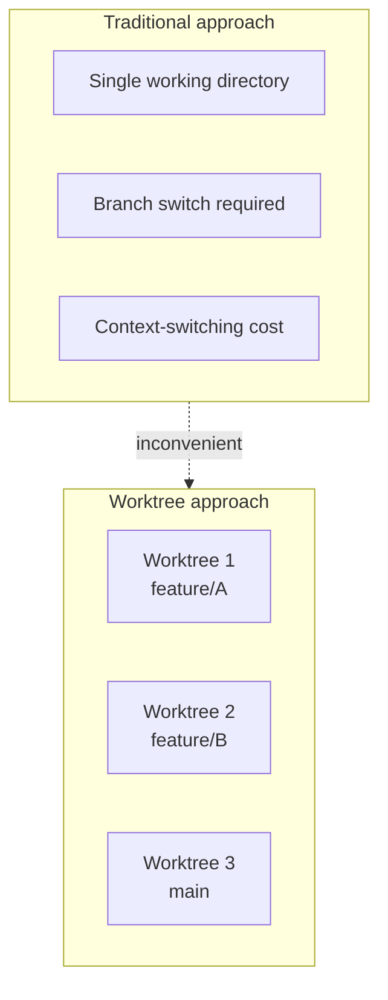
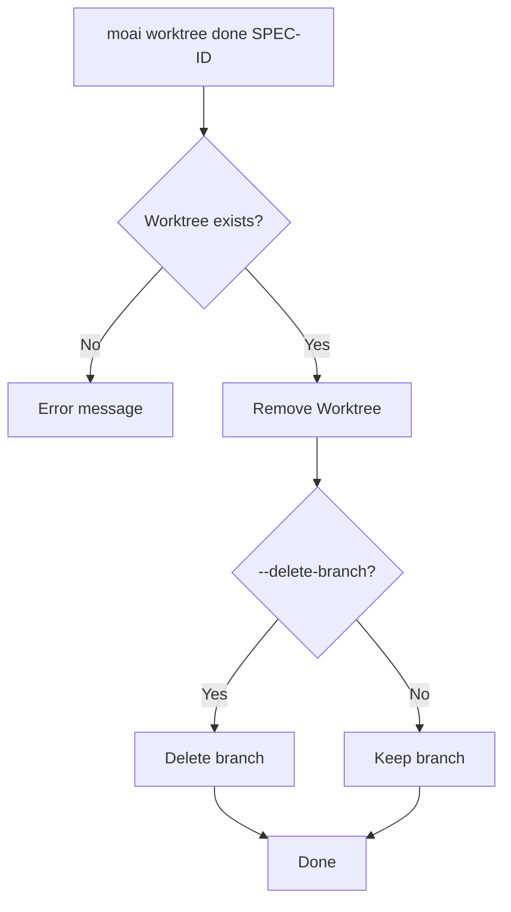
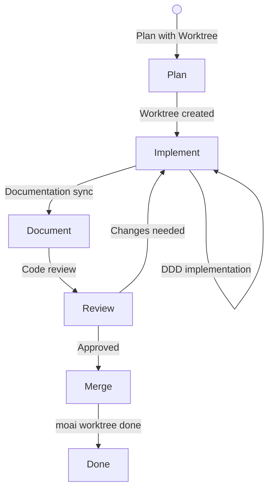
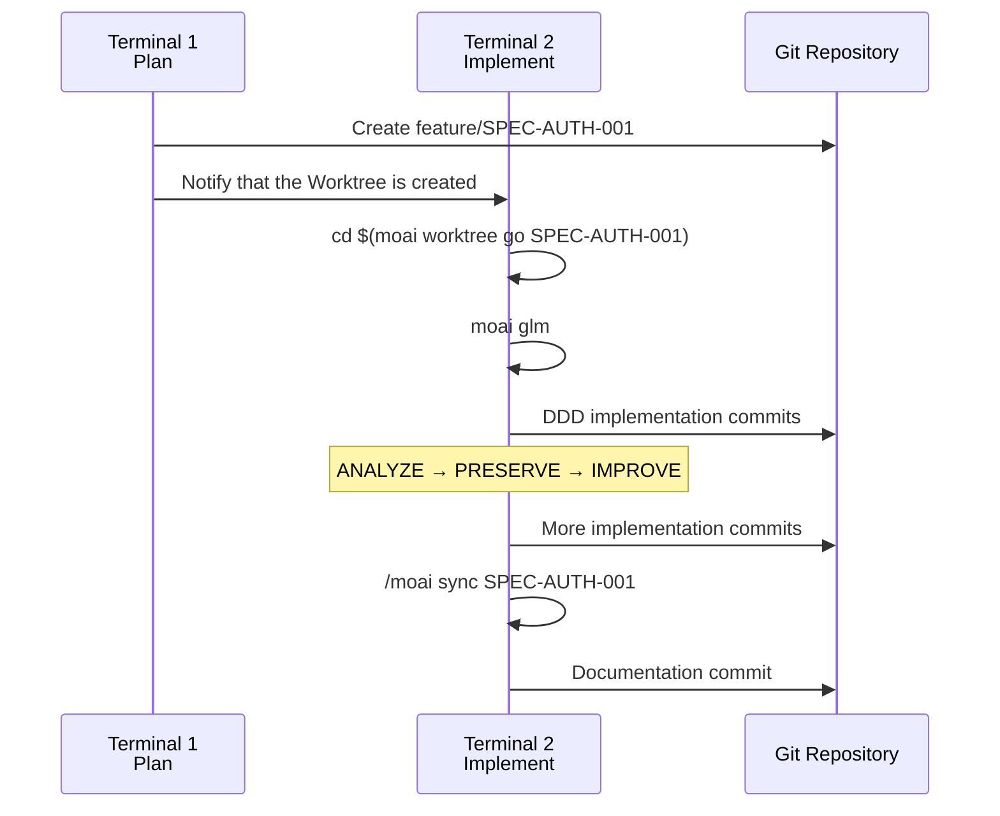
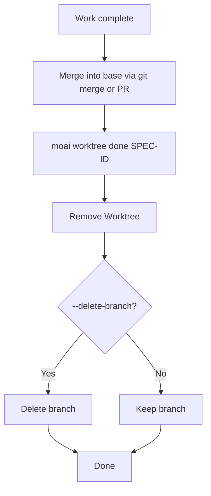
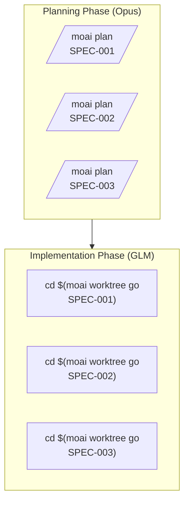
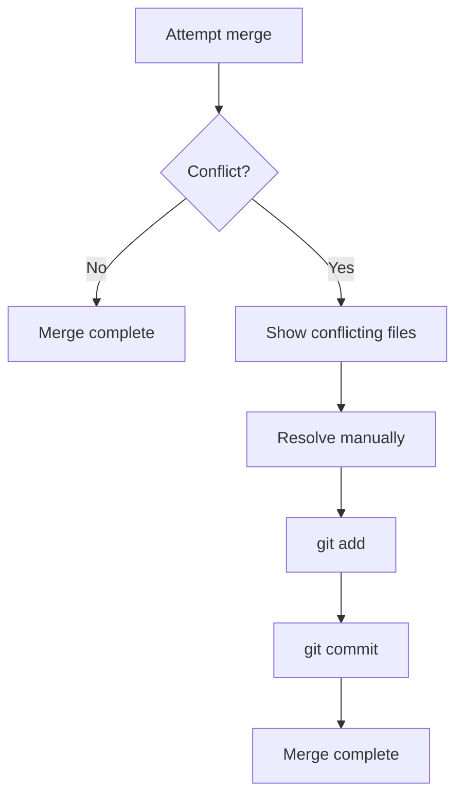
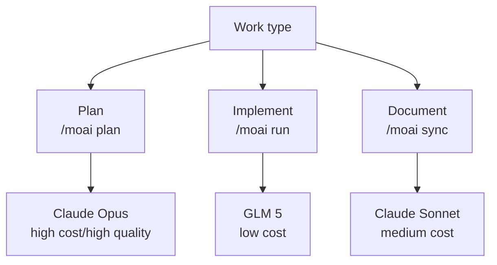

Everything about MoAI-ADK parallel development with Git Worktree — from basic concepts through the command reference, workflows, and best practices, all in this one document.

## Table of contents

1. [Worktree Basics](#worktree-basics)
2. [Detailed Command Reference](#detailed-command-reference)
3. [Workflow Guide](#workflow-guide)
4. [Advanced Features](#advanced-features)
5. [Best Practices](#best-practices)

---

## Worktree Basics

### What is Git Worktree?

Git Worktree is a built-in Git feature that lets you **work on one Git repository in multiple directories at once**. Instead of swapping context with `git checkout` every time you move between branches, you keep one directory open per branch.


```mermaid
graph TB
    subgraph Traditional["Traditional approach"]
        T1[Single working directory]
        T2[Branch switch required]
        T3[Context-switching cost]
    end

    subgraph Worktree["Worktree approach"]
        W1[Worktree 1<br/>feature/A]
        W2[Worktree 2<br/>feature/B]
        W3[Worktree 3<br/>main]
    end

    Traditional -.->|inconvenient| Worktree
```

### Worktree in MoAI-ADK

MoAI-ADK layers SPEC-level isolated environments on top of this feature. Because each SPEC has a fully independent environment, agents can work in parallel without stepping on each other's work:

- **Independent Git state** — each Worktree keeps its own branch and commit history
- **Separate LLM setting** — each Worktree can use a different LLM execution mode. This is where the tokenomics practice of assigning Claude to planning and GLM to implementation comes from
- **Isolated workspace** — fully separated at the file-system level

---

## Detailed Command Reference

### moai worktree new

Creates a new Worktree.

#### Syntax

```bash
moai worktree new SPEC-ID [options]
```

#### Parameters

- **SPEC-ID** (required): the ID of the SPEC to create (e.g. `SPEC-AUTH-001`)

#### Options

- `--path PATH`: specify the Worktree path directly (default: `.moai/worktrees/<SPEC-ID>` for a SPEC ID, otherwise `../<branch-name>`)
- `--base BRANCH`: base branch (default: `origin/main`, auto-fetched). For local-only commits, use `--base main`
- `--from-current`: use the current HEAD as the base (skips `git fetch origin main`, mutually exclusive with `--base`)
- `--tmux`: create a tmux session after creating the Worktree
- `--team`: automatically start a Claude/GLM session in the new Worktree

#### Examples

```bash
# Basic usage (based on origin/main)
moai worktree new SPEC-AUTH-001

# Create based on local main
moai worktree new SPEC-AUTH-001 --base main

# Create based on the current HEAD
moai worktree new SPEC-AUTH-001 --from-current

# Create with a tmux session
moai worktree new SPEC-AUTH-001 --tmux
```

#### How it works


```mermaid
sequenceDiagram
    participant User as User
    participant CLI as moai worktree
    participant Git as Git
    participant FS as File system

    User->>CLI: moai worktree new SPEC-AUTH-001
    CLI->>Git: git worktree add
    Git->>Git: Create feature/SPEC-AUTH-001 branch
    Git->>FS: Create ~/.moai/worktrees/{ProjectName}/SPEC-AUTH-001/ directory
    Git->>Git: Check out the branch
    CLI->>CLI: Copy .moai/config settings
    CLI->>User: Worktree created

    Note over User,FS: A fully independent environment<br/>for SPEC-AUTH-001 is created
```

---

### moai worktree go

Prints the Worktree path. It emits only the path string to standard output for shell navigation, and does not start a shell session directly. Use it combined with the shell's `cd`.

#### Syntax

```bash
moai worktree go SPEC-ID
```

#### Parameters

- **SPEC-ID** (required): the ID of the Worktree whose path to print

#### Examples

```bash
# Print the path only
moai worktree go SPEC-AUTH-001

# Move to the printed path
cd "$(moai worktree go SPEC-AUTH-001)"

# Start development after moving
moai glm
claude
> /moai run SPEC-AUTH-001
```

#### How it works

```mermaid
flowchart TD
    A[moai worktree go SPEC-ID] --> B{Worktree exists?}
    B -->|No| C[Error message]
    B -->|Yes| D[Print Worktree path to stdout]
    D --> E["Use in the shell, e.g. cd \"$(...)\""]
```

---

### moai worktree list

Displays a list of all Worktrees.

#### Syntax

```bash
moai worktree list [options]
```

#### Options

- `-v, --verbose`: include detailed information for each Worktree

#### Examples

```bash
# Basic list
moai worktree list

# Detailed information
moai worktree list --verbose

# Sample output
SPEC-AUTH-001  feature/SPEC-AUTH-001  /path/to/worktree/SPEC-AUTH-001  [active]
SPEC-AUTH-002  feature/SPEC-AUTH-002  /path/to/worktree/SPEC-AUTH-002
SPEC-AUTH-003  feature/SPEC-AUTH-003  /path/to/worktree/SPEC-AUTH-003
```

---

### moai worktree done

Removes the Worktree and optionally deletes the branch. **It does not merge or push** — handle the merge into the base branch separately with `git merge` or a PR.

#### Syntax

```bash
moai worktree done SPEC-ID [options]
```

#### Parameters

- **SPEC-ID** (required): the ID of the Worktree to complete

#### Options

- `--force`: force removal even with uncommitted changes
- `--delete-branch`: also delete the branch after removing the Worktree
- `--auto`: quiet mode for automation (e.g. cleanup after a PR merge)

#### Examples

```bash
# Remove the Worktree
moai worktree done SPEC-AUTH-001

# Remove the Worktree + delete the branch
moai worktree done SPEC-AUTH-001 --delete-branch

# Auto cleanup after PR merge (no output)
moai worktree done SPEC-AUTH-001 --auto
```

#### How it works


```mermaid
flowchart TD
    A[moai worktree done SPEC-ID] --> B{Worktree exists?}
    B -->|No| C[Error message]
    B -->|Yes| D[Remove Worktree]
    D --> E{--delete-branch?}
    E -->|Yes| F[Delete branch]
    E -->|No| G[Keep branch]
    F --> H[Done]
    G --> H[Done]
```

---

### moai worktree remove

Removes a Worktree (no merge). The branch is kept.

#### Syntax

```bash
moai worktree remove PATH [options]
```

#### Parameters

- **PATH** (required): the path of the Worktree to remove

#### Options

- `--force`: force removal even with uncommitted changes

#### Examples

```bash
# Basic removal
moai worktree remove .moai/worktrees/SPEC-AUTH-001

# Force removal
moai worktree remove .moai/worktrees/SPEC-AUTH-001 --force
```

---

### moai worktree status

Checks the status of a Worktree.

#### Syntax

```bash
moai worktree status [options]
```

#### Options

- `--all`: show all detailed information, including full commit hashes

#### Examples

```bash
# Worktree status
moai worktree status

# All detailed information
moai worktree status --all

# Sample output
Worktree: SPEC-AUTH-001
Branch: feature/SPEC-AUTH-001
Path: /path/to/worktree/SPEC-AUTH-001
Status: Clean (2 commits ahead of main)
LLM: GLM 5
```

---

### moai worktree clean

Cleans up merged or completed Worktrees.

#### Syntax

```bash
moai worktree clean [options]
```

#### Options

- `--merged-only`: remove only Worktrees whose branch is merged into base
- `--base BRANCH`: the base branch used for the `--merged-only` judgment (default: `main`)

#### Examples

```bash
# Clean up merged Worktrees (base=main)
moai worktree clean --merged-only

# Clean up against a different base branch
moai worktree clean --merged-only --base develop
```

---

### moai worktree config

Checks or modifies Worktree settings.

#### Syntax

```bash
moai worktree config [key] [value]
```

#### Parameters

- **key** (optional): the setting key
- **value** (optional): the setting value

#### Examples

```bash
# Show all settings
moai worktree config

# Check a specific setting
moai worktree config root

# Change a setting
moai worktree config root /new/path/to/worktrees
```

---

## Workflow Guide

### The complete development cycle


```mermaid
flowchart TD
    Start(( )) -->|"Plan with Worktree"| Plan["Plan"]
    Plan -->|"Worktree created"| Implement["Implement"]
    Implement -->|"DDD implementation"| Implement
    Implement -->|"Documentation sync"| Document["Document"]
    Document -->|"Code review"| Review["Review"]
    Review -->|"Approved"| Merge["Merge"]
    Review -->|"Changes needed"| Implement
    Merge -->|"moai worktree done"| Done["Done"]
```

### Step 1: SPEC planning (Phase 1)

```bash
# In Terminal 1
> /moai plan "Implement a user authentication system" --worktree
```

**Output**:

```
✓ SPEC document created: .moai/specs/SPEC-AUTH-001/spec.md
✓ Worktree created: ~/.moai/worktrees/{ProjectName}/SPEC-AUTH-001
✓ Branch created: feature/SPEC-AUTH-001
✓ Branch switch complete

Next steps:
1. Run in a new terminal: cd "$(moai worktree go SPEC-AUTH-001)"
2. Change LLM: moai glm
3. Start development: claude
```

### Step 2: implementation (Phase 2)

```bash
# In Terminal 2
cd "$(moai worktree go SPEC-AUTH-001)"

# The prompt changes once you enter the Worktree
(SPEC-AUTH-001) $ moai glm
→ Set to GLM 5.

(SPEC-AUTH-001) $ claude
> /moai run SPEC-AUTH-001
```

**Workflow**:


```mermaid
sequenceDiagram
    participant T1 as Terminal 1<br/>Plan
    participant T2 as Terminal 2<br/>Implement
    participant Git as Git Repository

    T1->>Git: Create feature/SPEC-AUTH-001
    T1->>T2: Notify that the Worktree is created

    T2->>T2: cd $(moai worktree go SPEC-AUTH-001)
    T2->>T2: moai glm
    T2->>Git: DDD implementation commits
    Note over T2: ANALYZE → PRESERVE → IMPROVE

    T2->>Git: More implementation commits
    T2->>T2: /moai sync SPEC-AUTH-001
    T2->>Git: Documentation commit
```

### Step 3: completion and merge (Phase 3)

```bash
# After finishing work in Terminal 2 (push is handled separately via git/PR)
exit

# After handling the base-branch merge with git merge or a PR,
# clean up the Worktree from Terminal 1
moai worktree done SPEC-AUTH-001 --delete-branch
```

**Process**:


```mermaid
flowchart TD
    A[Work complete] --> B[Merge into base via git merge or PR]
    B --> C[moai worktree done SPEC-ID]
    C --> D[Remove Worktree]
    D --> E{--delete-branch?}
    E -->|Yes| F[Delete branch]
    E -->|No| G[Keep branch]
    F --> H[Done]
    G --> H[Done]
```

---

## Advanced Features

### Parallel-work strategies

#### Strategy 1: separate Plan and Implement

This is the basic tokenomics strategy. Do the planning stage in bulk with a high-reasoning model (Opus), and spread the implementation stage in parallel with a low-cost model (GLM):


```mermaid
graph TB
    subgraph Planning["Planning Phase (Opus)"]
        P1[/moai plan<br/>SPEC-001/]
        P2[/moai plan<br/>SPEC-002/]
        P3[/moai plan<br/>SPEC-003/]
    end

    subgraph Implementation["Implementation Phase (GLM)"]
        I1["cd $(moai worktree go<br/>SPEC-001)"]
        I2["cd $(moai worktree go<br/>SPEC-002)"]
        I3["cd $(moai worktree go<br/>SPEC-003)"]
    end

    Planning --> Implementation
```

#### Strategy 2: concurrent development

```bash
# Terminal 1: SPEC-001 Plan
> /moai plan "Authentication" --worktree

# Terminal 2: SPEC-002 Plan (after completion)
> /moai plan "Logging" --worktree

# Terminals 3, 4, 5: parallel implementation
cd "$(moai worktree go SPEC-001)" && moai glm  # Terminal 3
cd "$(moai worktree go SPEC-002)" && moai glm  # Terminal 4
cd "$(moai worktree go SPEC-003)" && moai glm  # Terminal 5
```

### Switching between Worktrees

```bash
# Check the current Worktree
moai worktree status

# Switch to a different Worktree
cd "$(moai worktree go SPEC-AUTH-002)"

# Or move directly
cd ~/.moai/worktrees/SPEC-AUTH-002
```

### Conflict resolution


```mermaid
flowchart TD
    A[Attempt merge] --> B{Conflict?}
    B -->|No| C[Merge complete]
    B -->|Yes| D[Show conflicting files]
    D --> E[Resolve manually]
    E --> F[git add]
    F --> G[git commit]
    G --> H[Merge complete]
```

---

## Best Practices

### 1. Worktree naming convention

```bash
# Good examples
moai worktree new SPEC-AUTH-001      # Clear SPEC ID
moai worktree new SPEC-FRONTEND-007  # Includes category

# Examples to avoid
moai worktree new feature-branch     # No SPEC ID
moai worktree new temp               # Ambiguous name
```

### 2. Regular cleanup

```bash
# Regularly clean up merged Worktrees
moai worktree clean --merged-only
```

### 3. LLM selection guide

Assigning models per work stage is the heart of Worktree tokenomics:


```mermaid
graph TD
    A[Work type] --> B[Plan<br/>/moai plan]
    A --> C[Implement<br/>/moai run]
    A --> D[Document<br/>/moai sync]

    B --> E[Claude Opus<br/>high cost/high quality]
    C --> F[GLM 5<br/>low cost]
    D --> G[Claude Sonnet<br/>medium cost]
```

### 4. Commit message convention

```bash
# When committing in a Worktree
git commit -m "feat(SPEC-AUTH-001): implement JWT-based authentication

- Add JWT token creation/verification logic
- Implement refresh token rotation
- Invalidate tokens on logout

Co-Authored-By: Claude <noreply@anthropic.com>"
```

### 5. Terminal management

```bash
# Use a separate terminal per Worktree
# iTerm2, VS Code, or tmux is recommended

# tmux example
tmux new-session -d -s spec-001 -c "$(moai worktree go SPEC-001)"
tmux new-session -d -s spec-002 -c "$(moai worktree go SPEC-002)"

# Switch sessions
tmux attach-session -t spec-001
```

### 6. Tracking progress

```bash
# Check all Worktree statuses
moai worktree status --all

# Check the Git log
cd ~/.moai/worktrees/{ProjectName}/SPEC-AUTH-001
git log --oneline --graph --all

# Check the changes
git diff main
```

## tmux Integration and Auto-Merge

### The moai worktree new --tmux flag

Automatically creates a tmux session, enabling isolated development in the Worktree environment.

```bash
moai worktree new SPEC-AUTH-001 --tmux
```

**Behavior flow:**
1. Create the Worktree (existing behavior)
2. Auto-create a tmux session (name: `moai-{ProjectName}-{SPEC-ID}`)
3. Inject environment variables depending on the LLM mode (GLM/CG mode)
4. cd into the Worktree, then run `/moai run {SPEC-ID}`

```bash
# Attach the tmux session
tmux attach-session -t moai-my-project-SPEC-AUTH-001
```


If tmux is not installed, graceful degradation kicks in: a manual cd guidance message is shown.


### Execution mode selection gate (Decision Point 3.5)

After `/moai plan` completes and before Run starts, the execution mode is auto-detected and the user is asked to choose.

**When tmux is available (3 options):**
- Worktree + \{current mode\} (Recommended): create a Worktree + tmux session
- Team Mode: parallel execution via Agent Teams
- Sub-agent Mode: sequential execution

**When tmux is unavailable (2 options):**
- Sub-agent Mode (Recommended)
- Team Mode (in-process)

### Auto-merge default behavior

Running `/moai sync` in a Worktree context makes auto-merge the default behavior.

| Flag | Behavior |
|--------|------|
| (none) | Auto-merge in the Worktree context |
| `--no-merge` | Skip the auto-merge |
| `--merge` | Deprecated (shows a warning) |

### Post-merge auto cleanup

Automatic cleanup on a successful PR merge:
- Remove the Worktree directory
- Delete the feature branch (`--delete-branch`)
- Update the registry


A cleanup failure does not affect the merge result. On failure, clean up manually: `moai worktree done SPEC-{ID}`


### Error handling (errors.go)

Provides structured error types and recovery commands.

| Error type | Description | Recovery command |
|-----------|------|-----------|
| `WorktreeCreateError` | Worktree creation failed | `moai worktree new {SPEC-ID}` |
| `TmuxNotAvailableError` | tmux unavailable | `cd {path} && /moai run {SPEC-ID}` |
| `AutoMergeBlockedError` | Auto-merge blocked | `/moai sync {SPEC-ID}` |
| `CleanupFailedError` | Cleanup failed | `moai worktree done {SPEC-ID}` |

## Related Documents

- [Git Worktree Overview](/en/worktree/)
- [Practical Examples](/en/worktree/examples)
- [FAQ](/en/worktree/faq)
