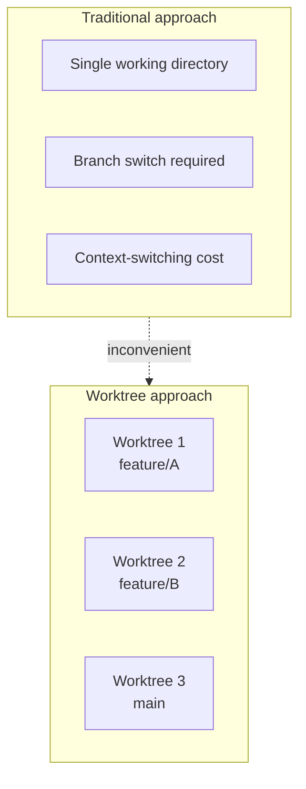
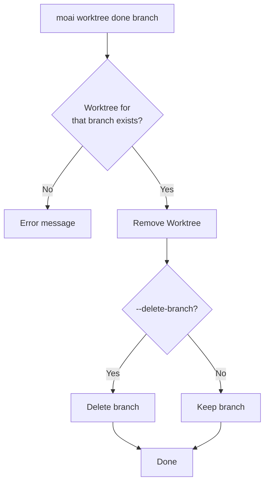
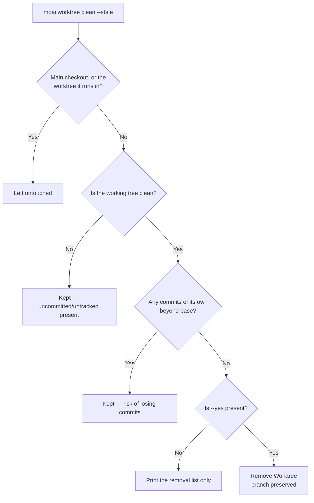
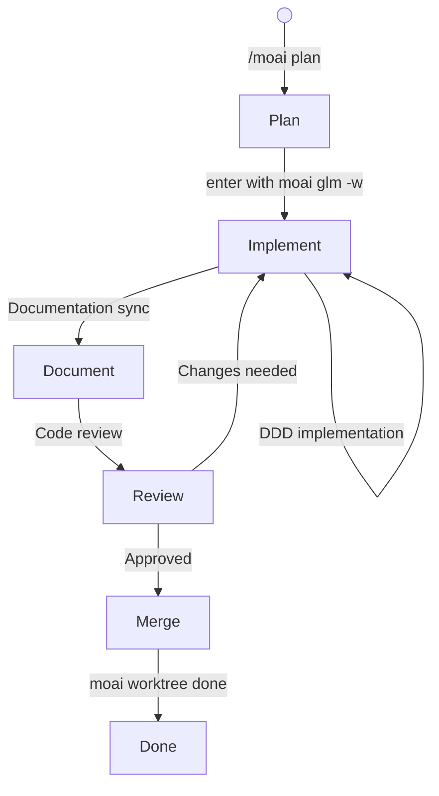
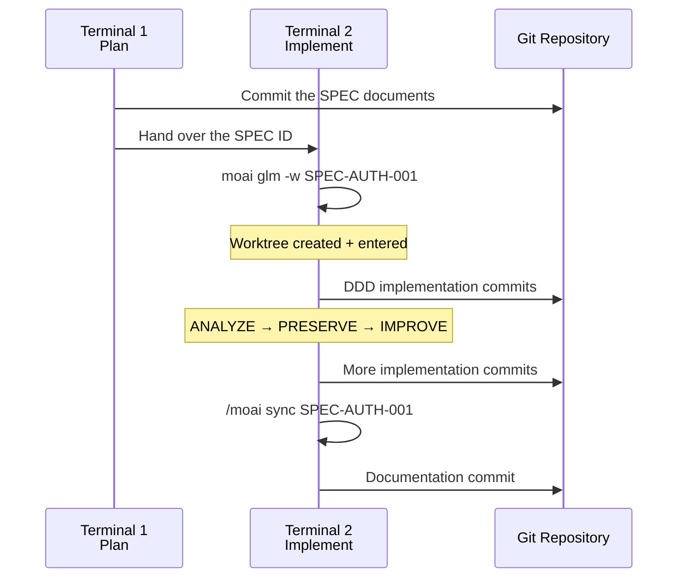
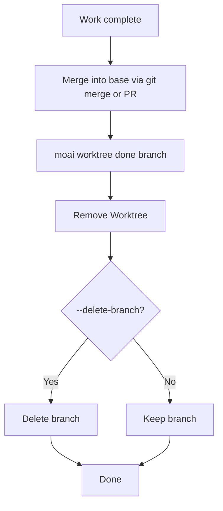
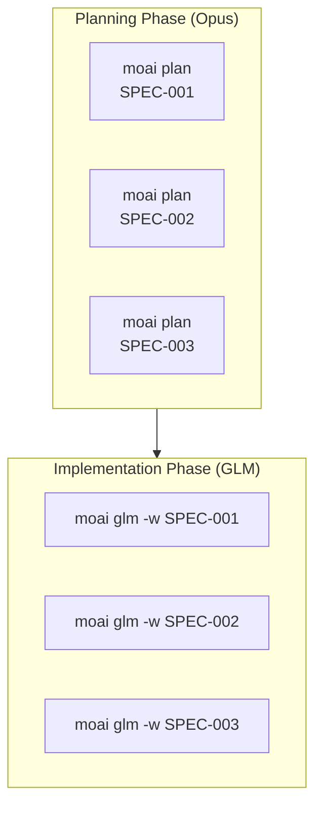
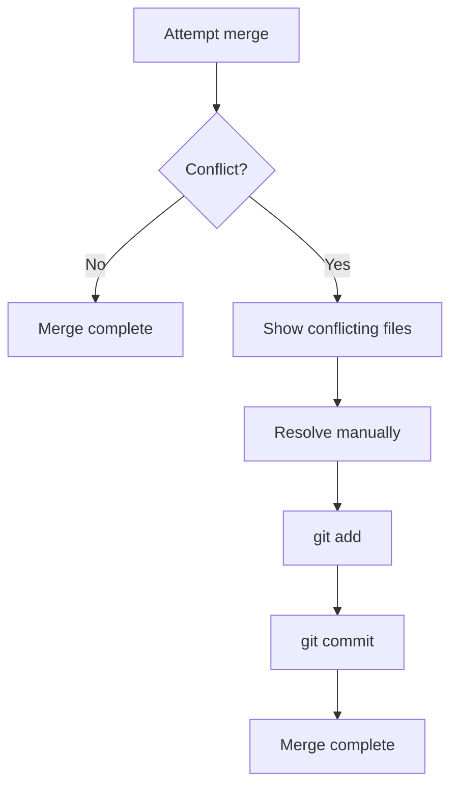
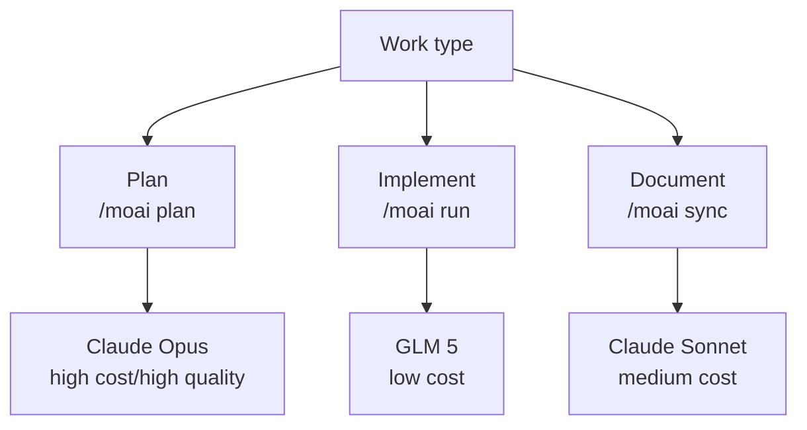

Everything about MoAI-ADK parallel development with Git Worktree, collected in
one document — from basic concepts through the command reference, workflows,
and best practices.

## Table of contents

1. [Worktree Basics](#worktree-basics)
2. [Detailed Command Reference](#detailed-command-reference)
3. [Workflow Guide](#workflow-guide)
4. [Advanced Features](#advanced-features)
5. [Best Practices](#best-practices)

---

## Worktree Basics

### What is Git Worktree?

Git Worktree is a built-in Git feature that lets you **work on one Git
repository in multiple directories at once**. Instead of swapping context with
`git checkout` every time you move between branches, you keep one directory
open per branch.


```mermaid
graph TD
    subgraph Traditional["Traditional approach"]
        T1[Single working directory]
        T2[Branch switch required]
        T3[Context-switching cost]
    end

    subgraph Worktree["Worktree approach"]
        W1[Worktree 1<br/>feature/A]
        W2[Worktree 2<br/>feature/B]
        W3[Worktree 3<br/>main]
    end

    Traditional -.->|inconvenient| Worktree
```

### Worktree in MoAI-ADK

MoAI-ADK layers SPEC-level isolated environments on top of this feature.
Because each SPEC's environment is completely split off, agents working in
parallel do not overwrite each other's work:

- **Independent Git state** — each Worktree accumulates its own branch and commit history
- **Separate LLM setting** — each Worktree can use a different LLM execution mode.
  This is where the tokenomics practice of assigning Claude to planning and GLM
  to implementation comes from
- **Isolated workspace** — fully separated at the file-system level

### Division of labor: the launcher enters, worktree manages, git lists

Three jobs are split across three different commands. Get this boundary
straight first and the rest reads easily.

| What you want to do | Handled by |
|-----------|------|
| Create a Worktree, enter it | The `-w` flag on the launchers `moai cc` · `moai glm` · `moai cg` |
| List Worktrees | `git worktree list` |
| Sync · clean · recover · state guards | `moai worktree` (alias `moai wt`) subcommands |

---

## Detailed Command Reference

### Creating and entering a Worktree

`moai worktree` has no create command. Worktrees are created by the launcher's
`-w` flag, which also brings up the session on the spot.

#### Syntax

```bash
moai cc  -w [name] [--spawn]
moai glm -w [name] [--spawn]
moai cg  -w [name] [--spawn]
```

#### How the `-w` value is resolved

- **Short name** (`feat-auth`) — resolved under `.claude/worktrees/feat-auth/`.
  Created if it does not exist
- **Absolute path** — re-enters an existing worktree under `~/.moai/worktrees/`
  or `<project>/.claude/worktrees/`
- **Value omitted** (`-w` alone) — a name is generated automatically
- Absolute paths outside those two prefixes are rejected. This keeps a worktree
  from being created in the wrong place by accident

#### `--spawn`: open one more without giving up the current session

With `-w` alone, the current process is **replaced** by the worktree session.
To open one more worktree while leaving the current window as it is, add
`--spawn`. A new tmux window comes up (focus stays where it is) and the pane ID
to switch to is printed.

`--spawn` works only inside a tmux session. Used outside tmux, it changes
nothing and exits with an error.

#### Examples

```bash
# Create a worktree and enter it with the Claude backend
moai cc -w feat-auth

# Enter the same worktree with the GLM backend
moai glm -w feat-auth

# Keep the current session + spawn a GLM teammate in a new tmux window
moai cg -w feat-auth --spawn

# To create a worktree at an arbitrary location, use git directly
git worktree add -b feature/SPEC-AUTH-001 \
    ~/.moai/worktrees/your-project/SPEC-AUTH-001 origin/main
moai glm -w ~/.moai/worktrees/your-project/SPEC-AUTH-001
```

#### Listing

```bash
git worktree list
```

---

### moai worktree sync

Syncs a Worktree with the changes on the base branch.

#### Syntax

```bash
moai worktree sync [branch-name]
```

#### Parameters

- **branch-name** (optional): the branch of the worktree to sync. Omit it and
  the worktree of the current directory is the target

#### Options

- `--base BRANCH`: base branch (default: `main`)
- `--strategy MODE`: `merge` (default) or `rebase`

#### Examples

```bash
# Sync the current directory's Worktree with main (merge strategy, default)
moai worktree sync

# Sync a specific Worktree with the rebase strategy
moai worktree sync feature/SPEC-AUTH-001 --strategy rebase

# Against a different base branch
moai worktree sync feature/SPEC-AUTH-001 --base develop
```

---

### moai worktree done

Removes the Worktree attached to a branch, and deletes the branch too if you
want. That said, **it neither merges nor pushes**. Merging into the base branch
is something you do separately with `git merge` or a PR.

#### Syntax

```bash
moai worktree done <branch-name>
```

#### Parameters

- **branch-name** (required, exactly one): the branch name of the worktree to
  clean up. Passing a SPEC ID form such as `SPEC-AUTH-001` resolves to
  `feature/SPEC-AUTH-001`

#### Options

- `--force`: force removal even with uncommitted changes
- `--delete-branch`: also delete the branch after removing the Worktree
- `--auto`: quiet mode for automation. It does not fail when no worktree is
  found, which makes it a good fit for a cleanup step right after a PR merge

#### Examples

```bash
# Remove the Worktree
moai worktree done feature/SPEC-AUTH-001

# Remove the Worktree + delete the branch
moai worktree done feature/SPEC-AUTH-001 --delete-branch

# Auto cleanup after PR merge (no output)
moai worktree done feature/SPEC-AUTH-001 --auto
```

#### How it works


```mermaid
flowchart TD
    A[moai worktree done branch] --> B{Worktree for<br/>that branch exists?}
    B -->|No| C[Error message]
    B -->|Yes| D[Remove Worktree]
    D --> E{--delete-branch?}
    E -->|Yes| F[Delete branch]
    E -->|No| G[Keep branch]
    F --> H[Done]
    G --> H[Done]
```

---

### moai worktree remove

Removes a Worktree (no merge). The branch is kept.

#### Syntax

```bash
moai worktree remove <path>
```

#### Parameters

- **path** (required, exactly one): the **file-system path** of the Worktree to
  remove. Not a branch name and not a SPEC ID

#### Options

- `--force`: force removal even with uncommitted changes

#### Examples

```bash
# Basic removal
moai worktree remove ~/.moai/worktrees/your-project/SPEC-AUTH-001

# Force removal
moai worktree remove ~/.moai/worktrees/your-project/SPEC-AUTH-001 --force
```

---

### moai worktree clean

Prunes stale references and picks out merged or abandoned Worktrees for
removal.

#### Syntax

```bash
moai worktree clean [options]
```

#### Options

- (no flags): prune stale worktree references only
- `--merged-only`: remove only Worktrees whose branch is merged into base
- `--stale`: sweep up abandoned Worktrees with nothing to lose (preview by default)
- `--yes`: actually remove instead of previewing with `--stale`
- `--json`: with `--stale`, report every non-protected Worktree with its keep reason, dirty, merge, and anchor state as JSON. Removes nothing, and overrides `--yes`
- `--base BRANCH`: base branch used to judge `--merged-only` and `--stale` (default: `origin/main`)

`--stale` and `--merged-only` cannot be combined.

#### The --stale safety rules

`--stale` classifies a worktree as a removal candidate only when it satisfies
**both** of these conditions.

1. The working tree is clean — no uncommitted changes and no untracked files
2. The branch carries no commits of its own beyond base

If either one fails, the worktree is kept and the reason for keeping it is
printed alongside. **Branches are never deleted under any circumstances** — even
when the worktree directory disappears, the commits remain reachable by branch
name. The main checkout and the worktree the command is currently running in
are always left out of the removal set.


```mermaid
flowchart TD
    A[moai worktree clean --stale] --> B{Main checkout, or the<br/>worktree it runs in?}
    B -->|Yes| C[Left untouched]
    B -->|No| D{Is the working tree clean?}
    D -->|No| E[Kept — uncommitted/untracked present]
    D -->|Yes| F{Any commits of its own<br/>beyond base?}
    F -->|Yes| G[Kept — risk of losing commits]
    F -->|No| H{Is --yes present?}
    H -->|No| I[Print the removal list only]
    H -->|Yes| J[Remove Worktree<br/>branch preserved]
```

#### Examples

```bash
# Prune stale references only
moai worktree clean

# Clean up merged Worktrees (base=main)
moai worktree clean --merged-only

# Clean up against a different base branch
moai worktree clean --merged-only --base develop

# Preview abandoned Worktrees — nothing is deleted
moai worktree clean --stale

# Actually remove after reviewing the preview
moai worktree clean --stale --yes
```


 `--stale` previews by default. Review the list with
your own eyes, then re-run with `--yes`.


---

### moai worktree recover

Scans the disk and runs `git worktree repair` to recover a damaged Worktree
registry. After recovery it prunes stale references and finally prints the list
of recognized worktrees. It takes no flags.

```bash
moai worktree recover
```

---

### State guards: snapshot · verify · restore

The three commands below are the state-guard primitives the orchestrator uses
to capture, compare, and roll back the working-tree state around an
`Agent(isolation: "worktree")` invocation.

#### moai worktree snapshot

Captures HEAD, the branch, the porcelain status, and the state of untracked
files under `.moai/specs/`, recording them as JSON in `.moai/state/`.

Options: `--out` (output path, default `.moai/state/worktree-snapshot-<id>.json`),
`--agent-name` (record the agent name).

```bash
moai worktree snapshot --agent-name my-agent --out .moai/state/snap.json
```

#### moai worktree verify

Weighs the current working tree against a snapshot. `--snapshot` is required,
and passing `--agent-response` additionally detects an empty `worktreePath` in
the agent response JSON.

Exit codes: `0`=clean, `1`=divergence, `2`=suspect (empty worktreePath), `3`=both.

```bash
moai worktree verify --snapshot .moai/state/snap.json --agent-name my-agent
```

#### moai worktree restore

Runs `git restore --source=<snapshot HEAD> --staged --worktree :/` to roll
tracked files back to the snapshot HEAD state. Untracked files cannot be
brought back by git, so it only tells you their paths and you have to recreate
them yourself.

```bash
moai worktree restore --snapshot .moai/state/snap.json

# Print the commands without running them
moai worktree restore --snapshot .moai/state/snap.json --dry-run
```


 `restore` discards local changes to tracked files.
Check that nothing needs keeping before you roll back.


---

## Workflow Guide

### The complete development cycle


```mermaid
flowchart TD
    Start(( )) -->|"/moai plan"| Plan["Plan"]
    Plan -->|"enter with moai glm -w"| Implement["Implement"]
    Implement -->|"DDD implementation"| Implement
    Implement -->|"Documentation sync"| Document["Document"]
    Document -->|"Code review"| Review["Review"]
    Review -->|"Approved"| Merge["Merge"]
    Review -->|"Changes needed"| Implement
    Merge -->|"moai worktree done"| Done["Done"]
```

### Step 1: SPEC planning (Phase 1)

Planning runs in the main checkout.

```bash
# In Terminal 1
> /moai plan "Implement a user authentication system"
```

**Output (example)**:

```
✓ SPEC document created: .moai/specs/SPEC-AUTH-001/spec.md

Next steps:
1. Run in a new terminal: moai glm -w SPEC-AUTH-001
2. Start development: /moai run SPEC-AUTH-001
```

### Step 2: implementation (Phase 2)

```bash
# In Terminal 2 — create the worktree and enter it with the GLM backend
$ moai glm -w SPEC-AUTH-001

# Run right inside the session you entered
> /moai run SPEC-AUTH-001
```

**Workflow**:


```mermaid
sequenceDiagram
    participant T1 as Terminal 1<br/>Plan
    participant T2 as Terminal 2<br/>Implement
    participant Git as Git Repository

    T1->>Git: Commit the SPEC documents
    T1->>T2: Hand over the SPEC ID

    T2->>T2: moai glm -w SPEC-AUTH-001
    Note over T2: Worktree created + entered
    T2->>Git: DDD implementation commits
    Note over T2: ANALYZE → PRESERVE → IMPROVE

    T2->>Git: More implementation commits
    T2->>T2: /moai sync SPEC-AUTH-001
    T2->>Git: Documentation commit
```

### Step 3: completion and merge (Phase 3)

```bash
# After finishing work in Terminal 2 (push is handled separately via git/PR)
exit

# After handling the base-branch merge with git merge or a PR,
# clean up the Worktree from Terminal 1
moai worktree done feature/SPEC-AUTH-001 --delete-branch
```

**Process**:


```mermaid
flowchart TD
    A[Work complete] --> B[Merge into base via git merge or PR]
    B --> C[moai worktree done branch]
    C --> D[Remove Worktree]
    D --> E{--delete-branch?}
    E -->|Yes| F[Delete branch]
    E -->|No| G[Keep branch]
    F --> H[Done]
    G --> H[Done]
```

---

## Advanced Features

### Parallel-work strategies

#### Strategy 1: separate Plan and Implement

This is the basic tokenomics strategy. Do the planning stage in bulk with a
high-reasoning model (Opus), and spread the implementation stage across several
tracks with a cheap model (GLM):


```mermaid
graph TD
    subgraph Planning["Planning Phase (Opus)"]
        P1["moai plan<br/>SPEC-001"]
        P2["moai plan<br/>SPEC-002"]
        P3["moai plan<br/>SPEC-003"]
    end

    subgraph Implementation["Implementation Phase (GLM)"]
        I1["moai glm -w SPEC-001"]
        I2["moai glm -w SPEC-002"]
        I3["moai glm -w SPEC-003"]
    end

    Planning --> Implementation
```

#### Strategy 2: concurrent development

```bash
# Terminal 1: do the planning in bulk
> /moai plan "Authentication"
> /moai plan "Logging"

# Terminals 3, 4, 5: parallel implementation (one line per terminal)
moai glm -w SPEC-001   # Terminal 3
moai glm -w SPEC-002   # Terminal 4
moai glm -w SPEC-003   # Terminal 5
```

If you are using tmux, you can bring them all up from one terminal without
moving between windows:

```bash
moai glm -w SPEC-001 --spawn
moai glm -w SPEC-002 --spawn
moai glm -w SPEC-003 --spawn
```

### Switching between Worktrees

```bash
# Check which Worktrees currently exist
git worktree list

# Enter a different Worktree session
moai glm -w SPEC-AUTH-002
```

### Conflict resolution


```mermaid
flowchart TD
    A[Attempt merge] --> B{Conflict?}
    B -->|No| C[Merge complete]
    B -->|Yes| D[Show conflicting files]
    D --> E[Resolve manually]
    E --> F[git add]
    F --> G[git commit]
    G --> H[Merge complete]
```

---

## Best Practices

### 1. Worktree naming convention

```bash
# Good examples
moai glm -w SPEC-AUTH-001      # Clear SPEC ID
moai glm -w SPEC-FRONTEND-007  # Includes category

# Examples to avoid
moai glm -w feature-branch     # No SPEC ID
moai glm -w temp               # Ambiguous name
```

### 2. Regular cleanup

```bash
# Regularly clean up merged Worktrees
moai worktree clean --merged-only

# Review abandoned Worktrees, then clean them up
moai worktree clean --stale
moai worktree clean --stale --yes
```

### 3. LLM selection guide

Assigning models per work stage is the heart of Worktree tokenomics:


```mermaid
graph TD
    A[Work type] --> B[Plan<br/>/moai plan]
    A --> C[Implement<br/>/moai run]
    A --> D[Document<br/>/moai sync]

    B --> E[Claude Opus<br/>high cost/high quality]
    C --> F[GLM 5<br/>low cost]
    D --> G[Claude Sonnet<br/>medium cost]
```

### 4. Commit message convention

```bash
# When committing in a Worktree
git commit -m "feat(SPEC-AUTH-001): implement JWT-based authentication

- Add JWT token creation/verification logic
- Implement refresh token rotation
- Invalidate tokens on logout

Co-Authored-By: Claude <noreply@anthropic.com>"
```

### 5. Terminal management

`--spawn` handles tmux window management for you, so there is almost never a
reason to create a session by hand.

```bash
# Bring up three worktree sessions at once from inside tmux
moai glm -w SPEC-001 --spawn
moai glm -w SPEC-002 --spawn
moai cc  -w SPEC-003 --spawn

# Switch using the pane ID that was printed
tmux select-window -t %7
```

### 6. Tracking progress

```bash
# Check the registered Worktrees
git worktree list

# Check the Git log
git -C ~/.moai/worktrees/your-project/SPEC-AUTH-001 log --oneline --graph --all

# Check the changes
git -C ~/.moai/worktrees/your-project/SPEC-AUTH-001 diff main
```

## Related Documents

- [Git Worktree Overview](/en/worktree/)
- [Practical Examples](/en/worktree/examples)
- [FAQ](/en/worktree/faq)
- [moai worktree CLI reference](/en/cli-reference/worktree)
