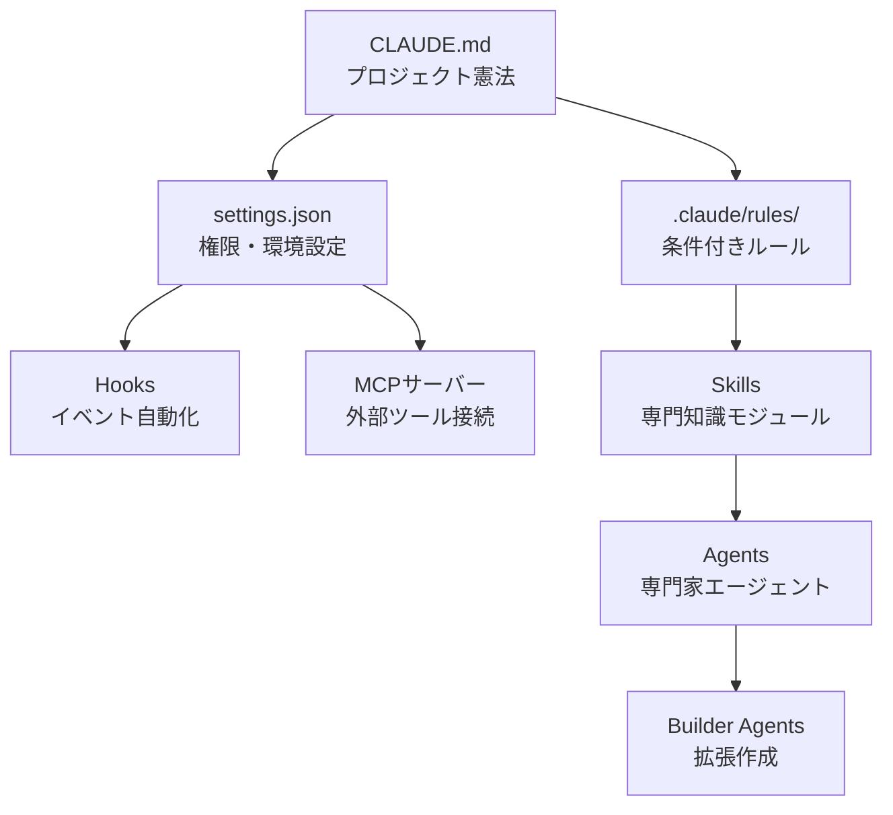

# 上級トピック

MoAI-ADKの内部構造と高度な機能を詳しく解説します。


このセクションは、MoAI-ADKの基本概念を理解した後、内部動作原理を詳しく学習したい開発者向けのガイドです。


## 学習構造

MoAI-ADKは7つのコアコンポーネントで構成されています。

## 目次

| トピック | 説明 |
|------|------|
| [スキルガイド](/advanced/skill-guide) | AIに専門知識を付与するスキルシステム |
| [エージェントガイド](/advanced/agent-guide) | 専門化されたAIタスク実行者体系 |
| [ビルダーエージェントガイド](/advanced/builder-agents) | スキル、エージェント、コマンド、プラグイン作成 |
| [Hooksガイド](/advanced/hooks-guide) | インベトベース自動化スクリプト |
| [settings.jsonガイド](/advanced/settings-json) | Claude Codeグローバル設定管理 |
| [CLAUDE.mdガイド](/advanced/claude-md-guide) | プロジェクトガイドラインファイル体系 |
| [MCPサーバー活用](/advanced/mcp-servers) | 外部ツール接続プロトコル |
| [Google Stitchガイド](/advanced/stitch-guide) | AIベースUI/UXデザイン作成ツール |


各ドキュメントは独立して読めますが、**スキルガイド**から順番に読むと全体アーキテクチャを体系的に理解できます。

