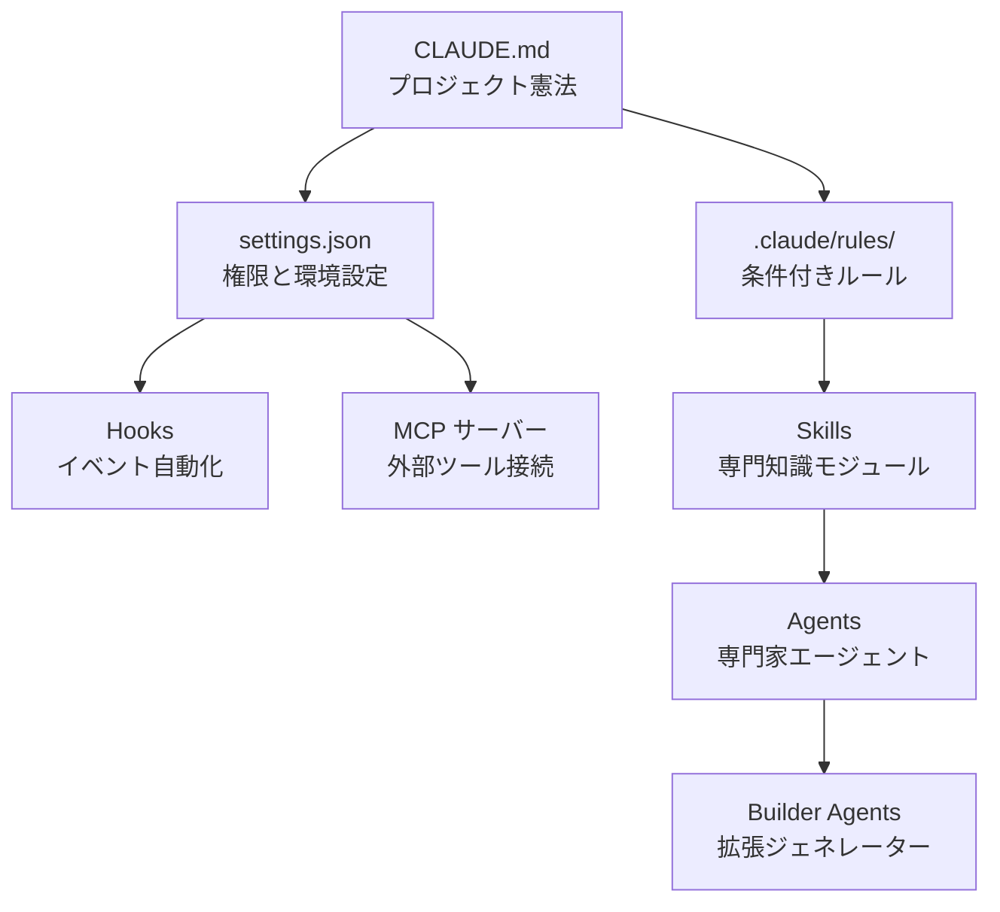

 <strong>所属バリュー</strong>: 🪙 トークノミクス · 🧠 再帰的自己学習 · 🛡️ エージェント型ハーネス

<!-- @value: tokenomics, self-learning, agentic-harness -->

MoAI-ADK の内部構造を掘り下げたい開発者のためのセクションです。基本ワークフロー(plan → run → sync)に慣れたら、ここでハーネスが実際にどのように組み立てられているかを確認できます。


このセクションのドキュメントは、v3.0 の三本柱 — **トークノミクス** (Token Economics)、**エージェンティック・ループ・エンジニアリング** (Agentic Loop Engineering)、**エージェンティック・ハーネス** (Agentic Harness) — のうち、主に第三の柱の実装詳細を扱います。エージェントに良いコードを書かせる秘訣はモデルではなく、モデルを取り巻く環境設計にあります。


## ハーネスはどう組み立てられるか

MoAI-ADK ハーネスは 7 つの構成要素が層をなして動作します。上から下へ行くほど、より動的な階層になります。

```mermaid
flowchart TD
    CLAUDE["CLAUDE.md<br>プロジェクト憲法"] --> SETTINGS["settings.json<br>権限と環境設定"]
    CLAUDE --> RULES[".claude/rules/<br>条件付きルール"]

    SETTINGS --> HOOKS["Hooks<br>イベント自動化"]
    SETTINGS --> MCP["MCP サーバー<br>外部ツール接続"]

    RULES --> SKILLS["Skills<br>専門知識モジュール"]
    SKILLS --> AGENTS["Agents<br>専門家エージェント"]

    AGENTS --> BUILDERS["Builder Agents<br>拡張ジェネレーター"]

```

`CLAUDE.md` がプロジェクトの憲法だとすれば、settings.json は権限の境界線であり、フックは決定的(deterministic)な制御ポイント、スキルとエージェントは実際に働く手です。そして Builder Agents はこの構造全体を再生成できます — ハーネスがハーネスを作る再帰構造です。

## 目次

### ハーネスの構成要素

| トピック | 説明 |
|------|------|
| [スキルガイド](/ja/advanced/skill-guide) | AI に専門知識を付与するスキルシステム |
| [エージェントガイド](/ja/advanced/agent-guide) | 専門化された AI 作業実行者の体系 |
| [ビルダーエージェントガイド](/ja/advanced/builder-agents) | スキル、エージェント、コマンド、プラグインの生成 |
| [Harness v4 Builder](/ja/advanced/harness-v4-builder) | 自然言語ひと言でプロジェクト専用ハーネスを生成 |
| [ハーネスプロファイルと評価システム](/ja/advanced/harness-profiles) | 3 階層の検証深度 + 4 次元スコアリング |
| [カタログシステム](/ja/advanced/catalog-system) | 3 階層マニフェストと slim init |

### 制御と自動化

| トピック | 説明 |
|------|------|
| [Hooks ガイド](/ja/advanced/hooks-guide) | イベント駆動の自動化スクリプト |
| [Hooks リファレンス](/ja/advanced/hooks-reference) | MoAI-ADK が配布するフック一覧 |
| [settings.json ガイド](/ja/advanced/settings-json) | Claude Code グローバル設定管理 |
| [CLAUDE.md ガイド](/ja/advanced/claude-md-guide) | プロジェクト指針ファイル体系 |
| [セキュリティノート](/ja/advanced/security-notes) | 権限スタックとサンドボックス |

### ループと観測

| トピック | 説明 |
|------|------|
| [意思決定メモリ](/ja/advanced/decision-memory) | ユーザーの選択を学習する観測システム |
| [ultracode ワークフロー](/ja/advanced/ultracode-workflows) | 動的ワークフローオーケストレーション |
| [statusline](/ja/advanced/statusline) | コンテキスト使用率・キャッシュヒット率の常時ダッシュボード |

### 外部ツール連携

| トピック | 説明 |
|------|------|


各ドキュメントは独立して読めます。ただし全体アーキテクチャを体系的に理解したい場合は、**スキルガイド → エージェントガイド → ビルダーエージェント** の順をお勧めします — 知識モジュールから実行者へ、実行者からジェネレーターへとつながる流れが、ハーネスの再帰構造をそのまま示しているからです。

