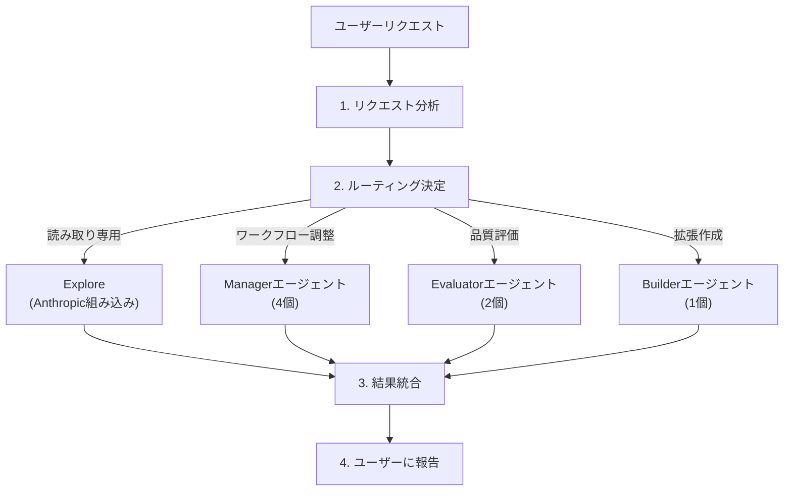
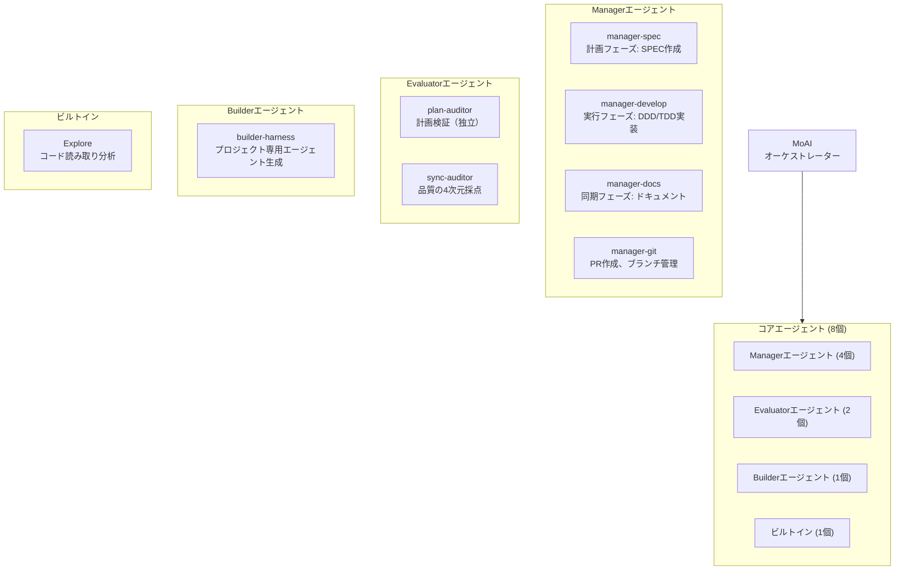
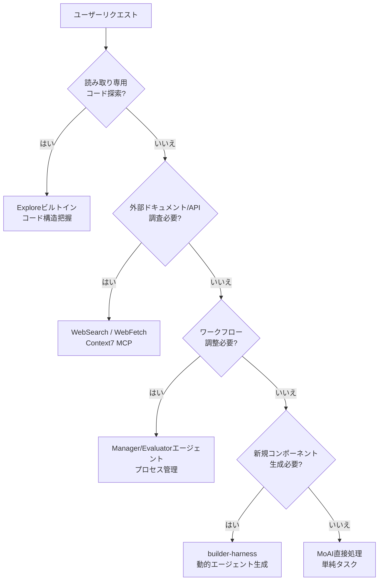
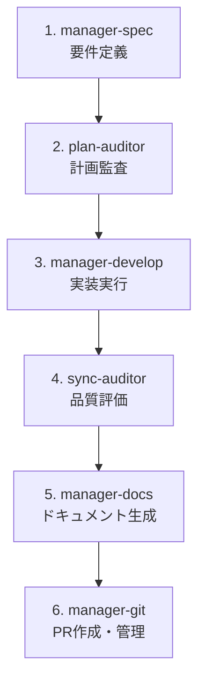

MoAI-ADKのエージェントシステムを詳しく解説します。


**要約**: エージェントは各分野の**専門家チーム**です。MoAIがチームリーダーとして適切な専門家にタスクを振り分けます。


## エージェントとは？

エージェントは特定分野に専門化された **AIタスク実行者**です。

Claude Code の **Sub-agent（サブエージェント）**システムを基盤としており、各エージェントは独立したコンテキストウィンドウ、カスタムシステムプロンプト、特定ツールアクセス、独立した権限を持ちます。

企業組織に例えると、MoAIはCEO、Managerエージェントは部門長、Expertエージェントは各分野の専門家、Builderエージェントは新規チームメンバーを採用するHRチームです。

## MoAIオーケストレーター

MoAIはMoAI-ADKの**最上位調整者**です。ユーザーのリクエストを分析し、適切なエージェント（8つの保持エージェントのみ）にタスクを委任します。

### MoAIのコアルルール

| ルール | 説明 |
|------|------|
| 委任専用 | 複雑なタスクは直接実行せず、特化したエージェント（manager/evaluator/builder）に委任 |
| ユーザー向け窓口 | ユーザーとの対話はMoAIのみ実行（下位エージェントはユーザーに直接質問不可） |
| 並列実行 | 独立したタスクは複数のエージェントに同時に委任（エージェントチームモード） |
| 統合結果 | エージェント実行結果を取りまとめてユーザーに報告 |
| アーカイブなし | 12個のアーカイブエージェントは利用不可；ドメイン専門知識はmanager-developのコンテキスト注入で対応 |

### MoAIのリクエスト処理フロー



## 8つの保持エージェント統合構成

MoAI-ADKは**8つの保持エージェント**を使用しています（7つのMoAI独自エージェント + 1つのAnthropicビルトイン）。



## Managerエージェント詳細

Managerエージェントは**ワークフローを調整・管理**する4つの中核エージェントです。

| エージェント | 役割 | 使用スキル | 主なツール |
|----------|------|-----------|------------|
| `manager-spec` | 計画フェーズ：SPECドキュメント作成、GEARS形式要件定義 | `moai-workflow-spec` | Read, Write, Grep |
| `manager-develop` | 実行フェーズ：DDD/TDD実装サイクル実行 | `moai-workflow-ddd`, `moai-workflow-tdd`, `moai-foundation-core` | Read, Write, Edit, Bash |
| `manager-docs` | 同期フェーズ：ドキュメント生成、CHANGELOG更新 | `moai-library-nextra`, `moai-workflow-project` | Read, Write, Edit |
| `manager-git` | PR作成、ブランチ管理、Late-Branchパターン | `moai-foundation-core` | Bash (git) |

### Managerエージェントとワークフローコマンド

Managerエージェントは主要なMoAIワークフローコマンドと直接接続されています。

```bash
# Planフェーズ: manager-specがSPECドキュメント作成
> /moai plan "ユーザー認証システム実装"

# Runフェーズ: manager-developがDDDサイクル実行
> /moai run SPEC-AUTH-001

# Syncフェーズ: manager-docsがドキュメント同期
> /moai sync SPEC-AUTH-001
```

## Evaluatorエージェント詳細

Evaluatorエージェントは**独立した品質評価と検証**を実行する2つのエージェントです。

| エージェント | 役割 | 使用スキル | 主なツール |
|----------|------|-----------|------------|
| `plan-auditor` | 計画フェーズ監査、偏り防止、GEARS準拠検証 | `moai-foundation-core` | Read, Grep, Bash |
| `sync-auditor` | 独立した懐疑的品質評価、4次元採点（機能/セキュリティ/工芸/一貫性） | `moai-foundation-quality` | Read, Grep, Bash |

## Builderエージェント詳細

Builderエージェントは**プロジェクト専用のドメイン特化型エージェント**を動的に生成します。

| エージェント | 役割 | 生成物 |
|----------|------|--------|
| `builder-harness` | プロジェクト固有のエージェント自動生成 | `.claude/agents/harness/*.md` |


Builderエージェントの詳細は[ビルダーエージェントガイド](/advanced/builder-agents)を参照してください。


## エージェント選択決定ツリー

MoAIがユーザーリクエストを分析して適切なエージェントを選択するプロセスです。



### エージェント選択基準

| タスクタイプ | 選択するエージェント | 例 |
|-----------|----------------|------|
| コード読み取り/分析 | Explore | "このプロジェクトの構造を分析して" |
| 実装（API/UI/バグ修正） | manager-develop | `/moai run SPEC-XXX` |
| セキュリティレビュー | sync-auditor | "コードをセキュリティ観点でレビュー" |
| テスト作成 | manager-develop | `/moai run SPEC-XXX` |
| SPEC作成 | manager-spec | `/moai plan "機能説明"` |
| 計画監査 | plan-auditor | plan-faseの独立検証 |
| ドキュメント生成 | manager-docs | `/moai sync SPEC-XXX` |
| Git/PR管理 | manager-git | PR作成、ブランチ管理 |
| 拡張作成 | builder-harness | プロジェクト専用エージェント生成 |

## エージェント定義ファイル

8つの保持エージェントは`.claude/agents/moai/`ディレクトリのマークダウンファイルで定義されます（FLAT構成）。

### ファイル構造

```
.claude/agents/moai/
├── manager-spec.md
├── manager-develop.md
├── manager-docs.md
├── manager-git.md
├── plan-auditor.md
├── sync-auditor.md
├── builder-harness.md
└── README.md (カタログ参照)
```

プロジェクト専用エージェントは以下に生成されます：

```
.claude/agents/harness/
├── {domain}-specialist-1.md
├── {domain}-specialist-2.md
└── ...
```

### エージェント定義形式

```markdown
---
name: manager-develop
description: >
  実行フェーズの実装を担当。DDD/TDDサイクルに基づいてSPEC要件を実装。
tools: Read, Write, Edit, Grep, Glob, Bash
model: sonnet
---

あなたはmanager-developエージェント。実行フェーズ(DDD/TDD)の実装を担当します。

## 役割
- SPEC要件の分析と実装計画
- DDD ANALYZE-PRESERVE-IMPROVE サイクル実行
- TDD RED-GREEN-REFACTOR サイクル実行
- テストドリブン開発の実践

## 使用スキル
- moai-workflow-ddd
- moai-workflow-tdd
- moai-workflow-testing
- moai-foundation-core

## 品質基準
- TRUST 5フレームワーク準拠
- 85%+ テストカバレッジ
- すべてのSPEC受入基準を満たす
```


**注意**: 下位エージェントは**ユーザーに直接質問できません**。すべてのユーザー対話はMoAIを通じてのみ実行されます。エージェントに委任する前に必要な情報を収集してください。


## エージェント間連携パターン

### Plan-Run-Sync順次フロー

```bash
# 1. manager-specがSPEC作成
# 2. plan-auditorが計画を独立検証
# 3. manager-developが実装を実行
# 4. sync-auditorが品質を評価
# 5. manager-docsがドキュメント同期
> /moai plan "認証システム"
> /moai run SPEC-AUTH-001
> /moai sync SPEC-AUTH-001
```

### エージェントチェーン（現代的フロー）

複雑なタスクでは複数のエージェントが順番に作業を引き継ぎます。



## Sub-agent（サブエージェント）システム

Claude Code の公式 Sub-agent システムは MoAI-ADK のエージェント構造の基盤となります。

### Sub-agent とは？

Sub-agent は **特定のタスクタイプに特化された AI アシスタント**です。

| 特徴 | 説明 |
|------|------|
| **独立コンテキスト** | 各 sub-agent は独自のコンテキストウィンドウで実行 |
| **カスタムプロンプト** | カスタムシステムプロンプトで動作を定義 |
| **特定ツールアクセス** | 必要なツールのみ選択的に提供 |
| **独立権限** | 個別権限設定可能 |

### Sub-agent vs エージェントチーム

| サブエージェントモード | エージェントチームモード |
|---------------------|---------------------|
| 単一 sub-agent が順次にタスク実行 | 複数のチームメンバーが並列で協業 |
| シンプルなタスクに適している | 複雑な多段階タスクに適している |
| 高速実行 | 系統的な調整が必要 |

## エージェントチーム（Agent Teams）

エージェントチームモードは複数の専門家が **並列で協業** する高度なワークフローです。


**実験的機能**: エージェントチームは Claude Code v2.1.32+ で利用可能で、`CLAUDE_CODE_EXPERIMENTAL_AGENT_TEAMS=1` 環境変数と `workflow.team.enabled: true` 設定が必要です。


### チームモード設定

| 設定 | デフォルト | 説明 |
|---------|---------|-------------|
| `workflow.team.enabled` | `false` | エージェントチームモードを有効化 |
| `workflow.team.max_teammates` | `10` | チームあたりの最大チームメイト数 |
| `workflow.team.auto_selection` | `true` | 複雑さに基づく自動モード選択 |

### モード選択

| フラグ | 動作 |
|-------|------|
| **--team** | チームモードを強制 |
| **--solo** | サブエージェントモードを強制 |
| **フラグなし** | 複雑さのしきい値に基づき自動選択 |

### /moai --team ワークフロー

MoAI の `--team` フラグは SPEC ワークフローでエージェントチームを有効化します。

```bash
# Plan フェーズ: チームモードで研究・分析
> /moai plan --team "ユーザー認証システム"
# researcher、analyst、architect が並列で作業

# Run フェーズ: チームモードで実装
> /moai run --team SPEC-AUTH-001
# backend-dev、frontend-dev、tester が並列で作業

# Sync フェーズ: ドキュメント生成（常に sub-agent）
> /moai sync SPEC-AUTH-001
# manager-docs がドキュメントを生成
```

### チーム構成

| 役割 | Plan Phase | Run Phase | 権限 |
|------|------------|-----------|------|
| **チームリード** | MoAI | MoAI | すべての作業を調整 |
| **研究者** | researcher (haiku) | - | 読み取り専用コード分析 |
| **分析者** | analyst (inherit) | - | 要件分析 |
| **設計者** | architect (inherit) | - | 技術設計 |
| **バックエンド開発** | - | backend-dev (acceptEdits) | サーバーサイドファイル |
| **フロントエンド開発** | - | frontend-dev (acceptEdits) | クライアントサイドファイル |
| **テスター** | - | tester (acceptEdits) | テストファイル |
| **デザイナー** | - | designer (acceptEdits) | UI/UX デザイン |
| **品質** | - | quality (plan) | TRUST 5 検証 |

### チームファイル所有権

エージェントチームではファイル所有権を明確に区分して競合を防止します。

| ファイルタイプ | 所有権 |
|-------------|--------|
| `.md` ドキュメント | すべてのチームメンバー |
| `src/` | backend-dev |
| `components/` | frontend-dev |
| `tests/` | tester |
| `*.design.pen` | designer |
| 共有設定 | すべてのチームメンバー |

## 関連ドキュメント

- [スキルガイド](/advanced/skill-guide) - エージェントが活用するスキル体系
- [ビルダーエージェントガイド](/advanced/builder-agents) - カスタムエージェント作成
- [Hooksガイド](/advanced/hooks-guide) - エージェント実行前後自動化
- [SPECベース開発](/core-concepts/spec-based-dev) - SPECワークフロー詳細


**ヒント**: エージェントを直接指定する必要はありません。MoAIに自然言語でリクエストすれば最適のエージェントが自動的に選択されます。「APIを作成して」と言えば`manager-develop`が、「このコードをレビューして」と言えば`sync-auditor`が自動的に呼び出されます。

