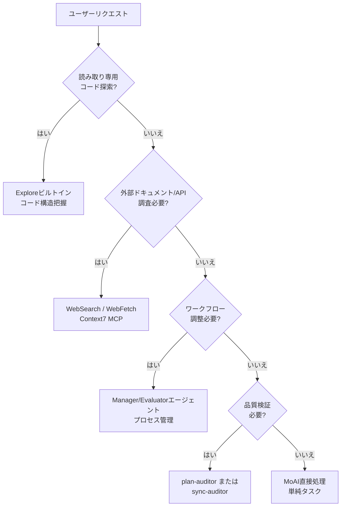

MoAI-ADKの8つのコアエージェント システムを詳細に解説します。


**一言でいうと**: エージェントは各分野の**専門家チーム**です。MoAIがチームリーダーとして適切な専門家にタスクを振り分けます。


## エージェントとは？

エージェントは特定分野に専門化された **AIタスク実行者**です。

Claude Code の **Sub-agent（サブエージェント）**システムを基盤としており、各エージェントは独立したコンテキストウィンドウ、カスタムシステムプロンプト、特定ツールアクセス、独立した権限を持ちます。

企業組織に例えると、MoAIはCEO、Managerエージェントは部門長、Evaluatorエージェントは品質監視官、Builderエージェントは新規チーム生成担当者です。

## MoAIオーケストレーター

MoAIはMoAI-ADKの**最上位調整者**です。ユーザーのリクエストを分析し、適切なエージェント（8つの保持エージェントのみ）にタスクを委任します。

### MoAIのコアルール

| ルール | 説明 |
|------|------|
| 委任専用 | 複雑なタスクは直接実行せず、専門エージェントに委任 |
| ユーザー向け窓口 | ユーザーとの対話はMoAIのみ実行（下位エージェントは直接質問不可） |
| 並列実行 | 独立したタスクは複数のエージェントに同時に委任（エージェントチームモード） |
| 統合結果 | エージェント実行結果を取りまとめてユーザーに報告 |

## 8つの保持エージェント カタログ

MoAI-ADKは**8つの保持エージェント**（7つのMoAI独自エージェント + 1つのAnthropicビルトイン）を使用します。

### Managerエージェント（4個）

| エージェント | 役割 | 段階 | 主なスキル |
|----------|------|------|----------|
| `manager-spec` | SPEC文書生成、GEARS形式要件定義 | Plan | `moai-workflow-spec` |
| `manager-develop` | DDD/TDD実装サイクル（quality.yamlのcycle_type） | Run | `moai-workflow-ddd`, `moai-workflow-tdd` |
| `manager-docs` | ドキュメント生成、CHANGELOG、README同期 | Sync | `moai-workflow-project` |
| `manager-git` | PR作成、Git分岐、マージ戦略 | PR（Tier L） | `moai-foundation-core` |

### Evaluatorエージェント（2個）

| エージェント | 役割 | 評価対象 | 主なスキル |
|----------|------|---------|----------|
| `plan-auditor` | Plan段階独立監査、GEARS準拠、偏り防止 | SPEC完成度 | `moai-foundation-core`, `moai-foundation-thinking` |
| `sync-auditor` | Sync段階品質スコア（4次元：Functionality, Security, Craft, Consistency） | 実装品質 | `moai-foundation-quality`, `moai-foundation-core` |

### Builderエージェント（1個）

| エージェント | 役割 | 生成物 |
|----------|------|--------|
| `builder-harness` | プロジェクト固有の動的エージェント生成（Socratic面接ベース） | `.claude/agents/harness/`, `.moai/harness/manifest.json` |

### ビルトインエージェント（1個、Anthropic）

| エージェント | 役割 | 特徴 |
|----------|------|------|
| `Explore` | 読み取り専用コード探索・分析 | Haikuモデル、Read-onlyツール |

## Manager-Developドメイン コンテキスト注入

`manager-develop`はドメイン別コンテキストを注入されて呼び出されます。

- **バックエンド作業**: `manager-develop` + バックエンド ドメイン コンテキスト + `moai-domain-backend` スキル
- **フロントエンド作業**: `manager-develop` + フロントエンド ドメイン コンテキスト + `moai-domain-frontend` スキル
- **その他ドメイン**: 言語別スキル + 専門性プロンプト

## エージェント選択 決定ツリー

MoAIがユーザーリクエストを分析して適切なエージェントを選択するプロセスです。



## エージェント定義ファイル

8つの保持エージェントは`.claude/agents/moai/`ディレクトリのマークダウンファイルで定義されます。

### ファイル構造

```
.claude/agents/moai/
├── manager-spec.md
├── manager-develop.md
├── manager-docs.md
├── manager-git.md
├── plan-auditor.md
├── sync-auditor.md
├── builder-harness.md
└── (Explore: Anthropic組み込み、ファイルなし)
```

### エージェント定義形式

```markdown
---
name: my-specialist
description: >
  このプロジェクトの専門家。特定ドメイン専門性説明。
tools: Read, Write, Edit, Grep, Glob, Bash
model: inherit
---

あなたはこのプロジェクトの[ドメイン]専門家です。

## 役割

- 責任1
- 責任2
- 責任3

## 使用スキル

- moai-domain-[domain]
- 言語別スキル
```

## エージェント間連携パターン

### Plan-Run-Sync順次ワークフロー

```bash
# 1. manager-specがSPEC作成
/moai plan "機能説明"

# 2. plan-auditorがSPEC品質検証
# (自動実行)

# 3. manager-developがDDD/TDD実装
/moai run SPEC-XXX

# 4. sync-auditorが4次元品質スコア
# (自動実行)

# 5. manager-docsがドキュメント同期
/moai sync SPEC-XXX
```

### エージェントチーム並列実行（実験的）

```bash
# MoAIが複数の専門家を同時に委任（--teamフラグ）
> /moai plan --team "ユーザー認証システム"
> /moai run --team SPEC-AUTH-001
```

## Sub-agentシステム基礎

Claude Code の公式Sub-agentシステムはMoAI-ADKのエージェント構造の基盤です。

### Sub-agentの特徴

| 特徴 | 説明 |
|------|------|
| **独立コンテキスト** | 各sub-agentは自体の200Kトークンコンテキストウィンドウで実行 |
| **カスタムプロンプト** | 専門システムプロンプトで役割と行動定義 |
| **特定ツールアクセス** | 必要なツールのみ選択的に提供 |
| **独立権限** | 個別権限モード設定可能 |

### Sub-agent制約事項

| 制約 | 説明 |
|------|------|
| サブエージェント生成不可 | 下位エージェントは他の下位エージェントを生成できない |
| AskUserQuestion制限 | 下位エージェントはユーザーと直接対話できない |
| スキル非継承 | 親会話のスキルを継承しない |
| 独立コンテキスト | 各エージェントは独立した200Kトークンコンテキストを持つ |

## エージェントチーム（実験的）

エージェントチームモードは動的専門家が**並列で協業**する高度なワークフローです。

### チームモード設定

| 設定 | 基本値 | 説明 |
|---------|---------|-------------|
| `workflow.team.enabled` | `false` | エージェントチームモード有効化 |
| `workflow.team.max_teammates` | `5` | チームあたり最大チームメイト数（Anthropic推奨） |
| `workflow.team.auto_selection` | `true` | 複雑度ベース自動モード選択 |

### モード選択

| フラグ | 動作 |
|-------|------|
| **--team** | エージェントチームモード強制 |
| **--solo** | Sub-agentモード強制 |
| **フラグなし** | 複雑度閾値ベース自動選択 |

## 関連ドキュメント

- [Harness v4 Builder](/ja/advanced/builder-agents) - 動的エージェント生成
- [スキルガイド](/ja/advanced/skill-guide) - エージェントが活用するスキル体系
- [SPEC基盤開発](/ja/workflow-commands/moai-plan) - SPECワークフロー詳細


**ヒント**: エージェントを直接指定する必要はありません。MoAIに自然言語でリクエストすれば最適のエージェントが自動的に選択されます。

