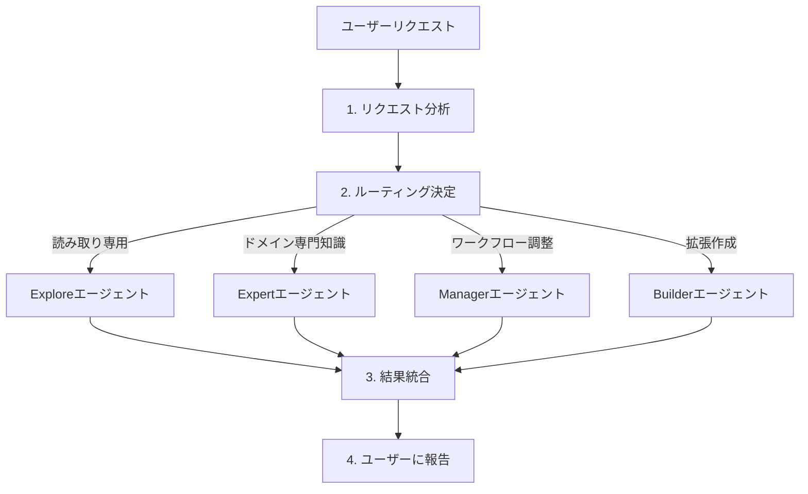
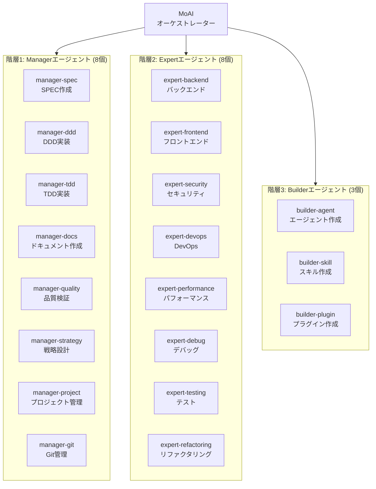
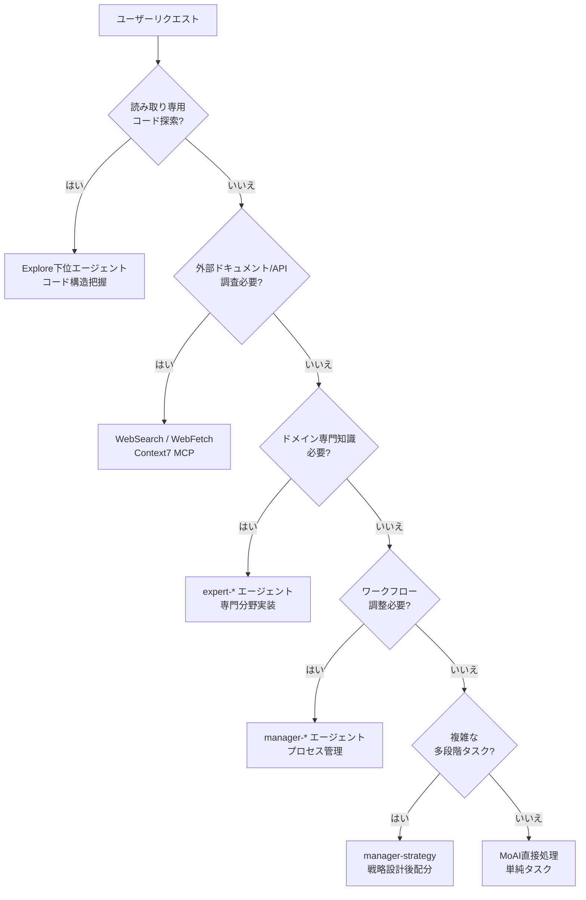
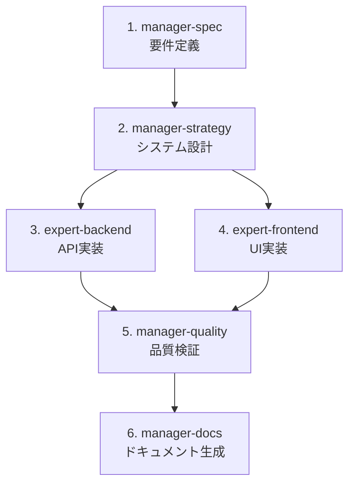

MoAI-ADKのエージェントシステムを詳しく解説します。


**要約**: エージェントは各分野の**専門家チーム**です。MoAIがチームリーダーとして適切な専門家にタスクを振り分けます。


## エージェントとは？

エージェントは特定分野に専門化された **AIタスク実行者**です。

Claude Code の **Sub-agent（サブエージェント）**システムを基盤としており、各エージェントは独立したコンテキストウィンドウ、カスタムシステムプロンプト、特定ツールアクセス、独立した権限を持ちます。

企業組織に例えると、MoAIはCEO、Managerエージェントは部門長、Expertエージェントは各分野の専門家、Builderエージェントは新規チームメンバーを採用するHRチームです。

## MoAIオーケストレーター

MoAIはMoAI-ADKの**最上位調整者**です。ユーザーのリクエストを分析し、適切なエージェントにタスクを委任します。

### MoAIのコアルルール

| ルール | 説明 |
|------|------|
| 委任専用 | 複雑なタスクは直接実行せず専門エージェントに委任 |
| ユーザー向け窓口 | ユーザーとの対話はMoAIのみ実行（下位エージェントは不可） |
| 並列実行 | 独立したタスクは複数のエージェントに同時に委任 |
| 統合結果 | エージェント実行結果を取りまとめてユーザーに報告 |

### MoAIのリクエスト処理フロー



## エージェント3階層

MoAI-ADKのエージェントは**3つの階層**で構成されます。



## Managerエージェント詳細

Managerエージェントは**ワークフローを調整・管理**する役割を果たします。

| エージェント | 役割 | 使用スキル | 主なツール |
|----------|------|-----------|------------|
| `manager-spec` | SPECドキュメント作成、EARS形式要件定義 | `moai-workflow-spec` | Read, Write, Grep |
| `manager-ddd` | ANALYZE-PRESERVE-IMPROVEサイクル実行 | `moai-workflow-ddd`, `moai-foundation-core` | Read, Write, Edit, Bash |
| `manager-docs` | ドキュメント生成、Nextra統合 | `moai-library-nextra`, `moai-docs-generation` | Read, Write, Edit |
| `manager-quality` | TRUST 5検証、コードレビュー | `moai-foundation-quality` | Read, Grep, Bash |
| `manager-strategy` | システム設計、アーキテクチャ決定 | `moai-foundation-core`, `moai-foundation-philosopher` | Read, Grep, Glob |
| `manager-project` | プロジェクト構成、初期化 | `moai-workflow-project` | Read, Write, Bash |
| `manager-tdd` | RED-GREEN-REFACTORサイクル実行 | `moai-workflow-tdd`, `moai-foundation-core` | Read, Write, Edit, Bash |
| `manager-git` | Gitブランチ、マージ戦略 | `moai-foundation-core` | Bash (git) |

### Managerエージェントとワークフローコマンド

Managerエージェントは主要なMoAIワークフローコマンドと直接接続されています。

```bash
# Planフェーズ: manager-specがSPECドキュメント作成
> /moai plan "ユーザー認証システム実装"

# Runフェーズ: manager-dddがDDDサイクル実行
> /moai run SPEC-AUTH-001

# Syncフェーズ: manager-docsがドキュメント同期
> /moai sync SPEC-AUTH-001
```

## Expertエージェント詳細

Expertエージェントは**特定ドメインで実際の実装作業**を実行します。

| エージェント | 役割 | 使用スキル | 主なツール |
|----------|------|-----------|------------|
| `expert-backend` | API開発、サーバーロジック、DB統合 | `moai-domain-backend`、言語別スキル | Read, Write, Edit, Bash |
| `expert-frontend` | Reactコンポーネント、UI実装 | `moai-domain-frontend`, `moai-lang-typescript` | Read, Write, Edit, Bash |
| `expert-security` | セキュリティ分析、OWASP準拠 | `moai-foundation-core` (TRUST 5) | Read, Grep, Bash |
| `expert-devops` | CI/CD、インフラ、デプロイ自動化 | プラットフォーム別スキル | Read, Write, Bash |
| `expert-performance` | パフォーマンス最適化、プロファイリング | ドメイン別スキル | Read, Grep, Bash |
| `expert-debug` | デバッグ、エラー分析、問題解決 | 言語別スキル | Read, Grep, Bash |
| `expert-testing` | テスト作成、カバレッジ改善 | `moai-workflow-testing` | Read, Write, Bash |
| `expert-refactoring` | コードリファクタリング、アーキテクチャ改善 | `moai-workflow-ddd` | Read, Write, Edit |

### Expertエージェント活用例

```bash
# バックエンドAPI開発リクエスト
> FastAPIでユーザーCRUD APIを作成して
# → MoAIがexpert-backendに委任
# → moai-lang-python + moai-domain-backendスキルが有効化

# セキュリティ分析リクエスト
> このコードのセキュリティ脆弱性を分析して
# → MoAIがexpert-securityに委任
# → OWASP Top 10基準で分析

# パフォーマンス最適化リクエスト
> このクエリが遅いので最適化して
# → MoAIがexpert-performanceに委任
# → プロファイリングと最適化提案
```

## Builderエージェント詳細

Builderエージェントは**MoAI-ADKを拡張する新規コンポーネント**を作成します。

| エージェント | 役割 | 生成物 |
|----------|------|--------|
| `builder-agent` | 新規エージェント定義作成 | `.claude/agents/moai/*.md` |
| `builder-skill` | 新規スキル作成 | `.claude/skills/my-skills/*/skill.md` |
| `builder-plugin` | 新規プラグイン作成 | `.claude-plugin/plugin.json` |


Builderエージェントの詳細は[ビルダーエージェントガイド](/advanced/builder-agents)を参照してください。


## エージェント選択決定ツリー

MoAIがユーザーリクエストを分析して適切なエージェントを選択するプロセスです。



### エージェント選択基準

| タスクタイプ | 選択するエージェント | 例 |
|-----------|----------------|------|
| コード読み取り/分析 | Explore | "このプロジェクトの構造を分析して" |
| API開発 | expert-backend | "REST APIエンドポイントを作成して" |
| UI実装 | expert-frontend | "ログインページを作成して" |
| バグ修正 | expert-debug | "このエラーの原因を特定して" |
| テスト作成 | expert-testing | "この関数のテストを追加して" |
| セキュリティレビュー | expert-security | "セキュリティ脆弱点をチェックして" |
| SPEC作成 | manager-spec | `/moai plan "機能説明"` |
| DDD実装 | manager-ddd | `/moai run SPEC-XXX` |
| ドキュメント生成 | manager-docs | `/moai sync SPEC-XXX` |
| コードレビュー | manager-quality | "このPRをレビューして" |
| 拡張作成 | builder-* | "新しいスキルを作成して" |

## エージェント定義ファイル

エージェントは`.claude/agents/moai/`ディレクトリのマークダウンファイルで定義されます。

### ファイル構造

```
.claude/agents/moai/
├── expert-backend.md
├── expert-frontend.md
├── expert-security.md
├── expert-devops.md
├── expert-performance.md
├── expert-debug.md
├── expert-testing.md
├── expert-refactoring.md
├── manager-spec.md
├── manager-ddd.md
├── manager-docs.md
├── manager-quality.md
├── manager-strategy.md
├── manager-project.md
├── manager-git.md
├── builder-agent.md
├── builder-skill.md
└── builder-plugin.md
```

### エージェント定義形式

```markdown
---
name: expert-backend
description: >
  バックエンドAPI開発専門家。API設計、サーバーロジック、データベース統合を担当。
  PROACTIVELY使用してバックエンド実装タスク時に自動委任。
tools: Read, Write, Edit, Grep, Glob, Bash, TodoWrite
model: sonnet
---

あなたはバックエンド開発専門家です。

## 役割
- REST/GraphQL API設計・実装
- データベーススキーマ設計
- 認証・認可システム実装
- サーバーサイドビジネスロジック

## 使用スキル
- moai-domain-backend
- moai-lang-python (Pythonプロジェクト時)
- moai-lang-typescript (TypeScriptプロジェクト時)

## 品質基準
- TRUST 5フレームワーク準拠
- 85%+ テストカバレッジ
- OWASP Top 10 セキュリティ基準
```


**注意**: 下位エージェントは**ユーザーに直接質問できません**。すべてのユーザー対話はMoAIを通じてのみ実行されます。エージェントに委任する前に必要な情報を収集してください。


## エージェント間連携パターン

### 順次実行（依存関係あり）

```bash
# 1. manager-specがSPEC作成
# 2. SPECを基にmanager-dddが実装
# 3. 実装完了後manager-docsがドキュメント作成
> /moai plan "認証システム"
> /moai run SPEC-AUTH-001
> /moai sync SPEC-AUTH-001
```

### 並列実行（独立タスク）

```bash
# MoAIが独立したタスクを同時に委任
# - expert-backend: API実装
# - expert-frontend: UI実装
# - expert-testing: テスト作成
> バックエンドAPIとフロントエンドUIを同時に作成して
```

### エージェントチェーン

複雑なタスクでは複数のエージェントが順番に作業を引き継ぎます。



## Sub-agent（サブエージェント）システム

Claude Code の公式 Sub-agent システムは MoAI-ADK のエージェント構造の基盤となります。

### Sub-agent とは？

Sub-agent は **特定のタスクタイプに特化された AI アシスタント**です。

| 特徴 | 説明 |
|------|------|
| **独立コンテキスト** | 各 sub-agent は独自のコンテキストウィンドウで実行 |
| **カスタムプロンプト** | カスタムシステムプロンプトで動作を定義 |
| **特定ツールアクセス** | 必要なツールのみ選択的に提供 |
| **独立権限** | 個別権限設定可能 |

### Sub-agent vs エージェントチーム

| サブエージェントモード | エージェントチームモード |
|---------------------|---------------------|
| 単一 sub-agent が順次にタスク実行 | 複数のチームメンバーが並列で協業 |
| シンプルなタスクに適している | 複雑な多段階タスクに適している |
| 高速実行 | 系統的な調整が必要 |

## エージェントチーム（Agent Teams）

エージェントチームモードは複数の専門家が **並列で協業** する高度なワークフローです。


**実験的機能**: エージェントチームは Claude Code v2.1.32+ で利用可能で、`CLAUDE_CODE_EXPERIMENTAL_AGENT_TEAMS=1` 環境変数と `workflow.team.enabled: true` 設定が必要です。


### チームモード設定

| 設定 | デフォルト | 説明 |
|---------|---------|-------------|
| `workflow.team.enabled` | `false` | エージェントチームモードを有効化 |
| `workflow.team.max_teammates` | `10` | チームあたりの最大チームメイト数 |
| `workflow.team.auto_selection` | `true` | 複雑さに基づく自動モード選択 |

### モード選択

| フラグ | 動作 |
|-------|------|
| **--team** | チームモードを強制 |
| **--solo** | サブエージェントモードを強制 |
| **フラグなし** | 複雑さのしきい値に基づき自動選択 |

### /moai --team ワークフロー

MoAI の `--team` フラグは SPEC ワークフローでエージェントチームを有効化します。

```bash
# Plan フェーズ: チームモードで研究・分析
> /moai plan --team "ユーザー認証システム"
# researcher、analyst、architect が並列で作業

# Run フェーズ: チームモードで実装
> /moai run --team SPEC-AUTH-001
# backend-dev、frontend-dev、tester が並列で作業

# Sync フェーズ: ドキュメント生成（常に sub-agent）
> /moai sync SPEC-AUTH-001
# manager-docs がドキュメントを生成
```

### チーム構成

| 役割 | Plan Phase | Run Phase | 権限 |
|------|------------|-----------|------|
| **チームリード** | MoAI | MoAI | すべての作業を調整 |
| **研究者** | researcher (haiku) | - | 読み取り専用コード分析 |
| **分析者** | analyst (inherit) | - | 要件分析 |
| **設計者** | architect (inherit) | - | 技術設計 |
| **バックエンド開発** | - | backend-dev (acceptEdits) | サーバーサイドファイル |
| **フロントエンド開発** | - | frontend-dev (acceptEdits) | クライアントサイドファイル |
| **テスター** | - | tester (acceptEdits) | テストファイル |
| **デザイナー** | - | designer (acceptEdits) | UI/UX デザイン |
| **品質** | - | quality (plan) | TRUST 5 検証 |

### チームファイル所有権

エージェントチームではファイル所有権を明確に区分して競合を防止します。

| ファイルタイプ | 所有権 |
|-------------|--------|
| `.md` ドキュメント | すべてのチームメンバー |
| `src/` | backend-dev |
| `components/` | frontend-dev |
| `tests/` | tester |
| `*.design.pen` | designer |
| 共有設定 | すべてのチームメンバー |

## 関連ドキュメント

- [スキルガイド](/advanced/skill-guide) - エージェントが活用するスキル体系
- [ビルダーエージェントガイド](/advanced/builder-agents) - カスタムエージェント作成
- [Hooksガイド](/advanced/hooks-guide) - エージェント実行前後自動化
- [SPECベース開発](/core-concepts/spec-based-dev) - SPECワークフロー詳細


**ヒント**: エージェントを直接指定する必要はありません。MoAIに自然言語でリクエストすれば最適のエージェントが自動的に選択されます。「APIを作成して」と言えば`expert-backend`が、「このコードをレビューして」と言えば`manager-quality`が自動的に呼び出されます。

