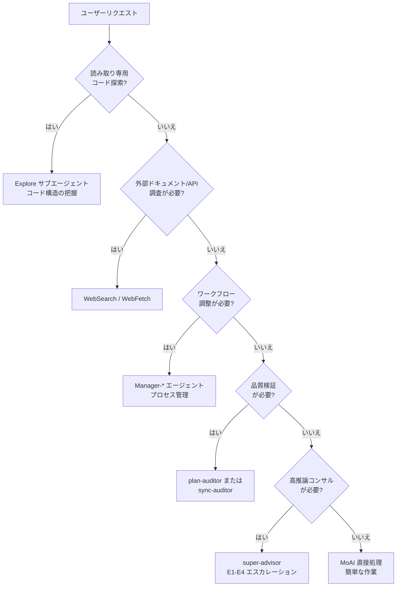
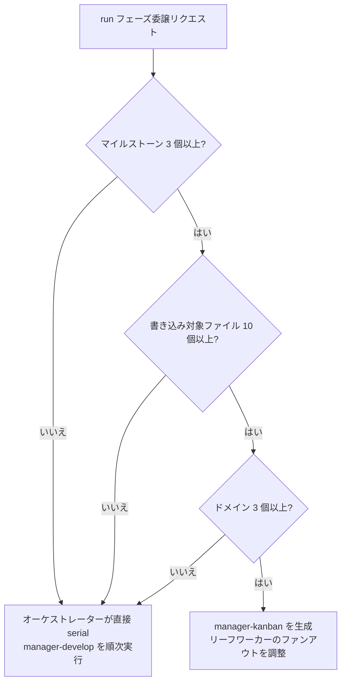
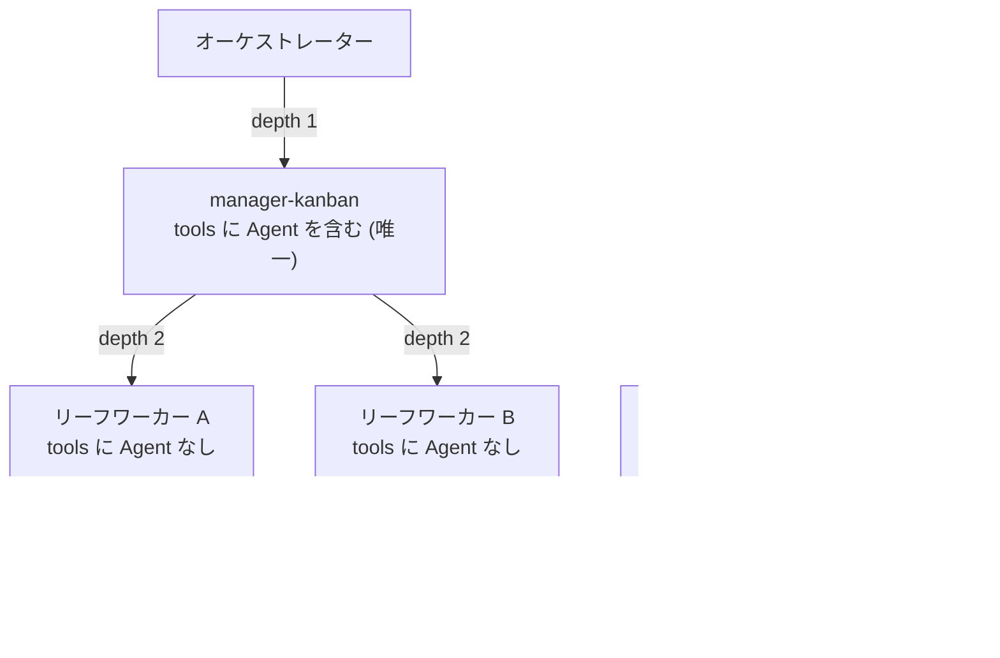
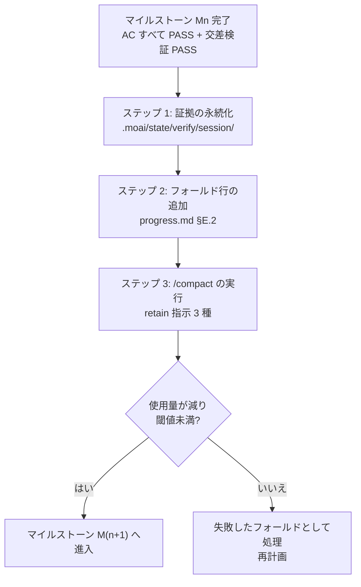
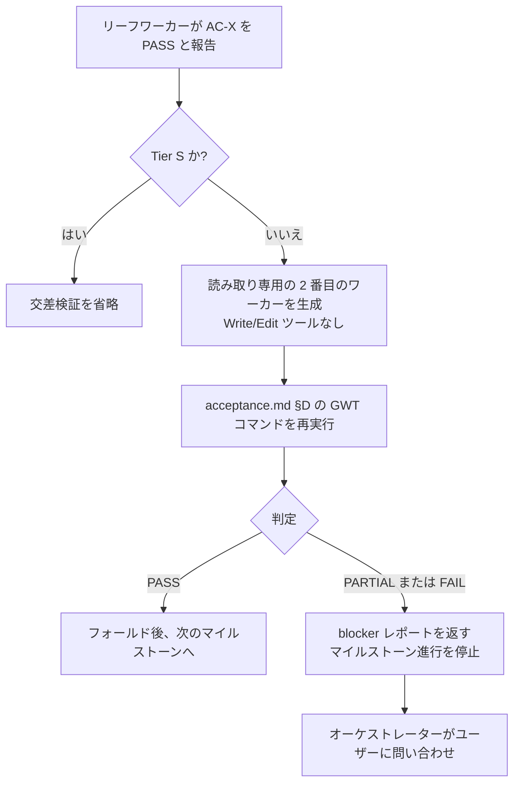

MoAI-ADK v3.0 の 12 個のコアエージェントカタログを詳しく解説します。


**ひと言要約**: エージェントは各分野の **専門家チーム** です。MoAI がチームリーダーとして適切な専門家に作業を割り振ります — そして計画を作るエージェントとそれを監査するエージェントは必ず分離されます。



プラットフォーム層の背景については [サブエージェント](/ja/claude-code/agentic/sub-agents) を参照してください。MoAI-ADK としての説明はこのページです。


## エージェントとは?

エージェントは特定分野に専門化された **AI 作業実行者** です。

Claude Code の **Sub-agent (サブエージェント)** システムを基盤とし、各エージェントは独立したコンテキストウィンドウ、カスタムシステムプロンプト、特定のツールアクセス、独立した権限を持ちます。

会社組織にたとえると、MoAI は CEO、Manager エージェントは部門長、Evaluator エージェントは品質監視官、Builder エージェントは新規チーム編成担当者、Advisor エージェントは外部顧問です。

エージェント数は v3 期間中に 22 → 17 → 8 → 10 → **11** へと精錬されました。エージェントが多ければ良いわけではありません — 委任のたびにコンテキストコストがかかるため、カタログを絞ること自体がトークノミクスの一部です。

## MoAI オーケストレーター

MoAI は MoAI-ADK の **最上位コーディネーター** です。ユーザーのリクエストを分析し、適切なエージェントに作業を委任します。

### MoAI のコアルール

| ルール | 説明 |
|------|------|
| 委任専用 | 複雑な作業は直接実行せず専門エージェントに委任 |
| ユーザー窓口 | ユーザーとの対話は MoAI のみが実行 (サブエージェントは不可) |
| 並列実行 | 独立した読み取り専用作業は複数エージェントに同時委任 |
| 結果統合 | エージェントの実行結果を集約してユーザーに報告 |

## 12 個のコアエージェントカタログ

MoAI-ADK は **12 個のコアエージェント** (11 個の MoAI カスタム + 1 個の Anthropic ビルトイン) を使用します。

### Manager エージェント (6 個)

| エージェント | 役割 | フェーズ | Model / effort | 主要スキル |
|----------|------|------|---------------|----------|
| `manager-spec` | SPEC ドキュメント生成、GEARS 形式の要求事項 | Plan | inherit / medium  | `moai-workflow-spec` |
| `manager-develop` | DDD/TDD/autofix サイクル実装 (quality.yaml の cycle_type) | Run | inherit / medium  | `moai-workflow-ddd`, `moai-workflow-tdd` |
| `manager-docs` | ドキュメント生成、CHANGELOG、README 同期 | Sync | inherit / low  | `moai-workflow-project` |
| `manager-git` | PR 作成、Git ブランチ、マージ戦略 | PR (Tier L) | sonnet / low  | `moai-foundation-core` |
| `manager-design` | Claude Design 双方向コラボレーション (D1-D5 パイプライン) | Design | inherit / medium  | `moai-foundation-core` |
| `manager-kanban` | 階層型チーム Tier L 調整（唯一の Agent-carrier、depth-2 seal） | Run (Tier L) | inherit / xhigh  | `moai-foundation-core`, `moai-workflow-project` |

### Evaluator エージェント (2 個)

| エージェント | 役割 | 評価対象 | Model / effort | 主要スキル |
|----------|------|---------|---------------|----------|
| `plan-auditor` | Plan フェーズの独立監査、GEARS 準拠、バイアス防止 | SPEC 完成度 | inherit / medium  | `moai-foundation-core`, `moai-foundation-thinking` |
| `sync-auditor` | Sync フェーズの品質スコア (4 次元: Functionality, Security, Craft, Consistency) | 実装品質 | inherit / medium  | `moai-foundation-quality`, `moai-foundation-core` |

計画と監査が分離されている点が核心です — 作った本人が自分の仕事を検査することはありません。この分離設計が **TRUST 5** 品質フレームワークの信頼性を支えています。

### Builder エージェント (1 個)

| エージェント | 役割 | Model / effort | 生成物 |
|----------|------|---------------|--------|
| `builder-harness` | プロジェクト固有の動的エージェントチーム生成 (Socratic インタビューベース) | inherit / medium  | `.claude/agents/harness/`, `.moai/harness/manifest.json` |

### Advisor エージェント (1 個)

| エージェント | 役割 | Model / effort | 特徴 |
|----------|------|---------------|------|
| `super-advisor` | 高推論コンサルティング — デッドロック、設計上の決定点、セカンドオピニオン (E1-E4 エスカレーション) | inherit / high  | 非拘束の処方 — 最終決定はオーケストレーター |

### Specialist エージェント (1 個)

| エージェント | 役割 | Model / effort | 特徴 |
|----------|------|---------------|------|
| `e2e-tester` | ウェブ/モバイル/デスクトップの E2E テスト実行 (ジャーニースクリプティング、CLI 優先のスイート実行、アーティファクト管理) | inherit / low  | `/moai e2e` ワークフローの実行主体 — 選択質問はオーケストレーター担当 |

### ビルトインエージェント (1 個、Anthropic)

| エージェント | 役割 | Model / effort | 特徴 |
|----------|------|---------------|------|
| `Explore` | 読み取り専用のコード探索と分析 | sonnet / low (呼び出し時のデフォルト) | Read-only ツール。ディスク上にエージェントファイルが無いため、effort は frontmatter に固定されるのではなく spawn プロンプトで指定されます |


**4 段のトークンコストティア** ( max ·  high ·  medium ·  low): `model: inherit` は親セッションのモデルを継承し、effort が推論トークンの予算を決めます。

上記の値は **配布時の frontmatter** であり、新規デプロイがデフォルトプロファイルと一致するように[プロファイルマトリクス](/ja/advanced/profile-matrix/)の `medium` 列に固定されています。プロファイルを切り替えるとこれらの値は書き換わります — `high` では `manager-develop` と `super-advisor` が `max`(それを使う唯一の 2 セル)に移り、`low` ではエージェンティック行が `low` に下がり、`manager-docs` と `e2e-tester` は Sonnet にフォールバックします。アクティブプロファイルで解決された値は `moai model profile` で確認してください。


## Manager-Develop ドメインコンテキスト注入

ドメインごとにエージェントを 1 つずつ置く代わりに、`manager-develop` 1 つがドメイン別コンテキストを注入されて呼び出されます。

- **バックエンド作業**: `manager-develop` + バックエンドドメインコンテキスト + `moai-domain-backend` スキル
- **フロントエンド作業**: `manager-develop` + フロントエンドドメインコンテキスト + `moai-domain-frontend` スキル
- **その他のドメイン**: 言語別スキル + 専門性プロンプト

## エージェント選択デシジョンツリー

MoAI がユーザーリクエストを分析して適切なエージェントを選択するプロセスです。


```mermaid
flowchart TD
    START[ユーザーリクエスト] --> Q1{読み取り専用<br>コード探索?}

    Q1 -->|はい| EXPLORE["Explore サブエージェント<br>コード構造の把握"]
    Q1 -->|いいえ| Q2{外部ドキュメント/API<br>調査が必要?}

    Q2 -->|はい| WEB["WebSearch / WebFetch"]
    Q2 -->|いいえ| Q3{ワークフロー<br>調整が必要?}

    Q3 -->|はい| MANAGER["Manager-* エージェント<br>プロセス管理"]
    Q3 -->|いいえ| Q4{品質検証<br>が必要?}

    Q4 -->|はい| EVAL["plan-auditor または<br>sync-auditor"]
    Q4 -->|いいえ| Q5{高推論コンサル<br>が必要?}

    Q5 -->|はい| ADVISOR["super-advisor<br>E1-E4 エスカレーション"]
    Q5 -->|いいえ| DIRECT["MoAI 直接処理<br>簡単な作業"]
```

## 階層型チーム — manager-kanban の仕組み

`manager-kanban` は Tier L 規模の run フェーズを調整する専用エージェントです。自分でコードを書くことはなく、作業をマイルストーンに分割してリーフワーカー (leaf worker) に委ね、各マイルストーンの境界でコンテキストを畳み、検証を交差させて実行します。リーフワーカーは `Agent(general-purpose)` で必要に応じて生成され、互いの書き込み範囲が重ならないよう worktree で隔離されたブランチ上で動作します。

この委譲経路は serial (順次サブエージェント) の変種であり、新しい実行モードではありません。引退した Agent Teams 静的階層とも無関係です — agent-team の tombstone と `MODE_TEAM_UNAVAILABLE` の挙動は変わりません。

### 進入条件 — 3 つすべてを満たす場合のみ

オーケストレーターは、以下の 3 条件が **すべて** 成立する場合にのみ `manager-kanban` を生成します。1 つでも欠ける場合は、オーケストレーター自身が serial でマイルストーンを順次処理します。条件を満たさない作業に `manager-kanban` を付けても、回収されない調整コストが増えるだけだからです。

| 軸 | 基準 |
|----|------|
| マイルストーン数 | plan.md §F のマイルストーン一覧に 3 個以上 |
| ファイル表面 | マイルストーン全体の書き込み対象が 10 個以上 |
| ドメイン範囲 | 異なるドメインが 3 個以上 (例: バックエンド + フロントエンド + devops) |

3 条件は OR ではなく AND です。単一マイルストーンの 10 ファイルリファクタリングのように 1 つの軸しか満たさない作業まで巻き込まないよう、意図的に狭く設定した値です。オーケストレーターは 3 条件がすべて満たされたという判断を `progress.md` § Mode Selection に記録してから生成します。


```mermaid
flowchart TD
    START["run フェーズ委譲リクエスト"] --> Q1{"マイルストーン 3 個以上?"}
    Q1 -->|"いいえ"| MODE5["オーケストレーターが直接 serial<br>manager-develop を順次実行"]
    Q1 -->|"はい"| Q2{"書き込み対象ファイル 10 個以上?"}
    Q2 -->|"いいえ"| MODE5
    Q2 -->|"はい"| Q3{"ドメイン 3 個以上?"}
    Q3 -->|"いいえ"| MODE5
    Q3 -->|"はい"| LEAD["manager-kanban を生成<br>リーフワーカーのファンアウトを調整"]
```

### depth-2 の封印

`manager-kanban` は、カタログエージェントの中で `tools:` 一覧に `Agent` を含む **唯一** のエージェントです。他のエージェントはすべて `Agent` を除外することでフラットな階層を維持しており、その例外をちょうど 1 層だけ開く場所がここです。したがってオーケストレーター → `manager-kanban` が depth 1、`manager-kanban` → リーフワーカーが depth 2 であり、depth 3 が生まれることはありません。

リーフワーカーは生成時点で `tools:` 一覧を受け取り、そこから `Agent` は常に除外されます。今後リーフワーカーをファイルとして定義する場合でも、frontmatter の `leaf_of: manager-kanban` または本文マーカー `<!-- manager-kanban leaf-worker -->` で自らを宣言すれば、`internal/template/manager_kanban_depth_test.go` の CI ガードがそのファイルの `tools:` に `Agent` があるかを検査し、存在すればビルドを失敗させます。


この封印は **MoAI のポリシー不変条件であり、ランタイムの不変条件ではありません**。Claude Code ランタイム自体はより深い再帰を許可しています — v2.1.219 からネストした生成がデフォルトで有効になり、デフォルトの深さ上限は 3 です。ランタイムが止めてくれない以上、深さを実際に押さえているのは `tools:` から `Agent` を外す運用と上記の CI ガードの 2 つだけです。



```mermaid
flowchart TD
    ORCH["オーケストレーター"] -->|"depth 1"| LEAD["manager-kanban<br>tools に Agent を含む (唯一)"]
    LEAD -->|"depth 2"| W1["リーフワーカー A<br>tools に Agent なし"]
    LEAD -->|"depth 2"| W2["リーフワーカー B<br>tools に Agent なし"]
    W1 -.->|"ブロック"| X["depth 3 の再帰"]
    W2 -.->|"ブロック"| X
    GUARD["manager_kanban_depth_test.go<br>CI ガード"] -.->|"ビルド失敗で検出"| X
```

### コンテキストフォールディングの 3 ステップ

マイルストーン Mn の AC 行がすべて PASS になり、それらの行の交差検証も PASS で返ってきたら、`manager-kanban` は次のマイルストーンに進む前に 3 つのステップを踏みます。この手順は **既存のツールだけを組み合わせます** — 新しい Go コードも、新しいフックも、新しい CLI サブコマンドも作りません。

1. **証拠の永続化** — 各 AC の検証コマンド出力を `.moai/state/verify/<session>/M<n>.<AC-id>.{log,out}` にリダイレクトします。`/tmp` は OS が消去するため使いません。監査時点でそのパスが実際に開けて初めて、引用された根拠が有効になります。証拠を取得できなかった AC は `PASS` ではなく `GAP` と表記します。
2. **フォールド行の追加** — `progress.md` §E.2 に既存の行フォーマットのまま 1 行を追記します: `M<n>: <AC-id-1>=PASS, ... | evidence: .moai/state/verify/<session>/M<n>.* | fold-at: <ISO-8601>`。`M<n>:` という接頭辞は `internal/spec/era.go` の §E 見出しマッチャーと衝突しないよう選んだ形であり、マッチャーに手を入れずに共存できます。
3. **`/compact` の実行** — 保持する項目を明示して圧縮します: retain-current-milestone (いま終えたマイルストーンとそのフォールド行)、retain-fold-rows (§E.2 にある過去のフォールド行すべて)、retain-armed-goal (`/moai goal` で設定した条件があればその条件)。

フォールド後の不変条件は 2 つです。圧縮後のトークン使用量が圧縮前より減っていること、そして同時にモデル別のハンドオフ閾値 (1M 系は 50%、200K/256K 系は 90%) を下回っていることです。減っていなければ失敗したフォールドとして扱い、計画を立て直します。サブエージェントのコンテキストで `/compact` が使えない場合は blocker レポートを返し、オーケストレーターに代わりに圧縮してもらうか、`/clear` と再開メッセージで迂回します。


```mermaid
flowchart TD
    MN["マイルストーン Mn 完了<br>AC すべて PASS + 交差検証 PASS"] --> S1["ステップ 1: 証拠の永続化<br>.moai/state/verify/session/"]
    S1 --> S2["ステップ 2: フォールド行の追加<br>progress.md §E.2"]
    S2 --> S3["ステップ 3: /compact の実行<br>retain 指示 3 種"]
    S3 --> CHECK{"使用量が減り<br>閾値未満?"}
    CHECK -->|"はい"| NEXT["マイルストーン M(n+1) へ進入"]
    CHECK -->|"いいえ"| REPLAN["失敗したフォールドとして処理<br>再計画"]
```

### peer 交差検証

リーフワーカーがある AC を PASS と表記すると、`manager-kanban` は **その作業を行っていない** 2 番目の `Agent(general-purpose)` を読み取り専用で生成します。読み取り専用は `tools:` から Write/Edit/NotebookEdit を除外することで強制します。このワーカーは `acceptance.md` §D の Given-When-Then コマンドをそのまま再実行し、`PASS` / `PARTIAL` / `FAIL` のいずれかを返します。

2 番目のワーカーは著者の主張に何の利害も持ちません。だからこそ、grep の結果を数え違える、古い baseline を引用する、検証コマンドを 1 つ飛ばすといった自己報告の失敗がそのまま露呈します。

`FAIL` または `PARTIAL` が出た場合、`manager-kanban` は次のマイルストーンに進みません。代わりに AC ID、著者が提示した根拠、交差検証ワーカーの根拠、両者が食い違った箇所を含む blocker レポートをオーケストレーターに返します。ユーザーに問い合わせるのはオーケストレーターの役割です — サブエージェントはユーザー窓口を使いません。Tier S は交差検証を省略します (範囲が小さく、検証コストが得られるものを上回るため)。

sync フェーズの `sync-auditor` とは役割が異なります。`sync-auditor` は実装完了後に 4 次元のスコアを付ける最終的な懐疑的判読であり、peer 交差検証は実装の途中で AC 一つひとつに付く二値判定です。両者は互いの代わりにはなりません。


```mermaid
flowchart TD
    AUTHOR["リーフワーカーが AC-X を PASS と報告"] --> TIER{"Tier S か?"}
    TIER -->|"はい"| SKIP["交差検証を省略"]
    TIER -->|"いいえ"| PEER["読み取り専用の 2 番目のワーカーを生成<br>Write/Edit ツールなし"]
    PEER --> RERUN["acceptance.md §D の GWT コマンドを再実行"]
    RERUN --> VERDICT{"判定"}
    VERDICT -->|"PASS"| NEXT["フォールド後、次のマイルストーンへ"]
    VERDICT -->|"PARTIAL または FAIL"| BLOCK["blocker レポートを返す<br>マイルストーン進行を停止"]
    BLOCK --> ORCH["オーケストレーターがユーザーに問い合わせ"]
```

## エージェント定義ファイル

10 個の MoAI カスタムエージェントは `.claude/agents/moai/` ディレクトリにマークダウンファイルとして定義されます。

### ファイル構造

```
.claude/agents/moai/
├── manager-spec.md
├── manager-develop.md
├── manager-docs.md
├── manager-git.md
├── manager-design.md
├── plan-auditor.md
├── sync-auditor.md
├── builder-harness.md
├── super-advisor.md
├── e2e-tester.md
└── (Explore: Anthropic ビルトイン、ファイルなし)
```

### エージェント定義フォーマット

```markdown
---
name: my-specialist
description: >
  このプロジェクトの専門家。特定ドメインの専門性の説明。
tools: Read, Write, Edit, Grep, Glob, Bash
model: inherit
---

あなたはこのプロジェクトの [ドメイン] 専門家です。

## 役割

- 責任 1
- 責任 2
- 責任 3

## 使用スキル

- moai-domain-[domain]
- 言語別スキル
```

## エージェント間コラボレーションパターン

### Plan-Run-Sync 順次ワークフロー

最も基本となるコラボレーションフローです。各フェーズの間に独立監査が挟まります。

```bash
# 1. manager-spec が SPEC を生成
/moai plan "機能の説明"

# 2. plan-auditor が SPEC の品質を検証
# (自動実行)

# 3. manager-develop が DDD/TDD で実装
/moai run SPEC-XXX

# 4. sync-auditor が 4 次元の品質スコアリング
# (自動実行)

# 5. manager-docs がドキュメントを同期
/moai sync SPEC-XXX
```

## Sub-agent システムの基礎

Claude Code の公式 Sub-agent システムは MoAI-ADK エージェント構造の基盤です。

### Sub-agent の特徴

| 特徴 | 説明 |
|------|------|
| **独立コンテキスト** | 各 sub-agent は自前の 200K トークンのコンテキストウィンドウで実行 |
| **カスタムプロンプト** | 専門システムプロンプトで役割と行動を定義 |
| **特定ツールアクセス** | 必要なツールのみを選択的に提供 |
| **独立権限** | 個別の権限モードを設定可能 |

### Sub-agent の制約事項

| 制約 | 説明 |
|------|------|
| サブエージェント生成制限 | サブエージェントのネスト生成は `Agent` ツールの許可有無で統制 — MoAI エージェントはネストしない |
| AskUserQuestion 制限 | サブエージェントはユーザーと直接対話できない (blocker レポートで返却) |
| スキル非継承 | 親会話のスキルを継承しない |
| 独立コンテキスト | 各エージェントは独立した 200K トークンのコンテキストを持つ |

## Agent Teams 静的階層 — v3.0 で引退、のち実験的に再許可

以前のバージョンにあった Agent Teams 静的オーケストレーション階層 (`workflow.team.*` 設定、`--team` 強制フラグ) は v3.0.0 で **引退** し、のちに実験的な面(明示的な `--team` 要求でのみ選択、自動選択なし)として再許可されました。

- 歴史的経緯: 引退時代には `--team` を強制すると `MODE_TEAM_UNAVAILABLE` を通知して sub-agent モードへフォールバックしました。このセンチネルは文書化された履歴として残ります。
- 並列性が必要な調査・レビュー作業は並列 sub-agent ファンアウトで、順次のコーディング作業は sub-agent チェーンで処理します。
- ネイティブの Claude Code teammate ランタイム (`moai cg` の GLM ペイン、`moai worktree --team`) はこれとは別に引き続き動作します — トークノミクスの観点では、CG モードの Claude リーダー + GLM ワーカーの分業がこの役割を担います。

## 関連ドキュメント

- [ビルダーエージェントとハーネス v4](/ja/advanced/builder-agents) - 動的エージェントチーム生成
- [スキルガイド](/ja/advanced/skill-guide) - エージェントが活用するスキル体系
- [SPEC ベース開発](/ja/workflow-commands/moai-plan) - SPEC ワークフロー詳細


**ヒント**: エージェントを直接指定する必要はありません。MoAI に自然言語でリクエストすれば、Analyze-First ルーティングが意図を分析して最適なエージェントを自動選択します。

