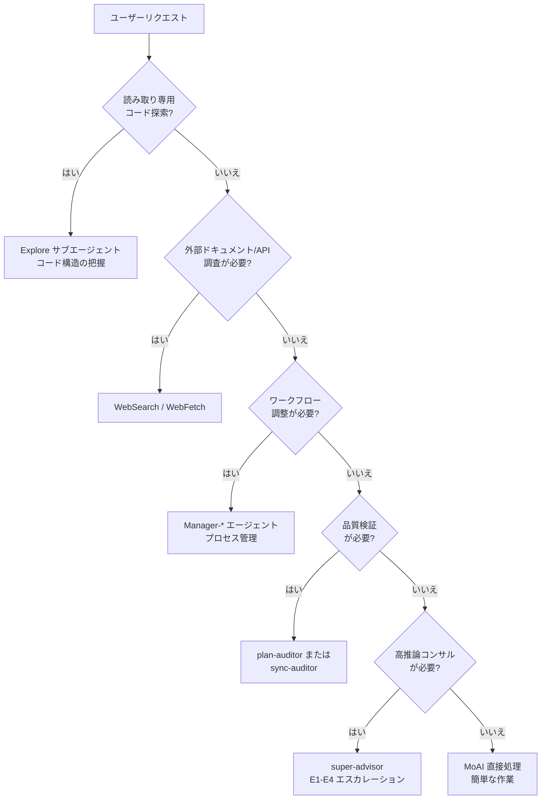

MoAI-ADK v3.0 の 11 個のコアエージェントカタログを詳しく解説します。


**ひと言要約**: エージェントは各分野の **専門家チーム** です。MoAI がチームリーダーとして適切な専門家に作業を割り振ります — そして計画を作るエージェントとそれを監査するエージェントは必ず分離されます。


## エージェントとは?

エージェントは特定分野に専門化された **AI 作業実行者** です。

Claude Code の **Sub-agent (サブエージェント)** システムを基盤とし、各エージェントは独立したコンテキストウィンドウ、カスタムシステムプロンプト、特定のツールアクセス、独立した権限を持ちます。

会社組織にたとえると、MoAI は CEO、Manager エージェントは部門長、Evaluator エージェントは品質監視官、Builder エージェントは新規チーム編成担当者、Advisor エージェントは外部顧問です。

エージェント数は v3 期間中に 22 → 17 → 8 → 10 → **11** へと精錬されました。エージェントが多ければ良いわけではありません — 委任のたびにコンテキストコストがかかるため、カタログを絞ること自体がトークノミクスの一部です。

## MoAI オーケストレーター

MoAI は MoAI-ADK の **最上位コーディネーター** です。ユーザーのリクエストを分析し、適切なエージェントに作業を委任します。

### MoAI のコアルール

| ルール | 説明 |
|------|------|
| 委任専用 | 複雑な作業は直接実行せず専門エージェントに委任 |
| ユーザー窓口 | ユーザーとの対話は MoAI のみが実行 (サブエージェントは不可) |
| 並列実行 | 独立した読み取り専用作業は複数エージェントに同時委任 |
| 結果統合 | エージェントの実行結果を集約してユーザーに報告 |

## 11 個のコアエージェントカタログ

MoAI-ADK は **11 個のコアエージェント** (10 個の MoAI カスタム + 1 個の Anthropic ビルトイン) を使用します。

### Manager エージェント (5 個)

| エージェント | 役割 | フェーズ | 主要スキル |
|----------|------|------|----------|
| `manager-spec` | SPEC ドキュメント生成、GEARS 形式の要求事項 | Plan | `moai-workflow-spec` |
| `manager-develop` | DDD/TDD/autofix サイクル実装 (quality.yaml の cycle_type) | Run | `moai-workflow-ddd`, `moai-workflow-tdd` |
| `manager-docs` | ドキュメント生成、CHANGELOG、README 同期 | Sync | `moai-workflow-project` |
| `manager-git` | PR 作成、Git ブランチ、マージ戦略 | PR (Tier L) | `moai-foundation-core` |
| `manager-design` | Claude Design 双方向コラボレーション (D1-D5 パイプライン) | Design | `moai-foundation-core` |

### Evaluator エージェント (2 個)

| エージェント | 役割 | 評価対象 | 主要スキル |
|----------|------|---------|----------|
| `plan-auditor` | Plan フェーズの独立監査、GEARS 準拠、バイアス防止 | SPEC 完成度 | `moai-foundation-core`, `moai-foundation-thinking` |
| `sync-auditor` | Sync フェーズの品質スコア (4 次元: Functionality, Security, Craft, Consistency) | 実装品質 | `moai-foundation-quality`, `moai-foundation-core` |

計画と監査が分離されている点が核心です — 作った本人が自分の仕事を検査することはありません。

### Builder エージェント (1 個)

| エージェント | 役割 | 生成物 |
|----------|------|--------|
| `builder-harness` | プロジェクト固有の動的エージェントチーム生成 (Socratic インタビューベース) | `.claude/agents/harness/`, `.moai/harness/manifest.json` |

### Advisor エージェント (1 個)

| エージェント | 役割 | 特徴 |
|----------|------|------|
| `super-advisor` | 高推論コンサルティング — デッドロック、設計上の決定点、セカンドオピニオン (E1-E4 エスカレーション) | 非拘束の処方 — 最終決定はオーケストレーター |

### Specialist エージェント (1 個)

| エージェント | 役割 | 特徴 |
|----------|------|------|
| `e2e-specialist` | ウェブ/モバイル/デスクトップの E2E テスト実行 (ジャーニースクリプティング、CLI 優先のスイート実行、アーティファクト管理) | `/moai e2e` ワークフローの実行主体 — 選択質問はオーケストレーター担当 |

### ビルトインエージェント (1 個、Anthropic)

| エージェント | 役割 | 特徴 |
|----------|------|------|
| `Explore` | 読み取り専用のコード探索と分析 | Haiku モデル、Read-only ツール |

## Manager-Develop ドメインコンテキスト注入

ドメインごとにエージェントを 1 つずつ置く代わりに、`manager-develop` 1 つがドメイン別コンテキストを注入されて呼び出されます。

- **バックエンド作業**: `manager-develop` + バックエンドドメインコンテキスト + `moai-domain-backend` スキル
- **フロントエンド作業**: `manager-develop` + フロントエンドドメインコンテキスト + `moai-domain-frontend` スキル
- **その他のドメイン**: 言語別スキル + 専門性プロンプト

## エージェント選択デシジョンツリー

MoAI がユーザーリクエストを分析して適切なエージェントを選択するプロセスです。


```mermaid
flowchart TD
    START[ユーザーリクエスト] --> Q1{読み取り専用<br>コード探索?}

    Q1 -->|はい| EXPLORE["Explore サブエージェント<br>コード構造の把握"]
    Q1 -->|いいえ| Q2{外部ドキュメント/API<br>調査が必要?}

    Q2 -->|はい| WEB["WebSearch / WebFetch"]
    Q2 -->|いいえ| Q3{ワークフロー<br>調整が必要?}

    Q3 -->|はい| MANAGER["Manager-* エージェント<br>プロセス管理"]
    Q3 -->|いいえ| Q4{品質検証<br>が必要?}

    Q4 -->|はい| EVAL["plan-auditor または<br>sync-auditor"]
    Q4 -->|いいえ| Q5{高推論コンサル<br>が必要?}

    Q5 -->|はい| ADVISOR["super-advisor<br>E1-E4 エスカレーション"]
    Q5 -->|いいえ| DIRECT["MoAI 直接処理<br>簡単な作業"]
```

## エージェント定義ファイル

10 個の MoAI カスタムエージェントは `.claude/agents/moai/` ディレクトリにマークダウンファイルとして定義されます。

### ファイル構造

```
.claude/agents/moai/
├── manager-spec.md
├── manager-develop.md
├── manager-docs.md
├── manager-git.md
├── manager-design.md
├── plan-auditor.md
├── sync-auditor.md
├── builder-harness.md
├── super-advisor.md
├── e2e-specialist.md
└── (Explore: Anthropic ビルトイン、ファイルなし)
```

### エージェント定義フォーマット

```markdown
---
name: my-specialist
description: >
  このプロジェクトの専門家。特定ドメインの専門性の説明。
tools: Read, Write, Edit, Grep, Glob, Bash
model: inherit
---

あなたはこのプロジェクトの [ドメイン] 専門家です。

## 役割

- 責任 1
- 責任 2
- 責任 3

## 使用スキル

- moai-domain-[domain]
- 言語別スキル
```

## エージェント間コラボレーションパターン

### Plan-Run-Sync 順次ワークフロー

最も基本となるコラボレーションフローです。各フェーズの間に独立監査が挟まります。

```bash
# 1. manager-spec が SPEC を生成
/moai plan "機能の説明"

# 2. plan-auditor が SPEC の品質を検証
# (自動実行)

# 3. manager-develop が DDD/TDD で実装
/moai run SPEC-XXX

# 4. sync-auditor が 4 次元の品質スコアリング
# (自動実行)

# 5. manager-docs がドキュメントを同期
/moai sync SPEC-XXX
```

## Sub-agent システムの基礎

Claude Code の公式 Sub-agent システムは MoAI-ADK エージェント構造の基盤です。

### Sub-agent の特徴

| 特徴 | 説明 |
|------|------|
| **独立コンテキスト** | 各 sub-agent は自前の 200K トークンのコンテキストウィンドウで実行 |
| **カスタムプロンプト** | 専門システムプロンプトで役割と行動を定義 |
| **特定ツールアクセス** | 必要なツールのみを選択的に提供 |
| **独立権限** | 個別の権限モードを設定可能 |

### Sub-agent の制約事項

| 制約 | 説明 |
|------|------|
| サブエージェント生成制限 | サブエージェントのネスト生成は `Agent` ツールの許可有無で統制 — MoAI エージェントはネストしない |
| AskUserQuestion 制限 | サブエージェントはユーザーと直接対話できない (blocker レポートで返却) |
| スキル非継承 | 親会話のスキルを継承しない |
| 独立コンテキスト | 各エージェントは独立した 200K トークンのコンテキストを持つ |

## Agent Teams 静的階層 — v3.0 で引退

以前のバージョンにあった Agent Teams 静的オーケストレーション階層 (`workflow.team.*` 設定、`--team` 強制フラグ) は v3.0.0-rc11 で **引退** しました。

- `--team` を強制すると `MODE_TEAM_UNAVAILABLE` を通知し、sub-agent モードへ自動フォールバックします。
- 並列性が必要な調査・レビュー作業は並列 sub-agent ファンアウトで、順次のコーディング作業は sub-agent チェーンで処理します。
- ネイティブの Claude Code teammate ランタイム (`moai cg` の GLM ペイン、`moai worktree --team`) はこれとは別に引き続き動作します — トークノミクスの観点では、CG モードの Claude リーダー + GLM ワーカーの分業がこの役割を担います。

## 関連ドキュメント

- [ビルダーエージェントとハーネス v4](/ja/advanced/builder-agents) - 動的エージェントチーム生成
- [スキルガイド](/ja/advanced/skill-guide) - エージェントが活用するスキル体系
- [SPEC ベース開発](/ja/workflow-commands/moai-plan) - SPEC ワークフロー詳細


**ヒント**: エージェントを直接指定する必要はありません。MoAI に自然言語でリクエストすれば、Analyze-First ルーティングが意図を分析して最適なエージェントを自動選択します。

