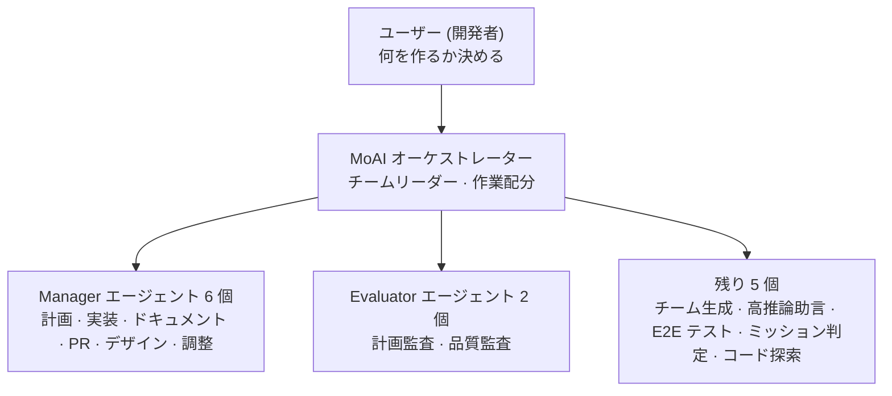
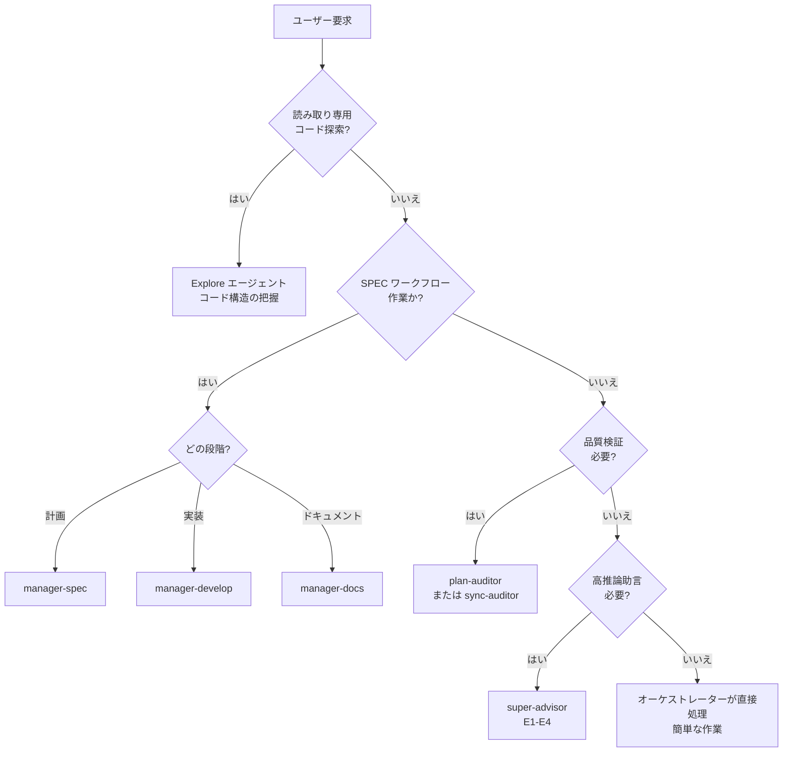
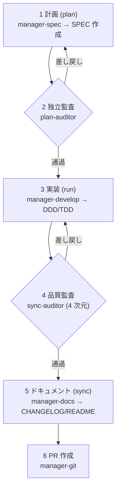
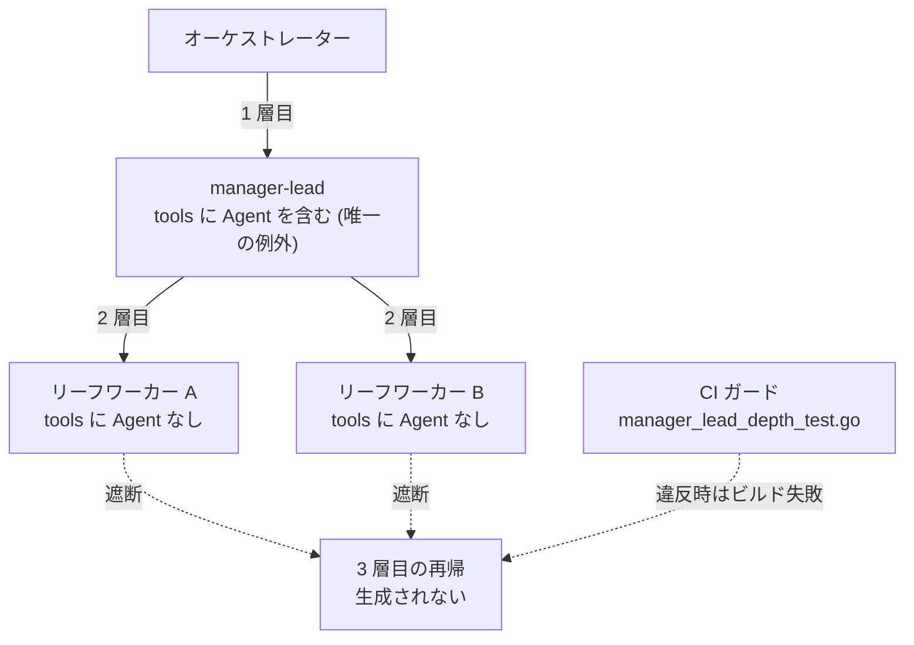

MoAI-ADK が使う 13 個のエージェント(自ら働く AI ヘルパー)のカタログを、基礎から順を追って解説します。この文書は「エージェントとは何か、なぜ複数で使うのか、どう協力するのか」を友人に説明できるほど平たく解きほぐします。


**ひと言要約**: エージェントは各分野の専門家です。MoAI はチームリーダーとして適材に作業を任せ、そのとき **計画を立てたエージェントとその計画を監査するエージェントは必ず別** にします。作った人が自分の仕事を採点しないための設計です。


## エージェントとは?

エージェントは特定分野に特化した AI 作業実行者です。ひとつの大きな AI がすべてをこなす代わりに、MoAI-ADK は仕事の性格に合わせて複数のエージェントに分け、それぞれが自分のコンテキストウィンドウ(記憶領域)とシステム指示文、ツールアクセス権を持ちます。

会社の組織にたとえると構造が自然に収まります。ユーザーはプロダクトを決めるオーナー、MoAI オーケストレーター(全作業を調整する中央指揮者)はチームリーダー、Manager エージェントは各部門長、Evaluator エージェントは品質監視官です。この比喩はそのまま構造に写ります。

```mermaid
flowchart TD
    USER["ユーザー (開発者)<br>何を作るか決める"] --> MOAI["MoAI オーケストレーター<br>チームリーダー · 作業配分"]
    MOAI --> MGR["Manager エージェント 6 個<br>計画 · 実装 · ドキュメント · PR · デザイン · 調整"]
    MOAI --> EVAL["Evaluator エージェント 2 個<br>計画監査 · 品質監査"]
    MOAI --> ETC["残り 5 個<br>チーム生成 · 高推論助言 · E2E テスト · ミッション判定 · コード探索"]
```

エージェントはすべて Claude Code の Sub-agent(サブエージェント)システムの上で動きます。サブエージェントごとに独立したコンテキストウィンドウ、専用のシステム指示文、選別されたツール、別個の権限が与えられます。この土台の上に MoAI-ADK が 13 個の専門役割を載せているのです。

## なぜエージェントを複数立てるのか

エージェント 1 個がすべてを処理できれば便利に見えますが、実務では品質とコストが一緒に崩れます。

第一に **品質** です。計画を立てたエージェントがその計画の出来まで判定すると、自分の作業に寛容になりがちです。人間も自分の書いた文章を自分で校正すると誤りが見えにくいのと同じです。だから MoAI-ADK は計画·実装を担う Manager 系と、その結果を検査する Evaluator 系を設計段階から分けました。

第二に **コスト** です。エージェントごとにコンテキストを新たに満たし推論を回すため、委任のたびにトークンコストがかかります。だから「多いほうが良い」は成立しません。カタログは v3 の過程で 22 → 17 → 8 → 10 → 12 → 13 と絞り込まれ、今は各役割が重ならない最小限に保たれています。エージェント数を減らすこと自体がトークノミクス(トークンを賢く使う仕事)の一部です。


この文書で頻出する 4 つの言葉を先に整理します。

- **エージェント** (自ら働く AI ヘルパー) — 特定分野の作業を担う AI 実行者
- **ハーネス** (品質検証の自動仕掛け) — エージェントがよく働けるようにする規則とゲート
- **スキル** (再利用できる作業指示書の束) — エージェントが呼んで使うドメイン知識の束
- **SPEC** (要件仕様書) — 何をなぜどう作るかを書いた文書


## MoAI オーケストレーター — チームリーダー

MoAI オーケストレーターはユーザーの要求を受け取って意図を分析(Analyze-First ルーティング)し、適任のエージェントに作業を委任して結果を取りまとめて報告する最上位の調整者です。複雑な作業は自分では行わず委任するのが核心の規則です。

| 規則 | 役割 |
|------|--------|
| 委任専用 | 複雑な作業は専門エージェントに任せます |
| 単一窓口 | ユーザーと対話するのはオーケストレーターだけで、サブエージェントはユーザーに話しかけません |
| 並列実行 | 互いに依存しない読み取り専用作業は一度に複数のエージェントへ委任します |
| 結果統合 | エージェントの結果を集めてユーザーに報告します |

オーケストレーターがどのエージェントを呼ぶかは `.moai/config/sections/delegation.yaml` の委任マップ(delegation map)が既定値として決めます。ただしこのマップは既定であって障壁ではありません — 作業の文脈に応じてオーケストレーターが判断して変えられます。

## 13 個のエージェントカタログ

MoAI-ADK は **13 個のエージェント** (12 個の MoAI カスタム + 1 個の Anthropic 内蔵 `Explore`) を使います。以下は役割ごとにまとめた全リストです。

### Manager エージェント — 6 個

実際の成果物を作る精鋭です。それぞれ SPEC ワークフローの一段階を担います。

| エージェント | 担う仕事 | 段階 |
|----------|--------|------|
| `manager-spec` | SPEC 文書の作成、要件を規則に合った形へ整理 | 計画 |
| `manager-develop` | DDD/TDD/autofix サイクルでコードを実装 | 実装 |
| `manager-docs` | CHANGELOG · README · frontmatter の同期 | ドキュメント |
| `manager-git` | PR 作成、ブランチ戦略、マージ | PR |
| `manager-design` | デザインツールと双方向に設計をやり取り | デザイン |
| `manager-lead` | Tier L 規模の実装をマイルストーンごとに調整 | 実装 (Tier L) |

### Evaluator エージェント — 2 個

作った側ではないエージェントが検査します。この分離が品質の背骨です。

| エージェント | 評価対象 | 時点 |
|----------|----------|------|
| `plan-auditor` | SPEC の完成度、要件規則の遵守、バイアス | 計画直後 |
| `sync-auditor` | 実装品質の 4 次元スコア (機能 · セキュリティ · 作法 · 一貫性) | ドキュメント段階 |

### Builder · Advisor · Specialist エージェント — 4 個

| エージェント | 担う仕事 |
|----------|--------|
| `builder-harness` | プロジェクト専用の動的エージェントチームを作ります (ユーザーインタビュー基盤) |
| `super-advisor` | 高推論助言 — デッドロック、設計の分岐点、セカンドオピニオン (E1-E4 エスカレーション) |
| `e2e-tester` | ウェブ/モバイル/デスクトップの E2E テストを実行します |
| `mission-governor` | 承認済み GTD 自動ミッションの封印されたスナップショットを読み、構造化された判定を 1 つだけ返します (読み取り専用) |

`mission-governor` は判定を返すだけで **自らは何も実行しません**。ファイルを書かず、シェルや Git コマンドも回さず、キューに触れず、レーンに仕事を配ることもなく、コミット·マージ·承認も、監査判定もしません。返された判定を検査して実際に状態を変えるのは決定論的実行器(決められた規則どおりにだけ動く自動処理器)です。ツール一覧も `Read`、`Grep`、`Glob`、`Skill` の 4 つだけで、要求が封印された範囲を外れたり、判定に必要な証拠が欠けていたり古かったりすれば blocker 判定を返します。


`mission-governor` は下の [エージェント選択デシジョンツリー](#エージェント選択デシジョンツリー) に **意図的に居場所がありません**。オーケストレーターが選んで呼ぶエージェントではなく、GTD 自動ミッションのワークフローが直接呼んで使う判定役だからです。ツリーに見当たらないのは抜け落ちではなく設計です。


### ビルトインエージェント — 1 個

| エージェント | 担う仕事 |
|----------|--------|
| `Explore` | 読み取り専用コード探索 · 分析 (Anthropic 内蔵、ファイルなし) |


エージェントごとにモデルと effort を割り当てる旧方式は退きました。**サブエージェントはメインセッションのモデルと推論深度をそのまま踏襲します** — サブエージェントを呼ぶとき `model` も `effort` も渡さず、MoAI エージェント定義はどちらも宣言しません。セッションの effort を変えれば(`/effort`、`ultrathink`)、そのセッションの全エージェントが一緒に従います。


## 計画と監査の分離 — なぜ作った側が検査しないのか

この原則はカタログ全体を貫く設計哲学です。`manager-spec` が計画を書けば `plan-auditor` が別個のコンテキストで検査し、`manager-develop` が実装を終えれば `sync-auditor` が 4 次元スコアを付けます。作ったエージェントと監査するエージェントが違うため、grep 結果の数え間違い、古い baseline の引用、検証一段階の省略といった自己報告の失敗が検査側で表面化します。

監査エージェントは fresh-judgment(懐疑的な姿勢)で臨みます — すべての主張を証拠が出るまで疑い、「通ったようだ」ではなく再現可能な結果だけを認めます。スコアは単純平均ではなく調和平均で計算され、一つの次元が崩れれば全体スコアも一緒に落ちます。この設計が TRUST 5 品質フレームワークの信頼を支えます。

## ドメイン専門性はどう入ってくるか

バックエンド·フロントエンド·セキュリティなど分野ごとにエージェントを 1 個ずつ置きません。代わりに `manager-develop` の 1 個が作業の文脈に合わせてドメイン知識とスキルを注入されて呼び出されます。

- バックエンド作業 → `manager-develop` + バックエンドコンテキスト + `moai-domain-backend` スキル
- フロントエンド作業 → `manager-develop` + フロントエンドコンテキスト + `moai-domain-frontend` スキル
- その他の分野 → その言語に合ったスキル + 専門性指示文

これでカタログは 13 個のまま小さく保ち、ドメインの深さはスキル注入で満たします。エージェント数を増やしてトークンコストを膨らませる代わりに、スキル(再利用できる作業指示書の束)を差し替える構造です。

## エージェント選択デシジョンツリー

オーケストレーターが要求を受け取ってどのエージェントを呼ぶか決める流れです。大部分は Analyze-First ルーティングが自然言語の意図だけで分類するので、ユーザーがエージェントを直接指す必要はほとんどありません。

```mermaid
flowchart TD
    START["ユーザー要求"] --> Q1{"読み取り専用<br>コード探索?"}
    Q1 -->|"はい"| EXPLORE["Explore エージェント<br>コード構造の把握"]
    Q1 -->|"いいえ"| Q2{"SPEC ワークフロー<br>作業か?"}
    Q2 -->|"はい"| Q3{"どの段階?"}
    Q3 -->|"計画"| SPEC["manager-spec"]
    Q3 -->|"実装"| DEV["manager-develop"]
    Q3 -->|"ドキュメント"| DOCS["manager-docs"]
    Q2 -->|"いいえ"| Q4{"品質検証<br>必要?"}
    Q4 -->|"はい"| EV["plan-auditor<br>または sync-auditor"]
    Q4 -->|"いいえ"| Q5{"高推論助言<br>必要?"}
    Q5 -->|"はい"| ADV["super-advisor<br>E1-E4"]
    Q5 -->|"いいえ"| DIRECT["オーケストレーターが直接処理<br>簡単な作業"]
```

## 一緒に働く順序 — Plan-Run-Sync

エージェントが実際どう連なるかを示す基本の流れです。段階と段階の間に独立監査が挟まるのが核心です。ユーザーは `/moai plan`、`/moai run`、`/moai sync` でこの流れを進めます。

```mermaid
flowchart TD
    PLAN["1 計画 (plan)<br>manager-spec → SPEC 作成"] --> A1{"2 独立監査<br>plan-auditor"}
    A1 -->|"差し戻し"| PLAN
    A1 -->|"通過"| RUN["3 実装 (run)<br>manager-develop → DDD/TDD"]
    RUN --> A2{"4 品質監査<br>sync-auditor (4 次元)"}
    A2 -->|"差し戻し"| RUN
    A2 -->|"通過"| SYNC["5 ドキュメント (sync)<br>manager-docs → CHANGELOG/README"]
    SYNC --> PR["6 PR 作成<br>manager-git"]
```

監査で差し戻されれば前の段階に戻ります。この「戻る」が手戻りコストを前倒しします — 品質問題を PR の直前ではなく各段階の直後に捕まえるからです。同じ誤りが次の段階へ流れて高くつくのを防ぎます。

## 引退したエージェントと拒否ルール

過去に使っていたエージェント名が文書やコピーしたメッセージに残っているかもしれません。次の 12 個の名前は **引退(archived)** しており、呼ぶと生成が拒否されます。

`manager-strategy`、`manager-quality`、`manager-brain`、`manager-project`、`claude-code-guide` (MoAI カスタムファイル限定)、`researcher`、`expert-backend`、`expert-frontend`、`expert-security`、`expert-devops`、`expert-performance`、`expert-refactoring`。


**注意**: 過去のセッションからコピーした再開メッセージにこれらの名前が入っていると、オーケストレーターは生成を拒否します。その場合は同じ仕事を `Agent(general-purpose)` にドメイン指示文を添えて任せるか、13 個の現行エージェントのどれかで代替します。代替経路は `.claude/rules/moai/workflow/archived-agent-rejection.md` にまとまっています。


ひとつ紛らわしい点があります。`claude-code-guide` は、引退した MoAI カスタムファイルと同じ名前を持つ Claude Code 内蔵ヘルパーがいます。内蔵ヘルパーを呼ぶことは拒否対象ではなく、拒否は MoAI カスタムファイルにだけかかります。

## 階層型チーム — manager-lead

`manager-lead` は Tier L 規模の実装を調整する専用エージェントです。自分ではコードを書かず、作業をマイルストーンに分けてリーフワーカー(leaf worker)に委ね、各マイルストーンの境界でコンテキストを畳んで検証を交差させます。リーフワーカーはそのつど `Agent(general-purpose)` で作られ、書き込み領域が重ならないよう worktree で隔離されたブランチで動きます。

### 3 条件すべてを満たすときだけ

オーケストレーターは次の 3 条件が **すべて(AND)** 成立するときだけ `manager-lead` を作ります。一つでも欠ければオーケストレーターが直接順次処理します — 条件に満たない仕事に調整エージェントを付けるとコストだけ増えて回収できないからです。

| 条件 | 基準 |
|------|------|
| マイルストーン数 | 3 個以上 |
| 書き込み対象ファイル | 10 個以上 |
| ドメイン範囲 | 異なるドメイン 3 個以上 (例: バックエンド + フロントエンド + devops) |

3 条件は OR ではなく AND です。条件をひとつだけ満たす作業(単一マイルストーンの 10 ファイルリファクタリングなど)まで巻き込まないよう、意図的に狭く設定した値です。

### depth-2 封印 — 階層が 2 層までしか開かない理由

13 個のエージェントのうち `manager-lead` だけが `tools:` 一覧に `Agent` ツールを載せています。ほかはすべて `Agent` を外してフラットな構造を保ちます。だからオーケストレーター → `manager-lead` が 1 層目、`manager-lead` → リーフワーカーが 2 層目で、3 層目は生まれません。

```mermaid
flowchart TD
    ORCH["オーケストレーター"] -->|"1 層目"| LEAD["manager-lead<br>tools に Agent を含む (唯一の例外)"]
    LEAD -->|"2 層目"| W1["リーフワーカー A<br>tools に Agent なし"]
    LEAD -->|"2 層目"| W2["リーフワーカー B<br>tools に Agent なし"]
    W1 -.->|"遮断"| X["3 層目の再帰<br>生成されない"]
    W2 -.->|"遮断"| X
    GUARD["CI ガード<br>manager_lead_depth_test.go"] -.->|"違反時はビルド失敗"| X
```


この封印は **ポリシー不変量であってランタイム不変量ではありません**。Claude Code ランタイム自体はより深い再帰を許します — v2.1.219 からネスト生成が既定で有効で、既定の深さ上限は 3 です。だから深さを実際に束ねるのは二つだけです: エージェントの `tools:` から `Agent` を外す運用と、リーフワーカーファイルに `Agent` があればビルドを失敗させる CI ガードです。


### コンテキストフォールドと交差検証

マイルストーン 1 個が終わると、次へ進む前に 3 段階を踏みます。まず各受け入れ基準(AC)の検証出力をマシンローカルのスクラッチに置き、判定を決めた行だけを追跡対象の判定書 `.moai/reports/<カードid>/verdict.md` に書いて監査時に開くようにします。カードディレクトリで追跡される名前はこの判定書ひとつだけです。続いて進行記録にその判定書を名指しした 1 行の要約行を追加し、最後に `/compact` でコンテキストを圧縮します。圧縮後にトークンが減り、ハンドオフしきい値(1M 系 50%、200K 系 90%)を下回って初めて次のマイルストーンへ進みます — 減らなければ失敗したフォールドとして再計画します。

リーフワーカーがある AC を PASS と印を付けたら、**その作業をしていない** 2 番目のワーカーを読み取り専用(書き込みツールを外した `tools:`)で呼び、同じ検証コマンドを再実行させます。2 番目のワーカーは結果に利害がないため、自己報告の失敗がそのまま露呈します。判定が食い違えばマイルストーンを止めてオーケストレーターに blocker レポートを返します — ユーザーに尋ねるのはオーケストレーターの役目です。Tier S は範囲が小さく交差検証のコストが得るものを上回るため、この段階を省略します。

sync 段階の `sync-auditor` とは役割が違います。`sync-auditor` は実装完了後に 4 次元のスコアを付ける最終的な懐疑判読で、peer 交差検証は実装中に AC ひとつひとつに付く二値判定です。両者は互いの代わりになりません。

## エージェント定義ファイル

MoAI カスタムエージェントはすべて `.claude/agents/moai/` ディレクトリのマークダウンファイルにあります。12 個の MoAI カスタムファイルがここに入り、`Explore` は Anthropic 内蔵のためディスクにファイルがありません。


各ファイルは YAML frontmatter と本文でできています。frontmatter には `name`、`description`、`tools`(CSV 文字列) を書き、本文には役割 · 責務 · 使用スキルを文章で書きます。model と effort は書きません — サブエージェントはセッションのモデルと推論深度をそのまま踏襲するので、エージェント定義が宣言する必要がないからです。新しいエージェントを自分で作るときは `builder-harness` エージェントを使うか、エージェント作成規則(`.claude/rules/moai/development/agent-authoring.md`)に従ってください。


## Sub-agent システムの基礎

MoAI-ADK エージェント構造の土台は Claude Code 公式のサブエージェントシステムです。

| 特徴 | 説明 |
|------|------|
| 独立コンテキスト | 各エージェントはモデルに応じた独自のコンテキストウィンドウで実行されます |
| 専用指示文 | 専門のシステム指示文が役割と振る舞いを定めます |
| 選別ツール | 必要なツールだけを選んで渡します |
| 別個の権限 | 個別の権限モードを設定できます |

サブエージェントはユーザーと直接対話できません — 必要な入力が足りなければ blocker レポートを返し、オーケストレーターがユーザーに尋ねて再送します。この境界が「単一窓口」規則を守ります。

## サブエージェントのツールフィルター — 2 段

サブエージェントがどのツールを使えるかは一回の設定ではなく 2 段のフィルターで決まります。スポーン時点の静的許可リストが 1 段目、ランタイムの遅延ロードが 2 段目です。

**1 段目 — スポーン時点の静的フィルター。** すべてのエージェント定義は frontmatter に `tools:` 許可リスト(CSV 文字列、例: `tools: Read, Write, Edit`) を持ち、リスト外のツールは呼び出せません。読み取り専用ロールはこのリストそのものを縮めて権限を作ります — 監査者や交差検証ワーカーは書き込みツール(Write, Edit)をリストから外し、ファイルを直接書き換える経路をなくします。ただしこれは狭めることであって封印ではありません — `Bash` がリストに残っていればそちらから書けるため、読み取り専用かどうかはツール名の不在ではなく書き込み能力の不在で判定しなければなりません。

**2 段目 — ランタイムの遅延ロード。** 一部のツールはスポーン時点でスキーマがロードされません。`AskUserQuestion`(ユーザーに選択肢を尋ねるツール) や `Task*`(タスクリスト管理) 系がそうです。こうした遅延(deferred)ツールは必要な瞬間に ToolSearch の `select:` クエリでスキーマを明示的に読み込んで初めて呼べるため、1 段目を通過したツールの中からさらに狭める 2 番目のゲートです。

この 2 段が合わさって作る規則が 2 つあります。

| 規則 | 内容 |
|------|------|
| ユーザーへの質問はオーケストレーター専用 | `AskUserQuestion` を使うのはオーケストレーターだけで、ランタイムがこの境界を強制します。ユーザー入力が必要なサブエージェントはプロンプトの代わりに構造化された blocker レポートを返し、オーケストレーターがユーザーに尋ねて答えを添えて再送します |
| sweep サブエージェントも質問不可 | 動的ワークフロー(sweep)のサブエージェントはメインセッションの下で動き、ユーザーにプロンプトできません。質問が必要ならオーケストレーターのチャネルを経由します |

前節の「サブエージェントはユーザーと直接対話できない」規則は、まさにこの 2 段のフィルターがランタイムで支えています。

## Agent Teams 静的階層 — v3.0 で引退、のち実験的に再許可

以前のバージョンの Agent Teams 静的オーケストレーション階層(`workflow.team.*` 設定、`--team` 強制)は v3.0.0 で引退し、のちに実験的表面(明示的な `--team` 要求でのみ選択、自動選択なし)として再許可されました。引退時代に `--team` を強制すると `MODE_TEAM_UNAVAILABLE` を通知してサブエージェントモードへフォールバックし、このセンチネルは文書化された歴史として残っています。

並列の調査·レビューは並列サブエージェントのファンアウトで、順次のコーディングはサブエージェントチェーンで処理します。CG は廃止されました。移行先の選択肢はまず `moai migrate cg` で確認してください。

## 関連ドキュメント

- [ビルダーエージェントとハーネス v4](/ja/advanced/builder-agents) — 動的エージェントチーム生成
- [スキルガイド](/ja/advanced/skill-guide) — エージェントが使うスキル体系
- [SPEC ベース開発](/ja/workflow-commands/moai-plan) — SPEC ワークフロー詳細
- [プロファイルマトリクス](/ja/advanced/profile-matrix/) — モデル · effort が今やセッション継承で決まるしくみ


**ヒント**: エージェントを直接指す必要はありません。MoAI に自然言語で要求すれば、Analyze-First ルーティングが意図を分析して適任者を自動で選びます。

