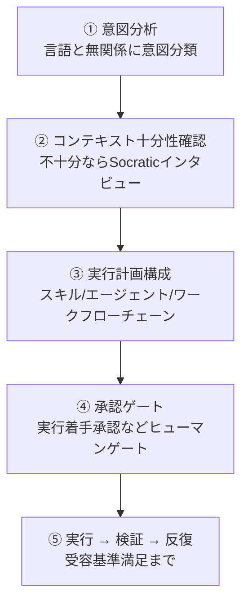

# Analyze-Firstルーティング

v3から`/moai`のデフォルトルーティングは**Analyze-First**です。英語キーワードを合わせて見るのではなく、リクエストの意味を分類します。したがってどの言語でリクエストしても同じ品質でルーティングされます — 韓国語で「ログインバグ直して」と言っても、英語で「fix the login bug」と言っても、意図分析を経て同じワークフローに到達します。

このページはAnalyze-Firstがリクエストを受けて実行に移す5ステップを追います。

## 5ステップパイプライン

すべてのリクエスト — `/moai`サブコマンドでも自然言語でも、どの入力言語でも — は1つの順序パイプラインを流れます。各ステップは前のステップの結果を入力として受け取ります。

### ① 意図分析

リクエストの意図を言語と無関係に分類します。入力言語が韓国語でも英語でも日本語でも関係なく、技術シグナルは③ステップの文脈としてのみ使われ、ルーティングの分岐道には立てません。「これ直して」と「fix this」は同じ意図（修正）として分類されます。

### ② コンテキスト十分性確認

意図が分類された後、リクエストを実行する文脈が十分か検査します。不十分ならRule 5 Context-First DiscoveryのSocraticインタビューを`AskUserQuestion`で回して明確化質問を投げます。十分なら次のステップに進みます。

### ③ 実行計画構成

文脈が整ったら実行計画を練ります。どのスキルをロードし、どのエージェントをどの順序でspawnするかを決めます。この計画は自明でない作業に限り実行前にユーザーに提示されます（Approach-First）。ここでPhase 4オーケストレーションモードも共に選び、並列ファンアウトが必要か順次サブエージェントが適切かを決定します。

### ④ 承認ゲート

計画が決まるとパイプラインの名前付きゲートを順序通り通過します。特に**実行着手承認**（plan → run ヒューマンゲート）は自律バイパス対象ではありません — 計画産出物がaudit-ready状態でも、runフェーズ进入直前には必ずユーザーの明示的承認を`AskUserQuestion`で受けます。自律性軸（半自律 vs 自律）は承認が**通過した後**何が起きるかを選ぶだけで、ゲート自体をスキップしません。

### ⑤ 実行 → 検証 → 反復

承認が得られたら計画を回します。受容基準に合わせて検証し、必要なら反復します。目標が武装した状態（`/moai goal`）なら、目標評価器が終了判定を下します。

## パイプラインゲート

デフォルトパイプラインは以下の4つのゲートを順序通り通過します。各ゲートは独立であり、FAILやINCONCLUSIVEが出るとチェーンが停止します。

| ゲート | 担当 | 役割 |
|--------|------|------|
| **Plan-auditゲート** | plan-auditor | SPEC計画産出物を別途監査。バイアス防止のため計画する側と異なるエージェントが評価 |
| **実行着手承認** | 人間（ヒューマンゲート） | パイプライン进入ごとに正確に1回、スコアと無関係に常に承認 |
| **Phase 4モード選択** | オーケストレータ | 実行着手承認後自律選択、`progress.md`に記録 |
| **Sync-auditゲート** | sync-auditor | 同期結果を4次元（機能・安全性・匠の心・一貫性）で評価 |


**実行着手承認はスコアと無関係です。** Plan-auditがPASS-eligible（0.90以上）だとしても、runフェーズ进入前のユーザー承認をスキップしません。Phase 0.5 SKIPと実行着手承認は異なる決定です — 前者はplan-auditor再実行の可否（自動化可能）、後者はユーザーがrunに入るか（ユーザー決定必須）です。


## 自然言語入力がワークフローに

サブコマンドなしで自然言語だけを入れると、①意図分析が自動的に適切なワークフローを選びます。

- **修正**意図 → `fix`系ワークフロー
- **新規機能**意図 → `plan → run → sync`パイプライン
- **探索**意図 → 読み取り専用サブエージェントファンアウト

例えば`/moai "ログインバグ直して"`とだけ入れても、意図分析が「修正」と分類して`fix`系に接続します。`/moai "ソーシャルログイン追加したい"`は「新規機能」と分類されて3フェーズパイプラインに到達します。`/moai status`のような1単語の意図もそれに合ったルートに行きます。

## Analyze-Firstがユーザーに与えるもの

- **言語の不便さなし** — 英語キーワードを暗記する必要がありません。母語でリクエストしても同じルーティング品質。
- **透明なゲート** — 実行前にどのスキル・エージェントが順番に呼ばれるかが提示されます。
- **一貫した承認地点** — 自律モードでもrun进入前に1回はユーザーが止められます。

## 関連ドキュメント

- [/moai](/ja/utility-commands/moai/) — Analyze-Firstの進入点コマンド
- [SPECベース開発](/ja/core-concepts/spec-based-dev/) — plan → run → syncパイプラインの上位フレームワーク
- [ハーネスプロファイルと評価](/ja/advanced/harness-profiles/) — ゲート評価とTier分類
