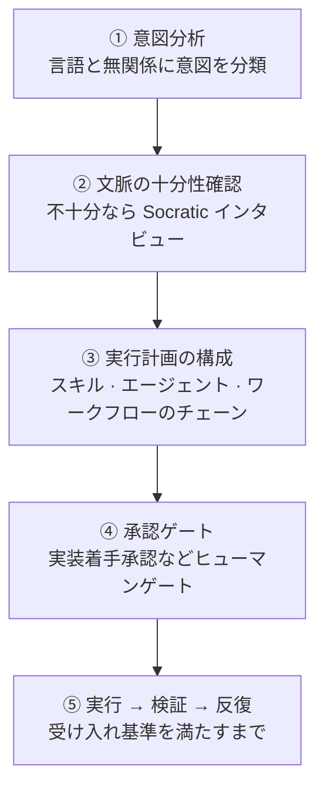
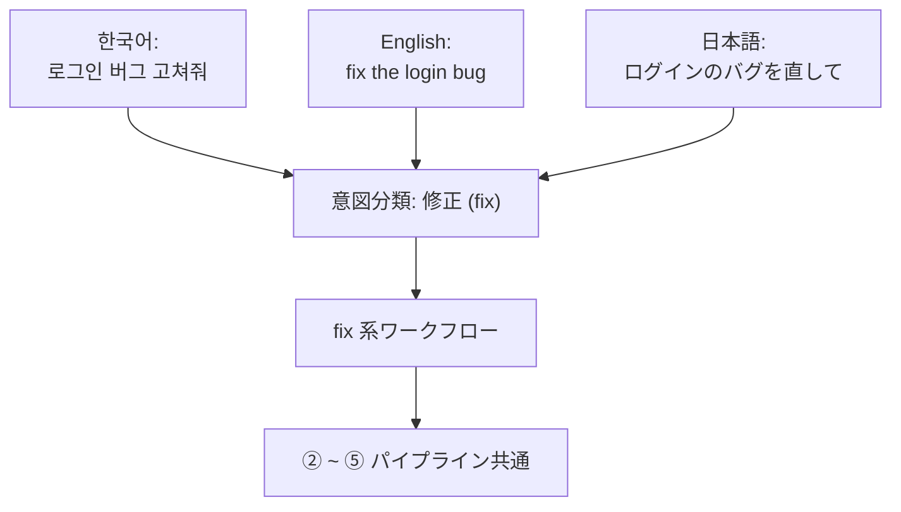

# Analyze-Firstルーティング

エージェント (自ら働く AI ツール) オーケストレーターが最初にすることは、「このリクエストをどこへ送るか」を決めるルーティングです。v3 から `/moai` のデフォルトルーティングは **Analyze-First** (リクエストの意味をまず分析して道を選ぶ方式) です。英語キーワードを当てはめて見るのではなく、リクエストが何を求めているかを分類します。おかげで、どの言語でリクエストしても同じ品質でルーティングされます — 韓国語で「로그인 버그 고쳐줘」と言っても、英語で "fix the login bug" と言っても、日本語で「ログインのバグを直して」と言っても、意図分析を経て同じワークフローにたどり着きます。

このページは、Analyze-First がなぜ必要なのか、リクエストを受けて実行に移す 5 段階がどうつながるのか、そしてその間にどんな承認ゲートが立っているのかを整理します。

## なぜキーワードではなく意味なのか

キーワードマッチングのルーターは、見た目は単純です。ユーザーが `/moai fix` と打てば fix ワークフローへ送り、`/moai plan` と打てば plan ワークフローへ送ります。しかしこの方式は 2 点で折れます。

まず、ユーザーが英語のコマンド語彙を覚えていなければなりません。「ログイン 버그 고쳐줘」のように母語で自然に話しかけると、ルーターは聞き取れません。そこでユーザーは毎回「これは fix なのか plan なのか run なのか、英語で当てはめて打たなければ」と考えるはめになります。次に、似た言葉が別の道へ行ってしまうことがあります。「고쳐줘」「수정해 줘」「버그 잡아 줘」は同じ意図なのに、キーワードが違えば結果も変わります。ルーターが単語で分岐すると、ユーザーはどの単語を使ったかによって、毎回異なる体験をすることになります。

Analyze-First はこの 2 つの問題を「意味を分類すればよい」で解きます。ルーターが分類するのは表面の単語ではなく、**意図** (ユーザーが何を求めているか) です。意図が同じなら、どの言語のどの表現で入ってきても同じ道に行きます。技術シグナル (例: 「Go プロジェクトだ」「テストファイルだ」) は意図ではなく文脈としてのみ使い、ルーティングの分岐には立てません。この区別が Analyze-First の核心であり、これを担う分類器を **Intent Router** (意図を分類して道を選ぶ装置) と呼びます。


**病院の受付デスクにたとえると**

キーワードマッチングのルーターは、「정형외과 (整形外科)」という英語の単語を正確に言わないと該当する診察室に案内しない受付デスクのようなものです。「팔이 부러졌어요」と韓国語で言っても理解できません。

Analyze-First ルーターは、症状を聞いて**必要 (need)** を分類する受付デスクです。「팔이 부러졌어요」、「I broke my arm」、「腕が折れました」、どれで入ってきても「骨の負傷」と分類して同じ診察室へ送ります。ユーザーは診察室の英語名を知る必要がありません。


## 5 段階パイプライン

すべてのリクエスト — `/moai` サブコマンドでも自然言語でも、どんな入力言語でも — は 1 つの順序パイプラインを流れます。各段階は前の段階の結果を入力として受け取り、どこかの段階で「文脈が足りない」「承認が必要」が引っかかると、次の段階へ進めません。

### ① 意図分析

リクエストの意図を、言語と無関係に分類します。入力言語が韓国語でも英語でも日本語でも関係なく、「이거 고쳐줘」と "fix this" と「これを直して」は同じ意図 (修正) として分類されます。このとき技術シグナル — たとえば「これは Go ファイルだ」「テストディレクトリの中にある」— はルーティングの判定には使わず、③ 段階への文脈としてのみ渡します。意図と技術をいっしょに見ると、「Go プロジェクトのバグ修正」と「Python プロジェクトのバグ修正」が別の道へ行きかねませんが、それはルーターの誤った学習です。言語とフレームワークは「どうやって」についての情報であって、「何を」についての判定ではありません。

Intent Router は 2 つの経路を持ちます。**P1 サブコマンドの近道** (ユーザーが `/moai plan` のようにサブコマンドを明示した場合、分類を飛ばしてすぐ該当ワークフローへ行く) と、**P3 意味分類** (サブコマンドなしで自然言語だけが入ってきた場合、意図を分類して適切なワークフローを選ぶ) です。サブコマンドが分かれば分類は不要で、分からなければ分類すればよい — どちらの経路も同じパイプラインに合流します。

### ② 文脈の十分性確認

意図が分類された後、リクエストを実行するのに文脈が十分かを検査します。「버그 고쳐줘」は意図が明確でも、**どんなバグ**なのか、**どこで**再現するのか、**どんな動作が正常**なのかが空では実行できません。不十分なら、Rule 5 Context-First Discovery の **Socratic インタビュー** (一度に 1 つずつ絞り込んでいく明確化対話) を `AskUserQuestion` (ユーザーに選択肢を示して答えを得る質問チャネル) で回し、明確化の質問を投げます。文脈が 100% 明確になるまでインタビューのラウンドを続け、十分になれば次の段階へ進みます。

### ③ 実行計画の構成

文脈が整うと実行計画を立てます。どのスキルをロードし、どのエージェントをどの順序で呼び出すか、動的ワークフローが必要かを決めます。この計画は、自明でない作業に限り実行前にユーザーに示されます (Approach-First、「このように進めます」を先に見せる方式)。ユーザーが見て直せるよう、計画は編集可能な形で提示されます。

ここで**オーケストレーションモード**も同時に選びます。作業が順次つながるコーディング中心ならサブエージェントモード (1 段階ずつエージェントに渡す基本形) に、複数の独立した視点が必要な調査 · レビューなら並列ファンアウト (3~5 個の読み取り専用エージェントを同時に広げる形) に、数十個のファイルに同じ変換をかける機械的な大量作業なら動的ワークフロー (スクリプトが多数のエージェントを調整する形) に行きます。モード選択は自律判断で、その根拠は作業ログに残ります。

### ④ 承認ゲート

計画が決まると、パイプラインの名前付きゲートを順番に通過します。その中で最も重要なのが**実装着手承認** (Implementation Kickoff Approval、plan から run へ移る前に人が押す必須の承認) です。このゲートは自律バイパスの対象ではありません — 計画成果物が監査を通過した状態でも、run 段階への進入直前には必ずユーザーの明示的な承認を受けます。

なぜスコアにかかわらず常に承認を受けるのか。品質スコアは「この計画がどれだけうまくできているか」を示すだけで、「今トークンを使って作業ツリーを変え始めてもよいか」は示しません。後者は品質の問題ではなくユーザーの決定です。だから監査スコアがどれほど高くても、そのスコアは「計画が良い」であって「進めてもよい」にはなれないのです。

承認を過ぎると、自律性の軸がもう 1 つ開きます。**半自律** (1 段階ごとにユーザーが確認) と**自律** (条件が整えば人の介入なしで進行) のどちらかを選ぶことです。この軸は承認が**通った後**に何が起こるかを選ぶだけで、ゲート自体を飛び越えません。「承認を受けた後どこまで自律で進むか」と「承認を受けるかどうか」は別の決定です。

### ⑤ 実行 → 検証 → 反復

承認が下りたら計画を回します。SPEC (要件仕様書) の受け入れ基準に合わせて検証し、必要なら反復します。目標が武装された状態 (`/moai goal`) なら、**目標評価器** (1 ターンが終わるときに完了条件を検査する装置) が終了判定を下します。目標がなければ、各段階のゲートが通過可否を判定します。

## 言語が変わっても同じワークフローへ

下の図は、同じ意図を 3 つの言語で表現したとき、Analyze-First がどう 1 つのワークフローに収束させるかを示しています。言葉は違っても意図 (修正) が同じなので、Intent Router は同じノードへ送ります。

この収束が成り立つには、1 つの前提があります。ルーターが意図を**意味**で分類し、表面の**単語**で分類しないことです。単語で分類すれば 3 つの入力は 3 つに分かれ、意味で分類すれば 3 つの入力は 1 つに合流します。Analyze-First は後者を選びます。

## 自然言語 1 行がワークフローに

サブコマンドなしで自然言語だけを入れれば、① 意図分析 (P3 意味分類の経路) が適切なワークフローを自動で選びます。以下はよく現れる 3 つの意図とその接続です。

- **修正**の意図 → `fix` 系ワークフロー (診断ツールが見つけた課題を次々に修正)
- **新機能**の意図 → `plan → run → sync` の 3 段階パイプライン
- **探索**の意図 → 読み取り専用サブエージェントの並列ファンアウト

たとえば `/moai "로그인 버그 고쳐줘"` と入れるだけでも、意図分析が「修正」と分類して `fix` 系につなげます。`/moai "소셜 로그인 추가하고 싶어"` は「新機能」と分類され、3 段階パイプラインにたどり着きます。`/moai "이 코드베이스 구조 한 번 분석해 줘"` は「探索」と分類され、読み取り専用エージェントたちが並列で食いつきます。サブコマンドが分かれば `/moai fix`、`/moai plan` のように直接呼ぶ方が速いですが (P1 近道)、分からなければ自然言語で呼べばよいのです (P3 意味分類が代わりに選びます)。

## パイプラインゲート

デフォルトのパイプラインは、次の 4 つのゲートを順番に通過します。各ゲートは独立しており、FAIL や INCONCLUSIVE が出るとチェーンが止まります。

| ゲート | 担当 | 役割 |
|--------|------|------|
| **Plan-audit ゲート** | plan-auditor エージェント | SPEC の計画成果物を別途監査。バイアス防止のため、計画を立てる側と別のエージェントが評価 |
| **実装着手承認** | 人間 (ヒューマンゲート) | パイプライン進入ごとに正確に 1 回、スコアにかかわらず常に承認 |
| **オーケストレーションモード選択** | オーケストレーター | 実装着手承認の後に自律選択、作業ログに記録 |
| **Sync-audit ゲート** | sync-auditor エージェント | 同期結果を 4 次元 (機能 · セキュリティ · 職人芸 · 一貫性) で評価 |


**実装着手承認はスコアと無関係です。** Plan-audit が通過可能なスコア (例: 0.90 以上) を受けたとしても、run 段階進入前のユーザー承認をスキップしません。計画段階の監査再実行の可否 (自動化可能) と実装着手承認 (ユーザー決定必須) は別の決定です — 前者は品質スコアで進められますが、後者は「今仕事を始めてもよいか」というユーザーの判断なので、スコアが代わることはできません。


## Analyze-First がユーザーに与えるもの

- **言語の不便さなし** — 英語キーワードを覚える必要がありません。母語でリクエストしても同じルーティング品質。これが Analyze-First を導入した最大の理由です。
- **透明な計画** — 実行前に、どのスキルとエージェントがどの順で呼ばれるかが示されます。ユーザーは計画を見て直せます。
- **一貫した承認地点** — 自律モードでも、run 進入前に 1 回はユーザーが止められます。自律性の軸はこのゲートの後にだけ開きます。

## 関連ドキュメント

- [/moai](/ja/utility-commands/moai/) — Analyze-First の入口コマンド
- [SPEC ベース開発](/ja/core-concepts/spec-based-dev/) — plan → run → sync パイプラインの上位フレーム
- [自律性ティア](/ja/advanced/autonomy-tier/) — 実装着手承認の後に自律性の軸がどこまで解けるか
- [ハーネスプロファイルと評価](/ja/advanced/harness-profiles/) — ゲート評価と Tier 分類
