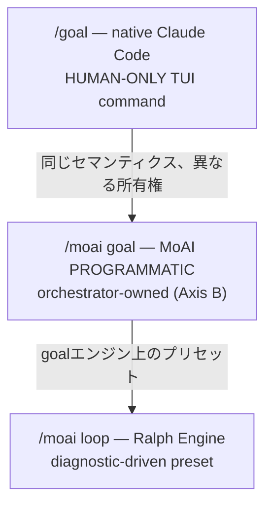

エージェント的ループの核心の問いは「いつ止まり、いつ続くか」です。MoAI-ADKは3つの連続ループプリミティブを提供し、それぞれトリガーセマンティクスと所有権が異なります。このページは`/goal`、`/moai goal`、`/moai loop`を区別し、それぞれの実装状態と安全ガードレールを説明します。

## いつ止まり、いつ続くか

単一ターンで終わる作業もありますが、数十ターンにわたり収束が必要な作業もあります — 例えば「全テストがPASSするまで」や「診断ツールのイシューキューが空になるまで」。毎ターンユーザーがプロンプトを入力しなければならないなら、自律性の利点が失われます。

連続ループプリミティブはこの問題を解決します。完了条件を宣言すると、条件が満たされるかターン限度に達するまでセッションが自ら作業を続けます。

## 3つの連続ループプリミティブ

MoAI-ADKには3つの連続ループプリミティブがあり、それぞれトリガーセマンティクスと所有権が異なります。

| プリミティブ | 所有権 | トリガー | 適切な場合 |
|-------------|--------|---------|-----------|
| `/goal` | ユーザーTUI (HUMAN-ONLY) | モデルが条件を評価 | 「この条件が真になるまで続行」 |
| `/moai goal` | オーケストレータ (PROGRAMMATIC) | stop-goal Stop-hook評価 | MoAIパイプライン内の自律連続 |
| `/moai loop` | Ralph Engine (診断駆動) | 診断ツールのイシューキュー | 「ツールが見つけたイシューをすべて修正」 |



### `/goal` — native Claude Code (HUMAN-ONLY)

 `/goal`はClaude CodeのネイティブTUIコマンドです。ユーザーが入力するコマンドであり、モデルがユーザーの代わりに呼び出すことはできません。これが**HUMAN-ONLY**制約です。

完了条件を宣言すると、各ターン終了後に小さな高速モデル(Haikuデフォルト)が条件が満たされたかを評価します。満たされていなければ別のターンを開始し、満たされていればループが終了します。

```text
/goal go test ./... exits 0 && lint is clean, or stop after 20 turns
```

条件は最大4,000文字まで可能で、ターン/時間限度を含めてループをバウンドできます。裸の`/goal`でステータスを確認し、`/goal clear`で早期終了できます。

### `/moai goal` — MoAI PROGRAMMATIC (Axis B)

 `/moai goal`はMoAIが所有するプログラミング的再実装です。ネイティブ`/goal`がHUMAN-ONLYであるため、オーケストレータがパイプライン内で自律連続ループを登録・武装(arm)できる唯一の経路です。

4つの動詞を提供します:

```bash
moai goal arm "<completion-condition>"  # 条件登録 + 武装
moai goal status                        # 現在の条件 + ターン/トークン消費確認
moai goal clear                         # 条件削除 (ループ終了)
```

セッション開始時に`PruneOrphans`が孤立goalをクリーンアップします。このメカニズムはSPEC-GOAL-ENGINE-001 (CLOSED)で実装されました。

### `/moai loop` — Ralph Engine (診断駆動プリセット)

 `/moai loop`は診断ツールが見つけたイシューキューをスキャンし、各イシューを修正し、キューが空になるか診断がクリーンになるまで繰り返す決定論的ループです。これはgoalエンジン上のプリセットです。

`/moai loop`は`/moai run --mode loop`のエイリアスではありません。`/moai run --mode loop`はランタイムモードディスパッチ値であり、`/moai loop`は独立したサブコマンドです。両者は同じgoalエンジンを使用しますが、エントリ経路とプリセット動作が異なります。

## ネイティブ /goal 詳細

`/goal <condition>`は完了条件を設定し、条件が真になるまでClaudeがプロンプトなしで作業を続けます。各ターン後、小さな高速モデルが条件を評価します。

効果的な条件の書き方:

- **1つの測定可能な終了状態** — テスト結果、ビルドexit code、ファイル数、空のキュー
- **明示された検証方法** — Claudeがどう証明すべきか(「`go test ./... exits 0`」)
- **重要な制約** — 経路で変更されないもの(「他のテストファイルは変更禁止」)

ターン限度を含めてループをバウンドしてください(「`or stop after 20 turns`」)。`/clear`を実行するとアクティブなgoalも削除されます。`--resume` / `--continue`でセッションを再開するとgoalが復元されます。

## 実装 vs ロードマップ

 **REQ-DA-062正直性区別**: 3つのプリミティブの実装状態を明確に区別します。

-  `/goal` (native) — Claude Codeランタイムで実装 (v2.1.139+必要)
-  `/moai goal` (PROGRAMMATIC) — SPEC-GOAL-ENGINE-001 CLOSED、4動詞CLI完全実装
-  `/moai loop` (Ralph Engine) — 診断駆動ループとして実装完了
-  AGENTIC-CORE Epic — 進行中。SPEC-1 (Analyze-Firstルーティング) CLOSED。SPEC-2 (自律/半自律kickoff REQ)はユーザー要求待機中。

## 安全ガードレール

 全ループプリミティブに対し安全ガードレールは変更されません。

- **Implementation Kickoff Approval** (plan → run HUMAN GATE)はどのループでもバイパス不可です。`/goal`がアクティブでもrun-phase進入前のユーザー承認は必須です。
- **安全境界 unchanged** — ループがアクティブでも「元に戻しにくい / 共有システム作業前の確認」境界は緩和されません。goal評価者は継続の可否のみを決定し、破壊的操作を事前承認しません。
- **auto modeとの組合せ** — Claude Code auto mode(ツールごとの自動承認)と`/goal`(ターンごとの連続)を組合せると無人`ac_converge`ループが可能です。auto modeはツールごとの承認プロンプトを削除し、`/goal`はターンごとのSTOPプロンプトを削除します。Implementation Kickoff Approvalはrun-phase進入前に依然必須です。

## 次のステップ

- [トークノミクス概論](/ja/advanced/tokenomics-overview/) — 自律ループがトークノミクスと接続するポイント
- [ハーネス自己進化](/ja/advanced/self-evolving/) — `/moai loop` / `/goal`収束軌跡がLoop 0観察に統合
