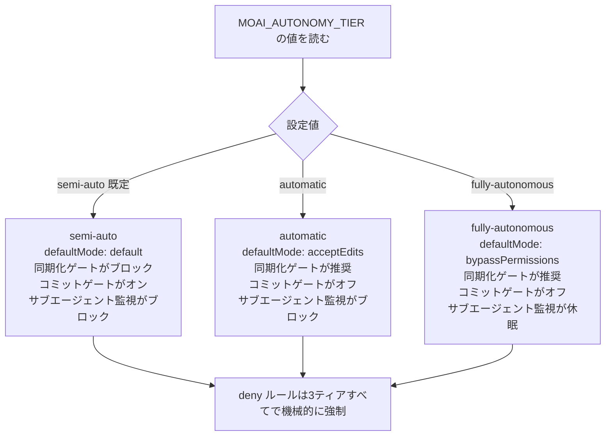
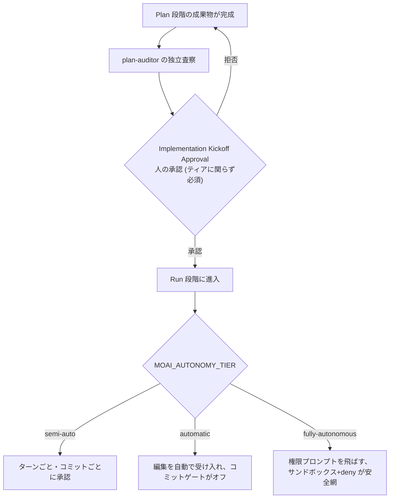

MoAI-ADKは、ユーザーがターンごとに承認を受ける半自律モードから、条件が整えば人の介入なしにタスクを最後まで押し進める完全自律モードまで、3つの自律性ティア(autonomy tier、どの程度自律的に動くかを定める等級)を提供します。この等級は`MOAI_AUTONOMY_TIER`という環境変数トークンで表現され、SPEC(要件仕様書)1つを計画から実装・文書化・監査まで押し進める全ライフサイクルを通じて、どこまでユーザー承認を求め、どこまで自動で進めるかを切り分けます。

このページでは、3つのティアの構造、各ティアが触る権限の範囲、そして自律性を高めるほど一段と堅くなければならない安全装置が何かを、実習中心に辿ります。

## 3つのティアが触る4つの表面

自律性ティアが変えるのはモデルやeffort(推論の深さ)ではなく、人がどこまで承認ゲートとして介入するかです。ティアが上がるほど、以下の4つの表面から人の手が外れていきます。

 **モデルティアと混同しないこと**: このページの「自律性ティア」は[3ティアエージェントアーキテクチャ](/ja/advanced/no-haiku-3tier/)の「モデルティア」とは**別の軸**です。モデルティアは「どのモデルをどのeffortで呼ぶか」(単発・エージェンティック・ピーク)を選び、自律性ティアは「人による承認をどこまで外すか」を選びます。2つの軸は互いに代置せず、直交します — ユーザーは能力に合ったモデルティアと監視水準に合った自律性ティアを**それぞれ**選びます。



4つの表面の具体的な挙動はティアごとに異なります。

| 表面 | semi-auto (既定) | automatic | fully-autonomous |
|------|------------------|-----------|------------------|
| `defaultMode` (既定の権限モード) | `default` | `acceptEdits` | `bypassPermissions` |
| 同期化ゲート (sync gate) | ブロック | 推奨 | 推奨 |
| コミットゲート | オン | オフ | オフ |
| サブエージェントのライフサイクル監視 (SubagentStop/TeammateIdle) | ブロック | ブロック | 休眠 |

どのティアでも変わらない線が1つあります。危険な動作を`deny`で塞いだルールはティアを上げても決して解かれず、`bypassPermissions`状態でも機械的に強制されます。自律性の安全網は結局この`deny`リストと — `fully-autonomous`では追加で — 検証済みサンドボックス(隔離実行環境)に頼るからです。

## Step 1 — ティアの値を確認して解釈する

自律性ティアは環境変数`MOAI_AUTONOMY_TIER`で読まれます。シェルで現在の値を直接表示できます。

```bash
# 現在のセッションに適用されている自律性ティアを出力
echo "${MOAI_AUTONOMY_TIER:-semi-auto}"
```

値が空か、設定したことがなければ`semi-auto`と解釈されます。これは下位互換性の不変条件です — 自律性ティアを明示的に選ばない既存のセッションは今日と同じ挙動を続け、オプトイン(opt-in、ユーザーが自らオンにする選択)していないセッションは挙動の変化を一切払いません。

3つの値の意味を整理すると以下の通りです。

- **`semi-auto`** (既定) — 今日の挙動をそのまま維持します。`defaultMode: default`、同期化ゲートがブロック、コミットゲートがオン、許可リスト(allowlist)に基づくBash実行でツールごとに承認を求めます。
- **`automatic`** — 半自律実行です。編集ツールは問わずに受け入れ(`acceptEdits`)、コミットゲートがオフになり、同期化ゲートはブロックではなく推奨へと下がります。サブエージェントのライフサイクル監視は依然としてブロックのまま残り、実装エージェントが完了条件を見落とせば止めてくれます。
- **`fully-autonomous`** — 無人自律です。権限プロンプト自体を飛ばし(`bypassPermissions`)、サブエージェント監視すら休眠状態にします。代わりに、サンドボックス証明と`deny`ルール、管理者キルスイッチ(manager kill-switch、緊急時に自律性を一括で取り下げる装置)がこのティアの安全の境界になります。

## Step 2 — `moai init` ウィザードでティアを選ぶ

自律性ティアはプロジェクトを初めて設定する際、`moai init`ウィザード(対話型設定ツール)で選びます。ウィザードは3つのティアのうち1つを尋ね、選択をプロジェクト設定に保存します。

```bash
# 新しいプロジェクトを作りながら自律性ティアを一緒に選ぶ
moai init myproject --autonomy-tier semi-auto
```

`--autonomy-tier`フラグは閉じた3つの値のうち1つだけを受け取ります。誤った値を入れると拒否し、理由を伝えます。この閉鎖性(closed set、決まった値だけを受け取る制約)は、自律性ティアが今後も読まれる単一の情報源(single source of truth)であり続けることを保証します — ランタイムフックとレンダラがそれぞれ別の解釈をしないように防ぐ最初の留めです。

ウィザードを通さずに既存プロジェクトでティアを変えるには、`moai web`のトグルを使うか、設定ファイルの`workflow.yaml`キーを直接編集します。ただし`fully-autonomous`はサンドボックス証明がなければウェブトグルで無効化されます — 無人自律は検証済みの隔離環境が前提だからです。

## Step 3 — ティアが権限の束をどう変えるか追跡する

選んだティアは設定レンダラ(権限の束を実際のファイルとして書き出す装置)を経て、2つの領域に書き込まれます。`defaultMode`は**ユーザー領域**(USER scope、個人設定)に、`deny`/`ask`ルールは**プロジェクト領域**(PROJECT scope、チーム共有設定)に降ろされます。この分離は、1人が自律性を上げてもチーム全体が共有する安全ルールは揺るがないようにします。

```bash
# レンダラが各ティア別に出力した deny/ask ルールが正確に一致するか確認する
diff <(grep -A20 'deny:' .claude/settings.json) \
     <(grep -A20 'deny:' .claude/settings.local.json) && echo "deny リストが一致"
```

この検査が通るべき理由は、`deny`/`ask`**ルール集合がティア不変**だからです。どのティアを選んでも`deny`で塞がれた動作の種類は減らず、`ask`で問う動作の種類も抜けません。ティアが変えるのは`defaultMode`、同期化ゲートモード、コミットゲートのオン/オフ、サブエージェント監視の活性だけ — 上の表の4つの表面のみです。この不変条件は、自律性を高めたからといって危険動作が新たに開かれる事態を防ぎます。

`deny`ルールの強制力は`bypassPermissions`でも生きています。権限評価は常に`deny → ask → allow`の順で、最初の一致が決定を下します。`fully-autonomous`では`ask`ルールが推奨へと下がりますが、`deny`ルールは依然として機械的にブロックします。だから完全自律の実効安全網は「検証済みサンドボックス + `deny`リスト + 内容範囲を伴った`ask`ルール」になります — `ask`1つに頼らない理由です。

## Step 4 — Implementation Kickoff ApprovalとStop-chainの関係を辿る

自律性ティアを上げても絶対に飛ばせないゲートが1つあります。**Implementation Kickoff Approval**(計画から実装へと移る人の承認ゲート)です。このゲートは自律性ティアに関わりなく常に必須で、plan-auditor(計画査察エージェント)の合格判定や高い点数がこのゲートを自動的に通すことはありません。



人の承認ゲートを一度抜けると、その後はティアがどこまで自律を許すかが決まります。`semi-auto`はターンごと、コミットごとに承認を求めて戻り、`automatic`は編集を自動的に受け入れ、`fully-autonomous`は権限プロンプト自体を飛ばします。ただし`fully-autonomous`の安全網は`ask`プロンプトではなくサンドボックスと`deny`であることを改めて指しておきます — ティアが高いほど安全装置はプロンプトから機械的強制へと移っていく構造です。

自律性ティアはまた、Stop-chain(ターンの終わりに回る検証の輪)の自発的な緩和と対になります。Stop-chainフックは本来、毎ターンの終わり、毎コミットごとに`moai`バイナリをコールドスタート(cold start、毎回新しく起動するコスト)で回して検証を走らせます。無人ループではこの往復コストが積もるため、`MOAI_AUTONOMY_TIER`トークンを読んで推奨性のゲートを条件的に飛ばします。ゴール状態ファイル(goal state file)がなければゴール評価フックの実行を省き、現在のコミットが同期化コミットでなければ同期化品質ゲートの重い検査を回しません。ただし`deny`と安全ルールはこの緩和の対象ではありません — Stop-chainはあくまで「人がすでに承認した範囲内での往復コスト」を減らす装置です。

## ティア選択のガイド

どのティアが合うかは、タスクの性質と検証環境の準備度によります。

- **`semi-auto`** — 初めて使う場合、見慣れないコードベースを扱う場合、元に戻しにくい動作が混じっている場合。毎段階でユーザーが意図を再確認できるため、最も安全です。
- **`automatic`** — SPEC1つを計画から実装・文書化まで束ねて押し進める場合。編集ごとに承認を受けなくてよいため長い実装の息継ぎが切れず、サブエージェント監視が残っているので完了条件が乱れれば止まってくれます。
- **`fully-autonomous`** — 検証済みのサンドボックスの中で、すでに承認を受けたタスクを人が席を外している間にも最後まで回す場合。ただしサンドボックス証明が前提で、管理者キルスイッチでいつでも自律性を取り下げられなければなりません。

どのティアでも`deny`リストは変わらず、Implementation Kickoff Approvalは常に必須です。自律性を高めることは「人の承認をより受けないこと」であって「安全の境界を緩めること」ではありません。ティアが変えるのは承認の頻度であって、安全の強度ではありません。

## 次のステップ

- [3ティアエージェントアーキテクチャ](/ja/advanced/no-haiku-3tier/) — モデルティア(単発・エージェンティック・ピーク)。自律性ティアと直交する「どのモデル」の軸
- [プロファイルマトリクス](/ja/advanced/profile-matrix/) — エージェント別の `{model, effort}` を選ぶ単一マトリクス
- [自律ループ](/ja/advanced/autonomous-loops/) — ゴールエンジンに基づく無人連続実行
- [ファクトリモード](/ja/advanced/factory-mode/) — 複数セッションのファクトリで自律性ティアを並列に運用
