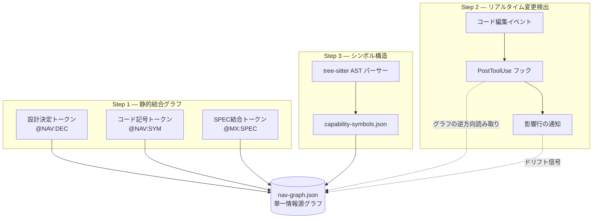

コードは変わり続けるのに文書は足踏みしているプロジェクトは少なくありません。BAS Navigator(コードマップを青写真の錨で結び止めておく同期化レイヤー)は、この溝を縮める装置です。このページは、BAS Navigatorがコードマップ(プロジェクト構造を記号単位で要約した地図)を3つの段階でどのように同期化するかを辿るチュートリアルです。コマンドを1行ずつ直接実行しながら読めます。


**BAS Navigatorの1行要約**

BAS(BluePrint-Anchored Synchronization、青写真錨同期化)Navigatorは、設計決定・SPEC(要件仕様書)・コード記号を1つのグラフにまとめ、コードが変わった瞬間に影響を受ける行を即座に知らせ、コード構造をシンボル単位に分解して見せる3段階の同期化レイヤーです。「更新インフラのない文書は生きているのではなく、出処のほうがマシなスナップショットだ」という問題意識が出発点です。


## なぜ必要か

エージェント(自ら働くAIアシスタント)が大きなリポジトリで方角を取るには、「どの設計決定がどのコードになり、そのコードがどのSPECから来たか」を一目で見なければなりません。かつてMoAI-ADKには、コードマップを描き直すコマンド(`regen`)、設計と実装の差を検査するコマンド(`audit`)、tree-sitter(ソースコードを構文木として解釈するパーサー)で記号を抽出するコマンド(`enrich`)がそれぞれ別々に存在しました。3つのコマンドはそれぞれ単独ではよく動きましたが、互いを指し示さなかったため、片方が変わってももう片方は知ることができませんでした。

BAS Navigatorはこの3つの同期化軸を**静的結合・リアルタイム検出・シンボル構造**という3つの段階に再配置し、その結果を`nav-graph.json`(Navigatorグラフの単一情報源ファイル)1つに集めます。グラフが単一の情報源であるため、どの段階でドリフト(設計と実装がずれる現象)が生じても同じグラフを通して追跡できます。

下のダイアグラムは、3つの段階がグラフをどう取り囲むかを示します。



各段階はグラフを生産するか消費するだけで、他の段階の生産者には触れません。この「橋を渡すだけで呑み込まない(bridge not absorb)」原則のおかげで、どの段階を直しても残りは揺るぎません。それでは段階ごとに直接実習してみましょう。

## Step 1 — 静的結合グラフを作る

最初の段階は、設計決定・コード記号・SPECを1つのグラフに結ぶ**バインディングトークントリオ** (3つ組で対にした結合トークン)です。トークンは文書とコードの中に直接埋め込む小さな標識で、3種類あります。

| トークン                | 付ける場所              | 指す対象            |
| ----------------------- | ----------------------- | ------------------- |
| `@NAV:DEC-<id>`         | `.moai/project/*.md`, ADR | 設計決定レコード    |
| `@NAV:SYM:<symbol>`     | コードコメント、設計文書 | 名前を付けたコード記号 |
| `@MX:SPEC:<id>`         | コードコメント           | SPECバックリンク    |

3つのトークンを文書とコードに散らばせると、Navigatorがこれを集めて`nav-graph.json`のエッジとして編み上げます。ノードは決定・SPEC・記号の3エンティティで、エッジはトークン種別ごとに元ファイルと行番号を併せ持ちます。だからグラフを読めば「この決定はどのファイルの何行目で初めて現れたか」まで追跡できます。

トークンを一度打って、グラフを組み直してみます。

```bash
# 1) 設計文書に決定トークンを残す (.moai/project/tech.md に1行追加)
#    @NAV:DEC-auth-token — 認証はセッションではなくトークン基盤で …

# 2) コードコメントに SPEC バックリンクを張る (internal/auth/token.go に)
#    // @MX:SPEC:SPEC-AUTH-001

# 3) グラフを組み直す
moai codemaps
```


`@MX:SPEC`は元々コードコメントからSPECへ向かうバックリンクとして使われていたトークンです。BAS Navigatorはこのトークンを新しく作ったのではなく、すでにあったmoai-adkの結合結果をグラフとして**橋渡し**して持ってきます。そのおかげで既存のコメントを直さずに済みます。


## Step 2 — 編集の瞬間にドリフトを捕まえる

2つ目の段階は**Falconer Detect** (毎段階の編集を監視するリアルタイム検出レイヤー)です。ファイルを保存した瞬間、PostToolUseフック(ツール実行直後に反応する自動フック)が変わったパスを読んでグラフを逆方向に走査し、影響を受ける行を即座に知らせます。

検出は読み取り専用です。編集を止めず、結果は2箇所に残します。1つはセッションに浮かぶ短い通知で、もう1つは機械が読める影響レコード(`.moai/state/navigator-detect/`以下の`jsonl`ファイル)です。このレコードを次の段階の更新パイプラインが消費します。

検出がどう動くか直接観察してみます。

```bash
# 1) ソースファイルを1つ編集 (例: internal/auth/token.go の関数を1つ修正)
#    Claude Codeの中で Edit ツールを使って保存

# 2) フックが残した影響レコードを確認 — 編集直後にこのファイルができます
ls .moai/state/navigator-detect/

# 3) 最新のレコードの中身を見る — 影響を受けたノードとエッジが行単位で入っています
tail -n 3 .moai/state/navigator-detect/*.jsonl
```

出力を見ると、先ほど選んだファイルがどの決定ノード、どのSPECノード、どの記号ノードに届いているかが1行に1つずつ現れます。これが「ドリフトが生じる直前の最も安い瞬間」に警告を浮かべる検出の核心です。Bashでファイルを移した場合のように構造化されたパスがない編集は検出対象ではありません。これは意図された設計で、誤検出を減らすための境界です。

## Step 3 — シンボル単位でコード構造を抽出する

3つ目の段階は、コードを記号単位に分解する**tree-sitter AST補強**です。設計文書に手作業で標識をすべて付けることはできません。そこで16言語をサポートするtree-sitterパーサーが関数・型・呼び出し関係を自動的に抽出し、`capability-symbols.json`に埋めます。この結果がさらにグラフの記号ノードを豊かにします。

この段階は2つの層に分かれます。下の層は決定論的構造層(パーサーが機械的に抽出するシグネチャ・宣言・参照)で、上の層はLLM記述層(ドキュメント文字列と呼び出し文脈を自然言語で埋める層)です。2つの層が分かれているため、LLMを使えない環境でも決定論的層は塞がりません。 構造が先、叙述は後です。

補強を一度回してみます。

```bash
# コードマップ更新 — tree-sitter がシンボルを再抽出し capability-symbols.json を埋めます
/moai codemaps

# 記号補強の結果を覗く
jq '.symbols | length' .moai/project/navigator/capability-symbols.json
```

コマンドの詳しいフラグと出力形式は、`utility-commands/moai-codemaps.md`コマンド参照ページに別途まとめてあります。このチュートリアルでは「1行で補強が回る」という流れだけを指して先に進みます。

## Step 4 — グラフ全体を読んで差を捕まえる

最後の段階は、ここまでの3段階を1つのサイクルにまとめることです。検出が影響行を知らせ、補強が記号を再抽出し、更新がグラフを最新に合わせます。設計意図と実装された機能の差を検査する監査モード(`--audit`)は、このサイクルが残したグラフを読んで「文書にはある / コードにはない」のペアを報告します。

サイクル全体を一度に回してみます。

```bash
# 1) 設計意図 vs 実装の差を監査
/moai codemaps --audit

# 2) 検出レコードが指した影響行を最新グラフと照合
jq '.affected_rows[] | {node: .identifier, type: .entity_type}' \
  .moai/state/navigator-detect/*.jsonl | head

# 3) 監査レポートの要約を見る
cat .moai/project/navigator/audit-report.json | jq '.summary'
```

監査が綺麗ならグラフはそのまま生きています。差が報告されれば、Step 1のトークンとStep 3の記号補強に遡り、どの段階が空いたかを絞り込めます。これが「一度に全部を描き直さなくても」コードマップを生きたまま保つBAS Navigatorのサイクルです。

## まとめ

3つの段階を改めて整理すると次の通りです。

| 段階   | 役割                          | 成果物                         |
| ------ | ----------------------------- | ------------------------------ |
| Step 1 | トークントリオで結合グラフを作る | `nav-graph.json`               |
| Step 2 | 編集の瞬間に影響行を検出       | `navigator-detect/*.jsonl`     |
| Step 3 | tree-sitter AST で記号を補強   | `capability-symbols.json`      |
| Step 4 | 監査で差を捕まえてサイクルを閉じる | `audit-report.json`            |

BAS Navigatorは単一の情報源グラフ1つに3つの同期化軸を載せ、コードが変わっても文書が遅れないようにします。コマンドの仕様に興味があれば`utility-commands/moai-codemaps.md`を、設計の背景に興味があれば各段階を定義したSPEC(SPEC-NAVIGATOR-SYNC-001, 002, 003)を参照してください。次に読みやすいページは、同じ高度セクションの`manager-kanban.md`と`autonomy-tier.md`です。どちらもこのコードマップの上で動くエージェント組織と自律等級を扱います。
