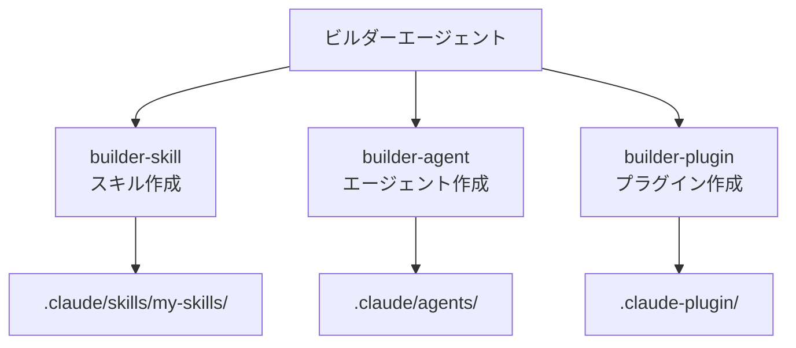

MoAI-ADK を拡張する 3 つのビルダーエージェントを詳細に解説します。



**一言でいうと**: ビルダーエージェントは MoAI-ADK の**拡張ツール制作所**です。スキル、エージェント、プラグインを直接作成してシステムをカスタマイズできます。



## ビルダーエージェントとは？

MoAI-ADK は基本提供される 52 スキル、28 エージェント以外に、ユーザーが直接拡張できる 3 つのビルダーエージェントを提供します。



### 拡張の 3 つのタイプ

| タイプ     | ビルダー              | 目的                           | 呼び出し方法               |
| -------- | ----------------- | ------------------------------ | ----------------------- |
| スキル     | `builder-skill`   | AI に新しい専門知識を付与   | 自動トリガー / `Skill()` |
| エージェント | `builder-agent`   | 新しい専門家ロールを定義        | MoAI が委任              |
| プラグイン | `builder-plugin`  | スキル+エージェント+コマンドバンドル配布 | `plugin install`        |

## スキル作成 (builder-skill)

### スキルとは？

スキルは Claude Code に**特定分野の専門知識**を提供するドキュメントです。スキルがロードされると、Claude Code はその分野のベストプラクティス、パターン、ルールを認識します。

### YAML フロントマタースキーマ

スキルの `SKILL.md` ファイルは必ず YAML フロントマターで始める必要があります。

```yaml
---
# 公式フィールド (Official Fields)
name: my-custom-skill # スキル識別子 (kebab-case、最大 64 文字)
description: > # 目的説明 (50～1024 文字、3 人称)
  カスタムスキルの説明。何に使用するか、どのような専門知識を提供するか
  3 人称で作成。
allowed-tools: # 許可ツール (カンマ区切りまたはリスト)
  - Read
  - Grep
  - Glob
model: claude-sonnet-4-20250514 # 使用するモデル (省略時は現在のモデル)
context: fork # サブエージェントコンテキストで実行
agent: general-purpose # context: fork 時に使用するエージェント
hooks: # スキルライフサイクルフック
  PreToolUse: ...
user-invocable: true # スラッシュコマンドメニュー表示設定
disable-model-invocation: false # false なら Claude も直接呼び出し可能
argument-hint: "[issue-number]" # 自動補完ヒント

# MoAI-ADK 拡張フィールド (Extended Fields)
version: 1.0.0 # セマンティックバージョン (MAJOR.MINOR.PATCH)
category: domain # 8 カテゴリーの中から 1 つ選択
modularized: false # modules/ ディレクトリ使用設定
status: active # active | experimental | deprecated
updated: "2025-01-28" # 最終更新日
tags: # 発見用タグ配列
  - graphql
  - api
related-skills: # 関連スキル
  - moai-domain-backend
  - moai-lang-typescript
context7-libraries: # MCP Context7 ライブラリ ID
  - graphql
aliases: # 代替名
  - graphql-expert
author: YourName # 作成者
---
```

### フロントマターフィールド詳細

| フィールド                       | 必須 | 説明                                  | 例示                             |
| -------------------------- | ---- | ------------------------------------- | -------------------------------- |
| `name`                     | 選択 | kebab-case 識別子 (最大 64 文字)         | `my-graphql-patterns`            |
| `description`              | 推奨 | 50～1024 文字、3 人称、発見用              | "GraphQL API パターンを提供する..." |
| `allowed-tools`            | 選択 | スキル有効時に許可されるツール            | `["Read", "Grep"]`               |
| `model`                    | 選択 | 使用するモデル                           | `claude-sonnet-4-20250514`       |
| `context`                  | 選択 | `fork` 設定時サブエージェントで実行 | `fork`                           |
| `agent`                    | 選択 | `context: fork` 時使用するエージェント    | `general-purpose`                |
| `hooks`                    | 選択 | スキルライフサイクルフック                     | `PreToolUse: ...`                |
| `user-invocable`           | 選択 | スラッシュメニュー表示 (デフォルト: true)       | `true`                           |
| `disable-model-invocation` | 選択 | true ならユーザーのみ呼び出し可能             | `false`                          |
| `argument-hint`            | 選択 | 自動補完ヒント                         | `"[issue-number]"`               |
| `version`                  | MoAI | セマンティックバージョン                           | `1.0.0`                          |
| `category`                 | MoAI | カテゴリー                              | `domain`                         |
| `modularized`              | MoAI | モジュール化設定                           | `false`                          |
| `status`                   | MoAI | アクティブステータス                             | `active`                         |

### スキルディレクトリ構造

```text
.claude/skills/my-skills/
└── my-graphql-patterns/
    ├── SKILL.md            # メインスキルドキュメント (500 行以下)
    ├── modules/            # 深層ドキュメント (無制限)
    │   ├── schema-design.md
    │   └── resolver-patterns.md
    ├── examples.md         # 実戦例
    └── reference.md        # 外部参照
```



  **重要**: ファイル名は必ず**大文字** `SKILL.md` を使用してください。ユーザーカスタム
  スキルは `.claude/skills/my-skills/` ディレクトリに作成してください。`moai-*` プレフィックスは
  MoAI-ADK 公式スキル専用です。



### 文字列置換 (String Substitutions)

スキル本文で以下のランタイム置換を使用できます。

| 置換文                    | 説明                    | 例示                         |
| ------------------------- | ----------------------- | ---------------------------- |
| `$ARGUMENTS`              | スキル呼び出し時の全引数  | `/skill foo bar` → `foo bar` |
| `$ARGUMENTS[N]` または `$N` | N 番目の引数 (0 から開始) | `$0`, `$1`                   |
| `${CLAUDE_SESSION_ID}`    | 現在のセッション ID            | セッション追跡用                  |

### 動的コンテキストインジェクション (Dynamic Context Injection)

`!`command`` 構文を使用してスキルロード前にシェルコマンドを実行し、その出力をインジェクトできます。

```markdown
---
# YAML
---

# プロジェクト情報
プロジェクト名: !basename $(pwd) Git ブランチ: !git branch --show-current
```

### 呼び出し制御モード (Invocation Control)

3 つの呼び出しモードがあります。

| モード        | 設定                             | 説明                           | 用途                  |
| ----------- | -------------------------------- | ------------------------------ | --------------------- |
| 基本        | 両フィールド省略                | ユーザーと Claude 両方呼び出し可能 | 一般的なスキル         |
| ユーザー専用 | `disable-model-invocation: true` | ユーザーのみ `/name` で呼び出し      | 配布、コミットワークフロー |
| Claude 専用 | `user-invocable: false`          | メニューで非表示、Claude のみ呼び出し   | バックグラウンド知識       |

### リポジトリ優先順位

スキルが重複して定義されている場合の優先順位は以下の通りです。

1. **Enterprise**: 管理設定 (最優先)
2. **Personal**: `~/.claude/skills/` (個人)
3. **Project**: `.claude/skills/` (チーム共有、バージョン管理)
4. **Plugin**: インストール済みプラグインバンドル (最低優先順位)

### スキル作成実戦例

```bash
# Claude Code で builder-skill 呼び出し
> GraphQL API 設計パターンに関するカスタムスキルを作成して
```

作成されるファイル: `.claude/skills/my-skills/my-graphql-patterns/SKILL.md`

```markdown
---
name: my-graphql-patterns
description: >
  GraphQL API 設計専門家。スキーマ設計、リゾルバパターン、N+1 問題解決、DataLoader
  パターンを提供する。GraphQL API 開発時に使用。
version: 1.0.0
category: domain
status: active
triggers:
  keywords: ["graphql", "schema", "resolver", "dataloader"]
  agents: ["expert-backend"]
allowed-tools: ["Read", "Grep", "Glob"]
---

# GraphQL API 設計専門家

## Quick Reference

- スキーマファースト設計 (Schema-First)
- N+1 問題防止のための DataLoader 必須
- ページネーションは Relay Cursor 方式使用

## Implementation Guide

(詳細実装ガイド)

## Advanced Patterns

(高度なパターン)

## Works Well With

- moai-domain-backend
- moai-lang-typescript
```



  **制約事項**: ユーザースキル名には**絶対 `moai-` プレフィックスを使用しないでください**。
  このネームスペースは MoAI-ADK システムスキル用に予約されています。管理者モード
  (admin mode, system skill) リクエスト時にのみ例外的に許可されます。



## エージェント作成 (builder-agent)

### エージェント定義構造

エージェントはマークダウンファイルで定義され、YAML フロントマターにメタデータを含みます。

```markdown
---
name: my-data-analyst
description: >
  データ分析専門家。データパイプライン設計、ETL プロセス、分析クエリ最適化を
  担当。PROACTIVELY 使用してデータ分析作業時に自動委任。
tools: Read, Write, Edit, Grep, Glob, Bash, TodoWrite
disallowedTools: Task, Skill # 選択肢: 除外するツール
model: sonnet # sonnet | opus | haiku | inherit
permissionMode: default # 権限モード
skills: # 事前ロードするスキル
  - moai-lang-python
  - moai-domain-database
hooks: # エージェントライフサイクルフック
  PostToolUse:
    - matcher: "Write|Edit"
      hooks:
        - type: command
          command: "echo 'File modified'"
---

あなたはデータ分析専門家です。

## Primary Mission

データパイプライン設計および実装を通じてデータ主導のインサイトを提供します。

## Core Capabilities

- データパイプライン設計および実装
- ETL プロセス自動化
- 分析クエリ最適化
- データ可視化

## Scope Boundaries

IN SCOPE:

- データ分析および可視化
- ETL プロセス設計
- クエリパフォーマンス最適化

OUT OF SCOPE:

- ML モデル開発 (expert-data-science に委任)
- インフラ構成 (expert-devops に委任)

## Delegation Protocol

- ML モデル必要時: expert-data-science
- インフラ設定時: expert-devops

## Quality Standards

- TRUST 5 フレームワーク準拠
- データ完全性検証
- クエリパフォーマンス最適化
```

### エージェントフロントマターフィールド詳細

| フィールド              | 必須 | 説明                                                       |
| ----------------- | ---- | ---------------------------------------------------------- |
| `name`            | 必須 | エージェント識別子 (kebab-case、最大 64 文字)                    |
| `description`     | 必須 | ロール説明。`PROACTIVELY` キーワード含む時自動委任          |
| `tools`           | 選択 | 使用可能ツール (カンマ区切り、省略時はすべてのツール継承)         |
| `disallowedTools` | 選択 | 除外するツール (継承されたツールから削除)                         |
| `model`           | 選択 | `sonnet`, `opus`, `haiku`, `inherit` (デフォルト: 設定されたモデル) |
| `permissionMode`  | 選択 | 権限モード (以下参照)                                      |
| `skills`          | 選択 | 事前ロードするスキルリスト (継承されません)                         |
| `hooks`           | 選択 | エージェントライフサイクルフック                                      |

### 権限モード (Permission Modes)

5 つの権限モードがツール承認処理を制御します。

| モード                | 説明                    | 用途                      |
| ------------------- | ----------------------- | ------------------------- |
| `default`           | 標準権限プロンプト      | 一般的なエージェント         |
| `acceptEdits`       | ファイル編集自動承認     | 編集中心作業            |
| `dontAsk`           | すべてのプロンプト自動拒否 | 事前承認済みツールのみ使用   |
| `bypassPermissions` | すべての権限チェックスキップ   | 信頼できるエージェントのみ |
| `plan`              | 読み取り専用探索モード     | 変更防止必要時          |

### エージェント作成方法

エージェントを作成する 4 つの方法があります。

| 方法           | 説明                    | 場所              |
| -------------- | ----------------------- | ----------------- |
| `/agents` コマンド | 対話型インターフェース       | プロジェクト/個人     |
| 手動ファイル作成 | マークダウンファイル直接作成 | `.claude/agents/` |
| CLI フラグ     | `--agents` JSON 定義    | セッション専用         |
| プラグイン配布  | プラグインバンドル           | インストール済みプラグイン   |

### エージェントリポジトリ優先順位

同一エージェント名が複数の場所で定義されている場合:

1. **プロジェクトレベル**: `.claude/agents/` (最優先、バージョン管理)
2. **ユーザーレベル**: `~/.claude/agents/` (個人、非バージョン管理)
3. **CLI フラグ**: `--agents` JSON (セッション専用)
4. **プラグイン**: インストール済みプラグイン (最低優先順位)

### ビルトインエージェントタイプ

Claude Code は複数のビルトインエージェントを含みます。

| エージェント            | モデル    | 特徴                                   |
| ------------------- | ------- | -------------------------------------- |
| `Explore`           | haiku   | 読み取り専用ツール、コードベース検索最適化 |
| `Plan`              | inherit | plan 権限モード、読み取り専用ツール         |
| `general-purpose`   | inherit | すべてのツール、複雑な多段階作業          |
| `Bash`              | inherit | ターミナルコマンド実行                       |
| `Claude Code Guide` | haiku   | Claude Code 機能質問応答             |

### スキル事前ロード (Skills Preloading)

`skills` フィールドにリストされたスキルはエージェント開始時に**全内容がインジェクト**されます。

- 親会話のスキルを**継承しません**
- 各スキルの完全な内容がシステムプロンプトにインジェクトされます
- トークン消費を最小化するため、必須スキルのみリストしてください
- 順序が重要です: 高優先順位スキルを最初に

### フック構成 (Hooks Configuration)

エージェントはフロントマターでライフサイクルフックを定義できます。

| イベント        | 説明                              |
| ------------- | --------------------------------- |
| `PreToolUse`  | ツール実行前 (検証、事前チェック)    |
| `PostToolUse` | ツール完了後 (リント、フォーマット、ログ) |
| `Stop`        | エージェント実行完了時             |

### 重要な制約事項 (Key Constraints)

| 制約                    | 説明                                                       |
| ----------------------- | ---------------------------------------------------------- |
| サブエージェント作成不可 | 下位エージェントは他の下位エージェントを作成できません    |
| AskUserQuestion 制限    | 下位エージェントはユーザーと直接対話できません       |
| スキル非継承             | 親会話のスキルを継承しません                       |
| MCP ツール制限           | バックグラウンド下位エージェントで MCP ツールを使用できません |
| 独立コンテキスト           | 各下位エージェントは独立した 200K トークンコンテキストを持ちます  |

## プラグイン作成 (builder-plugin)

### プラグインとは？

プラグインはスキル、エージェント、コマンド、Hooks、MCP サーバーを 1 つのパッケージに**バンドルした配布単位**です。



  **重要な制約事項**: commands/, agents/, skills/, hooks/ ディレクトリは**プラグイン
  ルート**に配置する必要があります。.claude-plugin/ 内部に配置してはいけません。



### プラグインディレクトリ構造

```text
my-plugin/
├── .claude-plugin/
│   └── plugin.json         # プラグインマニフェスト
├── commands/               # スラッシュコマンド (ルートレベル!)
│   └── analyze.md
├── agents/                 # エージェント定義 (ルートレベル!)
│   └── data-expert.md
├── skills/                 # スキル定義 (ルートレベル!)
│   └── my-skill/
│       └── SKILL.md
├── hooks/                  # Hooks 設定 (ルートレベル!)
│   └── hooks.json
├── .mcp.json               # MCP サーバー設定
├── .lsp.json               # LSP サーバー設定
├── LICENSE
├── CHANGELOG.md
└── README.md
```



  **誤った例**: .claude-plugin/commands/ (commands が .claude-plugin 内部に
  ある) **正しい例**: commands/ (commands がプラグインルートにある)



### プラグインマニフェスト (plugin.json)

```json
{
  "name": "my-data-plugin",
  "version": "1.0.0",
  "description": "データ分析作業のための総合プラグイン",
  "author": {
    "name": "My Team",
    "email": "team@example.com",
    "url": "https://example.com"
  },
  "homepage": "https://example.com/docs",
  "repository": {
    "type": "git",
    "url": "https://github.com/owner/repo"
  },
  "license": "MIT",
  "keywords": ["data", "analytics", "etl"],
  "commands": ["./commands/"],
  "agents": ["./agents/"],
  "skills": ["./skills/"],
  "hooks": "./hooks/hooks.json",
  "mcpServers": "./.mcp.json",
  "lspServers": "./.lsp.json",
  "outputStyles": "./output-styles/"
}
```

### フィールド詳細

| フィールド          | 必須 | 説明                               |
| ------------- | ---- | ---------------------------------- |
| `name`        | 必須 | kebab-case プラグイン識別子         |
| `version`     | 必須 | セマンティックバージョン (例: "1.0.0")          |
| `description` | 必須 | 明確な目的説明                   |
| `author`      | 選択 | name, email, url 属性              |
| `homepage`    | 選択 | ドキュメントまたはプロジェクト URL             |
| `repository`  | 選択 | ソースコードリポジトリ URL               |
| `license`     | 選択 | SPDX ライセンス識別子               |
| `keywords`    | 選択 | 発見用キーワード配列                 |
| `commands`    | 選択 | コマンドパス (必ず "./" で開始)   |
| `agents`      | 選択 | エージェントパス (必ず "./" で開始) |
| `skills`      | 選択 | スキルパス (必ず "./" で開始)     |
| `hooks`       | 選択 | Hooks パス (必ず "./" で開始)    |
| `mcpServers`  | 選択 | MCP サーバー設定パス                 |
| `lspServers`  | 選択 | LSP サーバー設定パス                 |

### パスルール

- すべてのパスはプラグインルート基準**相対パス**です
- すべてのパスは**"./" で開始**する必要があります
- 使用可能な環境変数: `${CLAUDE_PLUGIN_ROOT}`, `${CLAUDE_PROJECT_DIR}`

### Marketplace 設定 (marketplace.json)

複数のプラグインを配布するには marketplace.json を作成します。

```json
{
  "name": "my-marketplace",
  "owner": {
    "name": "My Organization",
    "email": "plugins@example.com"
  },
  "plugins": [
    {
      "name": "plugin-one",
      "source": "./plugins/plugin-one"
    },
    {
      "name": "plugin-two",
      "source": {
        "type": "github",
        "repo": "owner/repo"
      }
    }
  ]
}
```

### インストールスコープ (Installation Scopes)

| スコープ      | 場所                          | 説明                          |
| --------- | ----------------------------- | ----------------------------- |
| `user`    | `~/.claude/settings.json`     | 個人プラグイン (デフォルト)        |
| `project` | `.claude/settings.json`       | チーム共有 (バージョン管理)           |
| `local`   | `.claude/settings.local.json` | 開発者専用 (gitignored)      |
| `managed` | `managed-settings.json`       | エンタープライズ管理 (読み取り専用) |

### プラグインインストールおよび管理

```bash
# GitHub からプラグインインストール
$ /plugin install owner/repo

# ローカルプラグイン検証
$ /plugin validate .

# プラグイン有効化
$ /plugin enable my-data-plugin

# Marketplace 追加
$ /plugin marketplace add ./path/to/marketplace

# インストール済みプラグインリスト
$ /plugin list
```

### プラグインキャッシュおよびセキュリティ

**キャッシュ動作**:

- プラグインはセキュリティと検証のためキャッシュディレクトリにコピーされます
- すべての相対パスはキャッシュされたプラグインディレクトリ内で解決されます
- `../shared-utils` のようなパストラバーサルは動作しません

**セキュリティ警告**:

- プラグインインストール前に出所を信頼できるか確認してください
- Anthropic はサードパーティプラグインの MCP サーバー、ファイル、ソフトウェアを制御しません
- インストール前にプラグインソースコードをレビューしてください

### プラグイン作成実戦例

```bash
# プラグイン作成リクエスト
> データ分析プラグインを作成して。
> スキル、エージェント、コマンドをすべて含めて。
```

## ユーザー定義保存場所

MoAI-ADK 更新時にユーザーカスタムファイルが保存される場所を整理します。

| タイプ     | 保存される場所                 | 上書きされる場所        |
| -------- | ----------------------------- | ------------------------ |
| スキル     | `.claude/skills/my-skills/`   | `.claude/skills/moai-*/` |
| エージェント | ユーザー定義エージェント          | `.claude/agents/moai/`   |
| コマンド   | ユーザー定義コマンド            | `.claude/commands/moai/` |
| Hooks    | ユーザー定義 Hooks             | `.claude/hooks/moai/`    |
| ルール     | `.claude/rules/local/`        | `.claude/rules/moai/`    |
| 設定     | `.claude/settings.local.json` | `.claude/settings.json`  |
| ガイドライン     | `CLAUDE.local.md`             | `CLAUDE.md`              |



  **推奨事項**: 個人拡張は常に `my-skills/` または `local/` ディレクトリに
  作成してください。MoAI-ADK 更新時にも安全に保存されます。



## ビルダーエージェント呼び出し方法

ビルダーエージェントは MoAI に自然言語でリクエストすると自動的に呼び出されます。

```bash
# スキル作成
> @"builder-skill (agent)" GraphQL パターンに関するカスタムスキルを作成して

# エージェント作成
> @"builder-agent (agent)" データ分析専門家エージェントを作成して

# プラグイン作成
> @"builder-plugin (agent)" データ分析総合プラグインを作成して
```

## 重要な制約事項

| 制約                    | 説明                                                                 |
| ----------------------- | -------------------------------------------------------------------- |
| サブエージェント作成不可 | 下位エージェントは他の下位エージェントを作成できません              |
| ユーザー対話制限    | 下位エージェントはユーザーと直接対話できません (MoAI のみ可能) |
| スキル非継承             | 親会話のスキルを継承しません (明示的リスト必要)              |
| 独立コンテキスト           | 各下位エージェントは独立した 200K トークンコンテキストを持ちます            |
| moai- プレフィックス禁止       | ユーザースキル/エージェントには `moai-` プレフィックス使用禁止                    |
| SKILL.md 命名           | スキルメインファイルは必ず大文字 `SKILL.md` 使用                       |
| プラグインコンポーネント配置  | プラグインの commands/, agents/, skills/ はルートに配置                 |

## 関連ドキュメント

- [スキルガイド](/advanced/skill-guide) - スキルシステム詳細
- [エージェントガイド](/advanced/agent-guide) - エージェントシステム詳細
- [Hooks ガイド](/advanced/hooks-guide) - イベント自動化
- [settings.json ガイド](/advanced/settings-json) - 設定管理



  **ヒント**: 最初は**スキル作成**から始めることを推奨します。スキルは最も
  軽量で高速に MoAI-ADK を拡張できる方法です。


