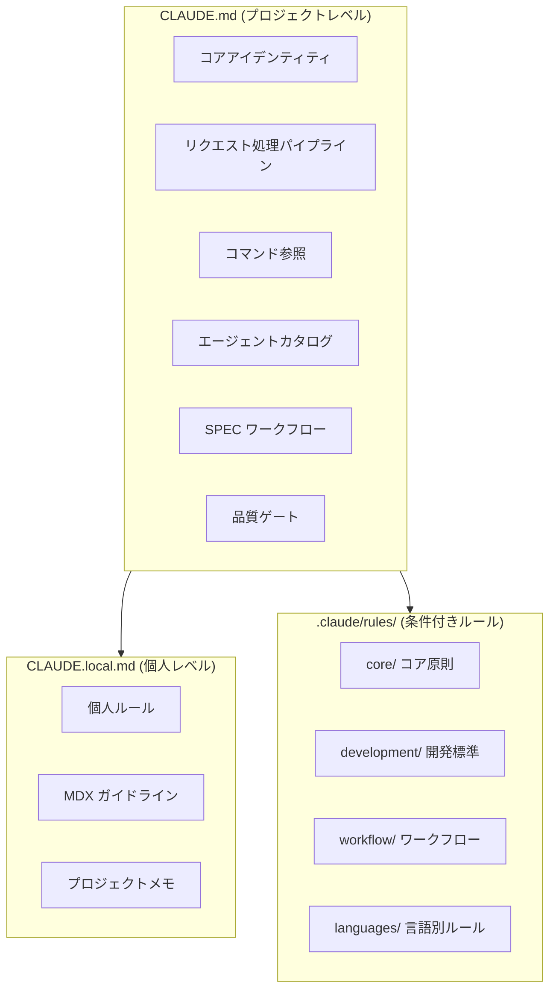
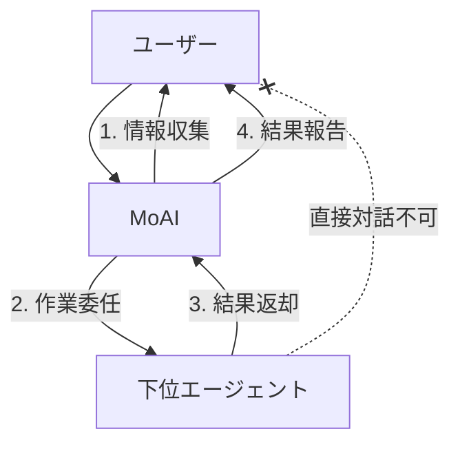
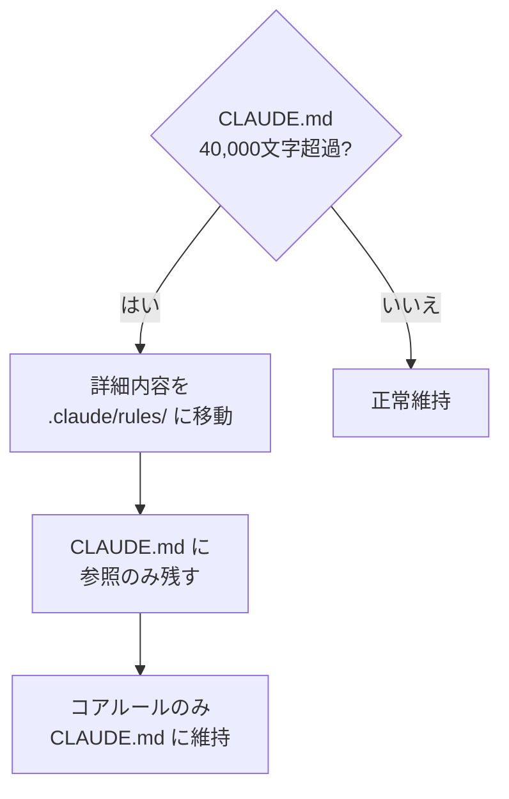
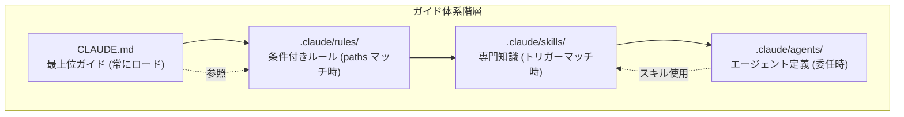

# CLAUDE.md ガイド

Claude Code のコアガイドファイル体系を詳細に解説します。


**一言でいうと**: `CLAUDE.md` はプロジェクトの**憲法**です。Claude Code がプロジェクトをどのように理解し、どのルールに従い、どのエージェントを呼び出すか、すべてこのファイルで決定されます。


## CLAUDE.md とは？

`CLAUDE.md` は Claude Code がセッションを開始するとき**最初に読むガイドファイル**です。このファイルにプロジェクトのルール、エージェント構造、ワークフロー、品質基準などが定義されています。

人が新しい会社に入社すると従業員ハンドブックを読むのと同じように、Claude Code はセッションを開始するとき `CLAUDE.md` を読んでプロジェクトのコンテキストを把握します。

## ファイル構造

MoAI-ADK は 2 つのガイドファイルとルールディレクトリを使用します。



| ファイル/ディレクトリ | 用途 | Git 追跡 | 更新時 |
|---------------|------|----------|-------------|
| `CLAUDE.md` | MoAI-ADK コアガイド | はい | 上書き |
| `CLAUDE.local.md` | 個人カスタムガイド | いいえ | 保存 |
| `.claude/rules/moai/` | 条件付き詳細ルール | はい | 上書き |
| `.claude/rules/local/` | 個人カスタムルール | いいえ | 保存 |

## MoAI CLAUDE.md 主要セクション

### 1. コアアイデンティティ

MoAI オーケストレーターの役割と HARD ルールを定義します。

```markdown
## 1. コアアイデンティティ

MoAI は Claude Code の戦略的オーケストレーターです。

### HARD ルール (必須)
- [HARD] 言語認識応答: ユーザーの conversation_language で応答
- [HARD] 並列実行: 独立したツール呼び出しは並列実行
- [HARD] XML タグ非表示: ユーザー対面応答に XML 非表示
- [HARD] Markdown 出力: すべてのコミュニケーションに Markdown 使用
```

### 2. リクエスト処理パイプライン

ユーザーリクエストを分析してルーティングする 4 段階パイプラインです。

| 段階 | 説明 |
|------|------|
| 1. 分析 | リクエストの複雑性評価、技術キーワード検出 |
| 2. ルーティング | コマンドタイプに基づき適切なルート選択 |
| 3. 実行 | エージェントに委任して作業実行 |
| 4. 報告 | 統果統合およびユーザーに報告 |

### 3. コマンド参照

MoAI-ADK の 3 つのコマンドタイプを定義します。

| タイプ | コマンド | 用途 |
|------|--------|------|
| Type A (ワークフロー) | `/moai project`, `/moai plan`, `/moai run`, `/moai sync` | 主要開発ワークフロー |
| Type B (ユーティリティ) | `/moai`, `/moai fix`, `/moai loop` | 高速修正、自動化 |
| Type C (フィードバック) | `/moai feedback` | 改善事項報告 |

### 4. エージェントカタログ

20 エージェントの役割と選択基準を定義します。

| 階層 | エージェント | 数 |
|------|----------|------|
| Manager | spec, ddd, docs, quality, strategy, project, git | 7 つ |
| Expert | backend, frontend, security, devops, performance, debug, testing, refactoring | 8 つ |
| Builder | agent, skill, command, plugin | 4 つ |

### 5. SPEC ワークフロー

3 段階 SPEC ベース開発ワークフローを定義します。

```bash
# Plan: SPEC ドキュメント作成 (30K トークン)
> /moai plan "機能説明"

# Run: DDD 実装 (180K トークン)
> /moai run SPEC-XXX

# Sync: ドキュメント同期 (40K トークン)
> /moai sync SPEC-XXX
```

### 6. 品質ゲート

TRUST 5 フレームワークと LSP 品質ゲートを定義します。

| 品質基準 | 要件 |
|-----------|----------|
| Tested | 85%+ カバレッジ、LSP タイプエラー 0 |
| Readable | 明確な命名、LSP リントエラー 0 |
| Unified | 一貫したスタイル、LSP 警告 10 以下 |
| Secured | OWASP 準拠、LSP セキュリティ警告 0 |
| Trackable | 明確なコミット、LSP 状態追跡 |

### 7. ユーザー対話アーキテクチャ

下位エージェントはユーザーと直接対話できません。



### 8. 設定参照

言語設定、ユーザー設定、プロジェクトルールを参照します。

```yaml
language:
  conversation_language: ko           # ユーザー応答言語
  agent_prompt_language: en           # エージェント内部言語
  git_commit_messages: en             # Git コミットメッセージ
  code_comments: en                   # コードコメント
  documentation: en                   # ドキュメントファイル
```

## CLAUDE.local.md 活用法

`CLAUDE.local.md` は個人的なルールとメモを記述するファイルです。MoAI-ADK 更新とは関係なく保存されます。

### 作成例

```markdown
# プロジェクトローカル設定

## ドキュメント作成ガイドライン

### MDX レンダリングエラー防止
- 強調表示と括弧の間に必ずスペース

### Mermaid ダイアグラム方向
- すべてのダイアグラムは縦方向 (flowchart TD)

## 個人メモ
- DB マイグレーション前にバックアップ必須
- API エンドポイント命名: kebab-case 使用
```

### 活用ヒント

| 用途 | 内容例 |
|------|-----------|
| コーディングルール | "変数名は camelCase、ファイル名は kebab-case" |
| プロジェクトメモ | "認証は JWT、有効期限 24 時間、更新 7 日間" |
| 禁止事項 | "console.log を本番コードに残さないこと" |
| 好みパターン | "React コンポーネントは関数型のみ使用" |
| MDX ルール | "強調と括弧の間スペース必須" |

## .claude/rules/ システム

`.claude/rules/` ディレクトリには**条件付きでロードされる詳細ルール**が保存されます。

### ディレクトリ構造

```
.claude/rules/moai/
├── core/                          # コア原則
│   └── moai-constitution.md       # TRUST 5、コアルール
├── development/                   # 開発標準
│   ├── skill-authoring.md         # スキル作成ガイド
│   └── coding-standards.md        # コーディング標準
├── workflow/                      # ワークフロー
│   ├── workflow-modes.md          # Plan/Run/Sync 定義
│   └── spec-workflow.md           # SPEC ワークフロー
└── languages/                     # 言語別ルール (16 つ)
    ├── python.md
    ├── typescript.md
    ├── javascript.md
    └── ...
```

### 条件付きローディング (paths フロントマター)

ルールファイルは `paths` フロントマターを通じて**特定ファイル作業時にのみロード**されます。

```yaml
---
paths:
  - "**/*.py"
  - "**/pyproject.toml"
---

# Python コーディングルール
- ruff フォーマッター使用
- type ヒント必須
- docstring は Google スタイル
```

このルールは Python ファイルを修正時のみロードされて**トークンを節約**します。

### ルールファイル種類

| ディレクトリ | ファイル | ロード条件 |
|----------|------|-----------|
| `core/` | `moai-constitution.md` | 常にロード |
| `development/` | `skill-authoring.md` | スキル関連作業時 |
| `development/` | `coding-standards.md` | コード作業時 |
| `workflow/` | `workflow-modes.md` | ワークフローコマンド時 |
| `workflow/` | `spec-workflow.md` | SPEC 関連作業時 |
| `languages/` | `python.md` 等 | 該当言語ファイル修正時 |

## サイズ制限

`CLAUDE.md` は**40,000 文字以下**を維持する必要があります。

### サイズ超過時の対処法



**対処戦略:**

1. **詳細内容移動**: 長い説明は `.claude/rules/` ファイルに分離
2. **参照使用**: `CLAUDE.md` で `@ファイルパス` で参照
3. **コアのみ維持**: アイデンティティ、HARD ルール、エージェントカタログのみ維持
4. **スキルに変換**: 長いパターン説明はスキルに変換

## 実戦例: CLAUDE.local.md カスタムルール

### フロントエンドプロジェクト

```markdown
# プロジェクトローカル設定

## React ルール
- コンポーネントは必ず関数型で作成
- Props インターフェースはコンポーネントファイル上部で定義
- 状態管理は Zustand 使用
- CSS は Tailwind CSS のみ使用

## 命名ルール
- コンポーネント: PascalCase (UserProfile.tsx)
- ユーティリティ: camelCase (formatDate.ts)
- 定数: UPPER_SNAKE_CASE (MAX_RETRY_COUNT)
- API エンドポイント: kebab-case (/api/user-profiles)

## 禁止事項
- any 型使用禁止
- console.log 本番コードで禁止
- default export 禁止 (named export のみ使用)
```

### バックエンドプロジェクト

```markdown
# プロジェクトローカル設定

## Python ルール
- FastAPI 使用
- 非同期関数優先 (async/await)
- Pydantic v2 モデル使用
- SQLAlchemy 2.0 スタイル

## データベースルール
- マイグレーション前に必ずバックアップ
- インデックスはクエリーパターン分析後追加
- soft delete パターン使用 (is_deleted フラグ)

## API ルール
- RESTful エンドポイント命名
- レスポンス形式統一: {"data": ..., "message": ...}
- エラーコード標準化
```

## CLAUDE.md、rules、skills の関係



| 階層 | ファイル | ロード時期 | 役割 |
|------|------|-----------|------|
| 1. CLAUDE.md | `CLAUDE.md` | 常時 | プロジェクトアイデンティティ、コアルール |
| 2. Rules | `.claude/rules/*.md` | ファイルパターンマッチ時 | 条件付き詳細ルール |
| 3. Skills | `.claude/skills/*/skill.md` | トリガーマッチ時 | 専門知識、パターン |
| 4. Agents | `.claude/agents/*.md` | 委任時 | 専門家ロール定義 |

## 関連ドキュメント

- [スキルガイド](/advanced/skill-guide) - スキルシステム詳細
- [エージェントガイド](/advanced/agent-guide) - エージェントシステム詳細
- [settings.json ガイド](/advanced/settings-json) - 設定ファイル管理
- [Hooks ガイド](/advanced/hooks-guide) - イベント自動化


**ヒント**: `CLAUDE.md` を直接修正するよりも `CLAUDE.local.md` に個人ルールを追加することを推奨します。MoAI-ADK 更新時にも個人ルールが安全に保存されます。

